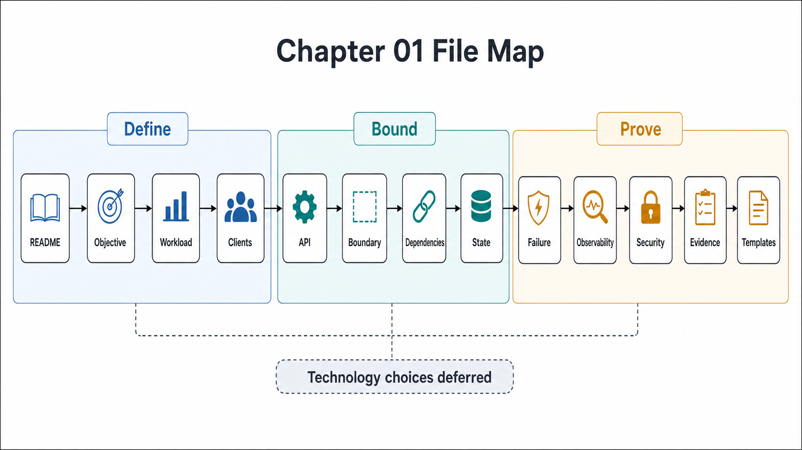

# Chapter 01 File Map



## Purpose

This folder defines the architecture entry contract. Every later design decision — storage engine, replication scheme, cache topology, inference runtime, agent framework — is mechanically evaluable only after the objective, workload, boundary, contracts, dependencies, state, failure behavior, observability, and trust boundaries are explicit enough to be falsified by measurement.

Each file is written as a self-contained research note: an abstract stating the claim, a formal model, figures for the structures that matter, decision tables, approval gates that can fail a design, and references to primary sources.

## Reading Order

| Order | File | Architecture Decision Produced |
|---:|---|---|
| 1 | [README.md](README.md) | Chapter thesis, institutional source standard, and completion gate |
| 2 | [01-objective-contract.md](01-objective-contract.md) | Falsifiable objective and non-negotiable constraints |
| 3 | [02-workload-and-capacity-envelope.md](02-workload-and-capacity-envelope.md) | Request classes, resource-cost model, burst model, and growth envelope |
| 4 | [03-client-tenant-and-use-case-model.md](03-client-tenant-and-use-case-model.md) | Client classes, tenant model, identity, authorization, and quota pressure |
| 5 | [04-input-output-and-api-contracts.md](04-input-output-and-api-contracts.md) | Ingress schema, egress schema, idempotency, deadlines, status states, and compatibility |
| 6 | [05-system-boundary-and-ownership.md](05-system-boundary-and-ownership.md) | Inside/outside ownership boundary, control-plane boundary, data-plane boundary, and operational accountability |
| 7 | [06-boundary-crossing-and-dependency-contracts.md](06-boundary-crossing-and-dependency-contracts.md) | Protocol, timeout, retry, fallback, and data-classification contract for every dependency |
| 8 | [07-state-classification-and-consistency-boundary.md](07-state-classification-and-consistency-boundary.md) | State ownership, consistency, invalidation, retention, backup, and recovery |
| 9 | [08-failure-domain-and-overload-semantics.md](08-failure-domain-and-overload-semantics.md) | Boundary failure model, overload behavior, degraded mode, and rollback semantics |
| 10 | [09-observability-slo-and-audit-contract.md](09-observability-slo-and-audit-contract.md) | SLIs, SLOs, metrics, logs, traces, audit events, alerts, and readiness signals |
| 11 | [10-security-privacy-and-trust-boundary.md](10-security-privacy-and-trust-boundary.md) | Trust boundaries, tenant isolation, secrets, egress controls, privacy, and audit evidence |
| 12 | [11-evidence-classification-and-architecture-review.md](11-evidence-classification-and-architecture-review.md) | Implemented/observed/tested/intended/assumed/external/unknown classification |
| 13 | [12-architecture-review-templates.md](12-architecture-review-templates.md) | Reusable dossier templates for review and approval |

## Approval Dependency Graph

The order is a dependency graph, not a table of contents. Each artifact consumes constraints produced by the ones above it; approving out of order produces decisions that cannot be checked against anything.

```text
Figure 1. Chapter 01 approval dependency graph.

  [01] Objective ──────────────┐
        │                      │ constrains every later gate
        v                      │
  [02] Workload envelope       │
        │                      │
        v                      │
  [03] Client + tenant model   │
        │                      │
        v                      │
  [04] Input/output contracts ◄┘
        │
        ├──────────────► [05] System boundary + ownership
        │                       │
        │                       v
        │                [06] Crossings + dependency contracts
        │                       │
        v                       v
  [07] State + consistency ◄────┘
        │
        v
  [08] Failure + overload semantics
        │
        v
  [09] Observability + SLO + audit
        │
        v
  [10] Security + trust boundary
        │
        v
  [11] Evidence classification ──► [12] Review dossier
```

Concrete dependency examples the graph encodes:

- Retry policy ([06]) is unverifiable until idempotency ([04]) exists.
- Cache policy ([07]) is unverifiable until freshness bounds ([01], [02]) exist.
- Shedding order ([08]) is unverifiable until priority classes ([03]) exist.
- SLO targets ([09]) are unverifiable until the latency budget ([01]) is decomposed.
- Audit sufficiency ([10]) is unverifiable until trust boundaries and data classes are inventoried.

## Chapter Rule

No component, database, queue, cache, model, framework, runtime, or deployment platform is approved in Chapter 01. This chapter approves only the constraints that make those later choices mechanically evaluable — and rejectable.
