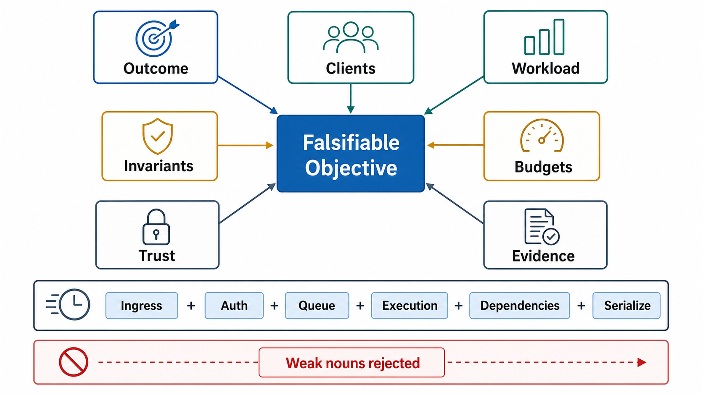

# Objective Contract



## Abstract

An architectural objective is a falsifiable contract between system purpose and operating constraints: the behavior the system must produce, who consumes it, which correctness invariants cannot be violated, and which measurements prove that the behavior holds under load and failure. This file defines the required fields of that contract, decomposes the latency budget into measurable terms, maps weak objective vocabulary to its measurable replacements, and sets the approval gates under which an objective can be rejected by measurement rather than by opinion. The framing follows the SLO discipline in [Google SRE — Service Level Objectives](https://sre.google/sre-book/service-level-objectives/): a target that cannot be measured from outside the implementation is not a target, it is a hope.

An objective is not a feature list, a technology selection, or a component diagram. Those three artifacts are the most common counterfeit objectives, and each fails the same test: none can be falsified by an external measurement.

## 1. Position in the Chapter

The objective is the root constraint. Every later gate — workload envelope, tenant isolation, retry policy, overload behavior, SLO alerting — is checked against the objective's invariants and budgets. An imprecise objective does not merely weaken one review; it makes every downstream review non-falsifiable.

## 2. Required Statement

```text
Build [system] for [client classes] to produce [externally observable outcome]
under [bounded workload] while preserving [correctness invariants],
within [latency, throughput, cost, and resource budgets],
under [failure assumptions],
inside [security, privacy, compliance, and ownership boundaries],
verified by [tests, telemetry, traces, audits, and operational drills].
```

Every bracketed term must bind to a later artifact in this chapter. A term that binds to nothing is a term the review cannot check.

## 3. Required Fields

| Field | Required Precision | Rejection Condition |
|---|---|---|
| Observable outcome | User-visible or client-visible result, not internal component activity | Outcome cannot be measured outside the implementation |
| Client classes | Human, service, batch, operator, agent, model, partner, adversarial actor | One generic actor hides latency, security, and retry differences |
| Workload envelope | Request classes, arrival distribution, payload bounds, concurrency, growth, retry pressure | Capacity claim is based on average QPS only |
| Correctness invariants | Durability, consistency, ordering, idempotency, authorization, freshness, grounding, schema validity | Review cannot distinguish acceptable stale/partial behavior from defect |
| Latency budget | p50, p95, p99, timeout, queue wait, streaming first-byte or first-token | Tail latency and timeout behavior are undefined |
| Throughput budget | Sustained rate, burst rate, concurrent sessions, bytes/sec, jobs/sec, messages/sec, tokens/sec | Saturation cannot be predicted or reproduced |
| Resource budget | CPU, memory, storage I/O, network I/O, GPU slots, context tokens, queue slots, external quota | Cost and overload behavior are discovered after deployment |
| Failure budget | Error rate, retry envelope, degraded mode, rollback, recovery time, data-loss allowance | Availability claim has no failure semantics |
| Trust boundary | Identity, tenant isolation, data classification, secret access, egress policy, audit requirement | Security is attached after architecture decomposition |
| Verification evidence | Contract tests, load tests, failure injection, telemetry, audit replay, production SLI reports | Objective cannot fail during review |

## 4. Objective Quality Bar

An objective is acceptable only if every major noun maps to a boundary, contract, or measurable signal. The table below is the translation dictionary from marketing vocabulary to architecture vocabulary. The left column appears in almost every rejected design document; the right column is what a reviewer can actually test.

| Weak Noun | Required Replacement |
|---|---|
| Scalable | Sustained rate, burst rate, concurrency, state growth, and resource envelope |
| Reliable | SLO, error budget, failure classes, recovery behavior, and observable detection |
| Secure | AuthN, AuthZ, tenant isolation, data classes, secrets, egress, audit, fail-closed paths |
| Fast | Percentile latency budget and critical-path decomposition |
| Accurate | Correctness metric, validation method, acceptable error class, and regression gate |
| AI-native | Context contract, model boundary, tool boundary, memory policy, grounding policy, replayability |

## 5. Correctness Invariant Types

Correctness invariants are the part of the objective that survives every refactor. Each invariant carries a structural cost the architecture must pay; declaring the invariant without pricing the mechanism is the root cause of most consistency incidents. The invariant taxonomy follows the hierarchy formalized in [Herlihy & Wing's linearizability](https://www.baeldung.com/cs/consistency-models) work and mapped comprehensively by [Jepsen's consistency model hierarchy](https://jepsen.io/consistency).

| Invariant | Boundary Consequence |
|---|---|
| Exactly-once effect | Requires idempotency keys, durable dedupe state, replay response, and mutation transaction boundary |
| At-least-once delivery | Requires duplicate-tolerant consumers and idempotent side effects |
| At-most-once delivery | Requires explicit data-loss acceptance and no transparent retry on uncertain completion |
| Read-after-write | Requires storage or cache behavior that proves fresh reads for specified key scope |
| Bounded staleness | Requires maximum age, source timestamp, invalidation path, and stale-response disclosure |
| Ordered processing | Requires partition key, sequence number, reorder detection, and consumer offset ownership |
| Tenant isolation | Requires authorization before data access and tenant-scoped state, cache, index, model context, and audit records |
| Grounded generation | Requires retrieval provenance, citation spans, output validation, and ungrounded-answer failure state |

A useful discipline when an invariant looks too expensive: [Fox & Brewer's harvest/yield decomposition](https://dl.acm.org/doi/10.5555/822076.822436) — declare explicitly whether the system degrades by answering fewer requests (yield) or by answering with less complete data (harvest). Either is a legitimate objective; leaving the choice implicit is not.

## 6. Latency Budget Decomposition

A single end-to-end number is not a budget. A budget assigns each term of the critical path an allowance that can be independently measured and independently blown.

```text
Figure 1. End-to-end latency budget as a sequential waterfall.
Each segment is separately measurable; the sum is the SLO surface.

  t=0                                                        t=SLO
  |--ingress--|--authn--|--authz--|--admission--|--queue--|
              |--control-plane lookup--|
                        |--data-plane execution-----------|
                            |--dependency calls (fanout)--|
                                        |--serialization--|
                                              |--stream/flush--|

L_e2e =
  L_ingress_validation
+ L_authentication
+ L_authorization
+ L_admission_wait
+ L_queue_wait
+ L_control_plane_lookup
+ L_data_plane_execution
+ L_dependency_calls
+ L_serialization
+ L_stream_flush_or_response_write
```

Two rules govern the decomposition:

1. The objective must state which terms are inside the SLO and which are excluded. Excluding client network time is acceptable only when client-side SLI coverage exists elsewhere.
2. Percentiles do not add. `p99(L_e2e) != Σ p99(L_i)` — a fanout of N parallel dependency calls drives end-to-end latency toward the max of the branches, so per-branch p99 targets must be far tighter than the end-to-end target. This amplification is quantified in [Dean & Barroso, "The Tail at Scale" (CACM 2013)](https://cacm.acm.org/research/the-tail-at-scale/): with 100 fanout branches at 1% slow-response probability each, 63% of requests hit at least one slow branch.

For token-streaming systems, the latency budget splits into two SLOs with different bottlenecks: time-to-first-token (TTFT, dominated by queueing plus compute-bound prefill) and time-per-output-token (TPOT, dominated by memory-bandwidth-bound decode). Serving systems such as [DistServe](https://haoailab.com/blogs/distserve-retro/) demonstrate that these two budgets contend for the same hardware and must be declared separately in the objective, not merged into one "response time" figure.

## 7. Worked Contrast

### Rejected

```text
Build a scalable AI support platform.
```

Failure analysis: no client class, no workload, no latency budget, no grounding invariant, no tenant boundary, no evidence requirement. No measurement can falsify it, so no review can approve it.

### Acceptable

```text
Build a multi-tenant support-answering service for authenticated support agents.
For each request up to 8 KiB and 32 retrieved chunks, the service retrieves only tenant-scoped
documents no more than 15 minutes stale, streams the first token within 1.5 seconds at p95,
returns an answer with citation spans or a typed insufficient-evidence state, and emits request,
retrieval, model, citation, and authorization traces joinable by request_id for audit replay.
```

Why it passes: the outcome is observable; workload has request size and retrieval bounds; correctness includes tenant scope, freshness, citation, and a typed failure state; the latency target is percentile-based on TTFT; observability is part of the objective rather than an afterthought. Each clause can be turned into a test that fails.

## 8. Rejected Objective Patterns

| Pattern | Reason Rejected |
|---|---|
| "Use microservices" | Deployment topology is not an externally observable outcome |
| "Use Kafka for reliability" | Queue choice does not define delivery, ordering, duplicate, retention, or replay semantics |
| "Add Redis for speed" | Cache choice does not define key construction, freshness, invalidation, stampede control, or correctness |
| "Use Kubernetes for scalability" | Runtime choice does not define workload, scheduling pressure, resource quotas, or failure isolation |
| "Use an LLM agent" | Agent loop does not define tool permissions, stopping conditions, validation, replay, or cost boundary |

The shared defect: each pattern names a mechanism and silently imports that mechanism's marketing claims as if they were the system's proven properties. This inversion — mechanism first, objective retrofitted — is the failure mode this file exists to block.

## 9. Approval Gates

| Gate | Evidence Required | Failure Condition |
|---|---|---|
| Objective review | Single objective statement with all required fields | Any field is implicit or technology-first |
| Constraint review | Correctness, latency, throughput, resource, failure, and trust constraints | Constraint cannot be measured or tested |
| Stakeholder review | Client classes and operators agree on observable success and failure states | Operators or clients rely on undocumented behavior |
| Verification review | Tests, SLIs, traces, and audit events map to every invariant | A correctness invariant has no proof path |

## Output

The output of this file is an objective statement that can be rejected by measurement, not by opinion.

## References

- [Google SRE Book — Service Level Objectives](https://sre.google/sre-book/service-level-objectives/)
- [Dean & Barroso, "The Tail at Scale," CACM 56(2), 2013](https://cacm.acm.org/research/the-tail-at-scale/)
- [Fox & Brewer, "Harvest, Yield, and Scalable Tolerant Systems," HotOS 1999](https://dl.acm.org/doi/10.5555/822076.822436)
- [Jepsen — Consistency Models](https://jepsen.io/consistency)
- [DistServe retrospective — disaggregated prefill/decode serving and TTFT/TPOT SLOs](https://haoailab.com/blogs/distserve-retro/)
