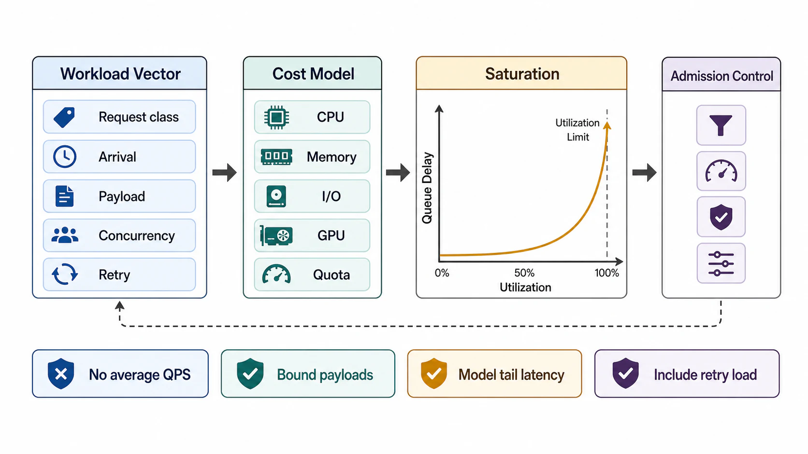

# Workload and Capacity Envelope



## Abstract

Workload is the shape of pressure applied to the system; capacity is the largest workload envelope the system can absorb while preserving correctness, latency, resource, and failure budgets. This file replaces the average-QPS capacity model with a bounded workload vector, a per-request-class resource cost model, and an explicit treatment of the nonlinear region near saturation where queueing delay — not compute — dominates tail latency. It incorporates the tail-amplification results of [Dean & Barroso (CACM 2013)](https://cacm.acm.org/research/the-tail-at-scale/), the open-versus-closed arrival distinction that invalidates most load tests, and the token-level cost model required for LLM-serving workloads where per-request cost varies by orders of magnitude.

Averages hide burst pressure, fanout, tail latency, payload skew, retry amplification, cache-miss cost, tenant hotspots, and state-growth pressure. Every one of those hidden terms has caused a production outage in the systems corpus this book draws from.

## 1. Workload Vector

```text
W = {
  request_classes,
  arrival_distribution,
  payload_distribution,
  resource_cost_distribution,
  concurrency_distribution,
  hotspot_distribution,
  state_growth_rate,
  dependency_quota_pressure,
  failure_induced_load,
  freshness_requirement,
  retention_requirement
}
```

Every field must be bounded or explicitly marked unknown. An unbounded field is not a modeling shortcut; it is a claim that the system tolerates any value of that field, which is almost never true and never tested.

## 2. Request Class Taxonomy

| Class | Primary Pressure | Boundary Requirement |
|---|---|---|
| Read | Cache, index, database read I/O, network egress, authorization filtering | Freshness and consistency claim |
| Write | Validation, dedupe, transaction, log append, index invalidation, audit | Idempotency and durability claim |
| Search/retrieval | Index latency, candidate fanout, reranking, context packing | Tenant-scoped retrieval and stale-bound declaration |
| Stream | Connection lifetime, backpressure, chunk ordering, cancellation | First-byte/first-token SLO and heartbeat contract |
| Batch import | Parser CPU, object storage I/O, queue depth, index build, retry storms | Checkpoint, resumability, and poison-record handling |
| Export | Snapshot consistency, pagination, egress bandwidth, data classification | Authorization and redaction before egress |
| Admin/control | Configuration mutation, policy update, rollout, rollback | Audit and blast-radius limit |
| Model inference | Tokenization, prefill, decode, KV-cache, GPU memory bandwidth | TTFT, TPOT, context, batching, and admission limits |
| Agent/tool execution | Tool fanout, workflow state, sandbox, retries, human approval | Tool timeout, validation, replay, and permission boundary |

## 3. Arrival Model

### 3.1 Open versus closed loops

Arrival processes divide into open loops (arrivals independent of completions — public traffic, webhook fanout, event backfill) and closed loops (a bounded client population that waits for a response before issuing the next request — internal batch drivers, benchmark harnesses). The distinction matters because a closed-loop load test self-throttles as the system slows down, which systematically underestimates queueing collapse under open-loop production traffic. A capacity claim validated only with a closed-loop generator is unproven for open-loop workloads.

### 3.2 Arrival patterns

| Pattern | Risk | Required Control |
|---|---|---|
| Steady | Slow saturation may be missed if only error rate is tracked | Utilization and latency trend alerts |
| Bursty | Queueing delay spikes before CPU or GPU appears saturated | Admission control and burst budget |
| Scheduled | Batch traffic collides with interactive traffic | Priority class and separate capacity pool |
| Retry-driven | Failure amplifies load and hides original cause | Deadline propagation and retry budget |
| Backfill-driven | Historical replay overwhelms hot path | Dedicated queue, rate limit, and checkpointing |
| Adversarial | Attack traffic consumes validation, auth, cache, or model resources | Pre-auth rate limit, size bounds, and abuse evidence |

Retry-driven arrival deserves emphasis: it is the trigger mechanism for metastable failure, where retry amplification sustains overload after the original fault clears ([Bronson et al., HotOS 2021](https://sigops.org/s/conferences/hotos/2021/papers/hotos21-s11-bronson.pdf)). The workload model must therefore include failure-induced load as a first-class arrival term, not as an operational surprise.

## 4. Capacity Model

### 4.1 Governing relations

Little's Law applies to any stable system regardless of distribution:

```text
L = λ · W        (in-flight work = arrival rate × time in system)
```

Single-class utilization:

```text
ρ = λ · E[S] / c    (utilization = arrival rate × mean service time / parallel capacity)
```

For an M/M/1 queue the expected wait grows as `W ≈ E[S] / (1 − ρ)` — the hyperbolic blow-up near ρ→1 shown below. Real systems with heavier-tailed service times blow up earlier and harder; the M/M/1 curve is the optimistic bound, not the pessimistic one.

```text
Figure 1. Latency versus utilization. The knee, not the ceiling,
is the capacity limit. Operating targets belong left of the knee.

 latency
    │                                          ..
    │                                        ..
    │                                      ..
    │                                    ..
    │                                 ...
    │                             ....
    │                        .....          <- knee (~ρ 0.7–0.8)
    │              .........
    │  ...........
    └────────────────────────────────────────────── ρ (utilization)
    0.0        0.3        0.6        0.8       1.0
```

Consequences the review must enforce:

- Capacity is declared as a target operating range per saturated resource (for example, ρ ≤ 0.7 on the GPU decode pool), never as a single maximum QPS.
- Latency headroom is bought with utilization headroom. A plan that budgets 95% steady-state utilization has budgeted zero burst tolerance.
- Little's Law is a throughput identity, not a tail guarantee. Tail behavior depends on service-time variance, queue policy, fanout width, dependency latency, retries, and admission control.

### 4.2 Tail amplification under fanout

If a request must wait for N parallel branches and each branch is slow with independent probability p, the request is slow with probability `1 − (1−p)^N`. At N=100 and p=0.01, that is 63% — per-branch p99 becomes end-to-end p37. Mitigations (hedged requests after the p95 mark, tied requests, latency-aware replica selection) are catalogued in [The Tail at Scale](https://cacm.acm.org/research/the-tail-at-scale/); Google reduced p99.9 from 1,800 ms to 74 ms with ~2% additional load using hedging. Hedging is admissible only for idempotent reads — which is why the idempotency contract in [04-input-output-and-api-contracts.md](04-input-output-and-api-contracts.md) precedes any hedging decision.

### 4.3 Measurement validity

Latency measurement under load is itself an architecture concern: load generators that pause when the system stalls (coordinated omission) silently delete the worst samples from the record. Capacity evidence must come from open-loop generation with corrected percentile recording, or it is classified as `assumed`, not `tested`, under the evidence rules of [11-evidence-classification-and-architecture-review.md](11-evidence-classification-and-architecture-review.md).

## 5. Resource Cost Model

Each request class must define cost in bounded units. Cost — not request count — is what admission control, quota, and autoscaling must conserve. The per-store machinery that makes these bounds structural — data layouts, index portfolios, query contracts, and engine selection — is [Chapter 04](../04-data-modeling-storage-engines-and-query-paths/README.md).

| Resource | Cost Unit | Example Boundary |
|---|---|---|
| CPU | core-ms/request | Validation and serialization cannot consume unbounded CPU per nested input |
| Memory | peak bytes/request | Concurrent streams cannot exceed buffer budget |
| Storage I/O | reads/writes/bytes/request | Write path must declare index and audit amplification |
| Network I/O | bytes in/out/request | Cross-region fanout must be explicit |
| Database | queries/rows/locks/request | Query path must be bounded by indexed predicates or page cursor |
| Cache | gets/sets/evictions/request | Cache stampede path must be bounded |
| Queue | messages/enqueues/dequeues/request | Retry and dead-letter traffic must be modeled |
| GPU | prefill tokens, decode tokens, KV bytes | Admission must bound context and concurrent decode slots |
| External quota | calls/tokens/bytes/request | Dependency rate limit must be part of capacity envelope |

### 5.1 The LLM-serving special case

Model-inference workloads break the uniform-cost assumption more severely than any classical class: a 128-token prompt and a 128k-token prompt differ by three orders of magnitude in prefill cost and KV-cache footprint, yet arrive on the same endpoint. Current production practice — vLLM/SGLang-class engines with prefill/decode disaggregation ([DistServe](https://haoailab.com/blogs/distserve-retro/), [Mooncake](https://docs.jarvislabs.ai/blog/llm-optimization-disaggregated-prefill-decode)) — separates the compute-bound prefill pool from the memory-bandwidth-bound decode pool precisely because the two phases saturate different resources under different SLOs (TTFT versus TPOT). The boundary consequence for this chapter: capacity for inference classes is declared in tokens and KV-bytes under both SLOs (the "goodput" framing — requests served *within* SLO per unit hardware), never in requests per second.

## 6. Tail-Latency Amplifiers

| Amplifier | Mechanism | Boundary Control |
|---|---|---|
| Fanout | End-to-end latency follows the slowest required branch (§4.2) | Limit fanout, parallelize only bounded branches, hedge only idempotent reads |
| Lock contention | Shared state serializes requests | Define ownership, shard hot keys, or move mutation off hot path |
| Cache miss | Cold path executes heavier storage, retrieval, or compute | Model miss ratio and miss cost separately |
| Retry storm | Failed dependency multiplies load | Retry budget, jitter, circuit breaker, and deadline propagation |
| Queue mixing | Batch jobs delay interactive requests | Priority isolation and per-class queue limits |
| Large payload skew | Few requests dominate CPU, memory, or network | Size classes, admission, and cost-weighted quotas |
| Model context growth | Prefill cost and KV memory scale with tokens | Context length cap and per-tenant token budget |
| N+1 call pattern | Per-item dependency fanout grows with result size | Batch interface or bounded pagination |
| Head-of-line blocking | One expensive request stalls a FIFO worker or decode batch | Cost-aware scheduling, chunked prefill, preemption |

## 7. Workload Declaration Template

```yaml
workload:
  request_classes:
    - name:
      description:
      caller:
      arrival_model: open | closed | mixed
      sustained_rate_per_second:
      burst_rate_per_second:
      burst_duration:
      payload_bounds:
        bytes_max:
        records_max:
        tokens_max:
        nested_depth_max:
      resource_cost:
        cpu_ms_p95:
        memory_bytes_p95:
        storage_reads_p95:
        storage_writes_p95:
        network_bytes_p95:
        gpu_prefill_tokens_p95:
        gpu_decode_tokens_p95:
        kv_cache_bytes_p95:
      concurrency:
        p95:
        p99:
        hard_limit:
      latency_budget:
        p50:
        p95:
        p99:
        timeout:
        ttft_p95:        # streaming/inference classes only
        tpot_p95:        # streaming/inference classes only
      retry_budget:
        max_attempts:
        backoff:
        jitter:
        deadline_propagated:
      failure_induced_load:
        duplicate_rate:
        replay_rate:
        failover_multiplier:
  state_growth:
  hotspot_assumptions:
  utilization_targets:
    - resource:
      target_rho:
      burst_headroom:
```

## 8. Approval Gates

| Gate | Evidence Required | Failure Condition |
|---|---|---|
| Request class gate | Every externally reachable path is assigned a class | A path inherits generic QPS assumptions |
| Payload gate | Size and shape bounds exist at ingress | Parser, serializer, tokenizer, or query planner can receive unbounded input |
| Cost gate | Critical resource cost is measured or estimated per request class | Capacity cannot be mapped to CPU, memory, I/O, GPU, or dependency quota |
| Arrival gate | Open/closed loop model and burst shape are explicit | Capacity was validated only with a self-throttling load generator |
| Utilization gate | Target operating range per saturated resource is declared | Capacity is a single QPS number with no headroom policy |
| Retry gate | Retry pressure is included in load model | Failure doubles or triples traffic outside the model |
| Growth gate | State growth and cardinality are projected | Index, cache, or storage pressure appears only after launch |

## Output

The output of this file is a workload and capacity envelope that can drive admission control, queue sizing, autoscaling, dependency contracts, and load-test scenarios — and that states its own region of validity.

## References

- [Dean & Barroso, "The Tail at Scale," CACM 56(2), 2013](https://cacm.acm.org/research/the-tail-at-scale/)
- [Bronson et al., "Metastable Failures in Distributed Systems," HotOS 2021](https://sigops.org/s/conferences/hotos/2021/papers/hotos21-s11-bronson.pdf)
- [Netflix — Performance Under Load (adaptive concurrency limits)](https://netflixtechblog.com/performance-under-load-3e6fa9a60581)
- [DistServe retrospective — 18 months of disaggregated LLM serving](https://haoailab.com/blogs/distserve-retro/)
- [Prefill/decode disaggregation in production LLM serving](https://docs.jarvislabs.ai/blog/llm-optimization-disaggregated-prefill-decode)
- [AWS Builders' Library — Avoiding Insurmountable Queue Backlogs](https://aws.amazon.com/builders-library/avoiding-insurmountable-queue-backlogs/)
