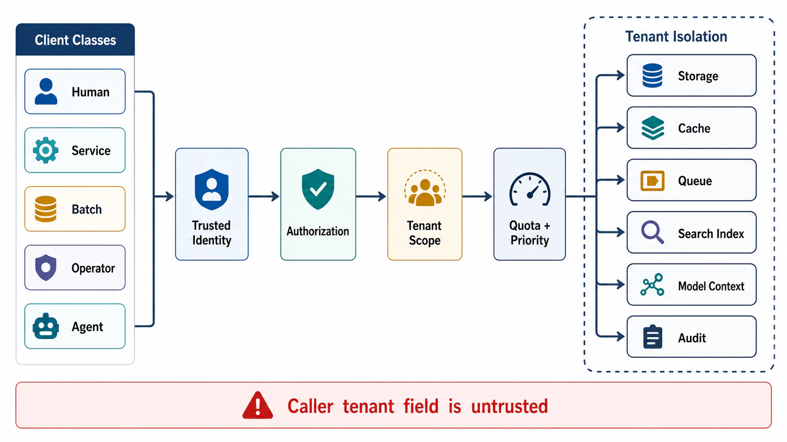

# Client, Tenant, and Use-Case Model



## Abstract

The client model defines who can invoke the system and what behavior each caller is allowed to observe or mutate. The tenant model defines how ownership, isolation, quota, audit, and data access are partitioned across customers sharing the same infrastructure. This file specifies both as enforceable contracts: a client-class taxonomy with per-class risk and boundary requirements, a tenant-isolation surface inventory that extends beyond database rows to caches, queues, worker pools, search indexes, and model context, and a priority/quota model fixed before overload rather than improvised during it. The isolation discipline follows [AWS's fairness analysis for multi-tenant systems](https://aws.amazon.com/builders-library/fairness-in-multi-tenant-systems/) and [Uber's Cadence multi-tenant task processing](https://www.uber.com/us/en/blog/cadence-multi-tenant-task-processing/); the agent-specific surfaces follow the [OWASP Top 10 for LLM Applications (2025)](https://genai.owasp.org/resource/owasp-top-10-for-llm-applications-2025/).

A system with multiple client or tenant classes cannot use one generic timeout, retry policy, authorization rule, quota, or error response. The generic caller is a fiction that costs exactly one incident to expose.

## 1. Client Classes

Each class below fails differently, retries differently, and must be throttled differently. Merging them into "the user" erases those differences at the boundary and rediscovers them in production.

| Client Class | Primary Risk | Required Boundary Contract |
|---|---|---|
| Interactive human | Tail latency and ambiguous partial failure damage task continuity | p95/p99 latency, partial-result schema, retry-safe UI state |
| Backend service | Retry and timeout mismatch cause duplicate mutation or cascading failure | Idempotency key, deadline propagation, stable error codes |
| Batch job | High-volume reprocessing consumes shared capacity | Checkpoints, rate limit, resumability, separate queue |
| Operator | Manual action can widen blast radius | Role-scoped override, approval, audit, rollback |
| Agent runtime | Tool calls can produce unbounded fanout or unsafe side effects | Tool allowlist, loop bounds, validation, sandbox, replay trace |
| ML model | Generated output can be malformed, stale, or over-authoritative | Schema validation, grounding, refusal state, context boundary |
| External partner | Compatibility and data-sharing errors cross organization boundary | Versioned API, partner quota, contractual data classification |
| Adversarial actor | Validation, auth, model, or cache resources can be exhausted | Pre-auth throttling, strict bounds, abuse telemetry |

Two classes deserve explicit commentary because they are new relative to classical service design:

- **Agent runtime.** An agent is a client whose request stream is generated by a model in a loop. Its failure modes — excessive tool fanout, retry-on-refusal loops, actions taken with broader permissions than the task requires — are catalogued as *Excessive Agency* (LLM06) in the [OWASP 2025 taxonomy](https://genai.owasp.org/llm-top-10/). The boundary contract must bound steps, tokens, tool invocations, and wall-clock per episode, and every side-effecting tool call must carry the same identity, authorization, and audit obligations as a human-initiated mutation.
- **Adversarial actor.** Abuse is a workload class, not a security afterthought. If validation, authentication, or model inference executes before rate limiting, the attacker rents your most expensive resource for free.

## 2. Client Contract Fields

```yaml
client:
  name:
  class:
  authentication:
  authorization_scope:
  tenant_scope_source:        # trusted identity or server-side mapping — never request body
  allowed_operations:
  allowed_side_effects:
  timeout_budget:
  retry_policy:
  rate_limit:
  quota_unit:                 # requests, bytes, tokens, GPU-seconds — match the scarce resource
  error_contract:
  audit_requirement:
  data_classes_accessible:
  denied_by_default: true
  agent_bounds:               # agent-runtime clients only
    max_steps:
    max_tool_calls:
    max_tokens:
    human_approval_operations:
```

## 3. Tenant Model

### 3.1 Isolation surface inventory

Tenant isolation must be defined across all state and execution resources, not only database rows. The figure enumerates the surfaces a single request touches; each is an independent leak or starvation channel, and each has produced real cross-tenant incidents when its isolation rule was left implicit.

```text
Figure 1. Tenant isolation surfaces along one request path.
Every layer needs its own isolation rule — isolation is not
inherited downward.

  request(tenant=A)
     │
     v
  ┌───────────────┐  identity/authz   tenant derived from token,
  │ ingress        │ ────────────────  never from payload
  ├───────────────┤
  │ rate limiter   │  quota per tenant, cost-weighted
  ├───────────────┤
  │ queue          │  per-tenant slots / fair scheduler
  ├───────────────┤
  │ worker pool    │  per-tenant concurrency cap
  ├───────────────┤
  │ cache          │  tenant in key derivation
  ├───────────────┤
  │ search index   │  filter enforced BEFORE ranking
  ├───────────────┤
  │ model context  │  tenant-scoped retrieval, memory, tools
  ├───────────────┤
  │ storage        │  row policy / schema / database per tier
  ├───────────────┤
  │ audit          │  tenant joinable on every decision
  └───────────────┘
```

| Isolation Surface | Required Decision |
|---|---|
| Identity | Tenant source must come from trusted identity or server-side mapping, not caller-provided metadata |
| Authorization | Permission decision must happen before retrieval, mutation, export, or tool execution |
| Storage | Tenant keying, encryption boundary, backup scope, deletion scope, migration scope |
| Cache | Tenant prefix, key derivation, invalidation, eviction fairness, cross-tenant leakage prevention |
| Queue | Per-tenant queue slots, priority, retry budget, dead-letter ownership |
| Worker pool | Tenant concurrency limit and fairness policy |
| Search index | Tenant-scoped index or filter enforcement before ranking and context packing |
| Model context | Tenant data cannot share prompt, memory, retrieval context, or tool output without explicit policy |
| Rate limit | Unit must match scarce resource: requests, records, bytes, tokens, GPU seconds, external calls |
| Audit | Actor, tenant, policy, operation, data class, and decision must be joinable to request trace |

### 3.2 Placement and blast radius

Beyond per-surface rules, the tenant model should state its placement strategy. Shuffle sharding — assigning each tenant a small random subset of workers so that two tenants rarely share their full worker set — bounds the blast radius of a poison workload to the few tenants whose shards overlap it, at near-zero capacity cost ([AWS Builders' Library, workload isolation with shuffle sharding](https://aws.amazon.com/builders-library/workload-isolation-using-shuffle-sharding/)). The review does not mandate shuffle sharding; it mandates that the chosen placement strategy names its blast radius.

### 3.3 Anti-patterns

| Anti-Pattern | Failure Mode |
|---|---|
| Trusting `tenant_id` from request body | Caller can request another tenant's data if authorization is not bound to identity |
| Shared cache without tenant in key | Cross-tenant data leak through cache hit |
| Filter after retrieval ranking | Forbidden documents can influence top-k ranking or generated answer |
| One queue for all tenants | Hot tenant can delay latency-sensitive or higher-priority traffic |
| One retry budget for all clients | Failing tenant can consume system-wide dependency quota |
| Shared vector index with optional filter | Missing filter becomes catastrophic correctness and privacy defect — [OWASP LLM08, vector and embedding weaknesses](https://genai.owasp.org/llm-top-10/) |
| Shared model memory across tenants | Persisted context from tenant A conditions answers for tenant B |
| Audit only on success | Denied and partial actions become invisible during incident review |

The "filter after ranking" row is the one most often missed in RAG systems: even if forbidden documents are stripped before display, their presence in the candidate set has already shaped the ranking and can shape the generated answer. Authorization must run before candidate selection, not after it.

## 4. Use-Case Contract

Each use case connects caller intent to allowed behavior. This is the unit at which product requirements become testable architecture.

| Field | Required Detail |
|---|---|
| Use case name | Stable operation name |
| Client class | Who invokes it |
| Tenant scope | How tenant is resolved |
| Input | Schema and size bounds |
| Output | Success, partial, rejected, failed, stale, accepted |
| Mutations | State that can change |
| Freshness | Required staleness bound |
| Consistency | Read/write visibility and ordering |
| Latency | Percentile and timeout |
| Dependency calls | Required and optional external calls |
| Failure behavior | Reject, retry, queue, degrade, compensate, rollback, escalate |
| Audit | Required evidence |

## 5. Priority and Quota Model

Priority must be explicit before overload. Netflix's production experience with [service-level prioritized load shedding](https://netflixtechblog.com/enhancing-netflix-reliability-with-service-level-prioritized-load-shedding-e735e6ce8f7d) demonstrates the payoff: when shedding order is pre-declared per traffic class, overload degrades the product predictably instead of arbitrarily. Retrofitting priority during incident response produces inconsistent user-visible behavior and un-replayable decisions.

| Priority Class | Admission Behavior | Shedding Rule |
|---|---|---|
| Critical safety/security | Admit if safety controls and audit path are available | Fail closed if authorization or audit is unavailable |
| Interactive revenue/user path | Admit within per-tenant and per-client budget | Shed optional enrichment and batch work first |
| Internal control-plane mutation | Admit with serialized audit and rollback path | Reject if policy store or audit sink is unavailable |
| Background maintenance | Admit only with spare capacity or reserved pool | Pause or checkpoint under overload |
| Backfill/migration | Explicit rate limit and isolated worker pool | Stop before affecting interactive SLO |
| Experimental/agentic | Strict tool, token, and step budget | Cancel on validation, timeout, or policy failure |

Quota units must denominate the scarce resource. A request-count quota on an LLM endpoint is a token subsidy for whoever sends the longest prompts; the quota must be in tokens and KV-bytes, or a cost-weighted composite, per the resource cost model in [02-workload-and-capacity-envelope.md](02-workload-and-capacity-envelope.md).

## 6. Approval Gates

| Gate | Evidence Required | Failure Condition |
|---|---|---|
| Client gate | Every caller is classified with auth, authorization, timeout, retry, quota, and audit | Generic caller model remains |
| Tenant gate | Tenant scope is resolved from trusted identity or server-side mapping | Tenant scope depends on unchecked request metadata |
| Isolation gate | Storage, cache, queue, worker, index, model context, and audit isolation are defined | Any resource can leak or starve across tenants |
| Placement gate | Blast radius of a poison tenant workload is stated | One hot or hostile tenant can degrade all tenants |
| Priority gate | Overload priority and shedding order are documented | Incident behavior depends on operator improvisation |
| Abuse gate | Adversarial requests are modeled as workload | Validation or model resources can be exhausted before throttling |
| Agent gate | Agent clients have step, token, tool, and approval bounds | Agent loop can consume unbounded resources or take unauthorized actions |

## Output

The output of this file is a client and tenant matrix that determines authorization, quota, isolation, priority, timeout, retry, audit, and overload behavior — per class, with no generic caller remaining.

## References

- [AWS Builders' Library — Fairness in Multi-Tenant Systems](https://aws.amazon.com/builders-library/fairness-in-multi-tenant-systems/)
- [AWS Builders' Library — Workload Isolation Using Shuffle Sharding](https://aws.amazon.com/builders-library/workload-isolation-using-shuffle-sharding/)
- [Uber Engineering — Cadence Multi-Tenant Task Processing](https://www.uber.com/us/en/blog/cadence-multi-tenant-task-processing/)
- [Netflix — Service-Level Prioritized Load Shedding](https://netflixtechblog.com/enhancing-netflix-reliability-with-service-level-prioritized-load-shedding-e735e6ce8f7d)
- [OWASP Top 10 for LLM Applications 2025 — LLM06 Excessive Agency, LLM08 Vector and Embedding Weaknesses](https://genai.owasp.org/llm-top-10/)
