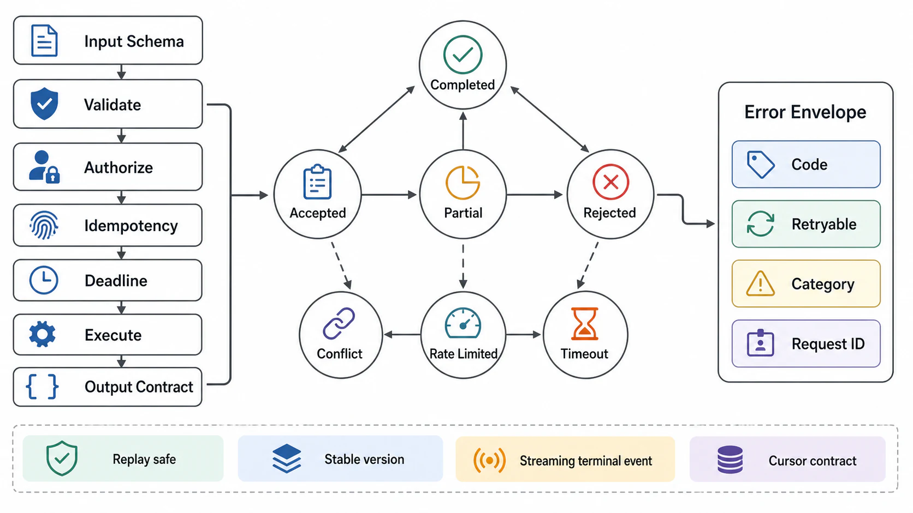

# Input, Output, and API Contracts



## Abstract

The API contract is the executable boundary between caller intent and system behavior: what enters, what leaves, what can be retried, what is durable, what is partial, what is stale, and what is forbidden. This file specifies the input contract, the output status machine, the idempotency mechanism that makes retries safe, the deadline-propagation algebra that keeps work from outliving its caller, and the compatibility rules under which the contract may evolve. The idempotency design follows [Stripe's production idempotency semantics](https://docs.stripe.com/api/idempotent_requests) and the [IETF `Idempotency-Key` header draft](https://datatracker.ietf.org/doc/draft-ietf-httpapi-idempotency-key-header/); the deadline discipline follows the deadline-propagation model native to gRPC and the retry analysis in [AWS's timeouts/retries/backoff guidance](https://aws.amazon.com/builders-library/timeouts-retries-and-backoff-with-jitter/).

An API without idempotency, deadline, status, version, and error semantics is not production-ready even if its schema validates. Schema answers "what shape"; the contract answers "what happens" — under retry, under timeout, under partial failure, and under concurrent duplicates.

## 1. Input Contract

| Field | Required Detail |
|---|---|
| Operation | Stable name and version |
| Schema | Required fields, optional fields, types, enums, nullability, defaulting rule |
| Size bounds | Bytes, records, tokens, files, nested depth, list length |
| Encoding | JSON, Protobuf, Avro, multipart, binary, compression, charset |
| Identity | Subject, tenant, service account, delegated actor, session |
| Authorization | Permissions required before data access or mutation |
| Idempotency | Key format, scope, dedupe store, dedupe window, replay response |
| Deadline | Caller timeout, server timeout, downstream propagation |
| Ordering | Sequence number, partition key, reorder detection, duplicate handling |
| Freshness | Maximum acceptable staleness for reads or derived state |
| Side effects | Exact state mutations allowed |
| Validation | Reject, normalize, enrich, quarantine, or redact |
| Trace context | W3C `traceparent`/`tracestate`, request ID, causality ID, audit key |

The ingress invariant: no downstream component may receive data that has not passed schema, size, identity, authorization, and deadline validation at the boundary. Validation failures are terminal — malformed schema, unauthorized access, invalid tenant scope, and oversized payloads must not enter internal retry loops, because retrying a deterministic rejection converts one bad request into N bad requests.

## 2. Output Contract and Status Machine

The output contract is the externally observable proof of system behavior. Its central invariant:

```text
The response must never imply stronger consistency, durability, authorization,
or completion semantics than the system actually provides.
```

```text
Figure 1. Request lifecycle status machine. Terminal states are
boxed with double borders; AMBIGUOUS is the state most contracts
forget to model, and the one retries must be designed around.

                       ┌──────────┐
        validation ───►║ REJECTED ║  (terminal, non-retryable)
        failure        ╚══════════╝
            │
  ingress ──┤ admission
            │  pass         async path
            v               ┌─────────────┐   poll/callback
       ┌─────────┐   ┌────► │  ACCEPTED   │ ────────────┐
       │ ADMITTED│───┤      └─────────────┘             │
       └─────────┘   │                                  v
            │        │ sync path                 ┌────────────┐
            v        │                           │ job status │
       ┌─────────┐   │    ┌───────────┐          └────────────┘
       │EXECUTING│───┴──► ║ COMPLETED ║◄─────────────┘
       └─────────┘        ╚═══════════╝
        │   │   │
        │   │   └────────► ║ PARTIAL  ║  (per-item results + retryability)
        │   │              ╚══════════╝
        │   └────────────► ║ FAILED   ║  (terminal, stable error code)
        │                  ╚══════════╝
        └─ deadline/link ─► ║ AMBIGUOUS ║ (completion unknown:
           lost after       ╚═══════════╝  resolve via idempotent
           side effect                     replay or operation query)
```

| Status Class | Meaning | Required Response Fields |
|---|---|---|
| Completed | Requested operation finished and all promised side effects are durable | Result, version, audit handle |
| Accepted | Request is durable, execution is asynchronous, final state unknown | Job ID, polling contract, cancellation contract |
| Rejected | Request will not execute because boundary validation failed | Stable error code, non-retryable flag |
| Partial | Some independent sub-operations succeeded and others failed | Per-item result, compensation state, retryability |
| Conflict | Request is valid but violates version, idempotency, sequence, or state precondition | Conflicting resource/version and resolution path |
| Rate limited | Request exceeded client, tenant, operation, or resource budget | Retry-after only if retry is safe |
| Timeout/Ambiguous | System cannot prove completion before deadline | Completion ambiguity flag and replay contract |
| Failed | System attempted execution and failed terminally | Stable error code, retryability, audit handle |

If a write is accepted asynchronously, the output must not report completed mutation. It returns `accepted` with a durable job identifier, polling contract, cancellation contract, and failure-state contract.

## 3. Idempotency Contract

Idempotency must be defined before retries, because a retry policy without idempotency is a duplicate-mutation generator. The mechanism is the one Stripe has run in production for a decade and the IETF has drafted as the [`Idempotency-Key` header](https://datatracker.ietf.org/doc/draft-ietf-httpapi-idempotency-key-header/): the server durably records the first outcome (success *or* failure) for a given key and replays that recorded outcome for every retry — it does not re-execute.

```yaml
idempotency:
  required: true
  key_source: client-generated, >= 122 bits entropy (UUIDv4 or equivalent)
  key_scope:                    # a key is unique within, not across:
    - tenant
    - operation
    - caller
  dedupe_window:                # bounded — an unbounded dedupe store is unbounded state
  dedupe_store:                 # durable, and atomic with the mutation fence
  mutation_fence:               # key reservation commits before side effect begins
  replay_response:
    same_result: true           # identical payload -> recorded outcome, no re-execution
    in_progress_state: true     # concurrent duplicate -> in-progress, not second execution
    conflict_on_mismatched_payload: true   # same key, different payload -> 409, never silent overwrite
  observable_completion:
    request_id:
    operation_id:
    audit_event_id:
```

Three edge cases separate a real implementation from a decorative one:

1. **Concurrent duplicates.** Two in-flight requests with the same key must serialize on the key reservation; the loser observes `in_progress`, not a second execution.
2. **Recorded failures.** If the first attempt failed terminally, the retry replays that failure. Re-executing on retry-of-failure reintroduces the duplicate-mutation window the key was meant to close.
3. **Key/payload mismatch.** Same key with a different payload is a client bug and must surface as `conflict`, never as silent acceptance of either payload.

## 4. Deadline Contract

Deadlines must travel with the work. A downstream call cannot outlive the caller's ability to consume the result unless the API explicitly returned `accepted`.

```text
Figure 2. Deadline budget attenuation across hops. Each hop
subtracts its own costs before delegating; a hop with no
remaining budget rejects instead of starting work it cannot finish.

  caller deadline: 2000 ms
   │
   ├─ ingress + validation      (-50)   remaining 1950
   ├─ reserve response write    (-100)  remaining 1850
   v
  service A budget: 1850 ms
   │
   ├─ local work                (-150)  remaining 1700
   ├─ reserve cleanup           (-100)  remaining 1600
   v
  dependency B deadline: 1600 ms   (propagated in metadata,
                                    e.g. gRPC deadline / timeout header)

server_deadline      <= caller_deadline − response_write_budget
dependency_deadline  <= remaining_server_deadline − local_cleanup_budget
retry_attempt_budget <= remaining_deadline / remaining_attempts
```

Deadline exhaustion must resolve to one of: rejected before execution, cancelled before side effect, completed but response lost, ambiguous completion, or accepted asynchronous continuation. "The request just timed out" is not a state; it is an unexamined superposition of the five.

## 5. Error Envelope

```json
{
  "error": {
    "code": "stable.machine.readable.code",
    "message": "safe caller-facing detail",
    "retryable": false,
    "category": "validation|authorization|conflict|rate_limit|timeout|dependency|internal",
    "request_id": "req_...",
    "operation_id": "op_...",
    "details": {}
  }
}
```

Rules:

- The error code is stable across deployments; clients branch on it, so changing it is a breaking change (§6).
- `retryable` must be consistent with idempotency and completion ambiguity — marking an ambiguous mutation `retryable: true` without an idempotency requirement is an instruction to duplicate it.
- Messages carry no secrets, internal topology, tenant data, or model-private context. Stack traces live in logs, not responses.

## 6. Compatibility Contract

The operative law of API evolution: with enough clients, every observable behavior — not just the documented schema — will be depended on. Compatibility review therefore covers behavior, not merely shape.

| Change Type | Compatibility Rule |
|---|---|
| Add optional request field | Compatible only if default behavior is unchanged |
| Add required request field | Breaking; requires new version or migration phase |
| Remove response field | Breaking unless field was explicitly experimental and uncontracted |
| Add enum value in response | Breaking for clients that branch exhaustively; requires documented unknown-value rule |
| Tighten size bound | Breaking if existing valid requests become invalid |
| Relax size bound | Requires capacity, abuse, and cost review |
| Change retryability | Breaking when clients have automated retry behavior |
| Change consistency claim | Breaking if response implies weaker freshness or durability |
| Change latency profile materially | Behavioral break for deadline-tuned callers; requires disclosure |

## 7. Streaming Contract

Streaming APIs add boundary obligations that unary contracts never face — the response is consumed while it is being produced, so failure can arrive mid-sentence:

- First-byte or first-token SLO (TTFT for model streams), and per-chunk cadence (TPOT) where applicable.
- Chunk schema and sequence numbering.
- Heartbeat interval, so a stalled stream is distinguishable from a slow one.
- Cancellation behavior — client disconnect must propagate to cancel upstream compute (an abandoned decode consuming GPU slots is capacity theft).
- Partial-output safety rule: which prefixes of the stream are safe to act on, and the terminal event that distinguishes a completed stream from a truncated one.
- Backpressure handling and reconnect/replay semantics.
- Audit capture of emitted chunks or a safe digest.

## 8. Pagination Contract

Cursor pagination must specify: cursor opacity, cursor expiry, sort key, snapshot-versus-moving-window semantics, duplicate and missing-item behavior under concurrent writes, page-size maximum, and authorization filtering *before* cursor construction (a cursor minted against unfiltered results is a stored authorization bypass). Offset pagination fails review for large or mutable datasets unless the workload is bounded and the consistency trade-off is documented.

## 9. Approval Gates

| Gate | Evidence Required | Failure Condition |
|---|---|---|
| Schema gate | Machine-readable schema with type, nullability, enum, version, and bounds | Informal request/response examples are the only contract |
| Idempotency gate | Mutation path has dedupe, replay, concurrent-duplicate, and conflict behavior | Retries can duplicate side effects |
| Deadline gate | Deadlines propagate to downstream calls and queues | Work can continue invisibly after caller timeout |
| Ambiguity gate | Timeout-after-side-effect maps to an explicit ambiguous state with resolution path | Ambiguous completion is reported as clean failure |
| Error gate | Stable error codes and retryability exist | Clients must parse text or infer retry safety |
| Compatibility gate | Breaking and non-breaking changes are defined, including behavioral changes | Version changes can silently break clients |
| Streaming/pagination gate | Long-lived or multi-page outputs have explicit consistency and cancellation semantics | Client-visible output can be duplicated, truncated, or reordered without disclosure |

## Output

The output of this file is a machine-readable API contract with precise mutation, retry, timeout, status, streaming, pagination, compatibility, and error semantics — one under which a retry is provably safe or provably forbidden, never a gamble. This file owns *that* these contract fields exist at the boundary; [Chapter 07](../07-api-contracts-and-request-lifecycle/README.md) owns *how* each one is engineered — the artifact pipeline, timeout budgets, idempotency machinery, error taxonomy, versioning, and the streaming/LRO/AI lifecycles in full depth.

## References

- [Stripe API Reference — Idempotent Requests](https://docs.stripe.com/api/idempotent_requests)
- [IETF HTTPAPI WG — The Idempotency-Key HTTP Header Field (draft)](https://datatracker.ietf.org/doc/draft-ietf-httpapi-idempotency-key-header/)
- [AWS Builders' Library — Timeouts, Retries, and Backoff with Jitter](https://aws.amazon.com/builders-library/timeouts-retries-and-backoff-with-jitter/)
- [AWS Well-Architected Reliability Pillar — API Service Contracts](https://docs.aws.amazon.com/wellarchitected/latest/reliability-pillar/rel_service_architecture_api_contracts.html)
- [W3C Trace Context — standard trace propagation headers](https://www.w3.org/TR/trace-context/)
