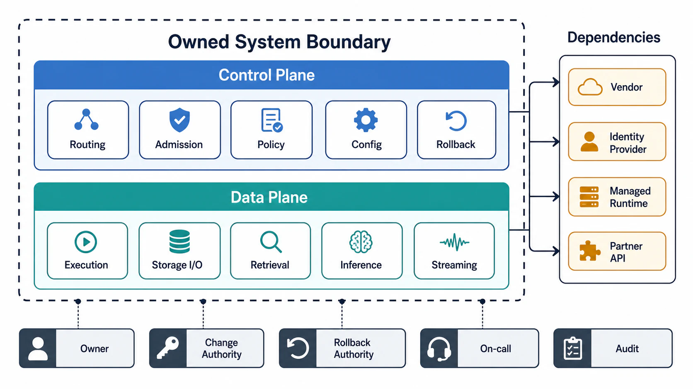

# System Boundary and Ownership



## Abstract

The system boundary defines what the team owns, operates, secures, observes, tests, rolls back, and can truthfully claim as implemented behavior; everything outside it is a dependency, assumption, or risk until governed by a contract. This file specifies the boundary as an accountability model rather than a diagram convention: ten boundary dimensions each requiring a named owner, the control-plane/data-plane separation with its coupled-failure-domain analysis, and the rejection criteria under which a boundary claim fails review. The control/data-plane discipline follows the pattern documented across [AWS's availability guidance](https://aws.amazon.com/builders-library/static-stability-using-availability-zones/) — the data plane must keep executing its last-known-good instructions when the control plane is down — and the coupled-domain analysis generalizes the shared-resource incidents recurring throughout the production corpus.

Boundary is not a drawing around components. Boundary is the answer to: who can change this, who is paged for it, who can roll it back, and whose correctness claim dies if it lies.

## 1. Boundary Dimensions

| Dimension | Defines | Required Owner |
|---|---|---|
| Functional | Capabilities promised to callers | Product and engineering owner |
| API | Ingress and egress interfaces | Service owner |
| Data | Owned, derived, cached, exported, retained, and deleted data | Data owner |
| Control plane | Policy, routing, configuration, scheduling, admission, rollout | Platform or service owner |
| Data plane | Hot-path execution, I/O, streaming, retrieval, inference, mutation | Service owner |
| Deployment | Processes, regions, runtimes, nodes, managed services | Operations owner |
| Trust | Identity, authorization, tenant isolation, secret access, privilege transition | Security owner |
| Observability | Metrics, logs, traces, alerts, audit evidence, dashboards | On-call owner |
| Failure | Faults absorbed internally versus delegated to caller or operator | Reliability owner |
| Lifecycle | Build, release, migration, rollback, deprecation | Release owner |

## 2. Inside, Outside, and the Test That Separates Them

Inside means all of the following hold:

- Behavior can be changed by owned code, configuration, schema, release, or documented operation.
- Behavior can be tested before release and observed in production.
- Behavior can be rolled back, mitigated, disabled, or isolated during failure.
- Correctness, security, and latency claims are owned by the system team.

Outside means at least one of the following holds:

- Another team, vendor, runtime, model provider, managed service, caller, or human process controls behavior.
- The failure mode cannot be changed directly by the system team.
- Telemetry must be imported, inferred, sampled, or requested from another owner.
- The guarantee depends on an external SLA, SLO, support channel, contract, or operational process.

Outside systems are allowed — every real system has them. Undocumented dependence on outside behavior is what is not allowed; it converts someone else's roadmap into your correctness claim.

## 3. Boundary Inventory

```yaml
boundary:
  inside:
    code:
    configuration:
    runtime:
    persistent_state:
    derived_state:
    caches:
    queues:
    models:
    indexes:
    telemetry:
    security_controls:
    release_process:
    rollback_process:
  outside:
    external_services:
    managed_infrastructure:
    model_providers:
    identity_providers:
    partner_apis:
    caller_responsibilities:
    operator_processes:
    compliance_authorities:
  crossings:
    ingress:
    egress:
    control_plane_mutation:
    data_export:
    secret_access:
    audit_export:
```

## 4. Control Plane and Data Plane

The two planes fail differently, scale differently, and demand different availability postures, so they must be separated even at boundary-definition time — before any component exists. This section declares the separation as a boundary obligation; the machinery that implements and verifies it (anatomy, policy distribution, static stability, rollout gates, drills) is [Chapter 02](../02-control-plane-and-data-plane-separation/README.md).

```text
Figure 1. Plane separation and legal failure directions.
The data plane runs on cached/last-known-good policy when the
control plane is unavailable (static stability); the control
plane's safety levers stay reachable when the data plane is
saturated. Neither plane may take the other down.

            CONTROL PLANE  (decides what should happen)
  ┌──────────────────────────────────────────────────────┐
  │ routing policy · admission limits · tenant quotas     │
  │ config rollout · feature flags · kill switches        │
  │ model/index selection · credential policy             │
  └──────────────┬───────────────────────────▲───────────┘
                 │ policy push /              │ health, load,
                 │ versioned snapshot         │ saturation signals
                 v                            │
  ┌──────────────────────────────────────────┴───────────┐
  │ request execution · storage I/O · retrieval           │
  │ prefill/decode · streaming · queue consumption        │
  └──────────────────────────────────────────────────────┘
            DATA PLANE  (executes accepted work)

  control-plane outage  -> data plane serves last-known-good policy
  data-plane overload   -> kill switches and rollback stay reachable
```

### 4.1 Control-plane boundary

| Control-Plane Concern | Boundary Requirement |
|---|---|
| Routing | Policy source, version, rollout, rollback, and default behavior |
| Admission | Capacity signal, rejection code, priority class, tenant quota |
| Scheduling | Queue ownership, fairness, deadline, cancellation, worker selection |
| Configuration | Change authority, validation, propagation delay, audit |
| Feature flags | Scope, blast radius, default, kill switch |
| Model/index selection | Selection rule, version, compatibility, rollback |
| Credential policy | Secret scope, rotation, least privilege, audit |
| Tenant policy | Limits, isolation, retention, export, deletion |

Two structural properties are required. First, static stability: the data plane must degrade to last-known-good policy, not to a halt, when the control plane is unreachable — a data plane that requires a live control-plane lookup per request has silently multiplied its availability dependencies. Second, the control plane is usually the higher-blast-radius plane: a wrong routing rule or bad config rollout fails every request at once, where a single data-plane host failure fails a fraction. Control-plane mutations therefore carry validation, staged rollout, and rollback obligations that data-plane requests do not.

### 4.2 Data-plane boundary

| Data-Plane Concern | Boundary Requirement |
|---|---|
| Request execution | Deadline, cancellation, idempotency, status emission |
| Storage I/O | Transaction boundary, consistency, retry, timeout |
| Retrieval | Tenant filter, index version, staleness, provenance |
| Inference | Tokenization, batching, model version, context bound, streaming |
| Queue consumption | Offset ownership, duplicate handling, poison message behavior |
| Streaming | Backpressure, chunk order, heartbeat, terminal event |
| Export | Snapshot, redaction, egress authorization, audit |

The data plane must not make policy decisions from unchecked caller metadata or model-generated claims — policy evaluation happens in the control plane or at an explicit, audited enforcement point, never inferred mid-execution.

## 5. Coupled Failure Domains

Sharing a resource across planes (or across priority classes) is sometimes the right cost decision — but only when it is declared as a coupled failure domain with a mitigation, because the coupling converts two independent failure probabilities into one.

| Shared Resource | Coupling Risk | Required Mitigation |
|---|---|---|
| Database shared by control and data plane | Data-plane overload prevents policy reads or rollback writes | Separate pool, priority, replica, or cached safe defaults |
| Shared cache | Eviction or corruption affects authorization, routing, or user data | Namespace, TTL, validation, and fail-closed rules |
| Shared queue | Batch work delays interactive or control-plane work | Separate queues or strict priority with admission |
| Shared thread pool | Slow dependencies exhaust control-plane execution | Bulkheads and bounded work queues |
| Shared GPU pool | Long contexts starve short interactive requests | Token-aware admission and class-based scheduling |
| Shared telemetry sink | Incident loses evidence needed for recovery | Local buffering and degraded readiness |

## 6. Ownership Matrix

Ownership is a claim about authority, not familiarity. "The platform team knows about this" is not an owner; an owner is whoever can change it, roll it back, and gets paged when it lies.

| Asset | Owner | Change Authority | Rollback Authority | On-Call Owner | Audit Required |
|---|---|---|---|---|---|
| API schema |  |  |  |  |  |
| Auth policy |  |  |  |  |  |
| Tenant quota |  |  |  |  |  |
| Database schema |  |  |  |  |  |
| Cache keys |  |  |  |  |  |
| Queue topics |  |  |  |  |  |
| Search index |  |  |  |  |  |
| Model artifact |  |  |  |  |  |
| Observability dashboards |  |  |  |  |  |
| Runbook |  |  |  |  |  |

Blank owner fields block architecture approval.

## 7. Boundary Rejection Criteria

- External dependency appears in the component diagram as if owned.
- Control-plane and data-plane responsibilities share a resource without failure-domain analysis.
- Data plane requires a live control-plane lookup per request with no last-known-good fallback.
- Ownership is assigned to a group name without release, rollback, and on-call authority.
- Caller-owned retry behavior is required for correctness.
- Model output is trusted as authorization, identity, policy, or data-classification evidence.
- Observability boundary cannot join a caller-visible response to internal execution.
- Deployment boundary lacks rollback and kill-switch authority.

## Output

The output of this file is an ownership-accurate boundary model that separates owned behavior from external dependency behavior, separates control-plane decisions from data-plane execution, and names an accountable owner for every asset that can fail.

## References

- [AWS Builders' Library — Static Stability Using Availability Zones](https://aws.amazon.com/builders-library/static-stability-using-availability-zones/)
- [AWS Builders' Library — Avoiding Overload by Putting the Smaller Service in Control](https://aws.amazon.com/builders-library/avoiding-overload-in-distributed-systems-by-putting-the-smaller-service-in-control/)
- [Google SRE Book — Handling Overload](https://sre.google/sre-book/handling-overload/)
- [Azure Well-Architected Framework — Operational Excellence principles](https://learn.microsoft.com/en-us/azure/well-architected/operational-excellence/principles)
