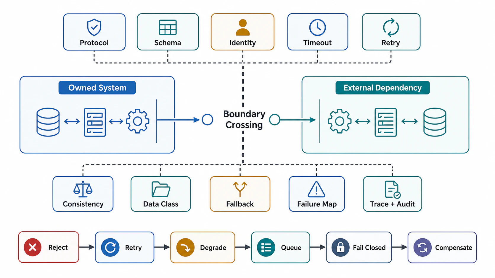

# Boundary Crossing and Dependency Contracts



## Abstract

A boundary crossing is any transition where data, control, identity, authority, or failure moves between separately owned execution contexts; a dependency contract defines the behavior the owned system may rely on when crossing. This file specifies the anatomy of a crossing, a typed inventory of crossing classes with their characteristic risks, the timeout/retry algebra that keeps a failing dependency from amplifying its own failure, and the fallback semantics under which degraded operation remains truthful. The retry discipline follows [AWS's timeouts, retries, and backoff analysis](https://aws.amazon.com/builders-library/timeouts-retries-and-backoff-with-jitter/) — capped exponential backoff with jitter, budgeted per caller — and the amplification analysis follows the metastable-failure literature ([Bronson et al., HotOS 2021](https://sigops.org/s/conferences/hotos/2021/papers/hotos21-s11-bronson.pdf)): retries are a loan against future capacity, and unbudgeted loans default at the worst time.

Every crossing must be designed as a failure surface. The four possible outcomes of any remote call — not executed, executed once, executed multiple times, partially executed — are indistinguishable to the caller at timeout, and the contract exists to make each outcome survivable.

## 1. Anatomy of a Crossing

```text
Figure 1. What actually crosses at a boundary crossing. Most
contracts specify only the data lane and discover the other
four lanes during incidents.

   owned context                        external context
  ┌──────────────┐                     ┌──────────────┐
  │              │  data (schema, ver) │              │
  │              │ ══════════════════► │              │
  │              │  identity/authority │              │
  │   caller     │ ──────────────────► │  dependency  │
  │              │  deadline budget    │              │
  │              │ ──────────────────► │              │
  │              │  trace/audit ctx    │              │
  │              │ ──────────────────► │              │
  │              │  failure (timeout,  │              │
  │              │ ◄─ ─ ─ ─ ─ ─ ─ ─ ─  │              │
  │              │   partial, stale,   │              │
  └──────────────┘   malformed, throttle)└────────────┘
```

## 2. Boundary Crossing Fields

| Field | Required Detail |
|---|---|
| Name | Stable crossing identifier |
| Direction | Ingress, egress, bidirectional, callback, async event, control mutation |
| Owner | Owning team or vendor on each side |
| Protocol | HTTP, gRPC, Kafka, database wire protocol, object storage API, filesystem, IPC |
| Schema | Versioned request, response, event, or file format |
| Identity | Caller identity, service identity, delegated actor, tenant scope |
| Authorization | Required permission and enforcement point |
| Timeout | Client deadline, server timeout, queue deadline, stream idle timeout |
| Retry | Retryable statuses, attempts, backoff, jitter, idempotency prerequisite |
| Rate limit | Sustained, burst, quota unit, throttling status, recovery signal |
| Ordering | Ordered, unordered, partition ordered, causal, snapshot, not applicable |
| Consistency | Freshness, durability, visibility, read-after-write, eventual behavior |
| Data classification | Confidentiality, retention, logging, redaction, export rule |
| Failure mapping | How dependency failures map to system status |
| Fallback | Cache, degrade, queue, fail closed, fail open, compensate, rollback |
| Observability | Metrics, logs, spans, audit handles, support correlation ID |

## 3. Crossing Types

| Crossing Type | Critical Risk | Required Guard |
|---|---|---|
| Public ingress | Malformed, unauthorized, oversized, adversarial input enters system | Schema, size, auth, rate, and deadline validation before internal fanout |
| Internal service call | Partial execution and ambiguous completion | Idempotency, timeout, retry, trace context |
| Database call | Lock contention, unbounded scan, inconsistent transaction boundary | Indexed predicate, isolation level, query timeout |
| Queue/event publish | Duplicate, reorder, poison event, retention loss | Event ID, partition key, schema version, DLQ |
| Object storage | Large I/O, stale listing, incomplete upload | Checksum, multipart state, size bound, lifecycle policy |
| Model provider/runtime | Cost, latency, nondeterminism, schema drift, context leakage | Token budget, output validation, model version pinning, privacy boundary |
| Tool execution | Unsafe side effect or unbounded fanout | Tool allowlist, sandbox, timeout, idempotency |
| Webhook/callback | Untrusted receiver, replay, delivery ambiguity | Signature, replay window, delivery state, retry budget |
| Control-plane mutation | Bad policy or config creates system-wide blast radius | Validation, approval, staged rollout, rollback |

The model-provider row deserves a note: a hosted LLM is a dependency whose latency variance, cost variance, and output distribution can all shift without a version change on your side. The contract must pin model version where the provider allows it, validate output schema on every call, and treat provider-side model updates as a dependency change requiring regression evidence — not as transparent maintenance.

## 4. Dependency Contract Template

```yaml
dependency:
  name:
  purpose:
  owner:
  escalation:
  interface:
    protocol:
    endpoint:
    schema_version:
    authentication:
    authorization:
  workload:
    expected_rate:
    burst_rate:
    quota_unit:
    payload_bounds:
  timeout:
    caller_deadline:
    server_timeout:
    stream_idle_timeout:
  retry:
    enabled:
    retryable_errors:
    max_attempts:
    backoff: capped_exponential
    jitter: full
    retry_budget:              # max retry fraction of live traffic, per caller
    idempotency_required:
  circuit_breaker:
    failure_threshold:
    half_open_probe:
    fallback_on_open:
  consistency:
    freshness:
    ordering:
    durability:
    read_after_write:
  data:
    classification:
    retained_by_dependency:
    logged_by_dependency:
    used_for_training:         # explicit for model providers
    encrypted_in_transit:
    encrypted_at_rest:
  failure:
    timeout:
    unavailable:
    stale_response:
    partial_response:
    malformed_response:
    wrong_authority:
  fallback:
    strategy:
    degraded_response:
    fail_closed_conditions:
    fail_open_conditions:
  observability:
    metrics:
    logs:
    traces:
    audit_events:
    correlation_id:
```

## 5. Timeout and Retry Algebra

The quantitative core: in a call chain of depth `d` where every layer retries `n` times, a persistent fault at the bottom multiplies traffic by `n^d`. Three layers of three attempts is a 27× amplifier aimed at a dependency that is already failing — the classic retry-storm entry into metastable failure. Hence the rules:

| Rule | Requirement | Rationale |
|---|---|---|
| Retry at one layer | Designate a single retry owner per call chain | Prevents multiplicative `n^d` amplification |
| Retry only inside remaining deadline | Attempt budget ≤ remaining_deadline / remaining_attempts | A retry that outlives the caller is pure waste heat |
| Retry only idempotent operations | Non-idempotent mutation requires dedupe or explicit compensation | Timeout does not mean "did not execute" |
| Cap and jitter all backoff | Capped exponential + full jitter | Synchronized retries recreate the spike they wait out ([AWS analysis](https://aws.amazon.com/blogs/architecture/exponential-backoff-and-jitter/)) |
| Budget retries as a traffic fraction | e.g., retries ≤ 10% of live requests per caller | Converts retry amplification from unbounded to bounded |
| Stop retries when circuit opens | Circuit breaker with half-open probes | Dependency outage must not consume all worker capacity |
| Never retry deterministic failures | Validation, authorization, conflict, 4xx-class errors | The answer will not change; the load will |
| Expose completion ambiguity | Timeout-after-mutation is `ambiguous`, not `failed` | Truthful status is the precondition for safe caller behavior |

Hedged requests — a second attempt fired when the first exceeds its p95 — are a latency tool, not a reliability tool, and are admissible only for idempotent reads with a hedge budget (~5% extra load), per [Dean & Barroso](https://cacm.acm.org/research/the-tail-at-scale/).

For multi-step workflows spanning several crossings, the modern alternative to hand-rolled retry/compensation state machines is durable execution ([Temporal-class engines](https://docs.temporal.io/workflow-execution)): each step's outcome is journaled, and recovery replays the journal deterministically instead of re-executing completed steps. This does not remove the per-crossing contract obligations — it relocates them into step boundaries and makes step idempotency the load-bearing requirement.

## 6. Fallback Semantics

A fallback is a second contract, not an exception handler. Each fallback claims validity conditions, and using it outside those conditions converts graceful degradation into silent lying.

| Fallback | Valid When | Invalid When |
|---|---|---|
| Cache | Staleness bound is acceptable and disclosed | Caller requires fresh or strongly consistent result |
| Degrade | Optional feature can be omitted without violating objective | Omitted data changes security, billing, correctness, or compliance |
| Queue for later | Operation is idempotent and caller accepts asynchronous status | Caller requires immediate completion |
| Fail closed | Security, privacy, authorization, audit, or data integrity is uncertain | Availability is prioritized by explicit risk acceptance |
| Fail open | Risk is explicitly approved and bounded | Data access, mutation, or secret exposure is possible |
| Compensate | Side effects are reversible and compensation is idempotent | External effect cannot be reliably observed or undone |
| Rollback | Transaction or version boundary exists | Partial side effects escaped the owned boundary |

## 7. Dependency Failure Mapping

| Dependency Failure | System Response |
|---|---|
| DNS/connect failure | Circuit breaker, dependency error, retry only if deadline and idempotency allow |
| Timeout before execution | Retry or fail with retryable timeout |
| Timeout after possible execution | Return ambiguous completion state or idempotent replay handle |
| Malformed response | Quarantine, fail closed for correctness paths, emit contract-violation metric |
| Stale response | Return stale state only if contract permits; include staleness metadata |
| Partial response | Return partial status only if response schema supports it; otherwise fail |
| Throttle/rate limit | Respect retry-after when safe; reduce admission; never retry-storm a throttling dependency |
| Auth failure | Fail closed; rotate credentials only through control-plane process |
| Data-classification mismatch | Block egress or quarantine result; audit policy violation |
| Silent quality degradation (gray failure) | Detect via differential SLIs (caller-observed vs dependency-reported health); treat divergence as failure |

The last row encodes the [gray-failure result](https://www.microsoft.com/en-us/research/publication/gray-failure-achilles-heel-cloud-scale-systems/): a dependency's own health checks routinely pass while callers experience degradation. A dependency contract that trusts only the dependency's self-reported health has no detection path for the most common class of cloud failure.

## 8. Approval Gates

| Gate | Evidence Required | Failure Condition |
|---|---|---|
| Crossing inventory | Every ingress, egress, callback, event, DB, model, tool, and control mutation is listed | Hidden crossing exists |
| Dependency contract | Timeout, retry, consistency, data, fallback, and observability are defined | Correctness relies on undocumented dependency behavior |
| Amplification gate | Retry ownership is single-layered and retry traffic is budgeted | Layered retries can multiply load into a failing dependency |
| Failure mapping | Each dependency failure maps to reject, retry, degrade, queue, compensate, rollback, or escalate | Failure response is unspecified |
| Gray-failure gate | Caller-side SLIs exist per dependency, independent of dependency self-reporting | Detection depends on the dependency admitting it is sick |
| Traceability | Crossing propagates trace and audit context | Incident cannot reconstruct causality |
| Data classification | Data sent to dependency has retention, logging, training-use, and encryption policy | Sensitive data can cross the boundary without policy |

## Output

The output of this file is a dependency contract set that makes every boundary crossing explicit, observable, bounded, and failure-aware — with retry behavior that dampens failure instead of amplifying it.

## References

- [AWS Builders' Library — Timeouts, Retries, and Backoff with Jitter](https://aws.amazon.com/builders-library/timeouts-retries-and-backoff-with-jitter/)
- [AWS Architecture Blog — Exponential Backoff and Jitter](https://aws.amazon.com/blogs/architecture/exponential-backoff-and-jitter/)
- [Bronson et al., "Metastable Failures in Distributed Systems," HotOS 2021](https://sigops.org/s/conferences/hotos/2021/papers/hotos21-s11-bronson.pdf)
- [Huang et al., "Gray Failure: The Achilles' Heel of Cloud-Scale Systems," HotOS 2017](https://www.microsoft.com/en-us/research/publication/gray-failure-achilles-heel-cloud-scale-systems/)
- [Dean & Barroso, "The Tail at Scale," CACM 2013](https://cacm.acm.org/research/the-tail-at-scale/)
- [Temporal — Workflow Execution and durable execution model](https://docs.temporal.io/workflow-execution)
