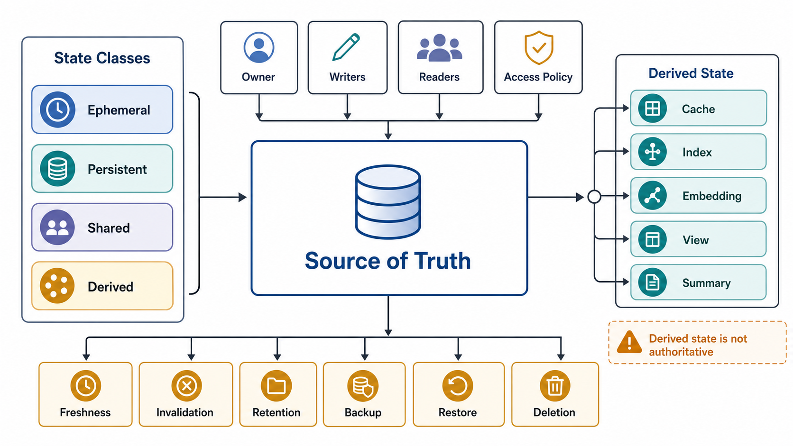

# State Classification and Consistency Boundary



## Abstract

State is any information whose value can affect future behavior. Every state item must declare an owner, a source of truth, a write path, a read path, a consistency model, a lifecycle, a recovery path, and a deletion policy — because each undeclared field is a class of silent correctness failure waiting for load. This file classifies state into four classes with distinct risk profiles, fixes the consistency vocabulary against the formally defined model hierarchy ([Jepsen's consistency map](https://jepsen.io/consistency), rooted in [Herlihy & Wing's linearizability](https://dl.acm.org/doi/10.1145/78969.78972)), specifies the derived-state authority rule that governs caches, indexes, and embeddings, and defines the mutation atomicity boundary that determines what compensation and reconciliation must exist.

Unowned state is unowned correctness. The phrase is not rhetorical: every consistency incident is, at root, two components holding different beliefs about the same state item with no contract saying whose belief wins. This file declares the inventory and vocabulary at boundary level; the machinery that enforces them — write authority and fencing, per-path consistency selection, isolation, lineage, deletion, migration, and recovery — is [Chapter 03](../03-state-ownership-and-consistency-model/README.md).

## 1. State Classes

```text
Figure 1. State classes by lifetime and authority. Derived state
is the perennially mismanaged quadrant: long-lived enough to be
trusted, but never authoritative.

                      authoritative
                           │
        PERSISTENT         │      (sources of truth live here:
        db rows, objects,  │       exactly one per state item)
        audit logs, model  │
        registry           │
  long-lived ──────────────┼────────────────── short-lived
                           │
        DERIVED            │      EPHEMERAL
        caches, indexes,   │      request buffers, stream
        embeddings, views, │      chunks, in-memory context,
        summaries          │      intermediate activations
                           │
                     non-authoritative

        SHARED (orthogonal axis): any class accessed by
        multiple writers/readers concurrently — queue offsets,
        locks, sessions, workflow state — adds a concurrency
        contract on top of its class contract.
```

| State Class | Examples | Primary Risk |
|---|---|---|
| Ephemeral | Request buffers, in-memory context, temporary files, stream chunks, intermediate activations | Loss, leak, or cross-request reuse |
| Persistent | Database rows, object storage, audit logs, model registry, user records | Durability, migration, backup, deletion |
| Shared | Distributed cache, workflow state, queue offsets, locks, sessions, feature flag cache | Concurrency, race, stale read, split ownership |
| Derived | Search index, embeddings, materialized view, summary, compiled prompt, cached tool result | Staleness, invalidation, source divergence |

## 2. State Ownership Fields

```yaml
state_item:
  name:
  class:
  owner:
  source_of_truth:
  write_interface:
  read_interface:
  consistency_model:
  freshness_bound:
  mutation_transaction_boundary:
  idempotency_boundary:
  retention:
  deletion_policy:
  backup_policy:
  restore_policy:
  invalidation_trigger:
  migration_policy:
  access_policy:
  audit_requirement:
  observability:
```

## 3. Consistency Models

The vocabulary below is ordered strongest to weakest and matches the formal hierarchy verified by [Jepsen](https://jepsen.io/consistency). The discipline this table enforces: a consistency *claim* is a promise to callers, and each promise has a specific mechanism whose presence the reviewer can check. Claiming a model without its mechanism is the state-layer version of claiming an SLO without a measurement.

| Model | Valid Claim | Required Evidence |
|---|---|---|
| Linearizable / strong | Reads observe the latest committed write; operations appear to take effect atomically between invocation and response | Consensus or single-writer proof plus stale-cache exclusion on the read path |
| Serializable (transactional) | Concurrent transactions produce results equivalent to some serial order | Isolation-level proof; note snapshot isolation is *weaker* (admits write skew) despite similar marketing |
| Read-after-write | Writer or scoped reader observes its write after completion | Key scope and cache invalidation path |
| Monotonic read | Client does not observe older versions after newer versions | Session/version token propagation |
| Snapshot | Query observes a stable point-in-time view | Snapshot timestamp or transaction version |
| Bounded staleness | Data may lag source by no more than declared bound | Source timestamp, refresh schedule, lag metric |
| Causal | Reads respect cause-effect order across keys | Causality token or dependency tracking |
| Eventual | Data converges if writes stop and dependencies recover | Reconciliation and divergence metric |
| Best effort | No correctness claim beyond attempted retrieval | Caller-visible disclosure and no hidden dependency on freshness |

Two review notes. First, "eventual consistency" without a divergence metric is not a model; it is an apology. Second, the snapshot-isolation/serializable distinction matters at the boundary because several mainstream engines default to snapshot isolation while their users assume serializability — write-skew anomalies then surface as "impossible" state.

## 4. State Boundary Questions

| Question | Rejection If Unknown |
|---|---|
| Who can write the state? | Conflicting writers can corrupt source of truth |
| Who can read the state? | Authorization boundary is unclear |
| What is the source of truth? | Derived state may become authoritative accidentally |
| How is stale data detected? | Staleness becomes silent correctness failure |
| How is stale data invalidated? | Cache or index can preserve deleted or unauthorized data |
| How is state restored? | Recovery depends on manual reconstruction |
| How is state deleted? | Privacy and retention obligations cannot be met |
| How is state migrated? | Schema changes can strand old readers or writers |
| What is the audit evidence? | Mutation and access history cannot be proven |

## 5. Derived State Rules

The authority rule: derived state can never be more authoritative than its source, and every derived item must carry the version of the source and transform that produced it. Without those versions, "rebuild" is undefined and staleness is undetectable.

```text
Figure 2. Derived-state flow. Every edge needs an invalidation
or refresh trigger; every node needs source + transform versions.

  source of truth (persistent, versioned)
     │
     ├──► cache            [key, TTL, invalidation, stampede ctl]
     ├──► search index     [index ver, lag metric, delete propagation]
     ├──► embeddings       [model ver, chunk ver, re-embed trigger]
     ├──► materialized view[refresh policy, freshness SLO]
     └──► summary/context  [source span, generation model ver]

  deletion in the source MUST propagate down every edge —
  a derived copy that survives source deletion is a privacy
  defect, not a performance feature.
```

| Derived State | Required Contract |
|---|---|
| Cache | Key, scope, TTL, invalidation, stampede control, admission, eviction, staleness disclosure |
| Search index | Source, transform version, index version, lag metric, rebuild path, delete propagation |
| Embedding | Model version, chunk version, source timestamp, metadata, re-embedding trigger |
| Materialized view | Source tables, refresh policy, failure behavior, freshness SLO |
| Summary | Source span, generation model, validity window, regeneration trigger |
| Compiled prompt/context | Input sources, priority order, truncation policy, tenant boundary |
| Tool result cache | Tool version, input hash, authorization scope, TTL, invalidation |

The embedding row is where AI-native systems most often violate the authority rule: an embedding is a derived artifact of (source document version × chunking version × embedding model version). Change any factor without re-deriving and retrieval silently degrades — no error, no alert, just answers grounded in a corpus that no longer exists.

## 6. Mutation Boundary

Mutation must define its atomicity boundary — the set of effects that succeed or fail together.

```text
mutation_boundary = {
  validated_input,
  authorization_decision,
  idempotency_record,
  source_of_truth_write,
  derived_state_update_or_invalidation,
  audit_event,
  response_status
}
```

In practice these elements rarely commit in one transaction, so the architecture must state the commit order and the consequence of failing between any two steps: which failures produce compensation, which produce reconciliation, which produce ambiguous completion, and which operator signal is emitted. The standard safe pattern commits the idempotency record and source-of-truth write atomically, then treats derived-state update and audit emission as asynchronous obligations with lag metrics — the transactional-outbox shape. Declaring the pattern is the requirement; leaving the ordering implicit is a rejection.

## 7. Cache Correctness Boundary

A cache is acceptable only when its correctness model is explicit. Cache hit ratio without correctness semantics is a performance number attached to an undefined behavior. Meta's memcache deployment established the canonical failure modes and mechanisms at scale — leases against thundering herds and stale-set races, deletion-based invalidation from the source of truth ([Nishtala et al., NSDI 2013](https://www.usenix.org/conference/nsdi13/technical-sessions/presentation/nishtala)).

| Field | Required Decision |
|---|---|
| Key | Includes tenant, authorization scope, schema version, input hash, data version where needed |
| Value | Encoded schema and redaction state |
| TTL | Derived from freshness requirement, not guessed |
| Invalidation | Triggered by source mutation, policy change, permission change, model/index version change |
| Stampede | Single-flight, request coalescing, leases, stale-while-revalidate, or admission |
| Negative cache | TTL and authorization safety for misses |
| Eviction | Behavior when cache pressure removes hot values |
| Observability | Hit ratio, miss cost, stale hit, invalidation lag, eviction rate |

## 8. Queue and Offset State

Queue state must define: producer ownership, consumer group ownership, partition key, ordering scope, offset commit point, duplicate handling, poison message policy, dead-letter ownership, retention, replay policy, and backfill rate limit.

The offset commit point is the whole delivery semantics in one decision:

```text
commit offset BEFORE side effect  -> at-most-once  (loss on crash)
commit offset AFTER  side effect  -> at-least-once (duplicates on crash)
                                     => side effect MUST be idempotent
atomic commit of offset + effect  -> exactly-once effect
                                     (requires transactional coupling,
                                      e.g. offsets stored in the same
                                      transactional store as the effect)
```

A consumer that commits after the side effect but has non-idempotent side effects has chosen duplicate mutations; the choice just hasn't executed yet.

## 9. Approval Gates

| Gate | Evidence Required | Failure Condition |
|---|---|---|
| State inventory | Every persistent, shared, derived, and security-relevant ephemeral state item is listed | Hidden state affects correctness |
| Ownership gate | Each state item has owner, source of truth, read/write interface, lifecycle | State is modified without accountability |
| Consistency gate | Each state item declares a model from §3 with its required mechanism | Response can imply stronger behavior than implemented |
| Invalidation gate | Derived state has trigger, lag metric, and delete propagation | Deleted, unauthorized, or stale data can remain visible |
| Version gate | Derived state records source and transform versions | Rebuild is undefined and staleness undetectable |
| Recovery gate | Backup, restore, replay, or rebuild path exists | Failure requires manual guesswork |
| Deletion gate | Retention and deletion policy exists and covers derived copies | Privacy or compliance deletion cannot be proven |

## Output

The output of this file is a state inventory that makes ownership, consistency, invalidation, retention, recovery, and deletion explicit at the architecture boundary — with exactly one source of truth per state item and a named consistency model per read path.

## References

- [Jepsen — Consistency Models (formal hierarchy)](https://jepsen.io/consistency)
- [Herlihy & Wing, "Linearizability: A Correctness Condition for Concurrent Objects," TOPLAS 1990](https://dl.acm.org/doi/10.1145/78969.78972)
- [Nishtala et al., "Scaling Memcache at Facebook," NSDI 2013](https://www.usenix.org/conference/nsdi13/technical-sessions/presentation/nishtala)
- [Kleppmann, *Designing Data-Intensive Applications* — replication, transactions, and derived data](https://dataintensive.net/)
- [LinkedIn Engineering — Running Kafka at Scale (offset and partition ownership)](https://engineering.linkedin.com/kafka/running-kafka-scale)
