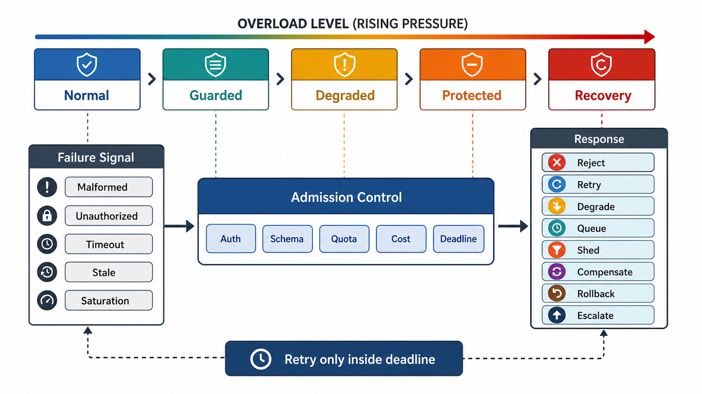

# Failure Domain and Overload Semantics



## Abstract

A failure domain is the smallest boundary within which a fault can corrupt, delay, overload, or obscure behavior; overload semantics define how the system behaves when demand exceeds safe capacity. This file specifies the boundary failure taxonomy with detection/response/recovery obligations per class, a constrained response vocabulary (reject, retry, degrade, queue, shed, compensate, rollback, escalate), a staged overload policy, and the controls that prevent the two dominant modern failure shapes: metastable failure, where recovery work sustains overload after the trigger clears ([Bronson et al., HotOS 2021](https://sigops.org/s/conferences/hotos/2021/papers/hotos21-s11-bronson.pdf); empirically surveyed in [Huang et al., OSDI 2022](https://www.usenix.org/publications/loginonline/metastable-failures-wild)), and gray failure, where the system degrades for callers while its own detectors report health ([Huang et al., HotOS 2017](https://www.microsoft.com/en-us/research/publication/gray-failure-achilles-heel-cloud-scale-systems/)).

Failure handling is part of the contract, not an implementation detail. A system's real availability is decided by what it does in the thirty seconds after something breaks — and that behavior is either designed here or improvised during the incident.

## 1. The Two Failure Shapes That Dominate at Scale

**Metastable failure.** The system has a stable healthy state and a stable failed state, and a transient trigger (deploy, burst, dependency blip) tips it into the failed state where a *sustaining feedback loop* — retries amplifying load, cold caches raising per-request cost, timeouts breeding more retries — keeps it there after the trigger is gone. Removing the trigger does not recover the system; only breaking the loop (shedding load below the recovery threshold) does. The design consequence: every "recovery" behavior (retry, cache refill, replay, failover) is itself load, and must be budgeted as load.

```text
Figure 1. Metastable failure loop. Each arrow adds load; the loop
is self-sustaining once work amplification exceeds shed capacity.

     trigger (burst, deploy, dependency blip)
        │
        v
  ┌─ latency rises ──► timeouts fire ──► callers retry ─┐
  │                                                     │
  └── per-request cost rises ◄── caches cool, queues ◄──┘
      (work amplification)       age, connections churn

  exit requires shedding BELOW pre-trigger load,
  not merely removing the trigger.
```

**Gray failure.** The defining property is differential observability: the failure detector's view (health checks pass) diverges from the application's view (requests degrade). Detection therefore cannot rely on component self-reporting; it requires caller-perspective SLIs compared against component-perspective health, with divergence itself treated as a failure signal.

## 2. Boundary Failure Classes

| Failure Class | Detection | Required Response | Recovery |
|---|---|---|---|
| Malformed input | Schema, parser, size, encoding, enum, depth failure | Reject before internal fanout | Caller changes request |
| Unauthorized input | AuthN/AuthZ denial, tenant mismatch, policy failure | Fail closed and audit | Credential or policy correction |
| Duplicate mutation | Idempotency key conflict or duplicate event ID | Replay prior result or conflict on mismatched payload | Dedupe window expiration |
| Deadline exceeded | Remaining deadline below required execution budget | Cancel, reject, or return accepted if durable async | Drain or replay by operation ID |
| Dependency timeout | Span timeout, circuit open, connection failure | Retry only if idempotent and deadline allows; otherwise degrade or fail | Dependency restore and circuit close |
| Partial dependency result | Missing page, chunk, shard, or sub-result | Return partial only if output schema supports partial status | Retry missing portion or reconcile |
| Stale dependency result | Source timestamp exceeds freshness bound | Reject or disclose stale state | Refresh, invalidate, or rebuild |
| Gray dependency degradation | Caller-side SLI diverges from dependency health report | Treat divergence as failure; reroute or degrade | Dependency remediation confirmed by caller-side SLI |
| Queue saturation | Queue depth, age, admission rejection, consumer lag | Backpressure, shed, throttle, or isolate | Drain and rate-limit replay |
| Resource saturation | CPU, memory, connection, thread, GPU, I/O, quota | Admission control and priority shedding | Scale, reduce input, or degrade |
| Schema drift | Validation mismatch, unknown field behavior, incompatible enum | Quarantine, fail closed for critical path | Rollback or adapter migration |
| Observability loss | Missing metrics, trace gaps, log lag, audit sink failure | Degrade readiness; preserve local audit buffer | Restore telemetry and reconcile |
| Trust-boundary breach | Cross-tenant access attempt, secret exposure, egress policy violation | Isolate, revoke, freeze mutation if needed | Forensics, rotation, impact analysis |

## 3. Failure Response Vocabulary

The response set is deliberately closed: eight verbs, each with a safety precondition. A failure mapped to a verb outside this set — or to a verb whose precondition is unmet — fails review.

| Response | Meaning | Required Safety Condition |
|---|---|---|
| Reject | Do not execute request | Rejection is deterministic and caller-visible |
| Retry | Attempt operation again | Operation is idempotent or no side effect occurred; retry budget available |
| Degrade | Omit optional behavior | Objective still holds and response discloses degradation |
| Queue | Persist work for later | Work is durable, idempotent, and deadline semantics permit async |
| Shed | Drop or reject lower-priority work | Priority order and user-visible status are defined |
| Compensate | Apply corrective side effect | Original and compensating effects are observable and idempotent |
| Rollback | Restore previous version/state | Transaction, deployment, or configuration version boundary exists |
| Escalate | Require operator or human approval | Runbook, owner, and evidence are available |

## 4. Overload Policy

Overload behavior must be defined before traffic arrives, and stage transitions must be driven by measured signals, not operator judgment under pressure. The staging follows [Google SRE's overload handling](https://sre.google/sre-book/handling-overload/) (per-class rejection cost, criticality-based shedding) and [Netflix's prioritized load shedding](https://netflixtechblog.com/enhancing-netflix-reliability-with-service-level-prioritized-load-shedding-e735e6ce8f7d).

```text
Figure 2. Overload stage machine. Transitions are signal-driven
and hysteretic — recovery thresholds sit below entry thresholds,
and reopening is gradual, or the system oscillates.

   NORMAL ──p95/queue-age rising──► GUARDED
     ▲                                │ error-budget burn /
     │ sustained                      │ p99 breach
     │ headroom                       v
   RECOVERY ◄──saturation falls─── DEGRADED
     ▲        + queues drained        │ critical resource
     │                                │ exhaustion imminent
     └──gradual, jittered,            v
        per-class reopening ◄──── PROTECTED
```

| Overload Stage | Signal | Action |
|---|---|---|
| Normal | Latency and saturation within SLO budget | Admit requests by quota |
| Guarded | p95 or queue age rising, utilization approaching target ceiling | Reduce optional fanout, tighten admission for expensive classes |
| Degraded | p99 or error budget burn exceeds threshold | Shed low-priority work, serve stale bounded cache where valid |
| Protected | Critical resource exhaustion imminent | Admit only critical classes; fail fast for non-critical work |
| Recovery | Saturation falls and queues drain | Reopen admission gradually with jitter and per-class limits |

The recovery row is where metastability is either prevented or invited: reopening admission at full rate into cold caches recreates the overload. Recovery is a distinct engineered stage with its own rate limits, not the absence of overload.

## 5. Admission Control

Admission must evaluate cost, not only request count — a rule that becomes existential for LLM serving, where admitting one 128k-token prefill is equivalent to admitting hundreds of short requests.

```text
admit(request) if:
  authenticated
  authorized
  schema_valid
  size_within_bounds
  tenant_quota_available          # cost-weighted units
  priority_allowed_at_current_stage
  estimated_cost_within_remaining_budget
  deadline_sufficient             # reject work that cannot finish in time
  dependency_circuit_allows
```

Requests rejected by admission must not enter internal queues. A queue in front of admission is a mechanism for converting overload into latency debt that comes due exactly when capacity is scarcest — the "insurmountable backlog" pattern ([AWS Builders' Library](https://aws.amazon.com/builders-library/avoiding-insurmountable-queue-backlogs/)): a queue is only useful if it drains faster than work expires, so every queue needs an age bound tied to the deadline of the work in it.

Static concurrency limits inherit the guesswork of whoever set them; the stronger current practice derives limits dynamically from measured latency gradients ([Netflix adaptive concurrency limits](https://netflixtechblog.com/performance-under-load-3e6fa9a60581)), keeping the system left of the queueing knee without manual retuning.

## 6. Backpressure Contract

| Boundary | Backpressure Signal |
|---|---|
| HTTP/gRPC ingress | 429/503 with typed error body; retry-after only when retry is safe |
| Stream | Flow-control window, heartbeat, cancellation, terminal overload event |
| Queue producer | Publish rejection, enqueue latency, queue depth/age limit |
| Queue consumer | Rate-limited polling, offset lag, worker capacity |
| Model serving | Token-budget rejection, batch queue age, KV-cache/GPU slot availability |
| Database | Connection pool limit, query timeout, lock wait threshold |
| External dependency | Circuit breaker and local admission reduction |

## 7. Retry Storm Prevention

Required controls (the quantitative amplification analysis lives in [06-boundary-crossing-and-dependency-contracts.md](06-boundary-crossing-and-dependency-contracts.md) §5):

- Deadline propagation; max attempts; capped exponential backoff with full jitter.
- Retry budget per caller, tenant, operation, and dependency — retries as a bounded fraction of live traffic.
- Single retry-owning layer per call chain (no multiplicative layering).
- Circuit breaker with half-open probe.
- No retry for validation, authorization, conflict, or deterministic 4xx failures.
- Idempotency for any retried mutation.
- Observability for retry cause and attempt number — attempt-1 versus attempt-N traffic must be distinguishable, or retry amplification is invisible until it is the outage.

## 8. Degraded Mode Contract

Degraded mode is valid only when intentional and disclosed. The harvest/yield framing applies: degrading by serving fewer requests (yield) and degrading by serving less complete data (harvest) are different promises, and the response schema must say which one the caller is getting.

| Degradation | Valid Only If |
|---|---|
| Serve stale cache | Staleness bound is within objective and response marks source age |
| Skip enrichment | Enrichment is optional and absence is represented in schema |
| Reduce result count | Contract permits partial result and indicates truncation |
| Disable write path | Callers receive clear rejection or queued state |
| Disable agent tools | Agent can produce safe insufficient-capability state |
| Switch model/index | Compatibility and quality regression gates are pre-approved |

## 9. Failure Injection Requirements

Chapter 01 declares the scenarios later chapters must implement as tests — chaos experiments with a hypothesis and a measured steady state, not ad hoc breakage:

- Dependency timeout before and after possible side effect.
- Duplicate request: same idempotency key, same payload; then same key, different payload.
- Concurrent duplicate requests with the same idempotency key.
- Queue saturation with mixed low- and high-priority traffic; verify shedding order matches §4.
- Retry storm: dependency fails for 60 s, then recovers — verify the system exits overload without intervention (the metastability test).
- Gray dependency: dependency health checks pass while its latency triples — verify caller-side detection fires.
- Stale cache/index beyond freshness bound.
- Tenant mismatch at ingress and at retrieval layer.
- Missing trace context; audit sink unavailable.
- Model/tool malformed response.
- Control-plane bad configuration rollout and rollback.

## 10. Approval Gates

| Gate | Evidence Required | Failure Condition |
|---|---|---|
| Failure inventory | Boundary failure classes are mapped to detection, response, recovery, owner | Failure list is symptom-only |
| Overload gate | Admission, throttle, queue, shed, degrade, and staged recovery behavior are explicit | System waits for resource exhaustion |
| Metastability gate | Recovery load (retries, cache refill, replay) is budgeted; recovery stage exists with hysteresis | Removing a trigger is assumed to equal recovery |
| Gray-failure gate | Caller-perspective SLIs exist independent of component self-reporting | Detection requires the failing component to notice itself |
| Retry gate | Retry budget and idempotency are linked; attempt number is observable | Retry policy can amplify failure invisibly |
| Degraded gate | Degraded responses preserve objective and disclose weaker behavior | Degradation silently violates correctness |
| Recovery gate | Rollback, replay, drain, or reconciliation path exists | Recovery depends on ad hoc manual steps |

## Output

The output of this file is a failure and overload contract that tells implementers exactly when to reject, retry, degrade, queue, shed, compensate, rollback, or escalate — and that treats recovery itself as load to be budgeted.

## References

- [Bronson et al., "Metastable Failures in Distributed Systems," HotOS 2021](https://sigops.org/s/conferences/hotos/2021/papers/hotos21-s11-bronson.pdf)
- [Huang et al., "Metastable Failures in the Wild," OSDI 2022](https://www.usenix.org/publications/loginonline/metastable-failures-wild)
- [Huang et al., "Gray Failure: The Achilles' Heel of Cloud-Scale Systems," HotOS 2017](https://www.microsoft.com/en-us/research/publication/gray-failure-achilles-heel-cloud-scale-systems/)
- [Google SRE Book — Handling Overload](https://sre.google/sre-book/handling-overload/)
- [Netflix — Performance Under Load: Adaptive Concurrency Limits](https://netflixtechblog.com/performance-under-load-3e6fa9a60581)
- [Netflix — Service-Level Prioritized Load Shedding](https://netflixtechblog.com/enhancing-netflix-reliability-with-service-level-prioritized-load-shedding-e735e6ce8f7d)
- [AWS Builders' Library — Avoiding Insurmountable Queue Backlogs](https://aws.amazon.com/builders-library/avoiding-insurmountable-queue-backlogs/)
