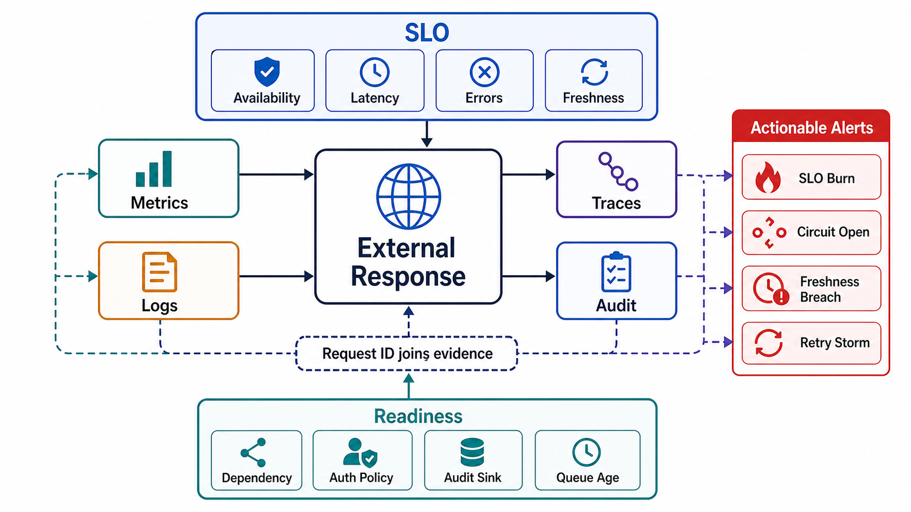

# Observability, SLO, and Audit Contract



## Abstract

Observability is the ability to reconstruct externally visible behavior from metrics, logs, traces, and audit events without guessing; SLOs define which user-visible behaviors must remain within budget; audit proves who did what, under which authority, to which data, and with what decision. This file specifies the four signal types as contracts with required fields, the SLO/error-budget mechanism with multiwindow multi-burn-rate alerting per the [Google SRE Workbook](https://sre.google/workbook/alerting-on-slos/), trace propagation on the [W3C Trace Context standard](https://www.w3.org/TR/trace-context/) as implemented by OpenTelemetry, and the readiness semantics that make observability loss itself a detected failure. The gray-failure result motivates the whole design: a system whose health signals come only from component self-reporting cannot see the most common class of production degradation.

Metrics without boundary context do not prove system behavior. The unit of observability is not the dashboard; it is the ability to join one externally visible response to the complete internal causal chain that produced it.

## 1. Signal Architecture

The four signal types answer different questions and have different cardinality economics; conflating them is the root of both observability cost blowups and evidence gaps.

```text
Figure 1. Signal types by question answered and cardinality budget.

  signal    question answered              cardinality   retention
  ────────  ─────────────────────────────  ───────────   ─────────
  metric    "how much / how fast,          bounded       long
             in aggregate?"                 (labels)
  log       "what exactly happened          unbounded     medium
             at this event?"                (structured)
  trace     "where in the causal chain      unbounded     medium
             did latency/failure arise?"    (sampled)
  audit     "who did what, under what       unbounded     long,
             authority, to what data?"      (complete)    tamper-evident

  join key: trace/request ID present in ALL four —
  a signal that cannot be joined is an anecdote.
```

Audit differs from the other three in a way that changes its engineering: metrics, logs, and traces may be sampled; audit may not. Sampling is an efficiency decision for diagnostics and an integrity violation for evidence.

## 2. SLI Requirements

| SLI | Required Dimensions |
|---|---|
| Availability | Route, client class, tenant class, status class, dependency, region |
| Latency | p50, p95, p99, timeout, queue wait, dependency latency, serialization |
| Traffic | Requests/sec, jobs/sec, bytes/sec, records/sec, tokens/sec, streams |
| Errors | Stable code, retryability, source, dependency, caller class |
| Saturation | CPU, memory, queue age, worker utilization, connection pool, GPU slots, KV-cache occupancy, external quota |
| Freshness | Source timestamp, index lag, cache age, materialized view lag |
| Correctness | Schema-valid output, idempotent replay match, duplicate mutation prevented |
| Security | Auth failures, authorization denials, tenant mismatches, egress blocks |
| AI serving | TTFT, TPOT, tokens/sec, context truncation rate, batch queue age |
| AI quality | Groundedness pass rate, citation validity, tool validation failure, model schema failure |

The first four rows are the golden signals ([Google SRE — Monitoring Distributed Systems](https://sre.google/sre-book/monitoring-distributed-systems/)); the remainder are the extensions that data-intensive and AI-native boundaries require. Every SLI must be measurable from the caller's perspective or explicitly marked as a leading internal indicator — internal saturation predicts user pain but never substitutes for measuring it.

## 3. SLO Contract

```yaml
slo:
  name:
  user_visible_behavior:
  sli:
  measurement_window:
  target:
  error_budget:            # 1 − target, made spendable
  included_traffic:
  excluded_traffic:        # explicit and limited
  alert_thresholds:        # multiwindow burn rates, §4
  burn_rate_policy:
  owner:
  rollback_or_mitigation:
```

Rules: the SLO measures externally visible behavior; exclusions are explicit and limited; every SLO has an owner and a mitigation path. The error budget is the operative number — it converts reliability from an aspiration into a spendable resource that gates release velocity: budget remaining permits risk, budget exhausted freezes it.

## 4. Burn-Rate Alerting

Threshold-on-error-rate alerting fails in both directions: too sensitive and it pages on noise, too lenient and it sleeps through slow burns. The multiwindow, multi-burn-rate construction from the [SRE Workbook](https://sre.google/workbook/alerting-on-slos/) alerts on the *rate of error-budget consumption*, measured simultaneously over a long window (evidence of sustained burn) and a short window (evidence the burn is still happening now):

```text
burn_rate = observed_error_rate / (1 − SLO_target)

Figure 2. Standard three-tier policy for a 30-day window.

  tier   long window  short window  burn rate  budget consumed  action
  ────   ───────────  ────────────  ─────────  ───────────────  ──────
  page       1 h          5 min       14.4       2% in 1 h      page now
  page       6 h         30 min        6         5% in 6 h      page
  ticket    72 h          6 h          1        10% in 3 d      ticket

  alert fires only if BOTH windows exceed the tier's burn rate —
  the short window suppresses pages for burns that already stopped.
```

## 5. Metrics Contract

Required attributes: `service`, `operation`, `version`, `client_class`, `tenant_class`, `status_class`, `error_code`, `retryable`, `attempt_number`, `dependency`, `region`, `priority_class`, `admission_decision`.

Cardinality rule: high-cardinality identifiers — raw user ID, full tenant ID, request ID, document ID, prompt text, error text — must not be metric labels; each unique label combination is a stored time series, so unbounded labels are an unbounded cost with near-zero aggregate diagnostic value. High-cardinality fields belong in logs, traces, and audit events, which are built for them. `attempt_number` is on the required list for the reason established in the failure file: retry amplification that cannot be seen cannot be budgeted.

## 6. Logs Contract

Logs must be structured and privacy-aware.

| Log Type | Required Fields |
|---|---|
| Validation failure | Request ID, operation, schema version, failure type, safe field path |
| Authorization decision | Actor, tenant, operation, policy version, decision, reason code |
| Dependency failure | Dependency, operation, timeout, attempt, circuit state, error code |
| Idempotency replay | Idempotency key hash, operation ID, replay state, payload hash match |
| State mutation | Resource type, version, transaction ID, actor, audit event ID |
| Degraded response | Degradation mode, cause, omitted capability, caller-visible status |
| Security event | Tenant mismatch, egress block, secret access denial, policy violation |

Rules: no secrets, no raw credentials, no unredacted sensitive payloads, no model prompt/context unless explicitly approved by data policy. The last rule is the one AI-native systems break by default — prompts and retrieved context are tenant data flowing through infrastructure logs, and logging them "for debugging" is an unreviewed egress path.

## 7. Trace Contract

Every externally visible response must be joinable to an execution trace unless privacy policy explicitly prohibits retention. Propagation uses the [W3C Trace Context](https://www.w3.org/TR/trace-context/) headers (`traceparent`/`tracestate`) with [W3C Baggage](https://www.w3.org/TR/baggage/) for cross-cutting attributes such as tenant class — the OpenTelemetry defaults — so causality survives vendor and language boundaries.

```text
Figure 3. Required span waterfall for one request. Gaps in this
waterfall are exactly the places incidents become guesswork.

  ├─ ingress validation ─┤
     ├─ authn ─┤├─ authz ─┤
                ├─ admission ─┤├── queue wait ──┤
                                ├─ control-plane lookup ─┤
                                  ├──────── data-plane execution ───────┤
                                    ├─ cache ─┤├── dependency call ──┤
                                    ├─ retrieval / rerank / packing ─┤     (RAG)
                                    ├─ tokenize ─┤├─ prefill ─┤├ decode… ┤ (LLM)
                                    ├─ tool call + validation ─┤          (agent)
                                                        ├─ serialization ─┤
```

Trace context must propagate across service calls, queue messages (in message headers — async hops are where most deployments break causality), workflow steps, model/tool calls, and audit events. Queue-wait spans deserve emphasis: under overload, queue wait is where latency lives, and a trace without it attributes queueing delay to the wrong component.

## 8. Audit Contract

Audit events are not debug logs; they are integrity evidence — complete (never sampled), attributable, and tamper-evident (append-only store or hash-chained records) for sensitive operations.

| Audit Event | Required Fields |
|---|---|
| Access decision | Actor, tenant, operation, resource scope, policy version, allow/deny |
| Mutation | Actor, tenant, resource, before/after version or digest, operation ID |
| Export/egress | Actor, tenant, destination, data class, redaction policy, approval |
| Admin change | Actor, role, config/policy diff, approval, rollout scope, rollback handle |
| Tool execution | Actor or agent, tool, input digest, permission scope, result state |
| Model-assisted decision | Model version, context source digest, output validation state, human approval if required |
| Deletion/retention | Actor, tenant, resource scope, deletion proof, retention exception |

The model-assisted-decision row is the AI-native addition: when a model output influences an authorization-adjacent or user-visible decision, the audit trail must capture enough (model version, context digest, validation state) to replay the decision — otherwise regressions in model behavior are indistinguishable from data changes.

## 9. Alerting Contract

Alerts must map to action; an alert whose response is "acknowledge and watch" is a metric, not an alert.

| Alert | Fires On | Action |
|---|---|---|
| SLO burn | Multiwindow burn rate exceeds tier threshold (§4) | Mitigate, rollback, reduce admission |
| Queue age | Oldest item exceeds class deadline | Shed, scale, pause producers |
| Dependency circuit open | Error/timeout threshold exceeded | Degrade, fail closed/open per contract |
| Freshness breach | Cache/index/view age exceeds bound | Invalidate, rebuild, reject stale reads |
| Missing traces | Trace sample or required span drops below threshold | Mark readiness degraded |
| Audit sink failure | Audit write unavailable or lagging | Fail closed for sensitive operations or buffer locally |
| Tenant mismatch | Cross-tenant access attempt | Block, audit, investigate abuse |
| Retry storm | Retry fraction exceeds budget | Open circuit, reduce admission |
| Differential health | Caller-observed SLI diverges from component self-report | Treat as gray failure; investigate as outage |

## 10. Readiness and Liveness

Liveness says the process can continue running; readiness says the process can safely serve the contract. Readiness must fail when: a required dependency is unavailable with no valid fallback; auth or authorization policy cannot be evaluated; the audit sink is unavailable for sensitive mutation with no approved local buffer; configuration is invalid or stale beyond rollout policy; the model/index version required by contract is unavailable; or queue age for an accepted class exceeds its deadline. The unifying principle: observability loss is itself a failure with defined semantics — a system that cannot prove its behavior is degraded even if it happens to be behaving.

## 11. Approval Gates

| Gate | Evidence Required | Failure Condition |
|---|---|---|
| SLI gate | Every objective invariant maps to an SLI or audit event | Behavior cannot be proven |
| Burn-rate gate | SLO alerts use multiwindow multi-burn-rate policy with owners | Alerting is naive thresholding: noisy pages or silent slow burns |
| Metric gate | Metrics have bounded cardinality and useful dimensions | Telemetry creates cost or lacks diagnostic value |
| Trace gate | Boundary crossings propagate W3C trace context, including queue and tool hops | Causality breaks across services, queues, tools, or models |
| Audit gate | Sensitive decisions produce durable, complete, tamper-evident audit evidence | Security or compliance claims are unprovable |
| Alert gate | Alerts map to owner and action | Alert produces notification without mitigation path |
| Readiness gate | Observability loss degrades readiness | System serves traffic it cannot account for |

## Output

The output of this file is an observability contract that can prove healthy, degraded, failed, unauthorized, stale, partial, and recovered states — and that pages a human only when the error budget is genuinely burning.

## References

- [Google SRE Workbook — Alerting on SLOs (multiwindow, multi-burn-rate)](https://sre.google/workbook/alerting-on-slos/)
- [Google SRE Book — Service Level Objectives](https://sre.google/sre-book/service-level-objectives/)
- [Google SRE Book — Monitoring Distributed Systems](https://sre.google/sre-book/monitoring-distributed-systems/)
- [W3C Trace Context](https://www.w3.org/TR/trace-context/) and [W3C Baggage](https://www.w3.org/TR/baggage/)
- [Uber Engineering — Distributed Tracing](https://www.uber.com/us/en/blog/distributed-tracing/)
- [Huang et al., "Gray Failure," HotOS 2017 — differential observability](https://www.microsoft.com/en-us/research/publication/gray-failure-achilles-heel-cloud-scale-systems/)
