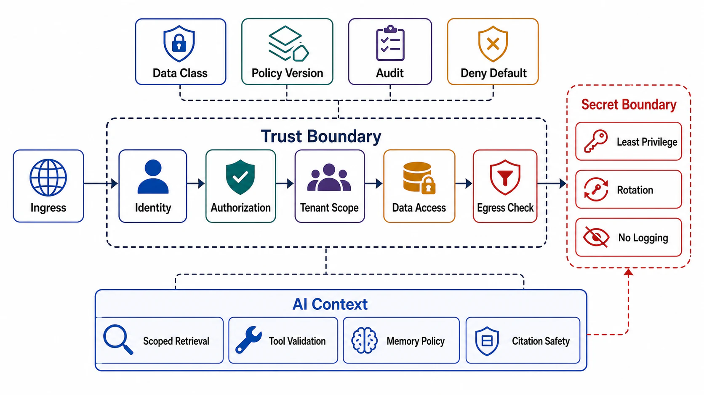

# Security, Privacy, and Trust Boundary



## Abstract

A trust boundary is where identity, authority, tenant scope, data classification, or secret access changes. This file specifies the trust boundary inventory, the identity and authorization models, tenant isolation requirements per surface, data classification by semantic meaning and lineage, and the additional control set that AI-native systems require. The architectural stance is the zero-trust model of [NIST SP 800-207](https://csrc.nist.gov/pubs/sp/800/207/final): no implicit trust from network location or call topology, per-request policy decisions at explicit enforcement points, deny by default. The AI-specific controls map to the [OWASP Top 10 for LLM Applications (2025)](https://genai.owasp.org/llm-top-10/), whose central finding shapes the whole section: an LLM processes instructions and data in the same channel, so any text reaching the model — user input, retrieved document, tool output — is a potential instruction, and authority must therefore never depend on what the model says.

Security architecture is invalid if authorization is inferred from routing, client-provided metadata, cached output, model text, or downstream filtering. Each of those five inferences is a real incident class, not a hypothetical.

## 1. Enforcement Model

Zero trust separates deciding from enforcing: a policy decision point (PDP) evaluates actor, tenant, operation, resource, data class, and context against versioned policy; policy enforcement points (PEPs) sit immediately in front of each protected resource and enforce that decision. The architecture consequence: enforcement points are structural, placed where data is accessed — not perimeter checks whose conclusions are assumed to hold downstream.

```text
Figure 1. Decision and enforcement placement. Every resource
access passes a PEP; the model and its context builder sit
BEHIND enforcement, never in front of it.

                      ┌─────────────────────┐
                      │ policy decision point│  versioned policy,
                      │ (actor, tenant, op,  │  audit every decision
                      │  resource, dataclass)│
                      └──────────┬──────────┘
              decisions          │
   ┌──────────────┬──────────────┼───────────────┬──────────────┐
   v              v              v               v              v
 [PEP]          [PEP]          [PEP]           [PEP]          [PEP]
 ingress        storage        retrieval/      tool           egress/
 authn+authz    read/write     index query     execution      export
   │              │              │               │
   └── request ───┴── data ──────┴── context ────┴── side effects
                                 │
                          ┌──────┴───────┐
                          │ model runtime │  output = untrusted text,
                          └──────────────┘  validated before any use
```

## 2. Trust Boundary Inventory

| Boundary | Required Enforcement |
|---|---|
| Public ingress | Authentication, rate limit, schema bound, abuse detection |
| Service-to-service | Mutual identity (mTLS/workload identity), least privilege, trace propagation |
| Tenant data access | Server-derived tenant scope and authorization before read/write |
| Cache access | Tenant and permission included in key or validated before hit |
| Search/retrieval | Authorization before candidate ranking and context packing |
| Model context | Data-class policy, tenant isolation, prompt/tool boundary |
| Tool execution | Tool allowlist, permission scope, sandbox, timeout, audit |
| Admin/control plane | Role, approval, audit, staged rollout, rollback |
| Secret access | Scoped runtime identity, rotation, no logging |
| Egress/export | Destination authorization, redaction, policy decision, audit |

## 3. Identity Model

Required fields: subject, tenant, client application, delegated actor (when acting on behalf of another identity), authentication issuer, credential type, token audience, token expiry, session or request binding, and service identity for internal calls.

Identity is validated at ingress and revalidated at privilege transitions. The delegated-actor field is what prevents the confused-deputy failure: a privileged service acting on a caller's behalf must carry the caller's authority through the chain, not substitute its own — otherwise every internal service with broad permissions is an escalation gateway for whoever can reach it. Agent runtimes make this concrete: a tool call executed by an agent must be authorized against the *end user's* identity and scope, never against the agent platform's service account.

## 4. Authorization Model

```text
authorization_decision =
  f(actor, tenant, operation, resource_scope, data_class, policy_version, context)
```

Rules:

- Authorization happens before data access; the decision is auditable with its policy version recorded.
- Deny is the default.
- Caller-provided resource scope is validated against server-owned mapping.
- Model-generated text cannot grant permission.
- Cache hit cannot bypass authorization; retry cannot bypass authorization.
- Authorization is evaluated per session/request, not once at connection setup ([NIST SP 800-207](https://csrc.nist.gov/pubs/sp/800/207/final), tenets 3–5).

## 5. Tenant Isolation Requirements

| Surface | Required Control |
|---|---|
| Database | Tenant predicate enforced by trusted server code, row policy, separate schema, or separate database |
| Object storage | Tenant-scoped path or bucket policy plus server-side authorization |
| Cache | Tenant, schema, permission, and data version in key where needed |
| Queue | Tenant-aware routing, priority, retry budget, and DLQ ownership |
| Search index | Physical isolation or mandatory filter enforced before ranking |
| Model prompt | Tenant-scoped context only; no shared memory without policy |
| Logs/traces | Redacted identifiers and no sensitive payload leakage |
| Metrics | Tenant class or safe hash only; no high-cardinality sensitive labels |
| Admin tooling | Tenant-scoped operator permissions and audit |

## 6. Data Classification

Classification must follow semantic meaning, lineage, and policy purpose — not field shape. A string column is not a classification; "this column holds government identifiers collected under purpose X, retained N days, never exported" is. This is the discipline behind [Meta's privacy-aware infrastructure](https://engineering.fb.com/2026/06/25/security/privacy-aware-infrastructure-in-the-ai-native-era-an-asset-classification-case-study/): classification travels with lineage so that policy survives transformation.

| Class | Boundary Requirement |
|---|---|
| Public | Integrity and attribution still required |
| Internal | Egress restricted to approved destinations |
| Confidential | Access logged; encryption in transit and at rest |
| Restricted | Least privilege, audit, retention, redaction, export approval |
| Secret | Dedicated secret manager, rotation, no logging, no model/tool exposure |
| Regulated | Retention, deletion, residency, audit, and legal basis tracked |
| Derived sensitive | Inherits sensitivity from source even if transformed |

The last row does the real work in AI systems: embeddings, summaries, fine-tuning corpora, and cached model outputs are transformations of their sources and inherit their sources' classification. An embedding of a restricted document is a restricted artifact — vector stores holding it need the same access control as the document store, a requirement codified as vector and embedding weaknesses (LLM08) in the [OWASP 2025 taxonomy](https://genai.owasp.org/llm-top-10/).

## 7. Privacy and Trust Boundary for AI Systems

The structural threat model: prompt injection (LLM01) means any text entering the context window can attempt to redirect the model, and no current mitigation eliminates this — so the architecture must make injection *survivable* rather than assume it is preventable. That yields the following controls:

- Retrieved context is tenant- and permission-scoped before model input (enforcement before ranking, per §2).
- The model's authority is bounded by its tools, not its instructions: tool allowlists, least-privilege tool scopes, and human approval for high-consequence actions (mitigating excessive agency, LLM06).
- Tool outputs are validated and classified before entering context — a tool result is an ingress, and untrusted content it carries is a prompt-injection vector.
- Model outputs are treated as untrusted input by every downstream consumer: schema-validated, never executed, never granted authority (improper output handling, LLM05).
- Prompt and completion logging is governed by data policy; memory writes require explicit write policy, classification, deletion policy, and stale-memory mitigation.
- Citation and provenance must not reveal forbidden document metadata — leaking a restricted document's existence via citation is an authorization failure at one remove.
- Redaction happens before egress, not only before display.
- System prompts contain no secrets and are assumed extractable (system prompt leakage, LLM07): the security of the system must not depend on the confidentiality of its instructions.

## 8. Secret Boundary

- Secrets load through scoped runtime identity; build-time and runtime scopes are separate.
- Secrets are never accepted from model output and never emitted to logs, metrics, traces, prompts, tool inputs, or audit payloads.
- Secret access is audited by identity, purpose, and resource.
- Rotation process and rotation blast radius are documented — an unrotatable secret is an incident with a delay timer.

## 9. Egress Control

Egress is any movement of data outside the owned trust boundary — including to model providers and tools, which most inventories miss. Required checks: destination allowlist, data classification, actor authorization, tenant authorization, redaction policy, retention policy at destination (including training-use policy for model providers), encryption in transit, audit event, and rate/volume limits. Volume limits give exfiltration detection teeth: an authorized path moving anomalous volume is the signature of both compromised credentials and injection-driven exfiltration through an agent.

## 10. Security Failure Semantics

| Failure | Required Behavior |
|---|---|
| Authentication unavailable | Reject public and privileged requests |
| Authorization policy unavailable | Fail closed for protected data and mutation |
| Audit unavailable | Fail closed for sensitive mutation unless approved durable buffer exists |
| Tenant mismatch | Reject, audit, and rate-limit abuse pattern |
| Secret access denied | Do not retry indefinitely; fail closed and alert owner |
| Data classification unknown | Treat as most restrictive applicable class |
| Model/tool requests forbidden data | Block before context/tool execution; audit as probe |
| Suspected prompt injection | Constrain to read-only/no-egress mode or terminate episode; audit |
| Egress policy uncertain | Block egress |

## 11. Approval Gates

| Gate | Evidence Required | Failure Condition |
|---|---|---|
| Identity gate | Actor, tenant, issuer, audience, expiry, and delegation are validated | Caller metadata is trusted |
| Authorization gate | Policy decision happens before data access and is audited | Downstream filtering is the only protection |
| Delegation gate | End-user authority propagates through services and agents | A service or agent account acts as a confused deputy |
| Tenant gate | Isolation covers storage, cache, queue, index, model context, logs, metrics, and tools | Any surface can leak or starve |
| Data gate | Data classes and derived sensitivity are defined, including embeddings and model artifacts | Privacy policy cannot govern transformations |
| Secret gate | Secret scope, rotation, and non-logging are enforced | Secrets can enter prompts, logs, or tool payloads |
| Injection gate | System remains safe when any context text is hostile | Safety depends on the model ignoring injected instructions |
| Egress gate | Destination, redaction, authorization, volume limits, and audit are enforced — including model providers | Data can leave without policy proof |

## Output

The output of this file is a security and privacy boundary that makes identity, authorization, tenant isolation, data classification, secret access, AI context, and egress controls structurally enforceable — with no control depending on model compliance or caller honesty.

## References

- [NIST SP 800-207 — Zero Trust Architecture](https://csrc.nist.gov/pubs/sp/800/207/final) and [SP 800-207A — cloud-native multi-cloud access control](https://csrc.nist.gov/pubs/sp/800/207/a/final)
- [OWASP Top 10 for LLM Applications 2025](https://genai.owasp.org/resource/owasp-top-10-for-llm-applications-2025/)
- [Meta Engineering — Privacy-Aware Infrastructure in the AI-Native Era](https://engineering.fb.com/2026/06/25/security/privacy-aware-infrastructure-in-the-ai-native-era-an-asset-classification-case-study/)
- [Google SRE — Handling Overload (fail-closed criticality)](https://sre.google/sre-book/handling-overload/)
