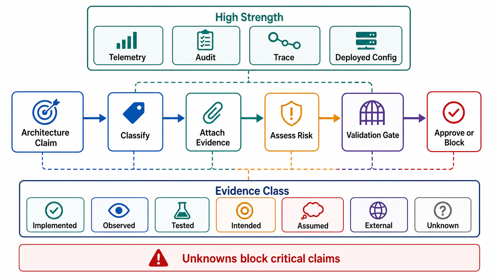

# Evidence Classification and Architecture Review



## Abstract

Architecture documentation must distinguish what exists from what is planned, assumed, external, tested, observed, or unknown — a diagram cannot promote intended behavior into implemented capability. This file defines a seven-class evidence taxonomy, an evidence-strength ordering with the caveats that keep strong evidence honest, the mandatory review ordering that makes each decision checkable against its prerequisites, and the unknown-handling policy that converts risk into validation work instead of optimism. The epistemics are borrowed deliberately: a claim about system behavior is admissible only if some measurement could falsify it, and the strength of evidence is bounded by the workload under which it was gathered. Even the strongest classes have systematic blind spots — production telemetry is censored by sampling and traffic mix; tests prove only the scenarios someone thought to write; formal specification finds design defects that testing cannot reach, which is why AWS applies TLA+ to its critical protocols ([Newcombe et al., CACM 2015](https://cacm.acm.org/research/how-amazon-web-services-uses-formal-methods/)).

Evidence classification prevents architecture from becoming aspirational fiction. Its enforcement mechanism is grammatical: every capability claim in a review dossier carries a classification tag, and untagged claims are treated as `unknown`.

## 1. Evidence Classes

| Class | Meaning | Allowed Claim |
|---|---|---|
| Implemented | Present in reachable source code or deployed configuration | System can execute this behavior |
| Observed | Seen in production telemetry, audit, logs, traces, or incident evidence | System has produced this behavior under observed workload |
| Tested | Covered by automated or manual verification | Behavior passed declared scenarios |
| Intended | Planned in roadmap, design, issue, diagram, or PRD | Not a current capability |
| Assumed | Required for design validity but not proven | Risk until validated |
| External | Provided by dependency outside ownership boundary | Dependency contract required |
| Unknown | No reliable evidence | Architecture approval blocked if it affects correctness, security, latency, recovery, or compliance |

The classes are not mutually exclusive — the strongest position is implemented ∧ tested ∧ observed, and mature reviews track all three bits per claim. The dangerous drift is always in one direction: intended and assumed silently promoting themselves to implemented through repetition in documents.

## 2. Evidence Strength

```text
Figure 1. Evidence strength ladder with the caveat that bounds
each rung. No rung is unconditional; the caveat column is what a
reviewer probes.

  strength   evidence                      bounded by
  ────────   ──────────────────────────    ─────────────────────────────
  highest    production telemetry          observed workload mix; sampling
     ▲       audit events                  tamper resistance; retention
     │       distributed traces            sampling; span completeness
     │       chaos/failure injection       injected scenarios only
     │       source code (deployed)        reachability under real config
     │       deployed configuration        environment and rollout scope
     │       automated tests               scenarios someone wrote
     │       load tests                    open/closed-loop validity,
     │                                     synthetic workload skew
     │       formal specification          fidelity of model to code
     ▼       runbook                       intent, not execution quality
  lowest     diagram                       intent only
  none       verbal claim                  inadmissible until linked
```

Three calibration notes reviewers apply in practice:

1. **Observed ≠ general.** Telemetry proves behavior under the traffic mix that occurred. A system observed stable at ρ=0.4 is `unknown` at ρ=0.8; capacity claims inherit the workload envelope of their evidence, which is why the load-test validity rules in [02-workload-and-capacity-envelope.md](02-workload-and-capacity-envelope.md) §4.3 exist.
2. **Tested ≠ correct.** Tests certify the enumerated scenarios. The failure-injection list in [08-failure-domain-and-overload-semantics.md](08-failure-domain-and-overload-semantics.md) §9 exists precisely to force enumeration of the scenarios teams reliably omit.
3. **Formal specification is complementary, not superior.** TLA+-class specification catches subtle concurrency and partial-failure design defects before implementation — AWS reports finding serious bugs in DynamoDB and S3 designs this way — but proves the model, not the code. Its evidence value is `tested` at the design level plus an obligation to keep model and code aligned.

## 3. Behavior Classification Template

```yaml
behavior:
  claim:
  classification: implemented|observed|tested|intended|assumed|external|unknown
  evidence:
    source_code:
    configuration:
    tests:
    telemetry:
    traces:
    audit:
    dependency_contract:
    formal_spec:
  workload_envelope_of_evidence:    # the conditions under which evidence holds
  risk_if_false:
  required_validation:
  owner:
```

## 4. Review Protocol

```text
Architecture review order (mandatory):

Objective
  -> Workload
  -> Client and tenant model
  -> Input/output contracts
  -> Boundary and ownership
  -> Boundary crossings and dependencies
  -> State ownership
  -> Failure and overload behavior
  -> Observability and audit
  -> Security and privacy
  -> Evidence classification
  -> Validation gates
```

The order is mandatory because later decisions consume earlier constraints; reviewing out of order produces approvals that cannot be checked against anything:

- Retry cannot be approved before idempotency.
- Cache cannot be approved before freshness and invalidation.
- Queue cannot be approved before deadline and duplicate handling.
- Retrieval cannot be approved before tenant filtering and provenance.
- Model streaming cannot be approved before cancellation and partial-output semantics.
- Shedding order cannot be approved before priority classes.

## 5. Review Dossier Requirements

| Section | Required Output |
|---|---|
| Objective | One falsifiable statement |
| Workload | Request classes, payload bounds, rates, concurrency, growth, retry pressure |
| Clients | Auth, authorization, quota, timeout, retry, audit per client class |
| Contracts | Versioned input, output, error, status, idempotency, deadline |
| Boundary | Inside/outside inventory and ownership |
| Dependencies | Contract for every crossing |
| State | Ownership, consistency, freshness, invalidation, retention, recovery |
| Failure | Detection, response, recovery, owner |
| Overload | Admission, backpressure, priority, shedding, degraded mode |
| Observability | SLIs, SLOs, metrics, logs, traces, alerts, audit |
| Security | Identity, tenant isolation, data classification, secrets, egress |
| Evidence | Classification for each claimed behavior |
| Unknowns | Risk, validation task, owner, due date |

## 6. Rejection Criteria

Architecture fails Chapter 01 review when:

- Objective is a technology choice.
- Workload is average QPS without payload, concurrency, burst, or retry model.
- Client classes are collapsed into a generic caller.
- Tenant scope comes from unchecked caller input.
- Input contract lacks size bounds.
- Output contract implies stronger completion, durability, or freshness than implemented.
- Retry policy exists without idempotency.
- Dependency behavior is undocumented but required for correctness.
- Persistent, shared, or derived state has no owner.
- Cache or index lacks invalidation and freshness semantics.
- Failure response is not one of reject, retry, degrade, queue, shed, compensate, rollback, or escalate.
- Observability cannot join a response to trace and audit evidence.
- Security controls depend on model output or downstream filtering.
- Claimed capability is intended or assumed but written as implemented.
- Capacity evidence comes from a workload envelope narrower than the declared one.

## 7. Unknown Handling

Unknowns are permitted only where they do not affect approval-critical properties; approval-critical unknowns become validation tasks with owners and deadlines. The review's job is not to eliminate unknowns — that is impossible — but to make each one carry its price tag.

| Unknown Affects | Review Decision |
|---|---|
| Correctness | Block |
| Security/privacy | Block |
| Compliance | Block |
| Durability | Block |
| Latency SLO | Block or mark capacity unapproved |
| Cost | Block launch at target scale |
| Operator workflow | Block production readiness |
| Non-critical UI detail | Track without blocking |

## 8. Validation Gate Template

```yaml
validation_gate:
  name:
  risk:
  evidence_required:
  test_or_measurement:
  pass_condition:
  fail_condition:
  owner:
  deadline:
  blocks:
    - architecture_approval
    - production_launch
    - scale_increase
```

## Output

The output of this file is an evidence-grounded review process that blocks unsupported claims, bounds every piece of evidence by the workload under which it was gathered, and converts assumptions into measurable validation work.

## References

- [Newcombe et al., "How Amazon Web Services Uses Formal Methods," CACM 2015](https://cacm.acm.org/research/how-amazon-web-services-uses-formal-methods/)
- [Principles of Chaos Engineering — hypothesis-driven failure injection](https://principlesofchaos.org/)
- [Google SRE Workbook — Implementing SLOs (evidence for reliability claims)](https://sre.google/workbook/implementing-slos/)
- [Jepsen — distributed systems safety analyses as adversarial evidence](https://jepsen.io/analyses)
