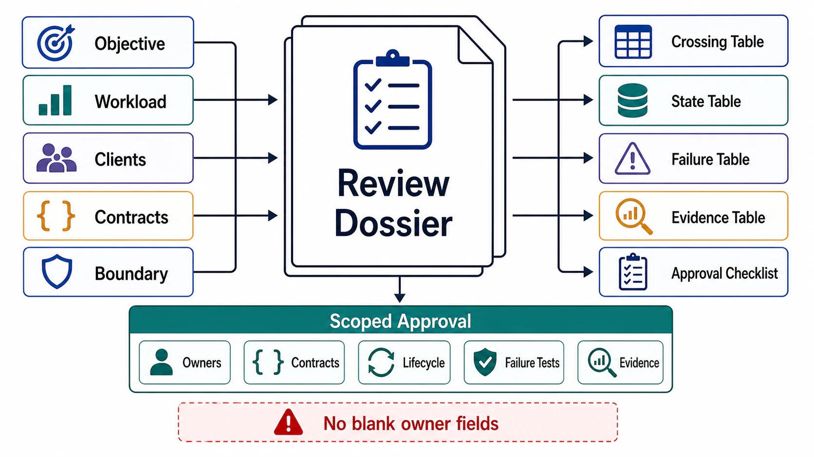

# Architecture Review Templates



## Abstract

This file collects the executable artifacts of Chapter 01: the objective statement pattern, the full boundary dossier schema, the four review tables, and the approval checklist. Every field in these templates is defined and justified in files 01–11; this file adds no new policy — it exists so that a review can be run mechanically, with each blank field acting as an explicit open question rather than a silent omission. A field left blank is a finding, not a formatting choice.

## Usage Protocol

1. Complete the dossier top-to-bottom; the section order matches the mandatory review order in [11-evidence-classification-and-architecture-review.md](11-evidence-classification-and-architecture-review.md) §4, so each section's answers are checkable against the sections above it.
2. Tag every capability claim with an evidence class. Untagged claims are treated as `unknown` and inherit the blocking rules of §7 in file 11.
3. Convert every approval-critical blank or `unknown` into a validation gate before requesting approval.
4. The dossier is a living artifact: re-run the checklist on any change to workload envelope, dependency set, tenant model, or trust boundary — those four changes invalidate prior approvals.

```text
Figure 1. Dossier assembly flow.

  files 01–03            files 04–07             files 08–10
  objective,             contracts, boundary,    failure, observability,
  workload, tenants  ──► crossings, state    ──► security
        │                      │                      │
        └──────────────┬───────┴──────────────────────┘
                       v
              evidence tagging (file 11)
                       v
              validation gates for unknowns
                       v
              approval: objective + boundary ONLY
              (no component choices are approved here)
```

## Objective Template

```text
Build [system_name] for [client_classes] to produce [observable_outcome]
under [workload_envelope] while preserving [correctness_invariants],
within [latency_budget], [throughput_budget], [resource_budget],
under [failure_assumptions],
inside [security_privacy_compliance_boundary],
verified by [tests], [telemetry], [traces], [audit], and [operational_drills].
```

## Boundary Dossier

```yaml
system:
  name:
  objective:
  owners:
    engineering:
    product:
    reliability:
    security:
    data:
    on_call:

clients:
  - name:
    class:
    authentication:
    authorization_scope:
    tenant_scope_source:
    timeout:
    retry_policy:
    rate_limit:
    quota_unit:
    allowed_side_effects:
    error_contract:
    audit_required:
    agent_bounds:            # agent-runtime clients only
      max_steps:
      max_tool_calls:
      max_tokens:
      human_approval_operations:

workload:
  request_classes:
    - name:
      caller:
      arrival_model:         # open | closed | mixed
      sustained_rate:
      burst_rate:
      burst_duration:
      payload_bounds:
      concurrency:
      latency_budget:        # include ttft/tpot for streaming/inference
      resource_cost:         # include tokens and kv_cache_bytes for inference
      retry_pressure:
  state_growth:
  hotspot_assumptions:
  failure_induced_load:
  utilization_targets:       # target rho per saturated resource

input_contracts:
  - operation:
    version:
    schema:
    size_bounds:
    encoding:
    identity:
    authorization:
    idempotency:
    deadline:
    ordering:
    freshness:
    validation:
    trace_context:

output_contracts:
  - operation:
    version:
    success_states:
    accepted_states:
    partial_states:
    ambiguous_states:        # timeout-after-side-effect resolution path
    failure_states:
    consistency_claim:
    retryability:
    pagination:
    streaming:
    audit_handle:
    redaction:

boundary:
  inside:
    code:
    configuration:
    runtime:
    persistent_state:
    shared_state:
    derived_state:
    caches:
    queues:
    models:
    indexes:
    telemetry:
    security_controls:
    release_process:
    rollback_process:
  outside:
    external_services:
    managed_infrastructure:
    identity_providers:
    model_providers:
    partner_apis:
    caller_responsibilities:
    operator_processes:
  coupled_failure_domains:   # shared resources across planes/classes + mitigation
  static_stability:          # data-plane behavior during control-plane outage

boundary_crossings:
  - name:
    direction:
    owner_internal:
    owner_external:
    protocol:
    schema_version:
    identity:
    authorization:
    timeout:
    retry:                   # single retry-owning layer, budget, jitter
    circuit_breaker:
    rate_limit:
    ordering:
    consistency:
    data_classification:     # include training-use policy for model providers
    failure_mapping:
    fallback:
    observability:

state:
  - name:
    class:
    owner:
    source_of_truth:
    source_and_transform_versions:   # derived state only
    write_interface:
    read_interface:
    consistency_model:
    freshness_bound:
    retention:
    deletion_policy:                 # must cover derived copies
    backup_policy:
    restore_policy:
    invalidation_trigger:
    migration_policy:
    access_policy:
    audit_requirement:

failure_model:
  - failure:
    detection:
    response:                # reject|retry|degrade|queue|shed|compensate|rollback|escalate
    recovery:
    owner:
    evidence:

overload:
  priority_classes:
  admission_policy:          # cost-weighted, not count-based
  queue_limits:              # depth AND age bounds
  shedding_order:
  degraded_modes:
  recovery_policy:           # staged, hysteretic, jittered reopening

observability:
  slos:
    - name:
      sli:
      target:
      measurement_window:
      error_budget:
      burn_rate_alerts:      # multiwindow multi-burn-rate tiers
      owner:
      mitigation:
  metrics:
  logs:
  traces:                    # W3C trace context across services, queues, tools, models
  alerts:
  audit_events:

security:
  trust_boundaries:
  identity_model:
  authorization_model:
  delegation_model:          # end-user authority propagation through services/agents
  tenant_isolation:
  data_classification:       # include derived-sensitive: embeddings, summaries, caches
  secrets:
  egress_controls:           # include model providers and tools as destinations
  prompt_injection_posture:  # survivability controls, not prevention claims
  privacy_controls:
  audit_requirements:

evidence_classification:
  implemented:
  observed:
  tested:
  intended:
  assumed:
  external:
  unknown:

validation_gates:
  - name:
    risk:
    evidence_required:
    pass_condition:
    fail_condition:
    owner:
    blocks:
```

## Boundary Crossing Table

| Crossing | Direction | Protocol | Schema | Identity | Timeout | Retry | Consistency | Data Class | Failure Response | Observability |
|---|---|---|---|---|---|---|---|---|---|---|
|  |  |  |  |  |  |  |  |  |  |  |

## State Ownership Table

| State | Class | Owner | Source of Truth | Writers | Readers | Consistency | Freshness | Invalidation | Retention | Recovery |
|---|---|---|---|---|---|---|---|---|---|---|
|  |  |  |  |  |  |  |  |  |  |  |

## Failure Mode Table

| Failure | Detection | Response | Recovery | Owner | Evidence |
|---|---|---|---|---|---|
| Malformed input |  | Reject | Caller correction |  |  |
| Unauthorized input |  | Fail closed | Policy/credential correction |  |  |
| Dependency timeout |  | Retry/degrade/fail per contract | Dependency restore |  |  |
| Gray dependency degradation |  | Divergence treated as failure | Confirmed by caller-side SLI |  |  |
| Queue saturation |  | Backpressure/shed | Drain/scale/rate limit |  |  |
| Retry storm / metastable loop |  | Shed below recovery threshold | Staged reopening |  |  |
| Stale derived state |  | Reject/disclose/rebuild | Invalidate/rebuild |  |  |
| Observability loss |  | Degrade readiness | Restore and reconcile |  |  |
| Trust-boundary breach |  | Isolate/revoke/freeze | Forensic recovery |  |  |

## Evidence Classification Table

| Claim | Classification | Evidence | Workload Envelope of Evidence | Risk If False | Required Validation | Owner |
|---|---|---|---|---|---|---|
|  | Implemented/Observed/Tested/Intended/Assumed/External/Unknown |  |  |  |  |  |

## Approval Checklist

```text
[ ] Objective is externally observable and falsifiable.
[ ] Workload includes request classes, payload bounds, concurrency, burst, growth, retry pressure,
    open/closed arrival model, and utilization targets per saturated resource.
[ ] Client classes define auth, authorization, quota, timeout, retry, side effects, and audit;
    agent clients have step/token/tool/approval bounds.
[ ] Tenant scope is derived from trusted identity or server-owned mapping.
[ ] Input contract defines schema, size, identity, authorization, idempotency, deadline, and trace context.
[ ] Output contract distinguishes completed, accepted, rejected, partial, conflict, rate limited,
    ambiguous, and failed — and never implies stronger semantics than implemented.
[ ] Idempotency covers concurrent duplicates, recorded failures, and key/payload mismatch.
[ ] Deadlines propagate and attenuate across every hop.
[ ] System boundary separates inside, outside, control plane, data plane, and ownership;
    coupled failure domains are declared with mitigations; static stability is stated.
[ ] Every boundary crossing has protocol, schema, identity, timeout, budgeted single-layer retry,
    circuit breaking, consistency, data classification, fallback, and observability.
[ ] Every persistent, shared, derived, and sensitive ephemeral state item has owner and lifecycle;
    derived state records source and transform versions; deletion propagates to derived copies.
[ ] Failure model maps detection to response and recovery; recovery load is budgeted (metastability);
    caller-side SLIs exist per dependency (gray failure).
[ ] Overload model defines cost-based admission, backpressure, priority, shedding order,
    degraded modes, and hysteretic staged recovery.
[ ] Observability joins external response to metrics, logs, traces, and audit; SLO alerts use
    multiwindow multi-burn-rate policy; observability loss degrades readiness.
[ ] Security enforces identity, per-request authorization, delegation, tenant isolation,
    data classification with derived sensitivity, secret handling, and egress control including
    model providers; no control depends on model output or caller honesty.
[ ] Claimed behaviors are classified as implemented, observed, tested, intended, assumed,
    external, or unknown, each bounded by the workload envelope of its evidence.
[ ] Approval-critical unknowns are converted into validation gates with owners and deadlines.
```

## Final Approval Statement

```text
Chapter 01 approval is granted only for the objective and boundary contract.
It does not approve storage engine, queue, cache, inference runtime, deployment topology,
replication strategy, partitioning scheme, agent framework, or vendor selection.
Those decisions require later chapter constraints and evidence.
```
