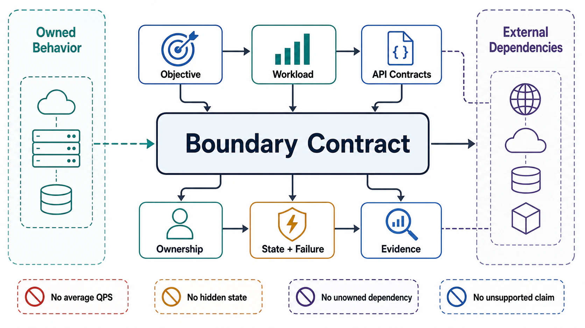

# Chapter 01: Architectural Objective and System Boundary



## Abstract

A design is not correct because it uses a strong database, a queue, a cache, a model, or a service mesh. A design is correct only relative to a declared objective, workload, correctness model, failure budget, trust boundary, and operating envelope — and the first architecture artifact is therefore not a component diagram but a boundary contract. This chapter builds that contract in twelve files: a falsifiable objective, a bounded workload and capacity envelope, a client and tenant model, executable input/output contracts, an ownership-accurate system boundary, dependency contracts for every crossing, a state and consistency inventory, failure and overload semantics, an observability and audit contract, a security and trust boundary, an evidence classification protocol, and the review templates that make the whole chapter mechanically executable.

```text
System = owned behavior + explicit contracts + bounded state + measurable failure handling
```

Anything outside that contract is not part of the system. It may still be a dependency, assumption, risk, or integration point, but it cannot be credited as implemented capability.

## Chapter Structure

Each file is a self-contained research note: an abstract stating its claim, a formal model, figures for the structures that matter, decision tables, approval gates that can fail a design, and primary-source references. The reading order is a dependency graph — later files consume constraints produced by earlier ones (see [00-chapter-file-map.md](00-chapter-file-map.md) for the full graph).

| Order | File | Concept |
|---:|---|---|
| 0 | [00-chapter-file-map.md](00-chapter-file-map.md) | Folder map and approval dependency graph |
| 1 | [01-objective-contract.md](01-objective-contract.md) | Falsifiable objective, correctness invariants, latency/resource budgets |
| 2 | [02-workload-and-capacity-envelope.md](02-workload-and-capacity-envelope.md) | Workload vector, capacity envelope, queueing knee, tail-latency amplifiers |
| 3 | [03-client-tenant-and-use-case-model.md](03-client-tenant-and-use-case-model.md) | Client classes, tenant isolation surfaces, priority, quotas, agent bounds |
| 4 | [04-input-output-and-api-contracts.md](04-input-output-and-api-contracts.md) | Schema, status machine, idempotency, deadline algebra, errors, streaming |
| 5 | [05-system-boundary-and-ownership.md](05-system-boundary-and-ownership.md) | Inside/outside boundary, control plane, data plane, coupled failure domains |
| 6 | [06-boundary-crossing-and-dependency-contracts.md](06-boundary-crossing-and-dependency-contracts.md) | Crossing anatomy, timeout/retry algebra, fallback semantics, gray failure |
| 7 | [07-state-classification-and-consistency-boundary.md](07-state-classification-and-consistency-boundary.md) | State classes, consistency model hierarchy, derived-state authority, offsets |
| 8 | [08-failure-domain-and-overload-semantics.md](08-failure-domain-and-overload-semantics.md) | Failure taxonomy, metastability, overload stages, admission, degraded mode |
| 9 | [09-observability-slo-and-audit-contract.md](09-observability-slo-and-audit-contract.md) | SLIs, SLOs, burn-rate alerting, trace propagation, audit integrity |
| 10 | [10-security-privacy-and-trust-boundary.md](10-security-privacy-and-trust-boundary.md) | Zero-trust enforcement, tenant isolation, data classification, AI threat model |
| 11 | [11-evidence-classification-and-architecture-review.md](11-evidence-classification-and-architecture-review.md) | Evidence classes, strength ladder, review ordering, unknown handling |
| 12 | [12-architecture-review-templates.md](12-architecture-review-templates.md) | Executable dossier, review tables, approval checklist |

## Institutional Source Standard

Allowed source class:

- Peer-reviewed systems research (SOSP, OSDI, NSDI, HotOS, CACM, FAST) and standards bodies (W3C, IETF, NIST, OWASP).
- Official engineering, architecture, or documentation material from the production-architecture corpus below.

Rejected source class:

- Third-party summaries, social posts, interview-prep material, unverified diagrams, anonymous architecture notes, and vendor-neutral articles that do not expose implementation, reliability, or operational evidence.

The corpus is not a market-cap claim. It is a constrained production-systems corpus selected because the sources expose mechanisms — for reliability, observability, service contracts, workload isolation, distributed execution, data governance, inference serving, and operational verification — with enough detail to be checked.

| Source | Official Material | Standard Imported Into This Chapter |
|---|---|---|
| Stanford | [CS244B Distributed Systems notes](https://www.scs.stanford.edu/24sp-cs244b/notes/intro.pdf) | Distributed calls can fail after no execution, one execution, repeated execution, or partial execution; therefore input contracts must define idempotency, retry, timeout, and observable completion semantics before service decomposition. |
| Google | [SRE: Service Level Objectives](https://sre.google/sre-book/service-level-objectives/), [Monitoring Distributed Systems](https://sre.google/sre-book/monitoring-distributed-systems/), [Handling Overload](https://sre.google/sre-book/handling-overload/), [SRE Workbook: Alerting on SLOs](https://sre.google/workbook/alerting-on-slos/) | Objective quality is measured through SLIs/SLOs, golden signals, and explicit overload behavior; SLO alerting uses multiwindow multi-burn-rate policy; QPS alone is not a workload model because requests have variable resource cost. |
| AWS | [Builders' Library: timeouts/retries/jitter](https://aws.amazon.com/builders-library/timeouts-retries-and-backoff-with-jitter/), [fairness in multi-tenant systems](https://aws.amazon.com/builders-library/fairness-in-multi-tenant-systems/), [queue backlogs](https://aws.amazon.com/builders-library/avoiding-insurmountable-queue-backlogs/), [Well-Architected API contracts](https://docs.aws.amazon.com/wellarchitected/latest/reliability-pillar/rel_service_architecture_api_contracts.html) | API boundaries require machine-readable contracts, budgeted single-layer retries with jitter, cost-based fairness across tenants, age-bounded queues, and static stability during control-plane outage. |
| Microsoft | [Azure Well-Architected Framework](https://learn.microsoft.com/en-us/azure/well-architected/), [Gray Failure (HotOS 2017)](https://www.microsoft.com/en-us/research/publication/gray-failure-achilles-heel-cloud-scale-systems/) | Workload architecture connects business outcome to observable operations; failure detection cannot rely on component self-reporting because caller-observed and component-observed health diverge (differential observability). |
| Meta | [Privacy-aware infrastructure](https://engineering.fb.com/2026/06/25/security/privacy-aware-infrastructure-in-the-ai-native-era-an-asset-classification-case-study/), [Scaling Memcache (NSDI 2013)](https://www.usenix.org/conference/nsdi13/technical-sessions/presentation/nishtala), [data-ingestion migration at scale](https://engineering.fb.com/2026/05/12/data-infrastructure/migrating-data-ingestion-systems-at-meta-scale/) | Data classification follows semantic meaning and lineage, not field shape; cache correctness requires leases and deletion-based invalidation; migrations require shadow execution, comparison, rollout, and rollback controls. |
| Netflix | [Service-level prioritized load shedding](https://netflixtechblog.com/enhancing-netflix-reliability-with-service-level-prioritized-load-shedding-e735e6ce8f7d), [adaptive concurrency limits](https://netflixtechblog.com/performance-under-load-3e6fa9a60581) | Boundary design distinguishes critical from non-critical traffic with pre-declared shedding order, and derives concurrency limits from measured latency gradients instead of static intuition. |
| Uber | [Distributed tracing](https://www.uber.com/us/en/blog/distributed-tracing/), [Cadence multi-tenant task processing](https://www.uber.com/us/en/blog/cadence-multi-tenant-task-processing/) | Distributed boundaries require trace-context propagation, cross-service visibility, tenant-aware resource isolation, and protection against one customer's bursts delaying latency-sensitive workflows. |
| LinkedIn | [Kafka at scale](https://engineering.linkedin.com/kafka/running-kafka-scale) | Event boundaries define topic ownership, partitioning, offset commit points, retention, and throughput envelope before data-plane coupling is accepted. |
| Cloudflare | [Dynamic Workflows](https://blog.cloudflare.com/dynamic-workflows/), [AI code review orchestration](https://blog.cloudflare.com/ai-code-review/) | Durable execution and agentic orchestration require tenant routing, resumable idempotent steps, sandboxed ownership, explicit fatal/non-fatal phase behavior, and traceable coordination. |
| NVIDIA | [Triton production inference](https://developer.nvidia.com/blog/simplifying-ai-inference-in-production-with-triton/) | AI-serving boundaries specify model repository, backends, protocols, batching, scheduling, live model update behavior, and hardware placement. |
| OpenAI | [Scaling PostgreSQL](https://openai.com/index/scaling-postgresql/), [Scaling Kubernetes to 7,500 nodes](https://openai.com/index/scaling-kubernetes-to-7500-nodes/) | Cache misses, expensive queries, write storms, retries, quotas, health checks, and workload isolation are boundary-level concerns, not late operational fixes. |
| Research corpus | [Tail at Scale (CACM 2013)](https://cacm.acm.org/research/the-tail-at-scale/), [Metastable Failures (HotOS 2021)](https://sigops.org/s/conferences/hotos/2021/papers/hotos21-s11-bronson.pdf), [Metastable Failures in the Wild (OSDI 2022)](https://www.usenix.org/publications/loginonline/metastable-failures-wild), [Jepsen consistency hierarchy](https://jepsen.io/consistency), [AWS formal methods (CACM 2015)](https://cacm.acm.org/research/how-amazon-web-services-uses-formal-methods/), [DistServe retrospective](https://haoailab.com/blogs/distserve-retro/) | Fanout multiplies tail probability; retry amplification sustains overload after triggers clear; consistency claims bind to formally defined models; formal specification finds design defects testing cannot; inference capacity is goodput under TTFT/TPOT SLOs, not QPS. |
| Standards | [NIST SP 800-207](https://csrc.nist.gov/pubs/sp/800/207/final), [OWASP LLM Top 10 (2025)](https://genai.owasp.org/llm-top-10/), [W3C Trace Context](https://www.w3.org/TR/trace-context/), [IETF Idempotency-Key draft](https://datatracker.ietf.org/doc/draft-ietf-httpapi-idempotency-key-header/) | Zero-trust per-request authorization at explicit enforcement points; prompt injection survivability rather than prevention; interoperable trace propagation; durable idempotency-key replay semantics. |

## Source-Derived Chapter Standards

1. Objective must be expressible as externally observable behavior plus SLI/SLO targets.
2. Workload must include request classes, payload shape, resource cost, concurrency, burst pattern, arrival model (open/closed), and failure-induced load.
3. API boundaries must be machine-readable, versioned, and explicit about input fields, output fields, status states (including ambiguous completion), and compatibility rules.
4. Retry policy is invalid until idempotency, deadline propagation, duplicate detection, retry budget, and replay response are defined.
5. A distributed call must document whether failure can mean not executed, executed once, executed multiple times, or partially executed.
6. QPS is not a capacity model unless request cost distribution is bounded and measured; capacity is a target utilization range per saturated resource.
7. Overload behavior must define admission, throttle, queue, shed, degrade, fail-fast, and staged hysteretic recovery semantics — with recovery load itself budgeted.
8. Observability must include latency, traffic, errors, saturation, trace context, audit context, retry attempt attribution, and dependency-level caller-side SLIs.
9. Data classification must follow semantic meaning, lineage, policy purpose, retention, and downstream transformation path — derived artifacts inherit source sensitivity.
10. Multi-tenant systems must define tenant isolation for CPU, memory, queue slots, worker capacity, cache keys, storage, indexes, model context, and audit evidence — with a stated blast radius.
11. Durable workflows and agentic loops must define resumable idempotent steps, sandbox boundary, step/token/tool budgets, cancellation, human approval points, and replay behavior.
12. Inference-serving boundaries must define tokenizer path, model backend, batching/scheduling policy, model update path, hardware placement, streaming contract, and token-denominated admission under TTFT/TPOT SLOs.
13. Migration or replacement work must include shadow execution, correctness comparison, latency comparison, resource comparison, rollout gate, rollback gate, and deprecation evidence.
14. Claimed capability must be classified as implemented, observed, tested, intended, assumed, external, or unknown — each bounded by the workload envelope of its evidence.
15. Unknown behavior that affects correctness, security, latency, recovery, or compliance blocks architecture approval until converted into evidence or explicit risk.

## Review Ordering

```text
Objective -> Workload -> Users -> Input Contract -> Output Contract
-> Boundary -> Dependencies -> State -> Failure -> Observability -> Security
-> Implemented/Intended Classification -> Validation Gates
```

The order matters because later artifacts depend on earlier constraints: no retry policy is valid until idempotency is defined, no cache policy until freshness is defined, no queue design until burst shape and deadline behavior are defined, no shedding order until priority classes exist. The full rationale and per-file gates live in [11-evidence-classification-and-architecture-review.md](11-evidence-classification-and-architecture-review.md).

## Chapter Completion Gate

Chapter 01 is complete only when the reviewer can answer these questions without guessing:

- What exact outcome does the system produce, and which measurement would falsify it?
- Who calls the system, under which identity, and with which per-class contract?
- What input is accepted, rejected, normalized, or quarantined?
- What output states can be returned — including ambiguous completion?
- Which latency, throughput, durability, freshness, and correctness budgets apply?
- Which components and states are inside the owned boundary, and who owns each?
- Which dependencies are outside the boundary, under which contracts?
- Which behaviors are implemented versus intended, and under which evidence?
- Which failures are absorbed by the system, and which are delegated to callers?
- What does the system do in the thirty seconds after overload begins — and how does it recover without operator improvisation?
- Which observability signals prove boundary behavior, and which alerts page a human?
- Which trust boundaries prevent unauthorized data access or mutation, with no control depending on model output or caller honesty?
- Which assumptions require validation before design approval?

## Final Position

The objective and boundary are the architecture's root invariants. Once they are precise, later design choices can be evaluated mechanically against workload, correctness, latency, state, failure, observability, and security constraints. Without them, every later chapter becomes a collection of plausible but unprovable decisions.
