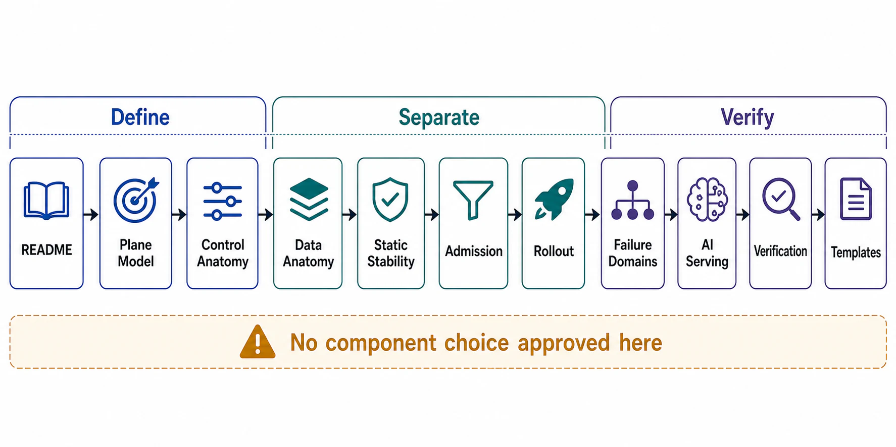

# Chapter 02 File Map



## Purpose

Chapter 01 declared the control-plane/data-plane split as a boundary-level obligation. This chapter designs it: which decisions belong in which plane, how policy moves from the plane that decides to the plane that executes, what the data plane is allowed to do per request, how control-plane mutations are rolled out without global blast radius, and how the separation is verified rather than asserted.

Each file is a self-contained research note: an abstract stating the claim, a formal model, figures for the structures that matter, decision tables, approval gates that can fail a design, and references to primary sources.

## Reading Order

| Order | File | Architecture Decision Produced |
|---:|---|---|
| 1 | [README.md](README.md) | Chapter thesis, source corpus, and completion gate |
| 2 | [01-plane-separation-model.md](01-plane-separation-model.md) | Formal plane definitions by scaling law, decision timescale, blast radius, and availability posture |
| 3 | [02-control-plane-anatomy.md](02-control-plane-anatomy.md) | Policy store, reconciliation loop, distribution layer, enforcement points |
| 4 | [03-data-plane-anatomy.md](03-data-plane-anatomy.md) | Per-request budget: what the hot path may and may not do |
| 5 | [04-static-stability-and-policy-distribution.md](04-static-stability-and-policy-distribution.md) | Last-known-good semantics, push/pull distribution contracts, boot dependency rule |
| 6 | [05-admission-scheduling-and-placement.md](05-admission-scheduling-and-placement.md) | Decision-latency classes; admission, scheduling, placement, and autoscaling ownership |
| 7 | [06-configuration-rollout-and-blast-radius.md](06-configuration-rollout-and-blast-radius.md) | Config-change risk model, staged rollout, canary, automatic rollback, kill switches |
| 8 | [07-coupled-failure-domains-and-anti-patterns.md](07-coupled-failure-domains-and-anti-patterns.md) | Circular dependencies, shared resources, availability multiplication, named-incident anti-patterns |
| 9 | [08-plane-separation-in-ai-serving-and-agents.md](08-plane-separation-in-ai-serving-and-agents.md) | Inference and agent systems mapped onto planes; KV-aware routing; episode admission |
| 10 | [09-verification-of-plane-separation.md](09-verification-of-plane-separation.md) | Drills, per-plane SLOs, dependency audits, chaos scenarios that prove the split |
| 11 | [10-plane-separation-review-templates.md](10-plane-separation-review-templates.md) | Executable dossier and approval checklist |

## Approval Dependency Graph

```text
Figure 1. Chapter 02 approval dependency graph.

  [01] Plane separation model
        │  defines what "control" and "data" mean here
        v
  [02] Control-plane anatomy ──────┐
        │                          │
        v                          v
  [03] Data-plane anatomy    [05] Admission, scheduling, placement
        │                          │
        v                          │
  [04] Static stability +          │
       policy distribution ◄───────┘
        │
        v
  [06] Configuration rollout + blast radius
        │
        v
  [07] Coupled failure domains + anti-patterns
        │
        v
  [08] AI serving + agents (applied case)
        │
        v
  [09] Verification ──► [10] Review dossier
```

Concrete dependencies the graph encodes:

- The data plane's per-request budget ([03]) is meaningless until the plane definitions ([01]) fix which lookups are local and which are remote policy.
- Distribution contracts ([04]) cannot be reviewed before the anatomy ([02]) names the policy store and its consistency model.
- Rollout policy ([06]) consumes the distribution mechanism ([04]) — you cannot stage what you cannot version.
- The anti-pattern register ([07]) is checkable only against the declared plane inventory ([02], [03]).
- Verification ([09]) turns every prior claim into a drill that can fail.

## Prerequisites From Chapter 01

| Chapter 01 Artifact | Consumed By |
|---|---|
| Boundary-level plane declaration ([file 05 §4](../01-architectural-objective-and-system-boundary/05-system-boundary-and-ownership.md)) | [01], [02], [03] |
| Coupled failure domain table ([file 05 §5](../01-architectural-objective-and-system-boundary/05-system-boundary-and-ownership.md)) | [07] |
| Cost-based admission ([file 08 §5](../01-architectural-objective-and-system-boundary/08-failure-domain-and-overload-semantics.md)) | [05] |
| Workload/utilization envelope ([file 02](../01-architectural-objective-and-system-boundary/02-workload-and-capacity-envelope.md)) | [03], [05] |
| Evidence classification ([file 11](../01-architectural-objective-and-system-boundary/11-evidence-classification-and-architecture-review.md)) | [09], [10] |

## Chapter Rule

No specific scheduler, service mesh, orchestrator, config system, or inference router is approved in Chapter 02. This chapter approves only the *split*: which decisions live in which plane, under which distribution contract, with which blast radius, verified by which drills. Component selection remains a later-chapter decision made against these constraints.
