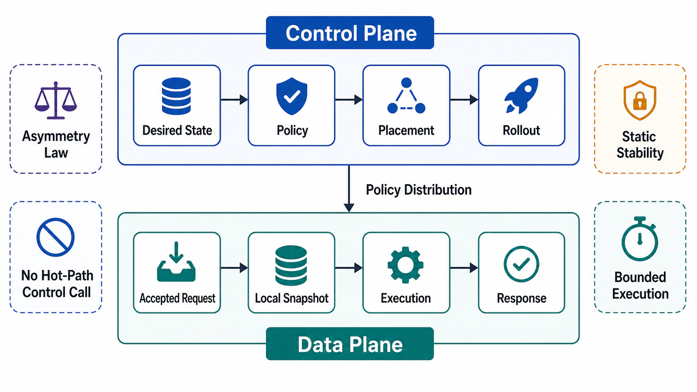

# Plane Separation Model



## Abstract

Control plane and data plane are not deployment labels; they are roles defined by four measurable properties — scaling law, decision timescale, blast radius, and availability posture. This file fixes the definitions the rest of the chapter depends on, following the sharpest formulation in the literature ([Brooker, "Control Planes vs Data Planes"](https://brooker.co.za/blog/2019/03/17/control.html)): data-plane components sit on the request path and scale O(N) with request volume, so they must be up for any request to succeed; control-plane components scale with the *rate of change* of the system — of load, of fleet size, of software — and may be briefly unavailable before any customer notices. From those two scaling laws every other property follows, including the chapter's central asymmetry: the data plane fails locally and fast, the control plane fails globally and slowly. The lineage of the separation runs from network engineering through SDN, where [OpenFlow](https://dl.acm.org/doi/10.1145/1355734.1355746) made it an explicit architecture by moving forwarding decisions out of switches into controllers, and into cluster management, where [Borg](https://research.google/pubs/large-scale-cluster-management-at-google-with-borg/) and its descendant Kubernetes made desired-state reconciliation the standard control-plane idiom.

Chapter 01 file 05 §4 declared this separation as a boundary obligation and named its two safety rules (control-plane outage must not halt the data plane; data-plane overload must not sever the safety levers). This chapter designs the machinery that makes those rules true.

## 1. Formal Model

Classify every component by how its required capacity scales:

```text
data_plane(c)    ⟺  capacity(c) = Θ(request_rate)          — on the request path
control_plane(c) ⟺  capacity(c) = Θ(d/dt fleet, config,    — off the request path,
                                     load, software)          proportional to change
management_plane(c) ⟺ capacity(c) = Θ(operator actions)    — humans and their tooling
```

The classification is per-*function*, not per-process: a single binary can host data-plane request handling and a control-plane reconciliation thread, and the review treats those as two components sharing a failure domain (a coupling that must be declared under [07-coupled-failure-domains-and-anti-patterns.md](07-coupled-failure-domains-and-anti-patterns.md)).

The third plane matters because incidents say it does. The management plane — deploy tooling, operator consoles, remote access, break-glass paths — is what you fix the other two planes *with*. Meta's October 2021 outage extended from hours toward a full day partly because the tooling and physical access systems needed to repair the network were themselves victims of the network outage ([Meta engineering postmortem](https://engineering.fb.com/2021/10/05/networking-traffic/outage-details/)). A management plane that depends on the planes it manages is a recovery deadlock scheduled in advance.

## 2. The Four Defining Properties

```text
Figure 1. Plane taxonomy: decision timescale versus blast radius.
Timescale falls as you move down the stack; blast radius rises as
you move up it. The dangerous quadrant is top-left: fast-acting,
globally-scoped decisions — which is what an unstaged config push is.

  blast radius
      │
global┤  ⚠ unstaged global      CONTROL PLANE
      │    config push          (policy, placement,
      │                          rollout, quotas)
      │                              MANAGEMENT PLANE
      │                              (deploys, operators,
      │                               break-glass)
 local┤  DATA PLANE
      │  (one request, one
      │   connection, one host)
      └──────┬──────────────┬──────────────┬─────── decision timescale
           µs–ms         sec–min        hours–days
        (per request)  (reconciliation)  (human/release)
```

| Property | Data Plane | Control Plane | Management Plane |
|---|---|---|---|
| Scaling law | Θ(request rate) | Θ(rate of change) | Θ(operator actions) |
| Decision timescale | µs–ms, inside one request | Seconds–minutes, reconciliation loops | Hours–days, releases and interventions |
| Blast radius of one failure | One request, connection, or host | Every consumer of the policy, often globally | Ability to repair anything at all |
| Availability posture | Must be up per request; fails fast and locally | May lag or pause briefly; must never emit wrong policy fast | Must survive the failure of both other planes |
| Consistency need | Serves from local state; tolerates bounded-stale policy | Needs strongly consistent policy storage (typically consensus-backed) | Needs out-of-band access and audit |
| Correct failure bias | Fail fast, shed, degrade | Fail *stale* (stop distributing) rather than fail wrong | Fail independent (no shared dependency) |

The consistency row contains the inversion that surprises most designs: the control plane needs strong consistency *internally* (two controllers disagreeing about desired state is corruption), yet its *distribution* to the data plane is deliberately eventually consistent — Envoy's xDS protocol is explicit that configuration convergence is eventual and the data plane keeps serving on its current snapshot meanwhile ([xDS protocol specification](https://www.envoyproxy.io/docs/envoy/latest/api-docs/xds_protocol)). Strong where decisions are made, stale-tolerant where they are consumed: that asymmetry is the design, not a compromise of it.

## 3. The Asymmetry Law

The two planes fail in opposite shapes, and every downstream design rule in this chapter is a response to one of the two shapes:

```text
data-plane fault:    wrong/slow answer for SOME requests, NOW,
                     bounded by host/shard/connection
                     -> defense: redundancy, retry, shedding (Ch01 file 08)

control-plane fault: wrong policy for ALL data-plane elements,
                     arriving on the distribution delay,
                     persisting until corrected + redistributed
                     -> defense: staging, validation, versioned rollback,
                        static stability (files 04, 06)
```

Empirically the second shape now dominates large outages: Cloudflare's July 2019 global outage was one WAF rule with catastrophic regex backtracking pushed to every edge server at once ([postmortem](https://blog.cloudflare.com/details-of-the-cloudflare-outage-on-july-2-2019/)); Meta's 2021 outage was one backbone maintenance command whose effect propagated through BGP withdrawal to the entire company ([postmortem](https://engineering.fb.com/2021/10/05/networking-traffic/outage-details/)); Cloudflare's November 2023 control-plane outage demonstrated the converse virtue — the data plane kept serving traffic for the duration precisely because it was statically stable against control-plane loss ([postmortem](https://blog.cloudflare.com/post-mortem-on-cloudflare-control-plane-and-analytics-outage/)). The pattern across all three: data-plane redundancy was fine; the control path was the single point of global failure.

## 4. Classification Procedure

For each component in the Chapter 01 boundary inventory, answer four questions; disagreement between answers is itself a finding.

| Question | Data-Plane Answer | Control-Plane Answer |
|---|---|---|
| Is it on the per-request critical path? | Yes | No — if yes, see §5 |
| What does its capacity track? | Request volume | Change volume |
| If it pauses for 60 s, who notices? | Callers, immediately | Nobody, if the data plane is statically stable |
| If it emits a wrong answer, what is the scope? | One request/caller | Every element consuming the policy |

### Common misclassifications

| Component | Common Wrong Label | Correct Analysis |
|---|---|---|
| Authorization check | "Control plane — it's policy" | Per-request *evaluation* is data plane against locally distributed policy; policy *authoring* is control plane |
| Rate limiter | "Data plane — it touches requests" | Enforcement is data plane; limit values and their distribution are control plane |
| Service discovery | "Data plane — lookups are per request" | Lookup against a local snapshot is data plane; the registry and its push pipeline are control plane; per-request calls to the registry are a §5 violation |
| Autoscaler | "Data plane — it manages serving capacity" | Pure control plane: scales with rate of load change, must never sit on the request path |
| Model/index selection | "Data plane — it happens per inference" | Selection *rule* and version pinning are control plane; applying the pinned selection is data plane |

## 5. Mixing Rule

Mixing the planes is not forbidden; undeclared mixing is. A per-request call from the data plane into a control-plane service is admissible only when all four hold:

1. The dependency is declared as a coupled failure domain with the availability multiplication computed ([07 §2](07-coupled-failure-domains-and-anti-patterns.md)).
2. A last-known-good fallback exists and is exercised by drill ([09](09-verification-of-plane-separation.md)).
3. The measured latency cost fits the request-class budget from Chapter 01 file 02.
4. The control-plane service is provisioned for Θ(request rate) — at which point the review should ask why it is not simply part of the data plane.

Condition 4 is the honest one: a "control plane" that must scale with request volume has been misnamed, and the misnaming hides an unprovisioned dependency.

## 6. Approval Gates

| Gate | Evidence Required | Failure Condition |
|---|---|---|
| Classification gate | Every boundary-inventory component carries a plane label with its scaling law | A component's capacity model is "same as the service" |
| Asymmetry gate | Control-plane failure shape (global, delayed, persistent) is analyzed per policy type | Control-plane faults are modeled like host faults |
| Management gate | Management plane has no hard dependency on the planes it manages | Repair tooling dies with the system it repairs |
| Mixing gate | Every per-request data→control call satisfies all four §5 conditions | Hidden synchronous control-plane dependency on the hot path |
| Seam gate | Plane labels are consistent with the Chapter 01 boundary inventory | The same component is classified differently in the two chapters |

## Output

The output of this file is a plane classification for every component in the system boundary — each with a scaling law, decision timescale, blast radius, and availability posture — precise enough that the remaining files can attach distribution contracts, rollout gates, and drills to it.

## References

- [Brooker, "Control Planes vs Data Planes," 2019](https://brooker.co.za/blog/2019/03/17/control.html)
- [McKeown et al., "OpenFlow: Enabling Innovation in Campus Networks," SIGCOMM CCR 2008](https://dl.acm.org/doi/10.1145/1355734.1355746)
- [Verma et al., "Large-scale cluster management at Google with Borg," EuroSys 2015](https://research.google/pubs/large-scale-cluster-management-at-google-with-borg/)
- [Envoy — xDS REST and gRPC protocol (eventual-consistency contract)](https://www.envoyproxy.io/docs/envoy/latest/api-docs/xds_protocol)
- [Cloudflare — Details of the Cloudflare outage on July 2, 2019](https://blog.cloudflare.com/details-of-the-cloudflare-outage-on-july-2-2019/)
- [Meta — More details about the October 4, 2021 outage](https://engineering.fb.com/2021/10/05/networking-traffic/outage-details/)
- [Cloudflare — Post-mortem on the control plane and analytics outage, November 2023](https://blog.cloudflare.com/post-mortem-on-cloudflare-control-plane-and-analytics-outage/)
