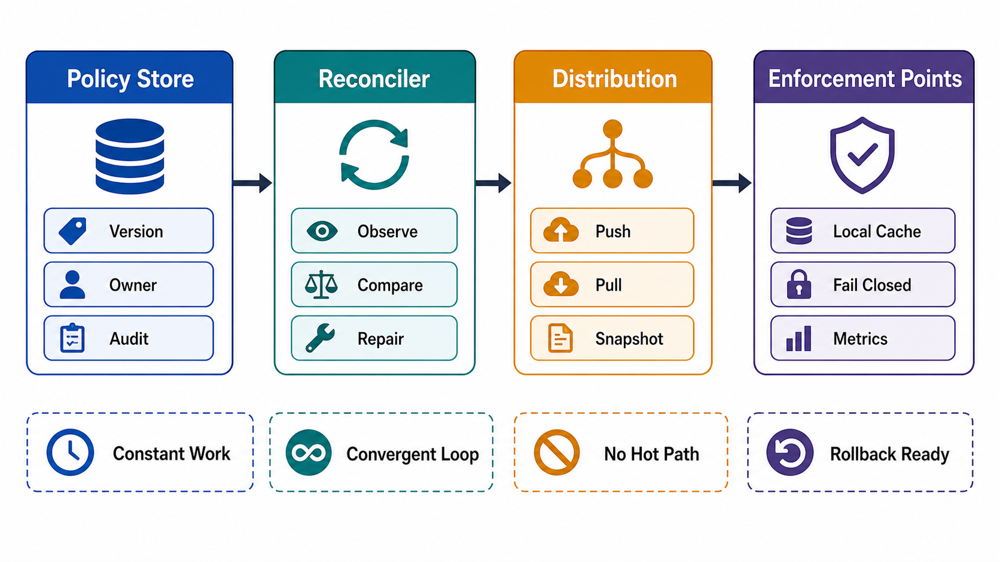

# Control-Plane Anatomy



## Abstract

A production control plane has a four-stage anatomy: a consensus-backed policy store holding desired state, a reconciliation loop converging actual state toward it, a distribution layer moving compiled policy to the data plane, and enforcement points inside the data plane that apply it. This file specifies each stage's contract and the two design disciplines that make control planes survive their own load: desired-state reconciliation rather than imperative command execution — the idiom proven at cluster scale by [Borg](https://research.google/pubs/large-scale-cluster-management-at-google-with-borg/) and generalized by [Kubernetes controllers](https://kubernetes.io/docs/concepts/architecture/controller/) — and constant-work design, in which the control plane does the same amount of work whether one thing changed or everything did, so that its worst day looks like its average day ([AWS Builders' Library, "Reliability, constant work, and a good cup of coffee"](https://aws.amazon.com/builders-library/reliability-and-constant-work/)).

The governing observation: the control plane is a distributed system whose customers are your own data-plane fleet, and whose overload arrives correlated with incidents — exactly when its output matters most. It must therefore be engineered to the same standard as the product, with one inversion: where the data plane optimizes for latency, the control plane optimizes for *predictability under stress*.

## 1. Responsibilities Inventory

The control plane owns decisions about what should happen. Chapter 01 file 05 fixed the responsibility table; this chapter attaches each responsibility to the anatomy that serves it.

| Responsibility | Desired State Artifact | Distribution Consumer |
|---|---|---|
| Routing policy | Route tables, weights, retry/timeout policy per route | Proxies, gateways, client libraries |
| Admission and quota | Per-class/per-tenant limits, priority order | Ingress admission enforcers |
| Scheduling and placement | Assignment maps: shard→host, model→GPU pool, partition→broker | Workers, schedulers' agents |
| Configuration | Typed, versioned config snapshots | Every data-plane process |
| Feature flags and kill switches | Flag state with scope and default | Flag evaluators embedded in data plane |
| Model/index selection | Pinned versions with compatibility metadata | Inference routers, retrieval services |
| Credential policy | Scoped secrets metadata, rotation schedule | Secret-fetching sidecars/agents |
| Tenant policy | Isolation, retention, export, deletion rules | Storage, cache, queue enforcement points |

## 2. The Four-Stage Pipeline

```text
Figure 1. Control-plane anatomy. Strong consistency on the left,
deliberate eventual consistency on the right; the arrows crossing
the plane boundary are the distribution contracts of file 04.

        CONTROL PLANE                                 DATA PLANE
 ┌─────────────────────────────────────────────┐   ┌──────────────────┐
 │  ┌──────────────┐      ┌──────────────────┐ │   │  ┌────────────┐  │
 │  │ policy store │◄─────│ authoring +      │ │   │  │enforcement │  │
 │  │ (consensus-  │      │ validation APIs  │ │   │  │points (PEP)│  │
 │  │  backed,     │      │ (schema, lint,   │ │   │  │apply local │  │
 │  │  versioned)  │      │  approval, audit)│ │   │  │snapshot    │  │
 │  └──────┬───────┘      └──────────────────┘ │   │  └─────▲──────┘  │
 │         │ watch/poll                        │   │        │         │
 │  ┌──────▼───────┐       ┌────────────────┐  │   │  ┌─────┴──────┐  │
 │  │reconciliation│──────►│ distribution   │──┼──►│  │ local      │  │
 │  │loop: observe │       │ layer: compile,│  │   │  │ policy     │  │
 │  │actual, diff  │       │ version, push/ │  │   │  │ snapshot   │  │
 │  │desired, act  │◄──────│ serve snapshots│  │   │  │ (LKG)      │  │
 │  └──────────────┘ state └────────────────┘  │   │  └────────────┘  │
 │        ▲          reports                   │   │                  │
 └────────┼────────────────────────────────────┘   └────────┬─────────┘
          └────────── health/load/saturation signals ◄──────┘
```

### 2.1 Policy store

Desired state lives in a strongly consistent, versioned store — in practice consensus-backed (etcd under Kubernetes, or an equivalent Raft/Paxos-replicated store), because two controllers acting on divergent desired state is corruption, not lag. Contract fields: schema per policy type, monotonic version per object, change audit (Chapter 01 file 09), and bounded size — a policy store that grows with request volume has a data-plane object in it by mistake.

### 2.2 Reconciliation loop

The controller pattern: observe actual state, diff against desired state, act to converge, repeat forever ([Kubernetes controller concept](https://kubernetes.io/docs/concepts/architecture/controller/)). Reconciliation beats imperative command execution for one structural reason — it is *self-healing against lost signals*. A missed event under imperative design is a permanent divergence; under reconciliation it is repaired on the next loop iteration. The Borg lineage demonstrates the pattern's ceiling: a logically centralized controller (Borgmaster) reconciling hundreds of thousands of tasks against declarative job specifications ([Verma et al., EuroSys 2015](https://research.google/pubs/large-scale-cluster-management-at-google-with-borg/)).

Loop contract:

```yaml
reconciliation_loop:
  observe_source:            # actual state: agent reports, health checks
  desired_source:            # policy store, versioned
  convergence_slo:           # p99 time from desired-state change to enforcement
  loop_period:               # bounded; no unbounded event-queue coupling
  work_per_iteration: constant | proportional_to_diff   # see §3
  action_idempotency: required   # loop retries; actions must tolerate replay
  divergence_metric:         # exported; alert on sustained non-convergence
  blast_radius_limit:        # max fraction of fleet actionable per iteration
```

The last field is the loop's own safety brake: a reconciler that will happily "converge" 100% of the fleet to a bad desired state in one iteration is the Cloudflare-2019 shape wearing a controller costume. Convergence rate must be capped so the rollout gates of [06-configuration-rollout-and-blast-radius.md](06-configuration-rollout-and-blast-radius.md) have time to fire.

### 2.3 Distribution layer

Compiles desired state into consumable snapshots and moves them to enforcement points. Its contract — push versus pull, propagation-delay SLO, snapshot atomicity, resync behavior — is large enough to own [file 04](04-static-stability-and-policy-distribution.md). The one anatomy-level rule: distribution serves *versioned snapshots*, never live queries. A data plane that queries the policy store per request has re-coupled the planes (file 01 §5).

### 2.4 Enforcement points

Enforcement points live in the data plane and apply the local snapshot. They are the same PEPs as Chapter 01 file 10's zero-trust placement — policy evaluation local, policy authority remote. Contract: evaluate from local state only; report applied version upward (so divergence is measurable); on missing/invalid snapshot, follow the fail-stale/fail-closed decision table in file 04 §4.

## 3. Constant Work Versus Edge-Triggered Design

The highest-leverage control-plane design decision is how work scales with change volume.

| Design | Mechanism | Behavior Under Stress |
|---|---|---|
| Edge-triggered | React to each change event; queue of deltas | Work spikes with change rate; queue backlogs form exactly during incidents; lost events cause silent divergence |
| Level-triggered / constant work | Periodically process the *full* desired state regardless of change count | Same work at zero changes and ten thousand; no backlog possible; lost signals self-heal on next cycle |

The constant-work pattern deliberately "wastes" resources in the calm case to buy modelessness in the stressed case: the system has no fast path and slow path, so there is no untested slow path to discover during an incident ([AWS, constant work](https://aws.amazon.com/builders-library/reliability-and-constant-work/)). AWS runs core network configuration distribution this way — a full configuration file rewritten and re-consumed on a fixed cadence, so failure recovery and normal operation are the same code path. Route 53's health-check aggregation follows the same shape.

The review does not mandate constant work everywhere — full-state processing has a scale ceiling — but it mandates the classification: each reconciler declares itself edge- or level-triggered, and edge-triggered loops must show their backlog bound and divergence-repair mechanism.

## 4. Control-Plane Load Model

The control plane's workload vector (Chapter 01 file 02 applies to it recursively):

| Load Source | Shape | Design Consequence |
|---|---|---|
| Steady reconciliation | Constant (by design) | Provision for it permanently; it is the floor, not waste |
| Fleet growth | Θ(dN/dt), spiky during scale-out | Placement decisions burst exactly when capacity is scarce |
| Incident-correlated load | Failover storms: mass re-registration, config refetch, cache cold-start | The control plane's peak arrives during the data plane's worst hour — provision for correlated peak, not average |
| Thundering-herd resync | Every data-plane element reconnects after control-plane restart | Jittered resync, snapshot serving from cache/CDN, connection admission |
| Operator/API traffic | Human-timescale, bursty during incidents | Isolate from reconciliation capacity; operators must not queue behind the loop |

The incident-correlated row is the one that breaks naive designs: a control plane sized for steady state meets its true peak the first time an availability zone fails and the whole fleet asks for new placement at once. This is why the smaller-service-in-control pattern has the *data plane* push health/state reports to the control plane on a constant cadence, rather than the control plane polling on demand — the traffic shape stays fixed no matter what is failing ([AWS, smaller service in control](https://aws.amazon.com/builders-library/avoiding-overload-in-distributed-systems-by-putting-the-smaller-service-in-control/)).

## 5. Control-Plane Correctness Bias

When the control plane must choose between being *wrong* and being *stale*, it chooses stale — always. Concretely:

- Validation failure on a policy compile → keep distributing the previous snapshot; alert; never distribute a partially valid snapshot.
- Reconciler uncertainty about actual state (telemetry gap) → pause convergence for the affected scope rather than act on guesses; a controller acting on stale observations amplifies gray failures into real ones.
- Split-brain risk in the policy store → unavailable beats divergent; the data plane's static stability (file 04) is what makes this affordable.
- Kill switches are the exception that proves the bias: they are the one policy class engineered for *fast* global effect, which is why they get dedicated, pre-validated, constantly-exercised distribution (file 06 §6).

## 6. Approval Gates

| Gate | Evidence Required | Failure Condition |
|---|---|---|
| Anatomy gate | Policy store, reconciler, distribution, and enforcement points are named per responsibility in §1 | A responsibility has no owning pipeline stage |
| Consistency gate | Policy store is strongly consistent and versioned; distribution is explicitly eventual with a convergence SLO | Consistency model is implicit or uniform across stages |
| Loop gate | Each reconciler declares trigger model, convergence SLO, idempotent actions, divergence metric, and per-iteration blast-radius cap | A reconciler can converge the whole fleet to a bad state in one pass |
| Load gate | Control plane is provisioned for incident-correlated peak (failover storm, mass resync) | Sizing assumes steady state |
| Bias gate | Every failure branch resolves to stale-not-wrong; kill-switch path is the only engineered fast-global exception | A failure path can distribute invalid or partial policy |

## Output

The output of this file is a named four-stage anatomy for every control-plane responsibility — store, loop, distribution, enforcement — each with a trigger model, convergence SLO, load model, and stale-not-wrong failure bias that files 04–06 can attach contracts to.

## References

- [Verma et al., "Large-scale cluster management at Google with Borg," EuroSys 2015](https://research.google/pubs/large-scale-cluster-management-at-google-with-borg/)
- [Kubernetes documentation — Controllers (desired-state reconciliation)](https://kubernetes.io/docs/concepts/architecture/controller/)
- [AWS Builders' Library — Reliability, Constant Work, and a Good Cup of Coffee](https://aws.amazon.com/builders-library/reliability-and-constant-work/)
- [AWS Builders' Library — Avoiding Overload by Putting the Smaller Service in Control](https://aws.amazon.com/builders-library/avoiding-overload-in-distributed-systems-by-putting-the-smaller-service-in-control/)
- [Brooker, "Control Planes vs Data Planes," 2019](https://brooker.co.za/blog/2019/03/17/control.html)
