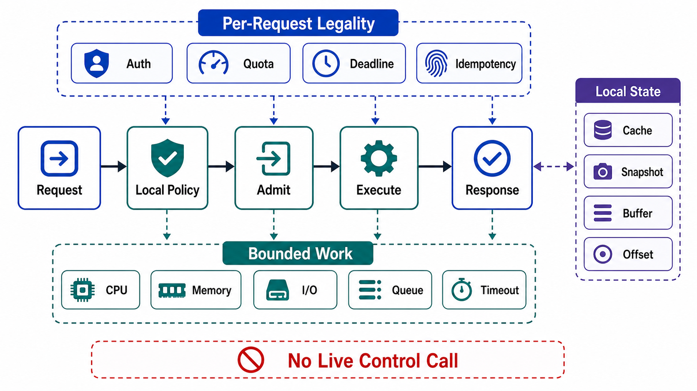

# Data-Plane Anatomy



## Abstract

The data plane executes accepted work on the per-request critical path, and its defining constraint is a budget: every instruction, lookup, and network hop on that path is multiplied by request volume and charged against the latency decomposition of Chapter 01 file 01 §6. This file specifies what a data-plane element may do per request (evaluate against locally held, versioned policy snapshots), what it must never do per request (synchronous calls into control-plane services), and the structural rules — local enforcement, upward reporting, bounded per-request work — that keep the hot path's dependency set exactly as small as its availability target requires. The discipline is the operational core of the plane split: [Brooker's definition](https://brooker.co.za/blog/2019/03/17/control.html) makes the data plane the set of components that must be up for a request to succeed, so every dependency added to the hot path multiplies into the availability product computed in [07 §2](07-coupled-failure-domains-and-anti-patterns.md).

The asymmetry to internalize: control-plane work is amortized across all future requests; data-plane work is paid per request. Moving a decision from the hot path into the control plane converts an O(N) cost into an O(rate-of-change) cost — that conversion is the entire economic argument for the separation.

## 1. Responsibilities Inventory

The data plane owns execution of accepted work. Chapter 01 file 05 fixed the responsibility table; this file attaches the per-request budget to it.

| Responsibility | Per-Request Work | Policy It Consumes Locally |
|---|---|---|
| Request execution | Validate, authorize, execute, emit status | AuthZ policy snapshot, schema versions |
| Storage I/O | Transactions, reads/writes within declared bounds | Placement/shard maps, connection budgets |
| Retrieval | Tenant-filtered candidate fetch, rerank, pack | Index versions, tenant filter policy |
| Inference | Tokenize, prefill, decode, stream | Pinned model version, batching parameters, token budgets |
| Queue consumption | Poll, process, commit offsets | Assignment maps, retry/DLQ policy |
| Streaming | Chunk emission, backpressure, heartbeat | Flow-control parameters |
| Cache service | Get/set against tenant-scoped keys | TTL and invalidation policy |
| Enforcement points | Apply admission, quota, flags, kill switches | The distributed snapshots of file 02 §2.4 |

## 2. The Per-Request Legality Rule

```text
Figure 1. Legal and illegal calls from the hot path. Everything
the request touches synchronously must be either local state or
another data-plane element with its own declared budget.

             ┌────────────────────────────────────────────┐
   request ─►│ DATA-PLANE ELEMENT                          │
             │                                             │
             │  LEGAL, synchronous (per request):          │
             │   ├─► local policy snapshot   (memory/disk) │
             │   ├─► local flag evaluation   (memory)      │
             │   ├─► other data-plane elements             │
             │   │     (storage, cache, model worker —     │
             │   │      each with its own budget)          │
             │   └─► local admission/quota counters        │
             │                                             │
             │  LEGAL, asynchronous (off request path):    │
             │   ├─◄ snapshot updates from distribution    │
             │   └─► health/load/applied-version reports,  │
             │        telemetry, audit emission (buffered) │
             │                                             │
             │  ILLEGAL, synchronous (per request):        │
             │   ├─X policy store read        (etcd, DB)   │
             │   ├─X service-discovery registry query      │
             │   ├─X flag service network call             │
             │   ├─X autoscaler / scheduler consultation   │
             │   └─X config fetch, credential mint         │
             └────────────────────────────────────────────┘
```

Each illegal call is illegal for the same compound reason: it adds the control plane's availability into the request's availability product, it adds the control plane's latency distribution into the request's tail, and it silently re-provisions the control plane to Θ(request rate) — the misnaming trap of file 01 §5. The legal exceptions route through that section's four conditions, and they are exceptions to be justified per call site, not a pattern.

Credential handling illustrates the correct shape: secrets are fetched and refreshed by an asynchronous local agent ahead of need, so the per-request path reads a locally cached credential. A request that cannot proceed without a synchronous call to the secret manager has made secret-manager availability a factor of every request's availability.

## 3. Bounded Work Rule

Per-request work must be bounded by the input contract, not by the input. Chapter 01 file 02 established the cost model; the data-plane anatomy adds the enforcement locations:

| Unbounded-Work Vector | Bound Enforced At |
|---|---|
| Payload size, nesting depth, list length | Ingress validation (before any parse loop) |
| Query fanout / N+1 dependency calls | Compile-time interface shape: batch APIs, bounded pagination |
| Regex/parser backtracking | Linter + runtime execution budget per evaluation |
| Token count (prefill/decode) | Token-denominated admission before batching |
| Retry loops | Retry budget + deadline (Chapter 01 files 04, 06) |
| Queue poison messages | Attempt cap + DLQ |

The regex row is not hypothetical: the Cloudflare 2019 outage was exactly an unbounded-work defect (catastrophic backtracking) *delivered by* an unstaged control-plane push — the two chapters' failure modes composing ([postmortem](https://blog.cloudflare.com/details-of-the-cloudflare-outage-on-july-2-2019/)). A data plane with per-evaluation execution budgets survives the bad rule; a data plane without them converts one bad policy object into fleet-wide CPU exhaustion.

## 4. Local State Discipline

The data plane holds three kinds of local state, each with a different contract (classification per Chapter 01 file 07):

| Local State | Class | Contract |
|---|---|---|
| Policy snapshot (routes, quotas, flags, model pins) | Derived, bounded-stale | Versioned; applied-version reported upward; staleness bound from file 04; never locally mutated |
| Working state (buffers, in-flight requests, KV cache, connections) | Ephemeral | Loss bounded to affected requests; no policy authority |
| Durable data (rows, objects, offsets, indexes) | Persistent/shared | Owned per Chapter 01 file 07; the data plane executes mutations, the schema and placement are control-plane artifacts |

Two rules keep this honest. First: the data plane never *originates* policy. An enforcement point that starts making exceptions ("this tenant looked idle, so I raised its quota") is an unaudited second control plane with no rollout gates. Adaptive mechanisms that must live in the data plane — adaptive concurrency limits, admission controllers reacting to local saturation — are legitimate, but their *parameters and envelopes* are control-plane-distributed, and their decisions are reported and auditable. Second: upward reporting is mandatory. Each element continuously reports health, load, saturation, and applied policy version; that stream is what makes the reconciler's "observe" step real and control-plane divergence measurable (file 02 §2.2). Reporting on a constant cadence — rather than on demand — is what keeps the reporting load flat during incidents ([AWS, smaller service in control](https://aws.amazon.com/builders-library/avoiding-overload-in-distributed-systems-by-putting-the-smaller-service-in-control/)).

## 5. Startup and Steady-State Dependency Sets

The dependency set must be declared twice, because it differs:

```text
steady_state_deps(element) = { local snapshot, peer data-plane services }
startup_deps(element)      = steady_state_deps
                           + { snapshot source: cached-on-disk LKG
                               OR distribution layer }
```

The startup row is where static stability is usually lost silently: a fleet that serves from local snapshots but cannot *boot* without the distribution layer is statically stable only until the first correlated restart — at which point a control-plane outage plus a data-plane deployment (or crash-loop, or AZ power event) becomes a full outage. The boot-from-cached-snapshot requirement and its drill live in [file 04 §5](04-static-stability-and-policy-distribution.md); the anatomy-level obligation is that both dependency sets appear in the dossier and the startup set does not silently exceed the steady-state set.

## 6. Approval Gates

| Gate | Evidence Required | Failure Condition |
|---|---|---|
| Legality gate | Per-request call graph audited against Figure 1; every synchronous edge is local state or a budgeted data-plane peer | A hot-path call reaches a Θ(rate-of-change) service |
| Budget gate | Per-request work is bounded at the §3 enforcement locations for every vector | Any input dimension can buy unbounded CPU, memory, tokens, or fanout |
| Authority gate | Data plane evaluates policy but never originates it; adaptive mechanisms have control-plane-owned envelopes | An enforcement point can grant itself policy exceptions |
| Reporting gate | Health, load, saturation, and applied-version reports flow upward on a constant cadence | Reconciler observes via on-demand polling that collapses under incident load |
| Startup gate | Startup dependency set is declared and does not exceed steady state without a cached-LKG fallback | Fleet cannot boot during a control-plane outage |

## Output

The output of this file is a per-request legality and budget contract for every data-plane element: a synchronous call graph containing only local state and budgeted data-plane peers, bounded work per input contract, no locally originated policy, constant-cadence upward reporting, and a startup dependency set that survives control-plane loss.

## References

- [Brooker, "Control Planes vs Data Planes," 2019](https://brooker.co.za/blog/2019/03/17/control.html)
- [AWS Builders' Library — Avoiding Overload by Putting the Smaller Service in Control](https://aws.amazon.com/builders-library/avoiding-overload-in-distributed-systems-by-putting-the-smaller-service-in-control/)
- [AWS Builders' Library — Static Stability Using Availability Zones](https://aws.amazon.com/builders-library/static-stability-using-availability-zones/)
- [Cloudflare — Details of the Cloudflare outage on July 2, 2019](https://blog.cloudflare.com/details-of-the-cloudflare-outage-on-july-2-2019/)
- [Netflix — Performance Under Load: Adaptive Concurrency Limits](https://netflixtechblog.com/performance-under-load-3e6fa9a60581)
