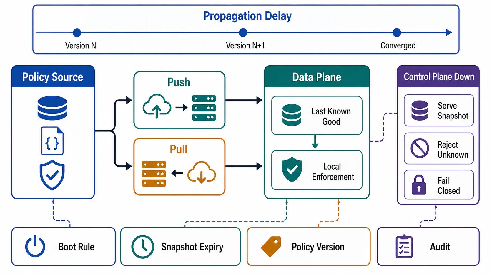

# Static Stability and Policy Distribution



## Abstract

Static stability is the property that the data plane keeps operating correctly on its existing state when the control plane is impaired — it continues doing what it was doing before the impairment, without needing to make new decisions ([AWS Builders' Library](https://aws.amazon.com/builders-library/static-stability-using-availability-zones/); [AWS fault-isolation whitepaper](https://docs.aws.amazon.com/whitepapers/latest/aws-fault-isolation-boundaries/static-stability.html)). This file makes static stability an engineered contract rather than an aspiration: last-known-good (LKG) semantics with a declared validity horizon, push versus pull distribution with explicit propagation-delay and convergence SLOs, snapshot atomicity and versioning rules, and the boot-from-cache requirement that closes the startup loophole identified in file 03 §5. The worked exemplar is Envoy's xDS protocol — the de facto standard for policy distribution to proxies — whose specification is explicit that configuration convergence is eventually consistent and that the data plane continues serving on its current configuration throughout ([xDS protocol](https://www.envoyproxy.io/docs/envoy/latest/api-docs/xds_protocol)).

The design stance: "control plane down" is not an emergency mode — it is a designed operating mode with its own contract, drills, and expiry. Cloudflare's November 2023 outage is the reference demonstration: the control plane and analytics were down for days while the data plane kept serving customer traffic on existing configuration ([postmortem](https://blog.cloudflare.com/post-mortem-on-cloudflare-control-plane-and-analytics-outage/)). That behavior was purchased in advance, by exactly the contracts this file specifies.

## 1. Last-Known-Good Semantics

LKG is a versioned snapshot with four declared properties:

```yaml
lkg_contract:
  snapshot_version:            # monotonic; data plane reports applied version
  atomicity: all_or_nothing    # a snapshot is applied fully or not at all
  validity_horizon:            # how long serving on this snapshot stays SAFE
  expiry_behavior:             # per policy class: keep_serving | degrade | fail_closed
  integrity: signed_or_checksummed
```

The validity horizon is the intellectually honest part. Policy staleness is not uniformly safe: a stale route table usually degrades gracefully; a stale revocation list is a security hole that grows with time. Each policy class therefore declares its staleness tolerance, which is the same bounded-staleness contract as Chapter 01 file 07 §3 applied to policy as data:

| Policy Class | Staleness Consequence | Expiry Behavior |
|---|---|---|
| Routing/weights | Suboptimal placement, slow drift | Keep serving indefinitely |
| Quotas/limits | Slightly wrong fairness | Keep serving; log divergence |
| Feature flags | Features frozen at last state | Keep serving; block new rollouts |
| Model/index pins | Serving yesterday's model | Keep serving; block version changes |
| Credentials/certs | Expiry is a hard deadline | Pre-fetched renewals must outlive the horizon; then degrade |
| Authorization policy | Revoked access persists | Bounded horizon, then fail closed for sensitive scopes |
| Kill switches | Cannot activate new ones | Dedicated channel with independent availability (file 06 §6) |

The credentials row sizes the horizon: static stability is only as long as the shortest-lived credential in the snapshot. A fleet whose certificates expire in 24 hours has a 24-hour static-stability budget, whatever the routing layer claims.

## 2. Push Versus Pull Distribution

```text
Figure 1. Distribution timelines. Push optimizes propagation
delay; pull bounds control-plane load and self-heals missed
updates. Production systems converge on pull-with-notify or
long-poll/stream hybrids (xDS is a gRPC stream: push semantics
over a client-initiated connection).

 PUSH                                    PULL (period P)
 cp ──change──► compile ──► fanout       cp ──change──► compile ──► serve
                              │                                      ▲
      t_prop = compile + fanout          data plane polls every P ───┘
      fast, but:                         t_prop ≤ P + compile
      - cp must track every consumer     - lost update self-heals ≤ P
      - lost push = divergence           - cp load = Θ(fleet/P), flat,
        until resync                       cacheable (CDN-able snapshots)
      - fanout spike on every change     - constant-work friendly (file 02 §3)
```

| Contract Field | Required Declaration |
|---|---|
| Mechanism | Push, pull, long-poll/stream, or hybrid — per policy class |
| Propagation SLO | p50/p99 time from policy commit to fleet-wide enforcement |
| Convergence metric | Fraction of fleet on latest version; exported and alerted |
| Ordering | Snapshot-atomic; cross-resource ordering rule (xDS ADS solves make-before-break sequencing by multiplexing resource types onto one stream) |
| Resync | Full-state resync path with jitter; survives control-plane restart without thundering herd |
| Consumer scale | Distribution layer sized for fleet size × restart storms, independent of policy store |

Two failure notes from the xDS experience. First, eventual consistency between related resources can transiently drop traffic (a route referencing a cluster the proxy hasn't received yet); the fix is sequencing — deliver dependencies before dependents — which is a *distribution-layer* obligation, not a consumer heuristic. Second, the distribution layer must be separable from the policy store: serving immutable versioned snapshots from cache/CDN keeps mass resync from becoming a consensus-store stampede.

## 3. Propagation Delay Is a Feature Boundary

Propagation delay bounds two different promises, and conflating them causes incidents:

```text
t_prop(p99)  bounds: how fast a GOOD change reaches the fleet
             -> product promise: "config takes effect within X"
t_detect + t_rollback + t_prop  bounds: how long a BAD change persists
             -> blast-radius promise of file 06
```

Making t_prop very small is therefore not unambiguously good: instant global propagation is exactly what made Cloudflare 2019 global in seconds. The design resolution is per-class speed tiers — slow, staged propagation for high-blast-radius policy (WAF rules, routing); a fast dedicated channel only for kill switches, which are pre-validated and shape-constrained. Speed is allocated by blast radius, not by engineering pride.

## 4. Failure Decision Table

When the data plane cannot obtain valid policy, behavior is decided per class, in advance:

| Condition | Behavior |
|---|---|
| Distribution unreachable, LKG within horizon | Serve on LKG; report stale version; no alarm to callers |
| Distribution unreachable, LKG past horizon | Per-class expiry behavior from §1 (serve / degrade / fail closed) |
| Snapshot received but fails validation/integrity | Reject snapshot, keep LKG, alert — never apply partially valid policy (stale-not-wrong, file 02 §5) |
| Snapshot valid but semantically suspicious (mass delta) | Apply within reconciler blast-radius cap; hold remainder for confirmation |
| No LKG at all (first boot, wiped disk) | §5 boot rule |

## 5. The Boot Rule

Startup is where static stability silently dies (file 03 §5). The rule:

```text
Every data-plane element persists its applied snapshot locally
(disk or image-baked) and MUST be able to boot to serving state
from that persisted LKG without any control-plane round trip.
The distribution layer is a freshness upgrade, not a boot dependency.
```

Consequences: snapshots are part of the deployment artifact story (a new AMI/container image ships with a recent-enough baked snapshot, or the node's previous snapshot survives restarts); crash-loops during a control-plane outage do not amputate the fleet; and the drill in [09 §2](09-verification-of-plane-separation.md) — cold-start a data-plane node with the distribution layer blocked — is the only accepted evidence, because this property regresses invisibly with every new "just fetch it at startup" convenience.

## 6. Approval Gates

| Gate | Evidence Required | Failure Condition |
|---|---|---|
| LKG gate | Versioned, atomic, integrity-checked snapshots with per-class validity horizons | Staleness tolerance is uniform or undeclared |
| Horizon gate | Static-stability budget computed from shortest-lived embedded credential/cert | Certificates expire before the claimed stability window |
| Distribution gate | Per-class mechanism, propagation SLO, convergence metric, sequenced dependencies, jittered resync | Distribution can stampede the policy store or apply resources out of order |
| Speed-tier gate | Propagation speed allocated by blast radius; only kill switches get the fast global channel | High-blast-radius policy propagates instantly |
| Decision-table gate | Every no-valid-policy condition maps to a §4 row per class | "Cannot fetch policy" behavior is discovered at runtime |
| Boot gate | Cold-start-without-control-plane drill passes | Startup dependency on the distribution layer |

## Output

The output of this file is a policy-distribution contract per policy class — mechanism, propagation SLO, convergence metric, LKG horizon, expiry behavior, and boot independence — under which "control plane down" is a rehearsed operating mode with a computed time budget rather than an outage.

## References

- [AWS Builders' Library — Static Stability Using Availability Zones](https://aws.amazon.com/builders-library/static-stability-using-availability-zones/)
- [AWS Fault Isolation Boundaries whitepaper — Static stability](https://docs.aws.amazon.com/whitepapers/latest/aws-fault-isolation-boundaries/static-stability.html)
- [Envoy — xDS REST and gRPC protocol](https://www.envoyproxy.io/docs/envoy/latest/api-docs/xds_protocol)
- [Cloudflare — Post-mortem on the control plane and analytics outage, November 2023](https://blog.cloudflare.com/post-mortem-on-cloudflare-control-plane-and-analytics-outage/)
- [AWS Builders' Library — Reliability, Constant Work, and a Good Cup of Coffee](https://aws.amazon.com/builders-library/reliability-and-constant-work/)
