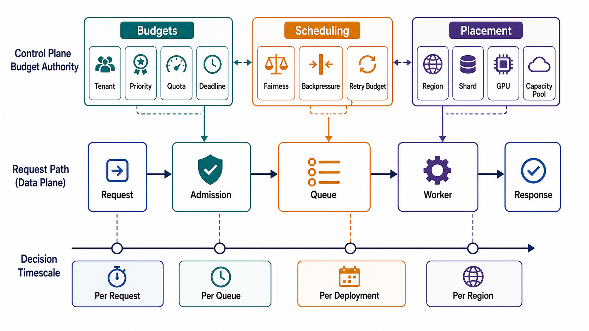

# Admission, Scheduling, and Placement



## Abstract

Admission, scheduling, and placement are the three decisions through which the control plane governs data-plane resources, and they differ by exactly one variable: decision latency. Admission must answer inside the request (data-plane enforcement of control-plane-distributed budgets); scheduling answers at queue-and-batch timescale; placement and autoscaling answer at reconciliation timescale. This file fixes the decision-latency ladder, assigns each decision an owner and a distribution contract, and works the hardest current instance — LLM inference routing, where placement quality is measured in KV-cache reuse and the routing layer has become a control plane in its own right ([NVIDIA Dynamo's](https://developer.nvidia.com/blog/introducing-nvidia-dynamo-a-low-latency-distributed-inference-framework-for-scaling-reasoning-ai-models/) KV-cache-aware router and SLA-based planner; [llm-d's](https://llm-d.ai/) prefix-cache-aware scoring in the Kubernetes Gateway API Inference Extension). The scheduling lineage is [Borg](https://research.google/pubs/large-scale-cluster-management-at-google-with-borg/): admission control, task packing, and placement as control-plane functions that buy utilization while data-plane isolation protects latency.

The organizing rule: a decision belongs at the *slowest* timescale that still satisfies its SLO. Every decision pushed faster than necessary buys latency pressure and hot-path coupling; every decision pushed slower than its SLO allows buys staleness incidents.

## 1. The Decision-Timescale Ladder

```text
Figure 1. Decisions ordered by required latency. The horizontal
line is the plane boundary: everything above it executes in the
data plane against distributed parameters; everything below it
executes in the control plane and distributes its results.

  timescale        decision                        executes in
  ─────────        ────────────────────────────    ───────────
  ns–µs            batch composition slot pick     data plane
  µs–ms            admission (quota, cost, prio)   data plane   ← enforces
  µs–ms            replica pick for THIS request   data plane     CP budgets
  ─────────────────── plane boundary ─────────────────────────
  100ms–sec        queue scheduling order,         control plane
                   batch policy parameters          (fast loop)
  sec–min          placement: shard→host,          control plane
                   model→pool, partition→broker     (reconciler)
  min–hours        autoscaling, capacity shifts    control plane
                   (planner)
  hours–days       capacity planning, pool sizing  management plane
```

| Decision | Owner | Distribution Artifact | Wrong-Timescale Failure |
|---|---|---|---|
| Admission | Data-plane enforcement of control-plane budgets | Per-class/tenant cost budgets, priority order | In CP per request: hot-path coupling; in DP without CP envelope: unaudited policy (file 03 §4) |
| Per-request replica pick | Data plane, from local view | Healthy-endpoint sets, weights, load hints | Registry query per request: file 03 Figure 1 illegal call |
| Queue/batch scheduling | Control-plane fast loop or DP scheduler with CP parameters | Scheduling policy, batch limits | Human-timescale: queue mixing incidents (Ch01 file 02 §6) |
| Placement | Control-plane reconciler | Assignment maps | Per-request placement: thrash; static placement: hotspots |
| Autoscaling | Control-plane planner | Desired replica counts | Reactive-only under LLM load: §4 |

## 2. Admission: Control-Plane Budgets, Data-Plane Enforcement

Chapter 01 file 08 §5 fixed *what* admission checks (cost, not count; deadline sufficiency; priority at current overload stage). The plane split fixes *where*: the predicate executes in the data plane against locally distributed budgets, because admission called out to a quota service per request would put a Θ(rate-of-change) service on the Θ(request-rate) path.

The residual design problem is distributed counting: per-tenant budgets enforced by N independent enforcement points require either partitioned budgets (each point owns a share — exact, but skew-sensitive), asynchronously reconciled local counters (bounded overshoot — the common choice), or a synchronous counting service (exact, hot-path coupling — rejected except for low-rate, high-value operations). The dossier must name the choice and its overshoot bound; "the rate limiter handles it" is not an answer.

## 3. Scheduling and Placement

Placement is the control plane's optimization surface: it amortizes an expensive global decision (bin-packing shards, models, partitions onto hardware) across the many requests that then ride it. Borg's demonstration still defines the trade: admission control plus packing plus overcommit bought fleet-scale utilization, while process-level isolation kept latency-sensitive tasks safe from batch neighbors ([Verma et al.](https://research.google/pubs/large-scale-cluster-management-at-google-with-borg/)) — the same priority/isolation structure Chapter 01 file 03 §5 requires per tenant class.

Placement contract fields: objective (pack for utilization vs spread for fault isolation — declared per workload class), constraint set (affinity, anti-affinity across failure domains, hardware requirements), churn budget (max moves per interval — placement that reoptimizes freely destroys cache locality and connection warmth), and drain protocol (planned moves are graceful; only failures are abrupt).

## 4. The Inference Instance

LLM serving is where this file's abstractions currently earn their keep, because placement quality is measured in *state reuse*, not just load balance:

```text
Figure 2. Inference routing planes. The router is data plane
(per-request pick from local state); the planner is control
plane (SLA-driven pool reshaping); KV-cache state feeds both.

              ┌─────────────────────────────────────┐
              │ CONTROL PLANE                        │
              │  planner: TTFT/TPOT SLO monitor,     │
              │  prefill:decode pool ratio,          │
              │  autoscaling, model pinning          │
              └───────┬──────────────▲───────────────┘
              pool maps,│            │ KV occupancy, queue age,
              route     │            │ cache-hit telemetry
              policy    ▼            │
   request ─► ┌─────────────────────┴───┐    ┌──────────────────┐
              │ router (DATA PLANE):     │───►│ prefill pool     │
              │  score replicas by       │    ├──────────────────┤
              │  prefix/KV overlap ×     │───►│ decode pool      │
              │  load; pick locally      │    │ (KV transfer via │
              └──────────────────────────┘    │  NIXL-class link)│
                                              └──────────────────┘
```

Two properties make this the chapter's stress test. First, the router's scoring state (which worker holds which prefix's KV blocks) is *data-plane telemetry aggregated at control-plane cadence but consumed per request* — Dynamo's router computes overlap scores between incoming requests and cached KV blocks across the fleet to minimize recomputation ([NVIDIA](https://developer.nvidia.com/blog/introducing-nvidia-dynamo-a-low-latency-distributed-inference-framework-for-scaling-reasoning-ai-models/)); llm-d scores decode pods by prefix-match length inside the gateway ([llm-d](https://llm-d.ai/)). The legality rule of file 03 holds only because the score table is a locally held snapshot, refreshed asynchronously — a router that queried worker caches synchronously per request would re-couple the planes at the worst possible spot. Staleness here costs performance (a missed reuse), not correctness, which is exactly the bounded-staleness trade the file 04 contract exists to price. Second, the planner's decision — the prefill:decode pool ratio under TTFT and TPOT SLOs ([DistServe's](https://haoailab.com/blogs/distserve-retro/) goodput framing) — is a placement decision whose wrong answer manifests as SLO violation under load shift, so reactive autoscaling is insufficient: decode capacity must exist *before* the decode demand that prefill admission has already committed. Admission, placement, and autoscaling stop being independent knobs; the planner owns their joint constraint.

Agent workloads add one admission twist, resolved by the same ladder: an agent episode is a multi-request commitment (steps × tokens × tool calls — the budgets of Ch01 file 03 §2). Admitting an episode is a control-plane-priced decision (is there budget for the whole trajectory?) enforced at data-plane speed per step; killing a mid-flight episode is the shedding decision of Chapter 01 file 08 applied at episode granularity.

## 5. Approval Gates

| Gate | Evidence Required | Failure Condition |
|---|---|---|
| Ladder gate | Every admission/scheduling/placement decision has a declared timescale, owner, and distribution artifact | A decision executes faster than its SLO requires, on the hot path |
| Counting gate | Distributed quota enforcement names its mechanism and overshoot bound | Per-tenant budgets assume a synchronous counter that isn't provisioned |
| Placement gate | Objective, constraints, churn budget, and drain protocol are declared | Placement thrashes locality or reoptimizes without a move budget |
| State-reuse gate | Locality-aware routing consumes asynchronous snapshots; staleness cost is performance-only | Router makes synchronous per-request state queries, or stale scores can cause correctness errors |
| Planner gate | Autoscaling for coupled pools (prefill/decode) is SLO-driven and anticipatory, not purely reactive | Admission can commit downstream work the planner hasn't provisioned |

## Output

The output of this file is a decision-latency ladder with an owner, distribution artifact, and staleness price for every admission, scheduling, placement, and autoscaling decision — including the inference router/planner split — such that no decision executes faster than its SLO requires or slower than its staleness budget allows.

## References

- [Verma et al., "Large-scale cluster management at Google with Borg," EuroSys 2015](https://research.google/pubs/large-scale-cluster-management-at-google-with-borg/)
- [NVIDIA — Introducing NVIDIA Dynamo (KV-cache-aware routing, SLA-based planner)](https://developer.nvidia.com/blog/introducing-nvidia-dynamo-a-low-latency-distributed-inference-framework-for-scaling-reasoning-ai-models/)
- [llm-d — Kubernetes-native distributed inference (prefix-cache-aware routing)](https://llm-d.ai/)
- [DistServe retrospective — goodput under TTFT/TPOT SLOs](https://haoailab.com/blogs/distserve-retro/)
- [Google SRE Book — Handling Overload (criticality-based admission)](https://sre.google/sre-book/handling-overload/)
- [Uber Engineering — Cadence Multi-Tenant Task Processing (tenant-aware scheduling)](https://www.uber.com/us/en/blog/cadence-multi-tenant-task-processing/)
