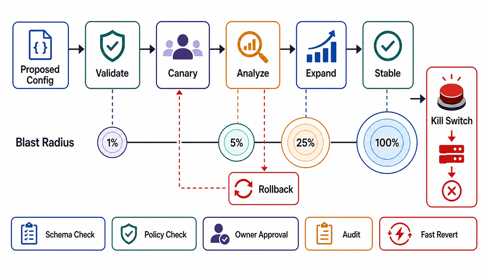

# Configuration Rollout and Blast Radius



## Abstract

Configuration is code with weaker testing, faster deployment, and — through the distribution machinery of file 04 — global reach. That combination makes control-plane mutation the highest-blast-radius change class in a production system, and the empirical record agrees: the largest self-inflicted outages of the last decade were config and policy pushes, not code deploys ([Cloudflare 2019](https://blog.cloudflare.com/details-of-the-cloudflare-outage-on-july-2-2019/): one WAF rule, global CPU exhaustion in seconds; [Meta 2021](https://engineering.fb.com/2021/10/05/networking-traffic/outage-details/): one maintenance command, six hours of global absence). This file specifies the rollout discipline that makes control-plane mutation survivable: validation as a pipeline rather than a review step, staged rollout with automatic analysis and abort ([Google SRE Workbook, canarying](https://sre.google/workbook/canarying-releases/)), blast-radius accounting per stage, rollback as a first-class versioned operation, and the kill-switch exception engineered separately from everything else.

The asymmetry from file 01 §3, restated as the operating premise: a bad config is a *correlated* failure — every consumer breaks the same way at distribution speed. Every mechanism in this file exists to break that correlation: stages break it in space, bake time breaks it in time, and automatic analysis breaks the dependency on a human noticing.

## 1. Why Config Outruns Code

| Property | Code Change | Config/Policy Change |
|---|---|---|
| Test coverage | CI, typed languages, review culture | Often schema-only; semantics untested against production traffic |
| Deployment speed | Staged over hours by default | Distribution layer: seconds to global, by design |
| Rollout tooling | Mature (deploy pipelines, canaries) | Frequently a side door: admin API, direct store write |
| Perceived risk | High — gets ceremony | Low — "it's just a config change" |
| Actual blast radius | One service version | Every consumer of the policy, simultaneously |

The Cloudflare 2019 analysis is candid on precisely this gap: the WAF rule pipeline was built for speed of response to emerging threats and pushed globally in seconds, bypassing the staged rollout that code received — the emergency path had become the everyday path ([postmortem](https://blog.cloudflare.com/details-of-the-cloudflare-outage-on-july-2-2019/)). The review conclusion generalizes: *every* mutation path into the policy store gets the same gates — there is no such thing as a low-ceremony config change to a high-blast-radius policy class, and side doors (direct store writes, break-glass admin endpoints) are inventoried and gated too.

## 2. Validation Pipeline

Validation is layered so that each layer catches what the previous one cannot express:

```text
Figure 1. Config validation pipeline. Each layer rejects a class
of defect; the last layers execute against real traffic because
some defects (resource exhaustion, semantic wrongness) only
manifest under production inputs.

  authoring
     │
     ├─ 1. schema/type check        (shape defects)
     ├─ 2. semantic lint            (references resolve, bounds sane,
     │                               regex complexity budget — the
     │                               2019 defect was catchable here)
     ├─ 3. policy simulation        (replay sampled production traffic
     │                               against candidate policy, offline)
     ├─ 4. resource-cost check      (CPU/memory budget per evaluation,
     │                               file 03 §3 bounds applied to the
     │                               policy itself)
     ├─ 5. shadow evaluation        (evaluate-but-don't-enforce on
     │                               live traffic; diff decisions)
     └─ 6. staged rollout           (§3 — the only path to 100%)
```

Layers 3 and 5 are the ones organizations skip and regret: schema-valid, lint-clean policy that is semantically wrong (blocks the wrong tenants, prices the wrong quota) is only visible against real traffic distributions. Shadow evaluation — run both old and new policy, enforce old, diff outcomes — is the config analogue of the migration shadow-execution standard from Chapter 01 (README standard 13).

## 3. Staged Rollout with Automatic Analysis

```text
Figure 2. Rollout stage machine. Every arrow to the right passes
an analysis gate with bake time; any gate failure triggers
automatic rollback to the last good version. Stage sizes grow
roughly geometrically; blast radius is bounded by the current
stage until the next gate passes.

  commit ─► canary ──► stage 1 ──► stage 2 ──► stage 3 ──► global
            (1 cell/    (~1–5%)     (~25%)      (~50%)      (100%)
             host set)
     │         │bake        │bake       │bake       │bake
     │         ▼            ▼           ▼           ▼
     │      analysis     analysis    analysis    analysis
     │      gate         gate        gate        gate
     │         │            │           │           │
     └────◄────┴────────◄───┴───────◄───┴───────◄───┘
              automatic rollback on gate failure
```

Contract per stage:

| Field | Requirement |
|---|---|
| Population | Defined by failure-domain boundary (cell, AZ, shard set) — not by "random 5%" that spans every domain at once |
| Bake time | Long enough for the SLI window of the analysis gate; per policy class |
| Analysis gate | Automated comparison of canary vs control on error rate, latency percentiles, resource use, and policy-specific SLIs — the SRE Workbook's canary evaluation, not human dashboard-watching ([canarying releases](https://sre.google/workbook/canarying-releases/)) |
| Abort authority | Automatic on gate failure; any operator can also abort; nobody can *skip* a gate without break-glass audit |
| Progression | Explicit; no auto-advance without a passed gate |

Two structural notes. First, stage populations must respect failure domains: a canary spread thinly across all cells tests nothing about containment — Chapter 01's blast-radius framing (file 03 §3.2) applies to rollout populations exactly as to tenants. Second, the analysis gate needs a *control* population, not just canary telemetry: comparing canary against the fleet average confounds the change with time-of-day and traffic mix; the workbook's method is canary-versus-control on matched populations.

## 4. Rollback Contract

Rollback is a versioned control-plane operation with its own guarantees, not "push the old file again":

- **Target**: last-known-good *version*, pinned at rollout start — not "whatever is in HEAD," which may contain the next unvetted change.
- **Speed**: rollback distribution uses the fast tier; it is the one change class pre-validated by construction (it ran in production before).
- **Completeness**: rollback propagation is confirmed by the file 04 convergence metric — a rollback that 3% of the fleet never received is a new incident.
- **Compatibility**: policy schema changes must be rollback-safe one version back (the Chapter 01 file 04 §6 compatibility discipline applied to internal policy).
- **State**: if the bad config caused durable state changes (queued work, cache poisoning), rollback triggers the reconciliation/invalidation paths of Chapter 01 file 07 — config rollback alone does not un-poison a cache.

## 5. Blast-Radius Accounting

Each policy class carries a computed worst-case blast radius, which is what the §3 stage sizes bound:

```text
blast_radius(change) = consumers(policy_class)
                     × failure_severity(worst plausible defect)
                     × persistence(t_detect + t_rollback + t_prop)
```

The persistence term is why detection investment is rollout investment: Cloudflare 2019's global impact lasted 27 minutes because detection was fast and rollback path was known; Meta 2021 persisted for hours because the management plane needed to execute the rollback was itself down (file 01 §1) — the same defect class, three orders of magnitude apart in persistence, separated entirely by the recovery path's independence.

## 6. Kill Switches: The Engineered Exception

Kill switches invert every rule above — global, instant, no staging — which is precisely why they are safe only as a *separately engineered* class:

| Property | Requirement |
|---|---|
| Shape | Boolean or enum disable of a pre-enumerated capability; never free-form config |
| Pre-validation | The off-state is tested in CI and drilled in production (dark launches of the disable path) |
| Distribution | Dedicated fast channel, independent of the general distribution layer where feasible |
| Authority | Two-person or role-gated activation for high-impact switches; every activation audited |
| Inventory | Enumerated, owned, and periodically exercised — an untested kill switch is a hypothesis ([SRE on launch defenses](https://sre.google/sre-book/reliable-product-launches/)) |

Free-form config pushed fast "because it's an emergency" is not a kill switch; it is the 2019 incident's exact mechanism. The discipline is to make the *pre-built* off-ramps fast, so nobody needs a fast on-ramp for novel changes under pressure.

## 7. Approval Gates

| Gate | Evidence Required | Failure Condition |
|---|---|---|
| Path-inventory gate | Every mutation path into the policy store is enumerated and gated, including admin APIs and break-glass | A side door bypasses the pipeline |
| Validation gate | Layers 1–5 of §2 exist; policy-evaluation resource budgets are enforced | Schema validation is the only defense; a policy object can buy unbounded evaluation cost |
| Staging gate | Stages align to failure domains, gates are automated canary-vs-control, no auto-advance without a pass | Rollout stages are cosmetic percentages with human-judgment gates |
| Rollback gate | Versioned rollback to pinned LKG, fast-tier distribution, convergence-confirmed, schema rollback-safe | Rollback is re-authoring the old config by hand |
| Persistence gate | t_detect + t_rollback + t_prop is measured per policy class; recovery path is independent of the planes being recovered | Recovery depends on infrastructure the bad change can take down |
| Kill-switch gate | Switches are enumerated, shape-constrained, pre-validated, drilled, and audited | "Emergency config push" is the de facto kill switch |

## Output

The output of this file is a rollout contract for every control-plane mutation path: layered validation, failure-domain-aligned stages with automated analysis gates, versioned convergence-confirmed rollback, computed blast-radius budgets, and a separately engineered kill-switch class — such that the speed of any change is allocated by its blast radius, never by its urgency.

## References

- [Cloudflare — Details of the Cloudflare outage on July 2, 2019](https://blog.cloudflare.com/details-of-the-cloudflare-outage-on-july-2-2019/)
- [Meta — More details about the October 4, 2021 outage](https://engineering.fb.com/2021/10/05/networking-traffic/outage-details/)
- [Google SRE Workbook — Canarying Releases](https://sre.google/workbook/canarying-releases/)
- [Google SRE Book — Reliable Product Launches at Scale](https://sre.google/sre-book/reliable-product-launches/)
- [Google SRE Book — Release Engineering](https://sre.google/sre-book/release-engineering/)
