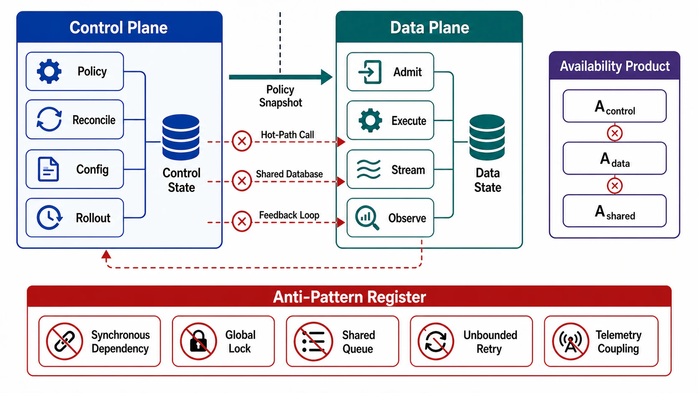

# Coupled Failure Domains and Anti-Patterns



## Abstract

Plane separation fails quantitatively before it fails visibly: every undeclared coupling between planes multiplies availabilities, inverts dependency directions, or creates feedback loops that convert local faults into global ones. This file provides the accounting — serial-dependency availability multiplication for hot-path control-plane calls, the circular-dependency audit that catches control planes depending on the data planes they control, and an anti-pattern register in which each entry is anchored to a named production incident rather than a hypothetical. The circularity analysis generalizes the defining incident of the class: Meta's October 2021 outage, in which the DNS data plane's health-withdrawal logic depended on backbone reachability, the control plane's fix path depended on the network being fixed, and the management plane's tooling and physical access depended on both ([Meta postmortem](https://engineering.fb.com/2021/10/05/networking-traffic/outage-details/)).

Chapter 01 file 05 §5 declared the shared-resource table at boundary level. This file adds what that table could not: the math that prices a coupling, the direction rule that detects inverted dependencies, and the incident evidence that makes each anti-pattern a checked box rather than an argument.

## 1. The Dependency Direction Rule

The legal dependency graph between planes is a partial order:

```text
Figure 1. Legal (solid) and illegal (crossed) dependency
directions. Data flows up as reports; authority flows down as
policy. Any edge pointing the wrong way is a coupling finding.

        ┌──────────────────┐
        │ MANAGEMENT PLANE │  may depend on: nothing it manages
        └────────┬─────────┘  (out-of-band access, indep. auth)
          policy │      ▲ X illegal: mgmt tooling behind the
          deploys▼      │   data plane it must repair (Meta '21)
        ┌──────────────────┐
        │ CONTROL PLANE    │  may depend on: its own store,
        └────────┬─────────┘  mgmt plane for deploys
   policy        │      ▲ X illegal: reconciler reads its
   snapshots     ▼      │   desired state THROUGH the data
        ┌──────────────────┐  plane it is reconciling
        │ DATA PLANE       │  may depend on: distributed
        └──────────────────┘  snapshots (async), DP peers
```

Reports flowing upward (health, load, applied versions) are data, not dependencies — the control plane must tolerate their absence (pause convergence, file 02 §5), whereas the data plane must *not* tolerate policy absence beyond its LKG horizon (file 04 §1). That asymmetry in tolerable absence is what makes the direction rule checkable: for each edge, ask "what happens to the consumer when this edge is severed for an hour?" If the answer for a downward edge is "data plane halts," static stability is broken; if the answer for an upward edge is "control plane acts on stale observations," the stale-not-wrong bias is broken.

## 2. Availability Multiplication

The price of a synchronous hot-path dependency is multiplicative:

```text
A_request = Π A_i   over every component that must answer
            synchronously for the request to succeed

worked example:
  data plane alone:            99.95%
  + live policy-store read:    × 99.9%   = 99.85%
  + live flag-service call:    × 99.9%   = 99.75%
  -> error budget consumed by architecture before any code runs:
     0.25% ≈ 5× the original 0.05% budget

with static stability (async snapshots, LKG):
  A_request = A_data_plane = 99.95%
  A_freshness = A_control_plane   — a different, cheaper promise
```

The last two lines are the entire economic argument of file 04 in two equations: decoupling does not make the control plane more available; it moves the control plane's unavailability out of the *request* SLO and into the *freshness* SLO, where its price is bounded staleness instead of failed requests. The review requires this product computed for every request class, using the dependency sets declared in file 03 §5 — and it requires the same computation for the *recovery* path, which is where Meta 2021 concentrated its damage.

## 3. Feedback Loops Between Planes

Couplings that are not dependencies also break separation: load in one plane inducing load in the other creates the amplification loops of Chapter 01 file 08 §1, now spanning planes.

| Loop | Mechanism | Break |
|---|---|---|
| Incident-driven control-plane stampede | Data-plane faults → mass refetch/re-registration → control plane saturates → staler policy → more faults | Constant-cadence reporting and pull-with-jitter (files 02 §4, 04 §2); control plane provisioned for correlated peak |
| Autoscaler thrash | Latency spike → scale-out → cold caches raise latency → further scale-out; or scale-in during recovery → relapse | Hysteresis and cooldowns in the planner; recovery stage semantics (Ch01 file 08 §4) |
| Health-check amplification | Overloaded node fails health checks → removed → survivors more overloaded → more removals (the classic metastable cascade) | Minimum-fleet floors; brownout states between healthy and removed; differential health per Ch01 file 08 §2 |
| Reconciler fighting the shedder | Overload triggers shedding; reconciler "repairs" the shed state back | Overload stage is an input to the reconciler; planes share one authority for degraded modes |

The health-check row deserves the emphasis: a control plane that removes capacity in response to overload signals is a *load-concentrating* controller unless floored — the DNS variant of exactly this (health-based route withdrawal under a false-positive health signal) is what turned Meta's backbone fault into a global DNS disappearance ([postmortem](https://engineering.fb.com/2021/10/05/networking-traffic/outage-details/)).

## 4. Anti-Pattern Register

Each entry names the defect, the incident class that proves it, and the required repair.

| # | Anti-Pattern | Evidence / Incident Shape | Required Repair |
|---|---|---|---|
| 1 | Hot-path policy-store read | §2 math; any etcd/DB-backed per-request lookup | Async snapshot distribution + LKG (file 04) |
| 2 | Control plane behind the data plane it controls | Meta 2021: internal tooling, auth, and DNS rode the network being repaired | Direction audit (§1); out-of-band management access |
| 3 | Unstaged global policy push | Cloudflare 2019: WAF rule to all edges in seconds | Rollout stage machine with automated gates (file 06 §3) |
| 4 | Health-withdrawal without floors | Meta 2021 DNS; generic metastable cascades | Minimum-capacity floors, brownout states |
| 5 | Shared store for policy and payload | Ch01 file 05 §5 row 1: data-plane overload starves policy reads and rollback writes | Separate stores, or declared coupling with priority + cached defaults |
| 6 | Emergency path as everyday path | Cloudflare 2019: the fast global channel was the *normal* WAF deploy path | Speed tiers by blast radius; kill switches as the only fast class (file 06 §6) |
| 7 | Control plane sized for steady state | Failover storms: first AZ loss saturates the placement service | Provision for incident-correlated peak (file 02 §4) |
| 8 | Recovery path through the failed plane | Cloudflare Nov 2023: some recovery tooling and analytics depended on the failed control-plane facility; Meta 2021 physical access | Recovery-path availability product computed independently (§2) |
| 9 | Two authorities for one policy | Reconciler vs autoscaler vs operator each "correcting" the same field; last writer wins silently | Single-writer rule per policy field; others advise through it |
| 10 | Data plane originating policy | Local "temporary" quota exceptions accreting into shadow policy | Authority gate of file 03 §4; envelopes distributed, decisions audited |

## 5. Coupled-Domain Register Contract

Every coupling that survives review — and some should, because full separation has real costs (extra hops, extra fleets, staleness) — is registered, priced, and drilled:

```yaml
coupled_domain:
  name:
  planes_coupled:            # data<->control, control<->mgmt, ...
  mechanism:                 # shared store | sync call | shared pool | feedback loop
  direction_violation:       # yes/no per §1; justification if yes
  availability_price:        # §2 product delta
  latency_price:             # hot-path p99 contribution
  failure_scenario:          # what breaks when the coupled resource fails
  mitigation:                # priority, bulkhead, cached default, floor
  drill:                     # the file 09 exercise that proves the mitigation
  accepted_by:               # named owner; expiry date for the acceptance
```

The expiry field is deliberate: coupling acceptances rot as fleets grow — a coupling priced at 1,000 RPS is unpriced at 100,000 RPS. Acceptance is a lease, not a deed.

## 6. Approval Gates

| Gate | Evidence Required | Failure Condition |
|---|---|---|
| Direction gate | Full inter-plane dependency graph audited against Figure 1; every downward severance answer is "LKG within horizon" | Any plane halts when a plane it should not depend on fails |
| Multiplication gate | Availability product computed per request class AND per recovery path | Hot-path or recovery-path dependency set is undeclared |
| Loop gate | Each §3 feedback loop is analyzed with its break mechanism named | Load in one plane can amplify load in the other without a damper |
| Register gate | Every surviving coupling has a register entry with price, mitigation, drill, owner, and expiry | A coupling is "known" but unpriced or undrilled |
| Single-writer gate | Every policy field has exactly one writing authority | Two controllers can fight over the same field |

## Output

The output of this file is a priced, audited coupling register: a dependency graph with no illegal directions, an availability product per request and recovery path, a break mechanism per feedback loop, and a named owner with an expiry date for every coupling the architecture chooses to keep.

## References

- [Meta — More details about the October 4, 2021 outage](https://engineering.fb.com/2021/10/05/networking-traffic/outage-details/)
- [Cloudflare — Details of the Cloudflare outage on July 2, 2019](https://blog.cloudflare.com/details-of-the-cloudflare-outage-on-july-2-2019/)
- [Cloudflare — Post-mortem on the control plane and analytics outage, November 2023](https://blog.cloudflare.com/post-mortem-on-cloudflare-control-plane-and-analytics-outage/)
- [Bronson et al., "Metastable Failures in Distributed Systems," HotOS 2021](https://sigops.org/s/conferences/hotos/2021/papers/hotos21-s11-bronson.pdf)
- [AWS Builders' Library — Static Stability Using Availability Zones](https://aws.amazon.com/builders-library/static-stability-using-availability-zones/)
