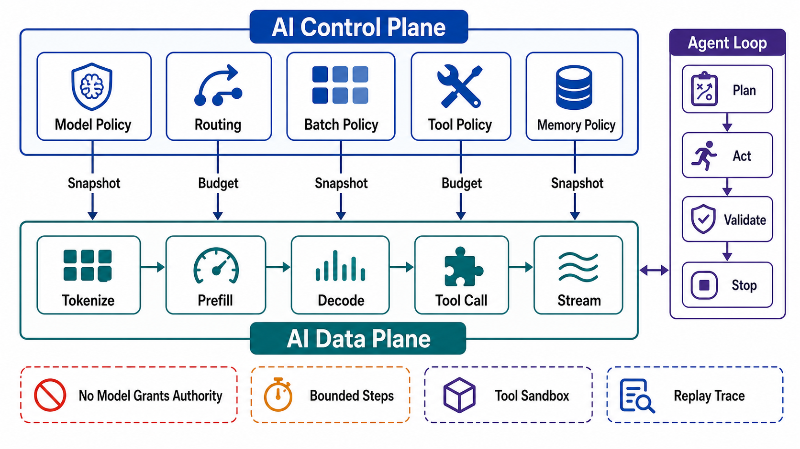

# Plane Separation in AI Serving and Agents



## Abstract

AI-native systems are where plane separation is currently rediscovered under pressure, because both of their hot paths — token generation and agent tool execution — are expensive enough that any control-plane leakage onto them is immediately measurable in dollars and TTFT. This file maps the two dominant AI workload shapes onto the chapter's model. For inference serving: model registry, router policy, SLA planner, and batch parameters are control plane; tokenize/prefill/decode/stream are data plane; and disaggregated serving ([DistServe](https://haoailab.com/blogs/distserve-retro/), [NVIDIA Dynamo](https://developer.nvidia.com/blog/introducing-nvidia-dynamo-a-low-latency-distributed-inference-framework-for-scaling-reasoning-ai-models/), [llm-d](https://llm-d.ai/)) is the plane discipline applied recursively *inside* the data plane. For agent systems: the orchestrator, tool-permission policy, and episode budgets are control plane; model calls and tool execution are data plane; and durable-execution engines ([Temporal](https://docs.temporal.io/workflow-execution), [Cloudflare Workflows](https://blog.cloudflare.com/dynamic-workflows/)) supply the control-plane journal that makes agent trajectories replayable. The security consequence is inherited from Chapter 01 file 10 and sharpened here: the model is a data-plane component that emits *suggestions*; anything that lets model output mutate control-plane state without passing the file 06 rollout gates has given an untrusted text generator write access to policy.

## 1. Inference Serving Mapped Onto Planes

```text
Figure 1. Inference serving plane map. Note the recursive split
inside the data plane: prefill and decode are separately pooled,
scheduled, and scaled — plane discipline applied to phases of a
single request.

 ┌── MANAGEMENT PLANE ─────────────────────────────────────────┐
 │ model release pipeline · eval/regression gates · capacity   │
 └──────────────┬──────────────────────────────────────────────┘
                │ pinned model versions, pool budgets
 ┌── CONTROL PLANE ────────────────────────────────────────────┐
 │ model registry (versions, compat metadata)                  │
 │ SLA planner: prefill:decode ratio, autoscaling (TTFT/TPOT)  │
 │ router policy: KV/prefix-overlap scoring params, weights    │
 │ batch policy: max batch, chunked-prefill params, token caps │
 └──────┬────────────────────────────────▲─────────────────────┘
        │ snapshots (async)              │ KV occupancy, queue age,
        ▼                                │ cache-hit rate, SLO burn
 ┌── DATA PLANE ──────────────────────────────────────────────┐
 │ router: per-request worker pick from LOCAL score table     │
 │   ├──► prefill pool: tokenize + prefill (compute-bound)    │
 │   │        └── KV transfer (NIXL-class interconnect)       │
 │   └──► decode pool: decode + stream (bandwidth-bound)      │
 │ admission: token-denominated, per class/tenant (Ch01 f08)  │
 └────────────────────────────────────────────────────────────┘
```

The mapping resolves the questions that recur in every serving design review:

| Decision | Plane | Rationale |
|---|---|---|
| Which model version serves | Control | Pinned artifact with rollout gates; a "latest" tag is an unstaged global config push (file 06 anti-pattern) |
| Which worker serves *this* request | Data | Per-request pick from an async-refreshed local score table (file 05 §4); synchronous fleet queries are the file 03 illegal call |
| Batch composition this iteration | Data | Sub-millisecond decision inside the scheduler loop, parameterized by control-plane batch policy |
| Prefill:decode pool ratio | Control | Reconciliation-timescale placement under goodput objectives; wrong answers surface as SLO burn, not errors |
| Context/token caps, KV budgets | Control-authored, data-enforced | The admission envelope pattern of file 05 §2 |
| KV-cache contents | Data (ephemeral/derived state) | Performance state, never policy; staleness of the router's *view* of it costs a cache miss, not correctness (file 05 §4) |

Model version deserves the emphasis it gets in the table: a model artifact is the highest-blast-radius config object in the system — it changes the behavior of every response simultaneously, and its regressions are semantic rather than crashing, so the file 06 analysis gates must include quality/groundedness SLIs (Chapter 01 file 09 §2), not just latency and error rate. Hosted-model providers move this object *outside* the boundary entirely, which is why Chapter 01 file 06 §3 requires version pinning and provider-update regression evidence as a dependency contract.

## 2. Disaggregation as Recursive Plane Separation

Prefill/decode disaggregation is worth naming as an instance of the chapter's law rather than a serving trick: two phases with different scaling laws (compute-bound vs memory-bandwidth-bound), different SLOs (TTFT vs TPOT), and different failure/scaling postures were separated so each could be provisioned, scheduled, and scaled on its own curve — exactly the argument of file 01 §2 applied inside one request. The KV transfer between pools is the resulting boundary crossing, and it inherits the full Chapter 01 file 06 crossing contract: bounded latency, failure mapping (decode-pool loss mid-request), and observability. Production systems price this crossing explicitly — Dynamo's NIXL transfer layer and Mooncake's KV-centric scheduling exist because the crossing cost decides whether disaggregation wins ([DistServe retrospective](https://haoailab.com/blogs/distserve-retro/); [Mooncake](https://docs.jarvislabs.ai/blog/llm-optimization-disaggregated-prefill-decode)).

## 3. Agent Systems Mapped Onto Planes

```text
Figure 2. Agent system plane map. The orchestrator journals and
budgets; the model proposes; tools execute behind PEPs. Model
output NEVER writes control-plane state directly.

 ┌── CONTROL PLANE ────────────────────────────────────────────┐
 │ episode admission: step/token/tool/cost budgets (Ch01 f03)  │
 │ tool registry: allowlists, permission scopes, timeouts      │
 │ orchestration journal: durable step log, replay (Temporal-  │
 │ class); approval workflow for high-consequence actions      │
 └──────┬────────────────────────────────▲─────────────────────┘
        │ budgets, allowlists,           │ step outcomes, budget
        │ approval decisions             │ consumption, violations
        ▼                                │
 ┌── DATA PLANE ──────────────────────────────────────────────┐
 │ agent loop: context assembly ─► model call ─► output       │
 │ validation ─► tool call (behind PEP, Ch01 f10) ─► observe  │
 │   · model output = untrusted suggestion                    │
 │   · tool result = ingress (validated, classified)          │
 │   · every side effect: idempotent, journaled, budgeted     │
 └────────────────────────────────────────────────────────────┘
```

| Decision | Plane | Rationale |
|---|---|---|
| Which tools exist, with which scopes | Control | Policy objects with rollout gates and audit; runtime tool grants are anti-pattern 10 of file 07 |
| Whether to admit an episode | Control-priced, data-enforced | Multi-request commitment priced against trajectory budget (file 05 §4) |
| Which tool to call *next* | Data | The model's proposal, executed only through validation + PEP |
| Whether a step may retry / the episode may continue | Control (journal + budget) | The orchestrator owns loop bounds; a model that decides its own retry policy is a retry storm with intent |
| Human approval for high-consequence actions | Control | An approval is a policy decision; it is journaled, not inferred from conversation |

Two failure modes make the split non-negotiable. First, *the model as confused deputy*: an injected instruction (Chapter 01 file 10 §7) asking the agent to "update the quota config" must be structurally impossible, not merely discouraged — which it is exactly when config mutation requires the file 06 pipeline and the agent's identity has no write scope to it. Second, *unbounded loops as overload*: an agent retrying a failing tool is a retry storm generator (Chapter 01 file 08 §7) whose budget must live in the orchestrator's journal, because the model cannot be trusted to count its own attempts. Durable execution supplies the mechanism: each step's outcome is journaled and replay is deterministic, so budgets, approvals, and loop bounds are enforced against a durable record rather than against the model's self-report ([Temporal](https://docs.temporal.io/workflow-execution); [Cloudflare Workflows](https://blog.cloudflare.com/dynamic-workflows/)).

## 4. What Breaks When the Planes Blur

| Blur | Concrete Failure |
|---|---|
| Router queries workers synchronously per request | TTFT inherits fleet-wide p99 of the query fanout; the score table exists to prevent exactly this |
| "Latest" model tag in production | Provider or registry update becomes an unstaged global rollout with semantic regressions and no canary |
| Agent granted a tool at runtime by conversation | Unaudited policy mutation authored by untrusted text — prompt injection's target state |
| Planner reacts only to current load | Prefill admission commits decode work the decode pool cannot absorb; TPOT SLO burns before scale-out lands (file 05 §4) |
| Episode budgets tracked in model context | Context truncation deletes the budget; the journal is the only durable counter |
| Eval gates only on latency/errors | Semantically regressed model passes canary; quality SLIs are part of the file 06 analysis gate for model rollouts |

## 5. Approval Gates

| Gate | Evidence Required | Failure Condition |
|---|---|---|
| Mapping gate | Every serving and agent component carries a plane label per Figures 1–2 | Router policy, model pins, or tool grants live in data-plane code |
| Model-rollout gate | Model versions are pinned artifacts with staged rollout and quality-SLI analysis gates | A model or provider update reaches 100% of traffic without canary evidence |
| Crossing gate | KV transfer and tool-execution crossings carry full Ch01 file 06 contracts | Disaggregation or tool fanout has unpriced failure modes |
| Authority gate | Model output cannot mutate control-plane state; tool grants and budgets are journaled policy | Any path exists from generated text to policy write |
| Journal gate | Episode budgets, approvals, and loop bounds are enforced from a durable journal | Loop control depends on model self-report or context contents |

## Output

The output of this file is a plane map for inference and agent workloads — model pins, router policy, planners, tool registries, and episode budgets as gated control-plane objects; token generation and tool execution as budgeted data-plane work — under which prompt injection cannot reach policy and no model update ships faster than its blast radius allows.

## References

- [NVIDIA — Introducing NVIDIA Dynamo](https://developer.nvidia.com/blog/introducing-nvidia-dynamo-a-low-latency-distributed-inference-framework-for-scaling-reasoning-ai-models/)
- [DistServe retrospective — 18 months of disaggregated serving](https://haoailab.com/blogs/distserve-retro/)
- [llm-d — Kubernetes-native distributed inference](https://llm-d.ai/)
- [Mooncake — KV-cache-centric disaggregated serving](https://docs.jarvislabs.ai/blog/llm-optimization-disaggregated-prefill-decode)
- [Temporal — Workflow execution and deterministic replay](https://docs.temporal.io/workflow-execution)
- [Cloudflare — Dynamic Workflows](https://blog.cloudflare.com/dynamic-workflows/)
- [OWASP Top 10 for LLM Applications 2025 — LLM01 Prompt Injection, LLM06 Excessive Agency](https://genai.owasp.org/llm-top-10/)
