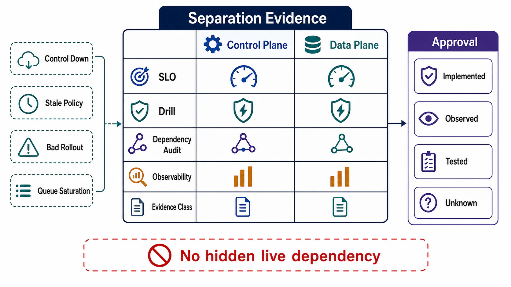

# Verification of Plane Separation



## Abstract

Plane separation is a property that regresses silently: every convenience dependency, every "temporary" synchronous lookup, every startup shortcut erodes it without failing a single test, and the erosion is discovered during the exact incident the separation was meant to survive. This file specifies the evidence that keeps the property true: outage drills per plane (the data plane must serve, and boot, through a control-plane outage), rollout game days that exercise the abort and rollback machinery of file 06, dependency-graph audits that mechanically detect the illegal edges of file 07 §1, and per-plane SLOs that make the two planes' different promises — request success versus policy freshness — separately measurable and separately alarmed. Every drill result is classified under the Chapter 01 file 11 evidence taxonomy: a separation that has never been drilled is `assumed`, not `implemented`, and Cloudflare's November 2023 experience shows both sides of that ledger — the statically stable data plane held, while portions of the recovery tooling turned out to depend on the failed facility ([postmortem](https://blog.cloudflare.com/post-mortem-on-cloudflare-control-plane-and-analytics-outage/)).

The discipline is chaos engineering's, applied to one property: a hypothesis about steady state, a controlled fault, a measured result ([Principles of Chaos Engineering](https://principlesofchaos.org/)). What is specific to this chapter is the hypothesis list.

## 1. Per-Plane SLOs

The planes make different promises, so they get different SLOs — collapsing them into one availability number is how control-plane debt hides:

| Plane | SLI | Example SLO Shape |
|---|---|---|
| Data plane | Request success rate, latency percentiles, TTFT/TPOT (Ch01 file 09) | The product SLO; measured at the caller |
| Control plane | Policy freshness: p99 commit→enforcement propagation; convergence fraction; reconciler divergence duration | "99% of policy changes enforced fleet-wide within X; divergence episodes resolve within Y" |
| Management plane | Time-to-mitigate capability: deploy/rollback/kill-switch executable within N minutes, from an independent path | Drilled, not measured from incidents alone |

The control-plane SLO is a *freshness* promise (file 07 §2), and its error budget is what rollout pace spends — a week of failed canaries consumes convergence budget the way failed requests consume the data plane's. The management-plane SLO is the one organizations skip because it has no steady-state traffic; it is verifiable only by drill (§2, D6).

## 2. Drill Catalog

```text
Figure 1. Verification regime: continuous structural audits catch
regressions between drills; drills convert claims into evidence;
per-plane SLOs make the two planes' promises separately alarmed.

  continuous               scheduled                 measured always
  ┌────────────────┐      ┌──────────────────┐      ┌────────────────┐
  │ dependency     │      │ drills D1–D10     │      │ per-plane SLOs │
  │ audit A1–A3    │      │ (hypothesis →     │      │ request /      │
  │ (CI + prod     │─────►│  fault → pass/    │─────►│ freshness /    │
  │  trace graphs) │ gate  │  fail condition) │ feed  │ time-to-      │
  └────────────────┘ new   └──────────────────┘ SLIs  │ mitigate      │
         │           edges          │                 └────────────────┘
         v                          v
    finding = failed test    evidence class per claim (§5):
                             intended → implemented → tested → observed
```

Each drill is a falsifiable hypothesis with a pass condition. Frequency is stated because these properties rot; a drill last passed two fleet-generations ago is `observed` history, not current evidence.

| # | Drill | Hypothesis Tested | Pass Condition | Frequency |
|---|---|---|---|---|
| D1 | Block the distribution layer for a full LKG-horizon window | Static stability (file 04 §1) | Data-plane SLIs unaffected; stale-version metric rises and alerts; no fail-closed before horizon | Quarterly |
| D2 | Cold-start data-plane nodes with the control plane blocked | Boot rule (file 04 §5) | Nodes reach serving state from persisted/baked LKG | Quarterly, and on image-pipeline changes |
| D3 | Push a deliberately bad (but lint-clean) canary config | Rollout gates (file 06 §3) | Automatic analysis fails the gate; automatic rollback; blast radius ≤ stage 1 population | Per rollout-pipeline change |
| D4 | Execute rollback under load | Rollback contract (file 06 §4) | Pinned-LKG rollback distributes on fast tier; convergence metric confirms 100%; no schema breakage | Quarterly |
| D5 | Activate each kill switch in production (scoped window) | Kill-switch inventory (file 06 §6) | Switch takes effect within its SLO; off-state behavior matches contract; audit event emitted | Per switch, semi-annually |
| D6 | Mitigate a simulated incident using only out-of-band management access | Direction rule for the management plane (file 07 §1) | Deploy/rollback/kill-switch executable with primary control plane and internal network degraded | Semi-annually |
| D7 | Saturate the control plane (mass resync, failover storm replay) | Incident-correlated load model (file 02 §4) | Data plane unaffected; reconciliation degrades to stale-not-wrong; recovery without operator action | Annually, and on fleet-size doublings |
| D8 | Kill a reconciler mid-convergence; restart it | Idempotent actions, level-triggered repair (file 02 §2.2) | No duplicate side effects; convergence resumes; divergence metric window bounded | Per reconciler change |
| D9 | Freeze the inference planner while shifting workload mix | Anticipatory planning (file 05 §4) | Admission tightens before decode saturation; TPOT SLO holds via shedding, not luck | Quarterly for serving fleets |
| D10 | Attempt policy mutation from an agent/tool identity | Authority gate (file 08 §5) | Structurally denied at the PEP; audited as a probe | Per tool-registry change |

D1 and D2 are ordered first deliberately: they are the cheapest to run and they verify the property everything else assumes. An organization that has never blocked its own distribution layer does not know its LKG horizon — it knows its LKG *hope*.

## 3. Dependency-Graph Audit

Drills verify behavior at points in time; the audit verifies structure continuously. Mechanism: extract the runtime call graph (trace data from Chapter 01 file 09 §7 is the honest source — declared dependencies lie, spans do not) and check three invariants mechanically:

```text
A1 (legality):   no synchronous hot-path edge terminates in a
                 component labeled control-plane (file 03 Fig. 1)
A2 (direction):  no edge violates the file 07 §1 partial order
A3 (budget):     every hot-path edge appears in the request class's
                 declared dependency set with its availability
                 product up to date (files 03 §5, 07 §2)
```

Violations are findings with the same standing as failed tests. The audit runs in CI against declared graphs and periodically against production traces — the difference between the two graphs is itself a finding (an undeclared dependency is the worst kind). New synchronous edges from data-plane to control-plane components should be blocked at review time by construction, not discovered at audit time.

## 4. Observability Requirements Specific to the Split

The Chapter 01 file 09 contract already requires most signals; four are load-bearing for this chapter and worth calling out as mandatory:

| Signal | Why the Split Needs It |
|---|---|
| Applied policy version, per data-plane element | Convergence and divergence are invisible without it; it is the join key for D1, D3, D4 |
| Stale-serving indicator (age of LKG in use) | Distinguishes "healthy on fresh policy" from "healthy on 3-day-old policy" — identical to callers, radically different states |
| Reconciler divergence duration and actioned-object rate | A reconciler doing nothing and a reconciler converging are indistinguishable in request metrics |
| Rollout stage position and gate outcomes | Blast-radius accounting (file 06 §5) requires knowing what fraction of the fleet each change had reached at detection time |

## 5. Evidence Classification of the Separation Claim

Applying Chapter 01 file 11 to the claim "our planes are separated":

| Evidence Held | Classification |
|---|---|
| Architecture diagram shows separate boxes | Intended |
| Dependency audit (A1–A3) passes on declared graph | Implemented |
| Audit passes on production trace graph | Implemented + observed |
| D1/D2 passed within the current fleet generation | Tested for the drilled scope |
| Survived a real control-plane incident with data-plane SLOs intact | Observed under production fault — the strongest class, and the only one Cloudflare could claim in November 2023 |

The dossier states which row the system is on, per plane pair. Most systems believe they are on row 5 and are actually on row 1.

## 6. Approval Gates

| Gate | Evidence Required | Failure Condition |
|---|---|---|
| SLO gate | Distinct data-plane (request), control-plane (freshness), and management-plane (time-to-mitigate) SLOs with owners | One availability number hides control-plane debt |
| Drill gate | D1–D4 passed within the current fleet generation; full catalog scheduled with owners | Separation evidence is a diagram |
| Audit gate | A1–A3 checked in CI and against production traces; trace/declared graph diffs are findings | Undeclared hot-path dependencies accumulate silently |
| Signal gate | The four §4 signals exist and are alerting | Stale serving or reconciler divergence is caller-invisible and operator-invisible |
| Classification gate | The separation claim carries an explicit file 11 evidence class per plane pair | "Separated" is asserted without stating what evidence backs it |

## Output

The output of this file is a verification regime — per-plane SLOs, a ten-drill catalog with frequencies, a mechanical three-invariant dependency audit, and four mandatory signals — under which plane separation is a continuously re-proven property with a named evidence class, rather than a diagram that was true once.

## References

- [Cloudflare — Post-mortem on the control plane and analytics outage, November 2023](https://blog.cloudflare.com/post-mortem-on-cloudflare-control-plane-and-analytics-outage/)
- [Principles of Chaos Engineering](https://principlesofchaos.org/)
- [AWS Builders' Library — Static Stability Using Availability Zones](https://aws.amazon.com/builders-library/static-stability-using-availability-zones/)
- [Google SRE Workbook — Canarying Releases (automated gate evaluation)](https://sre.google/workbook/canarying-releases/)
- [W3C Trace Context — the propagation layer the audit reads](https://www.w3.org/TR/trace-context/)
