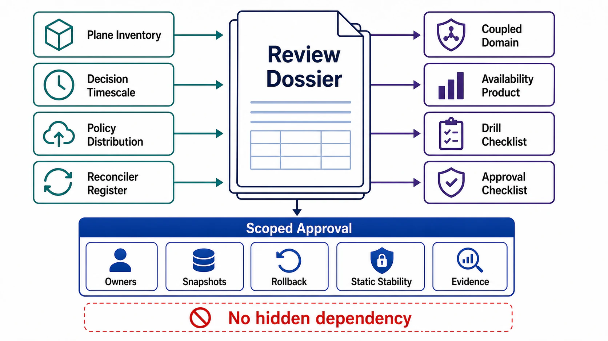

# Plane Separation Review Templates



## Abstract

This file collects the executable artifacts of Chapter 02: the plane inventory, the decision-timescale table, the policy-distribution contract, the coupled-domain register, the rollout policy, and the drill checklist. Every field is defined and justified in files 01–09; this file adds no new policy — it exists so the review can be run mechanically, with each blank field acting as an explicit open question. A field left blank is a finding, not a formatting choice.

## Usage Protocol

1. Complete the dossier top-to-bottom; section order matches the approval dependency graph in [00-chapter-file-map.md](00-chapter-file-map.md).
2. The plane inventory must be consistent with the Chapter 01 boundary dossier — same components, now carrying plane labels (the seam gate of file 01 §6).
3. Tag every separation claim with its evidence class per file 09 §5. Untagged claims are `intended`.
4. Re-run the checklist on fleet-size doublings, new policy classes, new synchronous hot-path dependencies, and coupling-acceptance expiries — those four events invalidate prior approvals.

```text
Figure 1. Dossier assembly flow.

  file 01                files 02–03              files 04–06
  plane labels per   ──► anatomy: store, loop,──► distribution contracts,
  component              distribution, PEPs,      timescale ladder,
      │                  per-request budget       rollout gates
      │                        │                       │
      └───────────┬────────────┴───────────────────────┘
                  v
        file 07: coupling register (priced, owned, expiring)
                  v
        file 08: AI serving/agent plane map (if applicable)
                  v
        file 09: drills + audits → evidence class per claim
                  v
        approval: the SPLIT only — no scheduler, mesh,
        config system, or router selection is approved here
```

## Plane Inventory

| Component (from Ch01 boundary dossier) | Plane | Scaling Law | On Hot Path? | 60-s Pause Impact | Wrong-Output Scope |
|---|---|---|---|---|---|
|  | data / control / management | Θ(requests) / Θ(change) / Θ(operators) | yes/no | callers / nobody / repair capability | one request / policy consumers / recovery |

## Decision-Timescale Table

| Decision | Timescale | Owner Plane | Distribution Artifact | Staleness Price (perf / correctness) |
|---|---|---|---|---|
| Admission |  |  |  |  |
| Per-request replica pick |  |  |  |  |
| Queue/batch scheduling |  |  |  |  |
| Placement |  |  |  |  |
| Autoscaling |  |  |  |  |
| Model/index selection |  |  |  |  |
| Tool/permission grants |  |  |  |  |

## Policy Distribution Contract (per policy class)

```yaml
policy_class:
  name:
  authoring_path:              # every mutation path, including admin/break-glass
  store:
    consistency: strong
    versioning: monotonic
  distribution:
    mechanism: push | pull | stream | hybrid
    propagation_slo_p99:
    convergence_metric:
    ordering_rule:             # dependency sequencing (make-before-break)
    resync: jittered_full_state
    speed_tier: staged | fast  # fast reserved for kill switches
  lkg:
    validity_horizon:
    horizon_binding_constraint:  # e.g. shortest embedded cert lifetime
    expiry_behavior: keep_serving | degrade | fail_closed
    integrity: signed | checksummed
    boot_source: baked | persisted   # must not be "fetch at startup"
  rollout:
    validation_layers: [schema, lint, simulation, resource_cost, shadow]
    stages:                    # failure-domain-aligned populations
    analysis_gate: automated_canary_vs_control
    quality_slis_included:     # mandatory for model artifacts
    rollback:
      target: pinned_lkg_version
      convergence_confirmed: true
      schema_rollback_safe_versions: 1
```

## Reconciler Register (per control loop)

| Reconciler | Trigger Model | Convergence SLO | Actions Idempotent? | Divergence Metric | Blast-Radius Cap / Iteration | Single Writer For |
|---|---|---|---|---|---|---|
|  | level / edge (+ backlog bound) |  | yes/no |  |  |  |

## Coupled-Domain Register

| Coupling | Planes | Mechanism | Direction Violation? | Availability Price | Latency Price | Mitigation | Drill | Owner | Acceptance Expiry |
|---|---|---|---|---|---|---|---|---|---|
|  |  | shared store / sync call / shared pool / feedback loop | yes+justification / no |  |  |  | D# |  |  |

## Availability Products

```yaml
request_class:
  name:
  synchronous_dependency_set:      # from Ch02 file 03 §5
  availability_product:            # Π A_i, computed
  slo_target:
  architecture_headroom:           # product − target; negative blocks approval
recovery_path:
  name:                            # rollback, kill switch, redeploy
  dependency_set:                  # must exclude the planes being recovered
  availability_product:
```

## Drill Checklist

```text
[ ] D1  Distribution blocked for full LKG horizon — data-plane SLIs held
[ ] D2  Cold start with control plane blocked — nodes served from LKG
[ ] D3  Bad canary config — automatic gate failure, rollback, radius ≤ stage 1
[ ] D4  Rollback under load — pinned LKG, fast tier, convergence confirmed
[ ] D5  Kill switches activated in production windows — all within SLO
[ ] D6  Incident mitigated via out-of-band management path only
[ ] D7  Control-plane saturation (resync storm) — data plane unaffected
[ ] D8  Reconciler killed mid-convergence — idempotent resume, no duplicates
[ ] D9  Planner freeze under workload shift — anticipatory admission held TPOT
[ ] D10 Agent/tool identity attempted policy write — structurally denied, audited
Each line: date last passed + fleet generation + evidence link.
```

## Approval Checklist

```text
[ ] Every boundary component carries a plane label with scaling law (file 01).
[ ] Management plane has no hard dependency on the planes it manages (files 01, 07).
[ ] Every per-request data→control call satisfies all four mixing conditions (file 01 §5).
[ ] Each control-plane responsibility names its store, loop, distribution, and PEPs (file 02).
[ ] Every reconciler: trigger model, convergence SLO, idempotent actions, divergence
    metric, per-iteration blast-radius cap (file 02).
[ ] Control plane provisioned for incident-correlated peak, not steady state (file 02 §4).
[ ] Every control-plane failure branch resolves stale-not-wrong; kill switches are the
    only engineered fast-global class (files 02 §5, 06 §6).
[ ] Data-plane hot path: only local snapshots and budgeted data-plane peers;
    bounded work per input vector; no locally originated policy (file 03).
[ ] Startup dependency set declared; boot-from-LKG drill (D2) passed (files 03 §5, 04 §5).
[ ] Per-class LKG horizons computed, bound by shortest embedded credential (file 04 §1).
[ ] Propagation speed allocated by blast radius (file 04 §3).
[ ] Every admission/scheduling/placement decision sits at its ladder timescale with a
    distribution artifact and staleness price (file 05).
[ ] Distributed quota counting mechanism and overshoot bound named (file 05 §2).
[ ] Every policy-store mutation path gated: layered validation, failure-domain stages,
    automated canary-vs-control, versioned convergence-confirmed rollback (file 06).
[ ] Blast radius (consumers × severity × persistence) computed per policy class (file 06 §5).
[ ] Dependency graph passes A1 legality, A2 direction, A3 budget — on declared AND
    production-trace graphs (files 07, 09 §3).
[ ] Every surviving coupling registered with price, mitigation, drill, owner, expiry (file 07 §5).
[ ] One writing authority per policy field (file 07 §4 #9).
[ ] AI serving: model pins, router policy, planner as gated control-plane objects;
    model rollouts include quality SLIs (file 08).
[ ] Agents: budgets, tool grants, approvals enforced from durable journal;
    no path from model output to policy write (file 08).
[ ] Per-plane SLOs exist: request (data), freshness (control), time-to-mitigate (management) (file 09 §1).
[ ] The four split-specific signals exist and alert: applied version, stale-serving age,
    reconciler divergence, rollout stage position (file 09 §4).
[ ] The separation claim carries an explicit evidence class per plane pair (file 09 §5).
```

## Final Approval Statement

```text
Chapter 02 approval is granted only for the plane split: the classification,
distribution contracts, rollout gates, coupling register, and drill evidence above.
It does not approve any specific scheduler, service mesh, configuration system,
orchestrator, or inference router. Those selections require later chapter
constraints evaluated against the contracts approved here.
```
