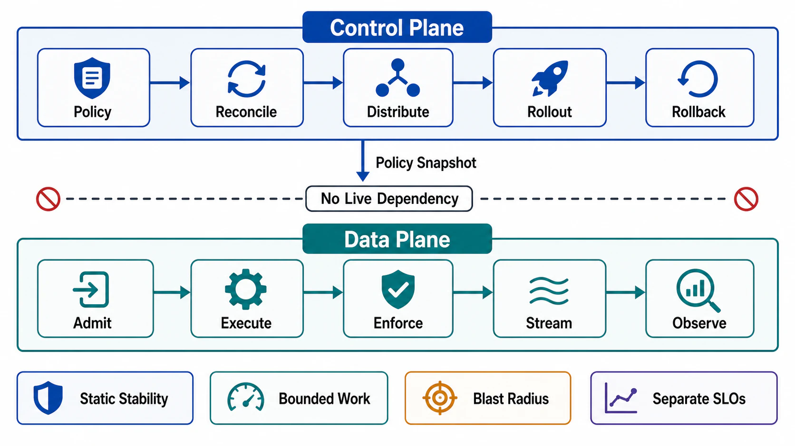

# Chapter 02: Control Plane and Data Plane Separation

## Abstract

Policy, scheduling, routing, configuration, admission control, and metadata belong in the control plane. Request execution, storage I/O, retrieval payloads, tensor movement, and streaming belong in the data plane. Mixing them is acceptable only with measured latency and failure-isolation justification — and this chapter supplies the machinery that makes the rule enforceable rather than aspirational: formal plane definitions grounded in scaling laws (data plane Θ(request rate), control plane Θ(rate of change)), a four-stage control-plane anatomy with a stale-not-wrong failure bias, a per-request legality budget for the data plane, static stability with computed last-known-good horizons, a decision-timescale ladder for admission/scheduling/placement, rollout gates that allocate propagation speed by blast radius, a priced coupling register, the plane map for AI serving and agent systems, and a ten-drill verification regime under which "separated" is an evidence-classified claim rather than a diagram.

The chapter's empirical anchor: the largest self-inflicted outages of the last decade were control-path failures — one WAF rule pushed globally in seconds ([Cloudflare 2019](https://blog.cloudflare.com/details-of-the-cloudflare-outage-on-july-2-2019/)), one maintenance command whose BGP consequences erased a company from the internet while disabling the tooling needed to repair it ([Meta 2021](https://engineering.fb.com/2021/10/05/networking-traffic/outage-details/)) — while the clearest recent demonstration of the discipline working is a multi-day control-plane outage during which the statically stable data plane kept serving ([Cloudflare, November 2023](https://blog.cloudflare.com/post-mortem-on-cloudflare-control-plane-and-analytics-outage/)).

## Chapter Structure

Each file is a self-contained research note: abstract, formal model, ASCII figures, decision tables, approval gates that can fail a design, and primary-source references. The reading order is a dependency graph (see [00-chapter-file-map.md](00-chapter-file-map.md)).

| Order | File | Concept |
|---:|---|---|
| 0 | [00-chapter-file-map.md](00-chapter-file-map.md) | Folder map, approval dependency graph, Chapter 01 prerequisites |
| 1 | [01-plane-separation-model.md](01-plane-separation-model.md) | Plane definitions by scaling law, timescale, blast radius; the asymmetry law; mixing rule |
| 2 | [02-control-plane-anatomy.md](02-control-plane-anatomy.md) | Policy store, reconciliation loop, distribution, enforcement points; constant work; load model |
| 3 | [03-data-plane-anatomy.md](03-data-plane-anatomy.md) | Per-request legality and budget; local state discipline; startup dependency sets |
| 4 | [04-static-stability-and-policy-distribution.md](04-static-stability-and-policy-distribution.md) | LKG horizons, push/pull contracts, propagation speed tiers, the boot rule |
| 5 | [05-admission-scheduling-and-placement.md](05-admission-scheduling-and-placement.md) | Decision-timescale ladder; distributed counting; inference router/planner split |
| 6 | [06-configuration-rollout-and-blast-radius.md](06-configuration-rollout-and-blast-radius.md) | Validation pipeline, staged rollout with automated gates, rollback contract, kill switches |
| 7 | [07-coupled-failure-domains-and-anti-patterns.md](07-coupled-failure-domains-and-anti-patterns.md) | Direction rule, availability multiplication, feedback loops, incident-anchored anti-patterns |
| 8 | [08-plane-separation-in-ai-serving-and-agents.md](08-plane-separation-in-ai-serving-and-agents.md) | Inference and agent plane maps; disaggregation as recursive separation; model output vs policy |
| 9 | [09-verification-of-plane-separation.md](09-verification-of-plane-separation.md) | Per-plane SLOs, drill catalog D1–D10, dependency audits, evidence classification |
| 10 | [10-plane-separation-review-templates.md](10-plane-separation-review-templates.md) | Executable dossier and approval checklist |

## Source Corpus

| Source | Official Material | Standard Imported Into This Chapter |
|---|---|---|
| Marc Brooker / AWS | [Control Planes vs Data Planes](https://brooker.co.za/blog/2019/03/17/control.html) | The defining scaling laws: data plane sits on the request path and scales with request volume; control plane scales with the rate of change and may pause briefly without customer impact. Separation is a heuristic for compartmentalizing complexity, not a goal in itself. |
| AWS Builders' Library | [Static stability](https://aws.amazon.com/builders-library/static-stability-using-availability-zones/), [Constant work](https://aws.amazon.com/builders-library/reliability-and-constant-work/), [Smaller service in control](https://aws.amazon.com/builders-library/avoiding-overload-in-distributed-systems-by-putting-the-smaller-service-in-control/) | Data plane continues on last-known-good state during control-plane impairment; constant-work designs have no untested stressed mode; constant-cadence reporting keeps control-plane load flat during incidents. |
| Google | [Borg, EuroSys 2015](https://research.google/pubs/large-scale-cluster-management-at-google-with-borg/), [SRE Workbook: Canarying](https://sre.google/workbook/canarying-releases/), [Reliable Product Launches](https://sre.google/sre-book/reliable-product-launches/) | Desired-state reconciliation at cluster scale; admission + packing + isolation as the utilization/latency trade; automated canary-versus-control analysis gates; drilled kill switches as launch defenses. |
| Kubernetes | [Controllers](https://kubernetes.io/docs/concepts/architecture/controller/) | The controller pattern: observe actual state, diff desired state, act to converge — self-healing against lost signals where imperative command execution diverges permanently. |
| Envoy / Istio | [xDS protocol](https://www.envoyproxy.io/docs/envoy/latest/api-docs/xds_protocol) | The canonical policy-distribution contract: strongly consistent authoring, deliberately eventual distribution, snapshot semantics, ADS resource sequencing to prevent transient blackholes. |
| Cloudflare | [2019 outage postmortem](https://blog.cloudflare.com/details-of-the-cloudflare-outage-on-july-2-2019/), [Nov 2023 control-plane outage postmortem](https://blog.cloudflare.com/post-mortem-on-cloudflare-control-plane-and-analytics-outage/) | Both directions of the evidence: unstaged global policy push as the dominant self-inflicted outage class; static stability holding a data plane up through a multi-day control-plane outage — and recovery tooling exposed as coupled where undrilled. |
| Meta | [October 2021 outage details](https://engineering.fb.com/2021/10/05/networking-traffic/outage-details/) | The circular-dependency incident shape: health-based route withdrawal amplifying a control-path fault globally, with management-plane tooling and access dependent on the failed planes — the direction rule's founding evidence. |
| NVIDIA / llm-d / Hao AI Lab | [Dynamo](https://developer.nvidia.com/blog/introducing-nvidia-dynamo-a-low-latency-distributed-inference-framework-for-scaling-reasoning-ai-models/), [llm-d](https://llm-d.ai/), [DistServe retrospective](https://haoailab.com/blogs/distserve-retro/) | The inference control plane: KV-cache-aware routing from asynchronously refreshed local state, SLA-driven planners owning prefill:decode ratios, disaggregation as plane discipline applied recursively inside the data plane. |
| Temporal / Cloudflare | [Durable execution](https://docs.temporal.io/workflow-execution), [Dynamic Workflows](https://blog.cloudflare.com/dynamic-workflows/) | The agent control plane: journaled step outcomes, deterministic replay, budgets and approvals enforced against durable records rather than model self-report. |
| Research corpus | [Metastable Failures, HotOS 2021](https://sigops.org/s/conferences/hotos/2021/papers/hotos21-s11-bronson.pdf), [OpenFlow, SIGCOMM CCR 2008](https://dl.acm.org/doi/10.1145/1355734.1355746), [Principles of Chaos Engineering](https://principlesofchaos.org/) | Cross-plane feedback loops as metastability triggers; the SDN lineage of explicit plane separation; hypothesis-driven drills as the only admissible separation evidence. |

## Chapter Standards

1. Every component carries a plane label derived from its scaling law, not its deployment topology.
2. The control plane fails globally and slowly; the data plane fails locally and fast — every mechanism in the chapter answers one of the two shapes.
3. The management plane must not depend on the planes it manages; recovery-path availability is computed independently.
4. Policy storage is strongly consistent; policy distribution is explicitly eventual, with propagation SLOs and convergence metrics.
5. The control plane fails stale, never wrong; kill switches are the only engineered fast-global exception.
6. The data-plane hot path touches only local snapshots and budgeted data-plane peers; per-request work is bounded by the input contract.
7. Data-plane elements boot from persisted last-known-good state; the distribution layer is a freshness upgrade, not a boot dependency.
8. Static stability has a computed horizon, bound by the shortest-lived embedded credential.
9. Every decision sits at the slowest timescale that satisfies its SLO; propagation speed is allocated by blast radius, never by urgency.
10. Every mutation path into a policy store passes layered validation, failure-domain-aligned staged rollout with automated canary-versus-control gates, and versioned convergence-confirmed rollback.
11. Every surviving inter-plane coupling is registered with an availability price, a mitigation, a drill, an owner, and an acceptance expiry.
12. Exactly one writing authority exists per policy field.
13. Model artifacts are the highest-blast-radius config class: pinned versions, staged rollout, quality-SLI analysis gates.
14. Model output is data-plane suggestion; no path may exist from generated text to control-plane state.
15. Plane separation is an evidence-classified claim (intended/implemented/observed/tested), re-proven by drills D1–D10 within the current fleet generation.

## Chapter Completion Gate

Chapter 02 is complete only when the reviewer can answer these questions without guessing:

- What is each component's plane label, and what scaling law justifies it?
- What happens to the data plane — serving *and* booting — during a full control-plane outage, and for how long is that safe?
- How long does a good policy change take to reach the fleet, and how long does a bad one persist (detect + rollback + propagate)?
- Which mutation paths exist into each policy store, and which gates does each pass?
- What is the availability product of each request class's synchronous dependency set — and of each recovery path?
- Which inter-plane couplings survive by choice, at what price, verified by which drill, expiring when?
- Where do model pins, router policy, tool grants, and episode budgets live, and can any model output reach them?
- Which drills passed within the current fleet generation, and what evidence class does the separation claim carry?

## Final Position

Plane separation is the first structural decision that makes a large system's failure modes tractable: it converts "anything can break anything" into two known failure shapes with known defenses. It is bought with real costs — distribution machinery, staleness contracts, extra fleets — and it is kept only through drills and audits, because every convenient shortcut erodes it silently. The chapters that follow assume the split holds; this chapter is where that assumption becomes evidence.
