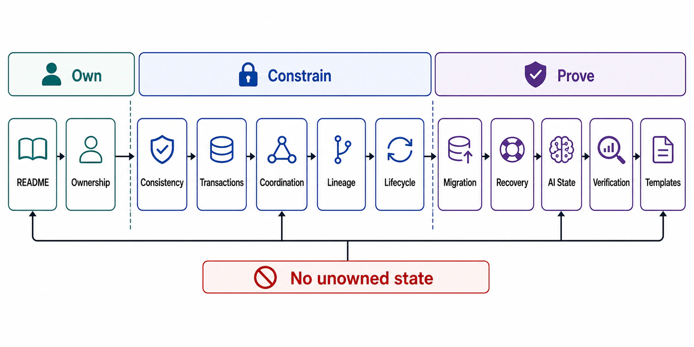

# Chapter 03 File Map



## Purpose

Chapter 01 file 07 declared the state inventory at boundary level: four state classes, a consistency vocabulary, and the rule that unowned state is unowned correctness. This chapter designs the machinery behind those declarations: ownership as enforceable write authority, consistency and isolation model selection with the anomaly each choice admits, coordination that survives partitions and process pauses, derived-state lineage, lifecycle and deletion that can be proven, schema migration without downtime, recovery that is rehearsed rather than hoped, and the AI-native state classes (KV cache, embeddings, agent memory) that current systems mismanage first.

Seam discipline: *how replicas are placed and quorums assembled* is Chapter 05; *how caches and materialized views are engineered* is Chapter 08. This chapter owns the contracts those chapters must implement.

Each file is a self-contained research note: an abstract stating the claim, a formal model, figures, decision tables, approval gates that can fail a design, and primary-source references.

## Reading Order

| Order | File | Architecture Decision Produced |
|---:|---|---|
| 1 | [README.md](README.md) | Chapter thesis, source corpus, and completion gate |
| 2 | [01-state-ownership-model.md](01-state-ownership-model.md) | Write authority, source-of-truth designation, single-writer discipline |
| 3 | [02-consistency-model-selection.md](02-consistency-model-selection.md) | Per-read-path consistency claims, PACELC pricing, session guarantees |
| 4 | [03-transactions-isolation-and-invariants.md](03-transactions-isolation-and-invariants.md) | Isolation level per invariant, admitted anomalies, serializability boundary |
| 5 | [04-coordination-locks-leases-and-convergence.md](04-coordination-locks-leases-and-convergence.md) | Fencing tokens, lease safety, coordination-free paths (CALM/CRDT) |
| 6 | [05-derived-state-and-lineage.md](05-derived-state-and-lineage.md) | Derivation DAG, CDC/outbox contracts, rebuild-versus-repair |
| 7 | [06-state-lifecycle-retention-and-deletion.md](06-state-lifecycle-retention-and-deletion.md) | Lifecycle machine, retention policy, provable deletion propagation |
| 8 | [07-schema-evolution-and-migration.md](07-schema-evolution-and-migration.md) | Expand/contract phases, dual-write hazards, migration gates |
| 9 | [08-recovery-backup-and-replay.md](08-recovery-backup-and-replay.md) | RPO/RTO budgets, defense-in-depth layers, restore drills |
| 10 | [09-ai-native-state.md](09-ai-native-state.md) | KV cache, embeddings, agent memory, session/context state contracts |
| 11 | [10-verification-of-state-contracts.md](10-verification-of-state-contracts.md) | Anomaly testing, lag/divergence SLIs, drill catalog S1–S10 |
| 12 | [11-state-review-templates.md](11-state-review-templates.md) | Executable dossier and approval checklist |

## Approval Dependency Graph

```text
Figure 1. Chapter 03 approval dependency graph.

  [01] Ownership: who may write, what is source of truth
        │
        ├──────────────────────────────┐
        v                              v
  [02] Consistency model         [04] Coordination
       per read path                  (locks, leases, fencing,
        │                              coordination-free paths)
        v                              │
  [03] Isolation + invariants ◄────────┘
        │
        v
  [05] Derived state + lineage
        │
        ├──────────────┬───────────────┐
        v              v               v
  [06] Lifecycle  [07] Migration  [08] Recovery
        │              │               │
        └──────────────┴───────┬───────┘
                               v
                     [09] AI-native state (applied case)
                               v
                     [10] Verification ──► [11] Dossier
```

Concrete dependencies the graph encodes:

- No consistency claim ([02]) is reviewable until write authority ([01]) fixes which component's view is authoritative.
- Isolation selection ([03]) presupposes both the consistency vocabulary ([02]) and the invariant list from Chapter 01 file 01 §5.
- Derived state ([05]) consumes the single-writer rule ([01]) — a projection with two writers has no rebuild semantics.
- Deletion ([06]) and recovery ([08]) are both defined *over the lineage DAG* of [05]: you cannot prove erasure or restore correctness for state whose derivation you cannot enumerate.
- AI-native state ([09]) is the prior seven files applied to KV cache, embeddings, and memory — nothing in it is new policy.

## Prerequisites From Earlier Chapters

| Artifact | Consumed By |
|---|---|
| State classes and ownership fields ([Ch01 file 07](../01-architectural-objective-and-system-boundary/07-state-classification-and-consistency-boundary.md)) | All files — this chapter implements that declaration |
| Correctness invariants ([Ch01 file 01 §5](../01-architectural-objective-and-system-boundary/01-objective-contract.md)) | [02], [03] |
| Idempotency contract ([Ch01 file 04 §3](../01-architectural-objective-and-system-boundary/04-input-output-and-api-contracts.md)) | [01], [04] |
| Evidence classification ([Ch01 file 11](../01-architectural-objective-and-system-boundary/11-evidence-classification-and-architecture-review.md)) | [10], [11] |
| Single-writer-per-policy-field rule ([Ch02 file 07 §4](../02-control-plane-and-data-plane-separation/07-coupled-failure-domains-and-anti-patterns.md)) | [01] generalizes it to all state |
| Rollout gates for schema/policy artifacts ([Ch02 file 06](../02-control-plane-and-data-plane-separation/06-configuration-rollout-and-blast-radius.md)) | [07] |

## Chapter Rule

No database engine, cache, event log, vector store, or storage service is approved in Chapter 03. This chapter approves only the state contracts — ownership, consistency, isolation, lineage, lifecycle, and recovery — that any selected engine must be shown to satisfy. Engine selection is Chapter 04's decision, made against these contracts.
