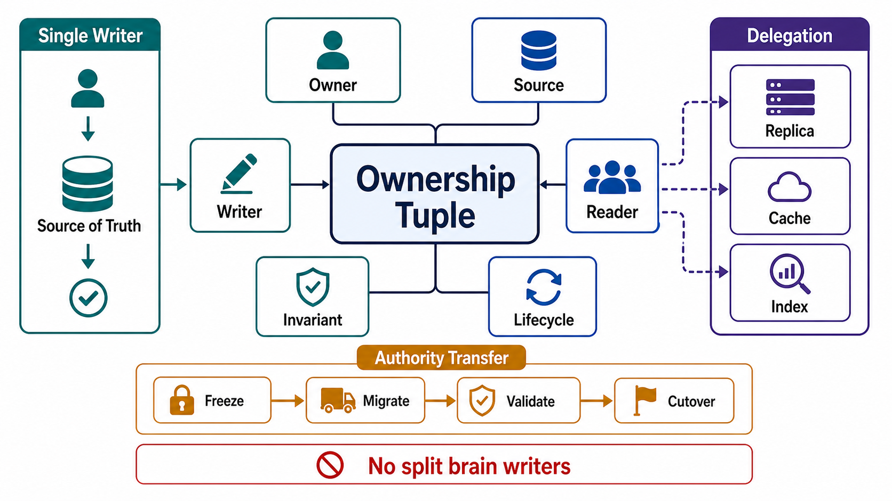

# State Ownership Model



## Abstract

Ownership of state is write authority: for every state item, exactly one component holds the right to mutate it, exactly one store is the source of truth for it, and every other copy — replica, cache, index, projection — is a follower whose divergence is measurable and repairable. This file formalizes that discipline: the ownership tuple every state item must declare, the single-writer rule and its legitimate delegation forms, the authority-transfer protocol that keeps failover from minting two writers, and the arbitration contract for the cases where concurrent writers are accepted deliberately. The founding incident is GitHub's October 2018 outage: a 43-second network partition let an automated failover promote a second MySQL primary while the original still held unreplicated writes — two components each believing they held write authority — and the reconciliation of that 43-second divergence took more than 24 hours of degraded service ([GitHub post-incident analysis](https://github.blog/2018-10-30-oct21-post-incident-analysis/)). Ownership is cheap to declare and catastrophically expensive to re-derive after the fact.

Chapter 02 file 07 §4 established single-writer-per-policy-field for control-plane state. This file generalizes: the rule was never about policy — it is the definition of what it means for state to be owned.

## 1. The Ownership Tuple

Every state item from the Chapter 01 file 07 inventory carries:

```yaml
ownership:
  item:
  owner_component:            # exactly one; holds write authority
  owner_team:                 # accountable humans (Ch01 file 05 ownership matrix)
  source_of_truth:            # exactly one store; all else is derived/follower
  write_interface:            # the ONLY mutation path; side doors are findings
  writer_cardinality: single | single_per_partition | multi_arbitrated
  authority_transfer:         # §4 protocol reference, if failover exists
  arbitration:                # §5 contract, iff multi_arbitrated
  followers:                  # replicas, caches, indexes — each with lag metric
  divergence_repair:          # how a follower is proven equal / made equal
```

Two fields do most of the review work. `write_interface` makes ownership auditable: a state item mutated through three code paths has three chances to disagree about invariants, and the audit (file 10) checks that production writes actually flow through the declared interface. `writer_cardinality` forces the honest choice among the three legitimate regimes — and makes "we didn't decide" impossible to hide.

## 2. The Single-Writer Rule

```text
Figure 1. Ownership topology. Authority flows through one writer;
data flows outward to followers. Every arrow pointing INTO the
source of truth that does not pass the owner is a defect.

                     ┌─────────────┐
   clients ─────────►│   owner     │        (validates invariants,
   (via the write    │  component  │         assigns versions,
    interface only)  └──────┬──────┘         emits audit)
                            │ the only write path
                            v
                    ┌───────────────┐
                    │ source of     │  version counter v
                    │ truth         │  monotonic per item
                    └──┬────┬────┬──┘
              follows  │    │    │   (async, lag-metered)
                       v    v    v
                  replica  cache  index/projection
                  (lag_r) (lag_c) (lag_i)

   X illegal: client → replica write        (split authority)
   X illegal: batch job → source of truth   (bypasses invariants)
   X illegal: projection → source of truth  (derived state writing up)
```

Why one writer, mechanically: a single writer serializes mutations, which means invariants can be checked before commit against a consistent view, versions can be assigned monotonically, and every follower's state is explainable as "the prefix of the writer's history up to version v." With two uncoordinated writers, none of those properties survive — divergence is not an error condition anymore but a steady state, and the system needs merge semantics it almost never actually has. GitHub's incident is the canonical demonstration: neither datacenter's MySQL was *wrong*; the system as a whole simply no longer had a fact of the matter about what the data was, and rebuilding that fact took a day ([post-incident analysis](https://github.blog/2018-10-30-oct21-post-incident-analysis/)).

Sharding does not weaken the rule; it applies it per partition: `single_per_partition` means each key range has exactly one writer, and the partition map itself is a control-plane state item with its own single writer (Chapter 02 file 05 §3). Kafka's per-partition leader and every primary-per-shard database follow this shape.

## 3. Delegation Without Divergence

Legitimate patterns that look like multiple writers but preserve single authority:

| Pattern | Why Authority Is Preserved |
|---|---|
| Leader + synchronous followers | Followers accept no client writes; they replay the leader's log |
| Command funneling | Many clients *request* mutations; one owner *applies* them (queue → single consumer per key) |
| Escrow / split quotas | Owner pre-partitions a numeric budget; delegates mutate only their share (the distributed-counting choice of Ch02 file 05 §2) |
| Saga participants | Each service is the single writer of *its own* state; the saga coordinates, never writes across boundaries |
| CRDT replicas | Deliberately multi-writer — but only for state whose merge is total and proven; this is file 04 §5's regime, declared as `multi_arbitrated` |

The saga row carries this chapter's inter-service consequence: "shared database between services" fails review not because of coupling aesthetics but because it creates two writers with independent invariant logic over one source of truth. Service boundaries are ownership boundaries or they are nothing.

## 4. Authority Transfer

Failover is the planned case of the GitHub incident, and the protocol requirements exist to keep it from becoming the unplanned one:

```text
transfer(old_writer → new_writer) is safe iff:
  1. old writer is fenced BEFORE new writer accepts mutations
     (fencing token / epoch: store rejects writes from epoch < current — file 04 §3)
  2. new writer starts from a state ≥ all acknowledged writes
     (else acknowledged durability is silently violated)
  3. the transfer decision itself has a single writer
     (one arbiter — a consensus group — not two failover daemons racing)
  4. unacknowledged in-flight writes have defined semantics
     (ambiguous completion per Ch01 file 04 §2 — clients may retry by idempotency key)
```

Condition 2 is where latency-motivated asynchronous replication quietly spends durability: if the failover target may lag, then `acknowledged` did not mean `durable across failover`, and that must appear in the output contract's consistency claim (Chapter 01 file 04), not in the incident review. Condition 3 is the GitHub lesson restated: their Orchestrator quorum *did* decide consistently — but fencing (condition 1) was not established before promotion, so the old primary kept accepting writes into the partition.

## 5. Arbitrated Multi-Writer

Some state is legitimately multi-writer — collaborative documents, multi-region accept-anywhere writes, offline-first clients. The review does not forbid it; it prices it:

| Requirement | Detail |
|---|---|
| Merge function | Total (defined for *every* pair of concurrent states), associative, commutative, idempotent — or an explicit LWW/priority rule with its data-loss window acknowledged |
| Concurrency detection | Version vectors or equivalent; wall-clock LWW must state that it discards concurrent writes silently |
| Convergence metric | Divergence duration and merge-conflict rate are exported SLIs (file 10) |
| Invariant scope | Only invariants preserved by the merge are claimable — numeric bounds, uniqueness, and foreign-key-style invariants generally are NOT (this is the CALM boundary, file 04 §5) |

The last row is the one that fails most designs: teams adopt multi-writer for availability and keep advertising invariants ("balance never negative") that no coordination-free merge can uphold. Pick the invariant or pick the availability; the review requires the choice in writing.

## 6. Ownership Anti-Patterns

| Anti-Pattern | Failure Mode | Repair |
|---|---|---|
| Two failover daemons, no shared arbiter | Dueling promotions; split brain | Single consensus-backed arbiter (§4.3) |
| Promotion without fencing | Old primary writes into the partition (GitHub 2018) | Epoch/fencing enforced by the store (file 04 §3) |
| Shared database across services | Multiple writers with divergent invariant logic | Ownership boundary = service boundary; funnel or split |
| Batch/ops side-door writes | Invariants and audit bypassed; "how did this row get here" | All mutation through the write interface; break-glass is audited and reconciled |
| Cache or projection writable by clients | Derived state diverges from source with no repair path | Followers are read-only; writes go up through the owner |
| "Last writer wins" as an unexamined default | Concurrent updates silently discarded | Declare `multi_arbitrated` with §5 pricing, or serialize through the owner |
| Ownership by convention, not enforcement | Convention survives until the first new team ships | Store-level enforcement: grants, epochs, write-interface ACLs |

## 7. Approval Gates

| Gate | Evidence Required | Failure Condition |
|---|---|---|
| Tuple gate | Every state item carries the full §1 ownership tuple | Any item has "shared" or blank in owner or source-of-truth fields |
| Interface gate | Production writes verifiably flow through the declared write interface | Side-door mutation paths exist (batch jobs, ops scripts, second services) |
| Cardinality gate | Writer cardinality is declared; multi-writer items carry the §5 pricing | Multi-writer by accident, or invariants claimed that the merge cannot preserve |
| Transfer gate | Failover satisfies all four §4 conditions, fencing first | Promotion can occur while the old writer still accepts mutations |
| Enforcement gate | Ownership is enforced by the store (grants, epochs), not by convention | Nothing prevents an unauthorized writer except code review |

## Output

The output of this file is an ownership tuple for every state item — one writer (or a priced arbitration), one source of truth, one audited write interface, and a fencing-first transfer protocol — such that "who may change this, and whose view wins" is never a question an incident has to answer.

## References

- [GitHub — October 21, 2018 post-incident analysis](https://github.blog/2018-10-30-oct21-post-incident-analysis/)
- [Kleppmann — How to do distributed locking (fencing tokens)](https://martin.kleppmann.com/2016/02/08/how-to-do-distributed-locking.html)
- [Kleppmann, *Designing Data-Intensive Applications* — leadership, replication, and the trouble with multi-leader writes](https://dataintensive.net/)
- [Jepsen — consistency models and the cost of divergence](https://jepsen.io/consistency)
- [LinkedIn Engineering — Running Kafka at Scale (per-partition leadership)](https://engineering.linkedin.com/kafka/running-kafka-scale)
