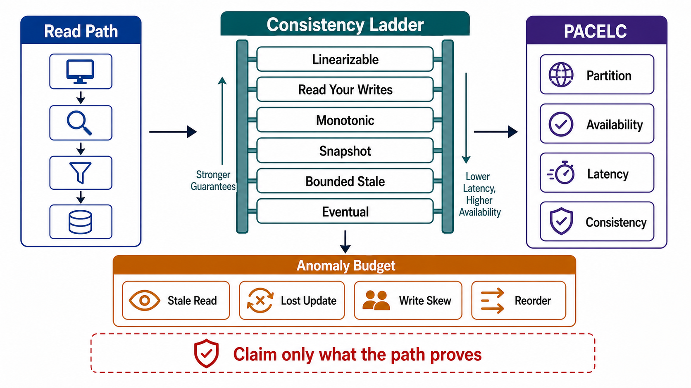

# Consistency Model Selection



## Abstract

A consistency model is a contract over what reads may return given the history of writes, and selecting one is a purchase: stronger models buy simpler application reasoning with coordination latency and reduced availability; weaker models refund latency and availability while billing every reader for anomaly handling. This file makes the purchase explicit per read path. The selection framework is PACELC ([Abadi, IEEE Computer 2012](https://ieeexplore.ieee.org/document/6127847/)) — the trade is not only availability-versus-consistency during partitions (CAP) but latency-versus-consistency during normal operation, which is why it applies to every request, not just the rare partition. The model vocabulary is the formally verified hierarchy maintained by [Jepsen](https://jepsen.io/consistency), and the middle tier that most applications actually need is Terry et al.'s session guarantees ([PDIS 1994](https://dl.acm.org/doi/10.1109/PDIS.1994.331722)) — read-your-writes, monotonic reads — which deliver most of strong consistency's *perceived* correctness at a fraction of its coordination cost.

The file's central discipline, inherited from Chapter 01 file 07 §3 and sharpened here: a consistency claim without its delivering mechanism is fiction, and a consistency claim stronger than the output contract needs is waste. Both directions fail review.

## 1. Selection Is Per Read Path, Not Per System

"Our database is strongly consistent" answers the wrong question: consistency is experienced at read paths, and one system legitimately serves different models to different paths. The unit of selection:

```yaml
read_path:
  name:
  reader:                     # client class from Ch01 file 03
  state_items:                # from the file 01 ownership inventory
  invariant_served:           # which Ch01 file 01 §5 invariant this read supports
  model_claimed:              # from the §2 ladder
  mechanism:                  # what delivers it (§2 evidence column)
  pacelc_position:            # §3: what was paid, what was refunded
  anomaly_budget:             # which §2 anomalies the reader tolerates, and how
```

The `invariant_served` field is the altitude control: a read that renders a dashboard tolerates bounded staleness; the read inside an authorization decision or a balance check does not. Same table, different paths, different purchases.

## 2. The Model Ladder

Ordered strongest to weakest; each row names the anomaly it newly admits — because a model is best understood as the set of anomalies it permits.

| Model | New Anomaly Admitted vs Row Above | Delivering Mechanism (evidence) |
|---|---|---|
| Linearizable | — (single-copy illusion; real-time order) | Consensus/single-writer serialization on the read path; no stale replica or cache reads |
| Sequential | Real-time order violated across clients | Total order without real-time bound |
| Causal + session guarantees | Concurrent (causally unrelated) writes seen in different orders by different readers | Causality/session tokens propagated with requests |
| Read-your-writes | Others' writes may appear late; own writes always visible | Session stickiness, write-through tokens, or read-repair by version |
| Monotonic reads | Own writes may lag; time never runs backward | Session-versioned replica selection |
| Bounded staleness | Reads lag by up to Δ | Lag-metered followers; reads rejected/redirected when lag > Δ |
| Eventual | Any finite staleness; convergence only if writes stop | Anti-entropy, read repair; divergence metric mandatory |

Two review notes. First, the session tier is the workhorse: most "we need strong consistency" requirements dissolve under the question *whose* reads must see *whose* writes — usually the answer is "each actor must see its own," which is read-your-writes, purchasable with a session token instead of a consensus round trip ([Terry et al.](https://dl.acm.org/doi/10.1109/PDIS.1994.331722)). Second, the mechanism column is the falsifiable part: "linearizable" claimed over a path that serves from a cache is not a weaker guarantee — it is a false statement, and the file 10 tests exist to catch exactly it.

## 3. PACELC: Pricing the Purchase

```text
Figure 1. PACELC decision tree. CAP prices the partition branch
only; the ELC branch is paid on EVERY request, which is why
latency budgets (Ch01 file 01 §6) — not partition fears — drive
most real selections.

                     ┌──────────────────┐
                     │  partition (P)?  │
                     └───────┬──────────┘
              yes            │            no (normal operation)
        ┌────────────────────┴─────────────────────┐
        v                                          v
  choose A or C                              choose L or C
  ┌───────────────┐                    ┌───────────────────────┐
  │ A: serve from │                    │ L: answer from nearest│
  │ reachable side│                    │ replica, stale by lag │
  │ → divergence  │                    │ C: coordinate/verify  │
  │   to repair   │                    │ → + RTTs on the read  │
  │ C: refuse /   │                    │   or write path       │
  │ fence minority│                    └───────────────────────┘
  └───────────────┘
  file 01 §4 decides WHO may keep writing;
  this file decides what READS may claim meanwhile.
```

The ELC branch supplies the quantitative teeth: a linearizable read across regions costs at least one cross-region round trip (tens of ms) on a path whose whole p95 budget may be 100 ms — so the Chapter 01 latency decomposition, not ideology, decides where strong consistency is affordable. During partitions, the choice is already constrained by file 01: a system with fencing-first single-writer transfer has chosen PC (minority side refuses writes); a system with §5-arbitrated multi-writer has chosen PA and owes the merge machinery. Brewer's own retrospective makes the same point from the other side: the CAP choice is not binary but per-operation, and the real engineering is in the *recovery* of consistency after availability was chosen ([CAP Twelve Years Later](https://www.infoq.com/articles/cap-twelve-years-later-how-the-rules-have-changed/)).

## 4. Claim Propagation Through Composition

Consistency claims do not survive composition for free — a linearizable store read through a cache is not linearizable, and a strongly consistent query joined with a lagged projection is bounded-stale at best. The composition rule:

```text
model(read path) = weakest(model(store), model(every intermediary))

intermediaries that weaken claims:  caches, read replicas, search
indexes, materialized views, CDN, client-side state, model context
(a RAG answer is at most as fresh as its retrieval index — the
Ch01 file 01 objective's "15 minutes stale" is a THIS-file claim)
```

Consequence for review: the claimed model attaches to the *path*, and every intermediary on the path must appear in its mechanism evidence. This is also where the output contract closes the loop — Chapter 01 file 04's rule that responses never imply stronger consistency than delivered is enforceable only because this file makes the delivered model per path explicit.

## 5. Anomaly Budgets: Making Weakness Safe

Choosing a weak model is legitimate; leaving the reader to discover the anomalies is not. Each admitted anomaly gets a handling entry:

| Admitted Anomaly | Reader-Side Handling |
|---|---|
| Stale read | Staleness metadata in response (source timestamp / version); UI or caller renders accordingly |
| Missing own write | Prevented by session token; or caller shown pending state from the idempotency record (Ch01 file 04 §3) |
| Non-monotonic read | Session version pinning; reject reads below high-water mark |
| Reordered observations | Causality token; or interface designed so order is immaterial |
| Divergent concurrent values | Surfaced as conflict for arbitration (file 01 §5), never silently one-sided |
| Phantom deletes/undeletes | Tombstone visibility rules declared (file 06 §4) |

## 6. Anti-Patterns

| Anti-Pattern | Defect |
|---|---|
| System-wide consistency claim | Hides per-path variation; the strongest path's claim gets advertised for the weakest |
| Strong-by-default everywhere | ELC cost paid on paths whose invariants never needed it; latency budget spent on ideology |
| Claim without mechanism | "Causal" with no token propagation; "linearizable" through a cache |
| Read-modify-write over a stale read | Lost update built at the application layer even over a strong store — this is an isolation problem, handed to file 03 |
| Cross-service read composition assumed consistent | Two individually consistent services queried together have no joint snapshot; declare the composite as bounded-stale or build a snapshot mechanism |
| Consistency by timing assumption | "Replication is usually fast" as the mechanism — lag is a distribution with a tail, not a constant |

## 7. Approval Gates

| Gate | Evidence Required | Failure Condition |
|---|---|---|
| Path gate | Every read path carries the §1 tuple with an invariant served | Consistency claimed per system, or a path serves no named invariant |
| Mechanism gate | Each claim names its delivering mechanism, covering every intermediary on the path | A claim exceeds what the weakest intermediary can deliver |
| PACELC gate | Each path states its partition behavior and its normal-operation latency price | Strong consistency claimed with no accounted coordination cost in the latency budget |
| Session gate | Paths needing "users see their own writes" use session guarantees, not blanket strong reads | Coordination purchased where a session token suffices |
| Anomaly gate | Every admitted anomaly has a §5 handling entry | A weak model's anomalies are discovered by readers in production |

## Output

The output of this file is a consistency contract per read path — model, mechanism, PACELC price, and anomaly budget — under which every claim is falsifiable by test, every weakness is handled rather than discovered, and no coordination is purchased that no invariant needs. The machinery that delivers these claims across replicas, partitions, and regions — topologies, quorums, consensus, and replica-read routing — is [Chapter 05](../05-replication-partitioning-and-quorum-semantics/README.md).

## References

- [Abadi, "Consistency Tradeoffs in Modern Distributed Database System Design" (PACELC), IEEE Computer 2012](https://ieeexplore.ieee.org/document/6127847/)
- [Brewer, "CAP Twelve Years Later: How the 'Rules' Have Changed," 2012](https://www.infoq.com/articles/cap-twelve-years-later-how-the-rules-have-changed/)
- [Jepsen — Consistency Models (formal hierarchy)](https://jepsen.io/consistency)
- [Terry et al., "Session Guarantees for Weakly Consistent Replicated Data," PDIS 1994](https://dl.acm.org/doi/10.1109/PDIS.1994.331722)
- [Kleppmann, *Designing Data-Intensive Applications* — replication lag and its guarantees](https://dataintensive.net/)
