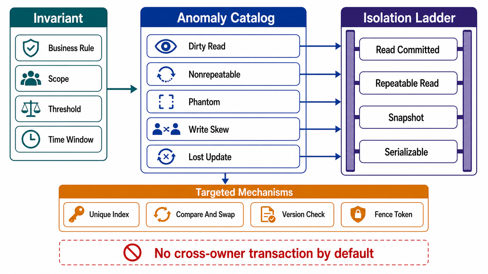

# Transactions, Isolation, and Invariants



## Abstract

Isolation levels are anomaly menus: each level is defined by which interleavings of concurrent transactions it admits, and the correct selection method is to start from the invariants that must hold (Chapter 01 file 01 §5), identify which anomalies can violate each, and buy exactly the isolation that excludes those anomalies. This file supplies the method and its lookup tables. The theoretical spine is Berenson, Bernstein, Gray, Melton, O'Neil & O'Neil's critique of the ANSI SQL isolation levels ([1995](https://www.microsoft.com/en-us/research/wp-content/uploads/2016/02/tr-95-51.pdf)), which showed the standard's phenomena under-specify real levels and formalized snapshot isolation — the level most production engines actually default to, and the one whose signature anomaly, write skew, produces "impossible" states in systems whose designers believed they were serializable. The modern resolution — serializable snapshot isolation, detecting dangerous read-write dependency structures at runtime — is due to Fekete, Cahill et al. and ships in PostgreSQL's `SERIALIZABLE` ([Cahill et al., SIGMOD 2008](https://dl.acm.org/doi/10.1145/1376616.1376690)).

Consistency (file 02) governs what a read sees given replication; isolation governs what concurrent *transactions* may do to each other. The two compose: a serializable transaction on a lagged replica is serializable over stale data. Both contracts must hold on a path for its invariant to hold.

## 1. The Anomaly Catalog

| Anomaly | Shape | Invariant It Breaks |
|---|---|---|
| Dirty read | T2 reads T1's uncommitted write | Any — reads of state that never existed |
| Dirty write | T2 overwrites T1's uncommitted write | Multi-object atomicity |
| Lost update | T1 and T2 read-modify-write the same object; one update vanishes | Counters, balances, any accumulate |
| Non-repeatable read | T1 reads the same object twice, sees different values | Read-then-act logic within one transaction |
| Phantom | T1's predicate query returns different rows on re-execution | Uniqueness, "at most N," queue-claim logic |
| Read skew | T1 reads a consistent pair of objects across T2's commit, sees a mixed state | Cross-object invariants (sum of A+B constant) |
| Write skew | T1 and T2 each read a shared predicate, then write *disjoint* objects invalidating it | Constraints spanning objects: on-call ≥ 1, sum ≤ limit, no double-booking |

Write skew is the star exhibit because snapshot isolation admits it while passing every intuitive test: both transactions read a consistent snapshot, neither overwrites the other, both commit — and the invariant "at least one doctor on call" dies as two doctors, each seeing the other still rostered, simultaneously withdraw ([Berenson et al.](https://www.microsoft.com/en-us/research/wp-content/uploads/2016/02/tr-95-51.pdf)). No test that examines one transaction at a time will ever find it.

## 2. The Isolation Ladder

```text
Figure 1. Isolation levels by admitted anomaly. ANSI names in
caps; the practical ladder includes snapshot isolation, which
ANSI omitted and Berenson et al. formalized. ✗ = excluded,
● = ADMITTED (the level's residual risk).

                     dirty  dirty  lost  non-rep read  phan- write
                     write  read  update    read  skew  tom  skew
 READ UNCOMMITTED      ✗      ●      ●       ●     ●     ●     ●
 READ COMMITTED        ✗      ✗      ●       ●     ●     ●     ●
 REPEATABLE READ       ✗      ✗      ✗       ✗     ✗     ●     ●
 SNAPSHOT ISOLATION    ✗      ✗      ✗       ✗     ✗     ✗*    ●
 SERIALIZABLE          ✗      ✗      ✗       ✗     ✗     ✗     ✗
 (incl. SSI)
 * SI excludes classic phantoms but admits predicate-based
   write skew — the distinction ANSI's phenomena cannot express.
```

Selection warnings the ladder cannot show:

- **Names lie across engines.** Several engines label snapshot isolation as `REPEATABLE READ` (PostgreSQL) or historically as `SERIALIZABLE` (older Oracle); the claim must be verified against the engine's actual behavior, not its keyword — this is what [Hermitage](https://github.com/ept/hermitage) exists to test, engine by engine.
- **Defaults are weak.** `READ COMMITTED` is the common default, admitting lost updates on every read-modify-write. Every accumulator written under a default isolation level is a latent counter bug.
- **Serializable ≠ slow anymore.** SSI's runtime dependency tracking ([Cahill et al.](https://dl.acm.org/doi/10.1145/1376616.1376690)) prices serializability as an abort rate rather than as locking throughput collapse; the review question shifts from "can we afford serializable" to "can this workload's retry loop absorb the abort rate" ([Brooker on SI vs serializability](https://brooker.co.za/blog/2024/12/17/occ-and-isolation.html)).

## 3. Selection Method: Invariant → Anomaly → Level

```text
for each invariant I (Ch01 file 01 §5):
  1. which anomaly interleavings can violate I?      (§1 catalog)
  2. weakest level excluding those anomalies?        (§2 ladder)
  3. cheaper targeted mechanism at a weaker level?   (§4 menu)
  4. declare: I → {level | mechanism}, with the residual
     anomalies at that choice explicitly accepted
```

| Invariant Shape | Violating Anomaly | Cheapest Sound Choice |
|---|---|---|
| Accumulate (balance += x) | Lost update | Atomic in-place update (`SET x = x + ?`) at READ COMMITTED; or SELECT FOR UPDATE; or OCC version check |
| Uniqueness | Phantom | Database unique constraint (declarative beats isolation); else serializable |
| Foreign-key-shaped reference | Phantom / read skew | Declarative FK constraint; else serializable |
| Cross-object sum/threshold | Write skew | Serializable (SSI); or materialize the constraint into one row and lock it |
| Read-then-decide (claim a job, book a slot) | Phantom + write skew | Serializable; or unique-constraint-encoded claims |
| Reconciliation / audit read | Read skew | Snapshot read (consistent point-in-time view suffices; no serializability needed) |

The "materialize the constraint" row is the practical workhorse: write skew exists because the constraint spans rows that no single write touches; collapsing the constraint into one contended row (an on-call-count row, a capacity row) converts write skew into a lost-update problem, which weak levels plus atomic updates already solve. The cost — a hot row — is the file 01 hotspot trade, made consciously.

## 4. Targeted Mechanisms Below Serializable

| Mechanism | Solves | Cost / Caveat |
|---|---|---|
| Atomic read-modify-write in the engine | Lost update | None beyond contention; first choice for accumulators |
| Explicit locking (`SELECT FOR UPDATE`) | Lost update, read-then-act races | Deadlock handling; lock scope discipline |
| Optimistic concurrency (version column, compare-and-set) | Lost update across long think-time | Retry loop mandatory; the version check IS the isolation |
| Declarative constraints (unique, FK, check) | Phantoms for encodable predicates | Only for constraints the engine can express — but those it enforces under ALL levels |
| Single-writer serialization per key (file 01 §3 funneling) | Everything, per key | Throughput bounded by per-key ordering; the log/actor pattern |
| Idempotency keys (Ch01 file 04 §3) | Duplicate effects from retries | Orthogonal to isolation — retries of ABORTED serializable transactions still need it |

The last row's composition point is easy to miss: SSI's answer to dangerous interleavings is abort-and-retry, and a retried transaction that already produced a side effect (an email, a tool call, a queue publish) duplicates it. Serializability governs the database's state; the idempotency contract governs the world's. Both or neither.

## 5. Transactions Across Ownership Boundaries

Within one source of truth, the engine's transaction is the atomicity boundary (Chapter 01 file 07 §6). Across sources of truth — two services, a database and a queue, a store and an index — there is no engine to buy isolation from, and the honest menu is short:

| Pattern | Guarantee Bought | Guarantee NOT Bought |
|---|---|---|
| Transactional outbox → CDC (file 05 §3) | Atomic "state changed AND event will publish" | Readers of the projection see it later (bounded staleness, file 02) |
| Saga with compensations | Eventual completion or documented compensation | Isolation — intermediate states are VISIBLE; other transactions can read mid-saga state |
| Two-phase commit | Atomic multi-store commit | Availability: coordinator failure blocks participants; rarely worth it across trust/ownership boundaries |
| Accept + reconcile | Throughput and availability | Bounded window of divergence, repaired by the file 05 reconciliation machinery |

The saga row's caveat is the one that produces incidents: sagas restore *atomicity* (all-or-compensated) but never *isolation* — a concurrent reader can observe the order-created-but-not-yet-paid intermediate state, so every intermediate state of a saga is a public API state that the Chapter 01 file 04 status machine must represent. A saga whose intermediate states were never designed as visible states is an isolation anomaly generator with a workflow engine attached.

## 6. Approval Gates

| Gate | Evidence Required | Failure Condition |
|---|---|---|
| Mapping gate | Every Ch01 invariant maps to level-or-mechanism via the §3 method, residual anomalies accepted in writing | Isolation chosen by engine default or folklore |
| Verification gate | Claimed level verified against engine behavior (Hermitage-style tests, file 10), not keyword names | "Serializable" or "repeatable read" taken from documentation labels |
| Write-skew gate | Every cross-object invariant is either under SSI/serializable or materialized into a single-row constraint | A multi-row constraint relies on snapshot isolation |
| Retry gate | Serializable abort rate is measured; retry loops exist and compose with idempotency for external effects | Aborts surface as user errors, or retries duplicate side effects |
| Boundary gate | Every cross-ownership transaction names its §5 pattern; saga intermediate states appear in the output-contract status machine | Cross-service atomicity assumed, or saga mid-states are unmodeled |

## Output

The output of this file is an isolation contract per invariant — the weakest level or targeted mechanism that provably excludes the anomalies capable of violating it, verified against engine behavior rather than engine vocabulary, with cross-boundary transactions reduced to one of four honest patterns whose intermediate states are contract states.

## References

- [Berenson et al., "A Critique of ANSI SQL Isolation Levels," SIGMOD 1995](https://www.microsoft.com/en-us/research/wp-content/uploads/2016/02/tr-95-51.pdf)
- [Cahill, Röhm & Fekete, "Serializable Isolation for Snapshot Databases," SIGMOD 2008](https://dl.acm.org/doi/10.1145/1376616.1376690)
- [Kleppmann — Hermitage: testing real isolation levels](https://github.com/ept/hermitage)
- [Brooker, "Snapshot Isolation vs Serializability," 2024](https://brooker.co.za/blog/2024/12/17/occ-and-isolation.html)
- [PostgreSQL documentation — Transaction Isolation (SSI in production)](https://www.postgresql.org/docs/current/transaction-iso.html)
