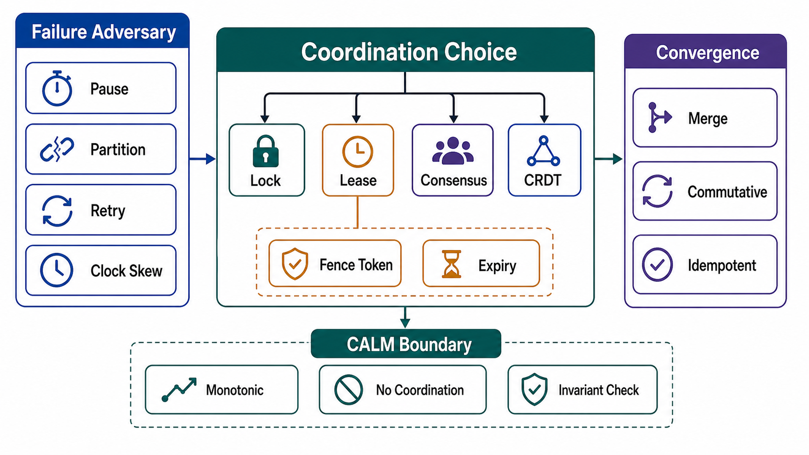

# Coordination: Locks, Leases, and Convergence



## Abstract

Coordination is how distributed components agree on who acts, and every coordination mechanism in an asynchronous system faces the same adversary: the process that acquired authority can pause (GC, VM migration, network delay) for longer than any timeout, then resume and act on authority it no longer holds. This file specifies the mechanisms that survive that adversary — leases with fencing tokens enforced by the resource, not trusted by the client ([Kleppmann's distributed-locking analysis](https://martin.kleppmann.com/2016/02/08/how-to-do-distributed-locking.html), which showed Redlock unsafe precisely because it lacks fencing) — and the complementary escape: the CALM theorem's result that monotonic problems need no coordination at all ([Hellerstein & Alvaro, CACM 2020](https://cacm.acm.org/research/keeping-calm/)), realized in practice by CRDTs ([Shapiro et al., 2011](https://inria.hal.science/inria-00609399)). The engineering discipline is therefore two-sided: coordinate correctly where you must, and restructure the problem to not need coordination where you can.

The file completes file 01's open obligations — §4's fencing condition and §5's arbitrated multi-writer pricing both resolve here.

## 1. The Adversary: Pauses Break Timeouts

```text
Figure 1. Why an unfenced lease fails. Client 1's pause outlasts
the lease; the lock service behaves correctly throughout; the
storage accepts a write from a client whose authority expired.

 client 1     acquire ──── holds lease ────╳ GC pause ╳──── write ──► ✗ accepted!
                                    lease expires              (stale authority)
 lock svc     grant(c1) ......... expire ..... grant(c2)
 client 2                                      acquire ──── write ──► ✓ accepted
 storage                                                   c2 write, THEN c1 write
                                                           → c1 clobbers c2

 with fencing tokens (monotonic epoch issued with each grant):
 storage rule: reject any write carrying token < highest seen
 c1 writes with token 33, c2 with 34 → c1's late write REJECTED
```

The load-bearing insight: **the resource enforces, the client cannot be trusted to check**. A client-side "am I still holding the lock?" test races with the pause by construction — the check can pass and the pause resume between check and write. Only the storage/resource comparing a monotonic token can close the window ([Kleppmann](https://martin.kleppmann.com/2016/02/08/how-to-do-distributed-locking.html)). This is the same epoch mechanism as file 01 §4's fencing-before-promotion: failover and lock expiry are the same problem — authority transfer under uncertainty.

## 2. Coordination Mechanism Menu

| Mechanism | Guarantee | Cost | Sound When |
|---|---|---|---|
| Lease + fencing token from a consensus service | Mutual exclusion with pause safety | Consensus round trip on acquire; resource must check tokens | Correctness-critical exclusion (the only sound general answer) |
| Lease without fencing | Exclusion under timing assumptions only | Cheap | Efficiency-only locks: duplicate work is wasteful but harmless AND idempotent |
| Optimistic concurrency (CAS/version) | Atomic single-object transition | Retry loop under contention | Contention low; conflict = retry is acceptable |
| Single-writer funneling (file 01 §3) | Total order per key, no locks at all | Per-key throughput ceiling; queue infrastructure | Ordered mutation streams; the log-consumer pattern |
| Consensus (Raft/Paxos) directly | Linearizable state machine | Quorum latency on every decision | The arbiter itself: lock services, leader election, partition maps (mechanics: Chapter 05) |
| Coordination-free (CRDT/monotone) | Convergence without any of the above | Merge-compatible invariants only (§4) | Monotonic problems (§3) |

The second row deserves its honest place: unfenced locks are fine for cost-saving ("only one worker should rebuild this cache") *provided* the protected action is idempotent — the classification every lock in the dossier must carry is `correctness` or `efficiency`, because the sound implementations differ. Redlock's failure mode was marketing an efficiency-grade mechanism for correctness-grade use.

## 3. The CALM Boundary: When Coordination Is Unnecessary

The CALM theorem gives the precise boundary: a problem has a consistent, coordination-free distributed implementation **if and only if it is monotonic** — once a conclusion is derivable from some inputs, more inputs never retract it ([Hellerstein & Alvaro](https://cacm.acm.org/research/keeping-calm/)). This turns "can we avoid the lock?" from intuition into a test:

| Problem Shape | Monotonic? | Consequence |
|---|---|---|
| Set/counter growth, event accumulation | Yes | Merge freely; coordinate never |
| "Has X ever happened?" | Yes | Any replica may answer as soon as it knows |
| "Has X *not* happened?" / negation | No | Requires knowing input is complete → coordination |
| Uniqueness, at-most-N, balance ≥ 0 | No | A new concurrent write can invalidate the conclusion → coordinate (file 03's write-skew boundary, rediscovered) |
| Deletion semantics | No (natively) | Made monotonic by tombstones — deletion as accumulating "removed" facts, the trick CRDT sets use |

The non-monotonic rows are exactly the invariants file 01 §5 warned cannot survive arbitrated multi-writer, and exactly the write-skew shapes of file 03 — three files, one underlying theorem. The design move CALM licenses is *restructuring*: many workflows contain a large monotonic core (accumulate observations, propagate knowledge) wrapped around a small non-monotonic kernel (the final uniqueness check); coordinating only the kernel buys most of the availability at none of the correctness cost.

## 4. CRDTs: Convergence as a Data-Type Property

CRDTs implement the monotonic side: state whose merge is associative, commutative, and idempotent converges on every replica regardless of delivery order or duplication ([Shapiro et al.](https://inria.hal.science/inria-00609399)). The review treats them as a priced product, not a fashion:

| Requirement | Detail |
|---|---|
| Type discipline | State is one of the proven types (G-Set, OR-Set, PN-Counter, LWW-Register, RGA/sequence types) or a composition with a proven merge — hand-rolled merges are findings |
| Semantic fit | The type's conflict resolution matches intent: OR-Set's add-wins vs remove-wins is a *product* decision surfaced to review, not a library default |
| Metadata growth | Tombstones and version vectors grow; garbage collection needs (ironically) coordination or causal-stability tracking — budgeted, not discovered |
| Invariant honesty | Only merge-preserved invariants are claimed (file 01 §5's pricing); a PN-Counter can go negative under concurrent decrements — "balance ≥ 0" is NOT a CRDT invariant |
| Convergence SLI | Divergence window and merge-conflict rate exported (file 10) |

## 5. Choosing: The Decision Procedure

```text
for each mutation path over shared state:
  1. is the problem (or its core) monotonic?          → coordination-free
     (CALM test §3; tombstone-ize deletions if that closes it)
  2. can mutation be funneled to a single writer      → funneling; no locks
     per key at acceptable throughput?                  (file 01 §3)
  3. is the race a single-object transition?          → OCC / CAS
  4. is exclusion for efficiency only, action         → plain lease,
     idempotent?                                        no fencing needed
  5. else: correctness-critical exclusion             → consensus-backed lease
                                                        + fencing ENFORCED
                                                        BY THE RESOURCE
```

The ordering is deliberate: each step down the list adds coordination cost and timing sensitivity. Most designs start at step 5 by reflex; the review walks them up the list.

## 6. Anti-Patterns

| Anti-Pattern | Defect | Named Analysis |
|---|---|---|
| Correctness lock without fencing | Paused client writes with expired authority | [Kleppmann on Redlock](https://martin.kleppmann.com/2016/02/08/how-to-do-distributed-locking.html) |
| Client-side "still valid?" re-check | Races the pause it defends against; only resource-side token checks close it | §1 |
| Lock over a non-idempotent action, then retry on timeout | Ambiguous completion → duplicate side effects; needs Ch01 file 04 idempotency regardless | file 03 §4 composition |
| Heartbeat-renewed lease with wall-clock math | Clock skew silently shortens or lengthens authority; use the service's monotonic grant epochs | §1 |
| CRDT for a non-monotonic invariant | Converges to a state that violates the advertised constraint | §4 invariant honesty |
| Distributed lock as a throughput serializer | Coordination on the hot path; a queue (funneling) gives order without lock churn | §2 |
| Two lock services (or lock + failover daemon) for one resource | Two arbiters = no arbiter; the file 01 §4.3 single-arbiter rule | GitHub 2018 shape |

## 7. Approval Gates

| Gate | Evidence Required | Failure Condition |
|---|---|---|
| Classification gate | Every lock/lease is labeled `correctness` or `efficiency`, with idempotency evidence for the latter | An efficiency-grade mechanism protects a correctness-critical action |
| Fencing gate | Correctness exclusion uses monotonic tokens **checked by the resource**; the check is tested under simulated pause (file 10 drill S2) | Fencing exists in the client library but the store accepts unfenced writes |
| CALM gate | The §5 procedure was applied; coordination on monotonic paths is justified or removed | Locks guard accumulate-only or funnel-able mutations |
| CRDT gate | Types are proven, semantics chosen deliberately, metadata growth budgeted, invariants merge-checked | Hand-rolled merge, or non-monotonic invariant claimed over converging state |
| Arbiter gate | Exactly one authority grants each resource's leases; it is consensus-backed | Competing granters, or a lock service weaker than the property it protects |

## Output

The output of this file is a coordination inventory: every exclusion classified and, where correctness-critical, fenced at the resource; every monotonic path stripped of unnecessary coordination via the CALM test; every CRDT priced by its merge-preserved invariants — so that authority under pauses, partitions, and retries is decided by tokens and theorems rather than timing luck.

## References

- [Kleppmann, "How to do distributed locking," 2016](https://martin.kleppmann.com/2016/02/08/how-to-do-distributed-locking.html)
- [Hellerstein & Alvaro, "Keeping CALM: When Distributed Consistency Is Easy," CACM 2020](https://cacm.acm.org/research/keeping-calm/)
- [Shapiro, Preguiça, Baquero & Zawirski, "Conflict-free Replicated Data Types," SSS 2011](https://inria.hal.science/inria-00609399)
- [GitHub — October 21, 2018 post-incident analysis (dueling authority)](https://github.blog/2018-10-30-oct21-post-incident-analysis/)
- [Jepsen — analyses of coordination failures in production systems](https://jepsen.io/analyses)
