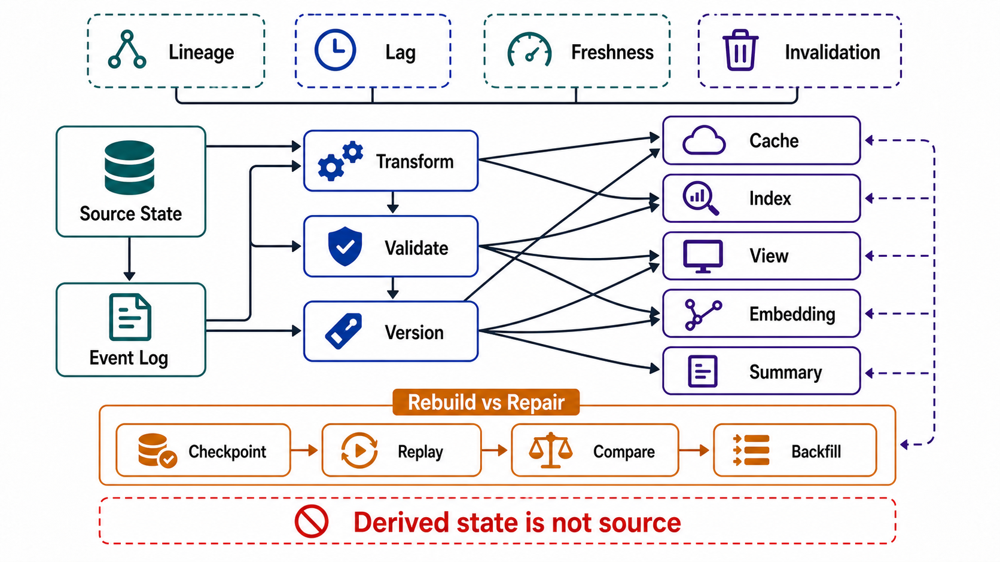

# Derived State and Lineage



## Abstract

Derived state — caches, indexes, embeddings, materialized views, projections, summaries — is where most of a modern system's state actually lives, and it obeys one law: every derived item is a deterministic function of (source versions × transform version), and anything not reconstructible from that tuple is not derived state but an unowned second source of truth wearing a disguise. This file specifies the derivation DAG as a first-class architecture artifact, the change-propagation contracts that keep it honest — transactional outbox and log-based CDC, the pattern family Kleppmann named "turning the database inside out" ([2015](https://martin.kleppmann.com/2015/11/05/database-inside-out-at-oredev.html)) and Debezium industrialized ([outbox pattern](https://debezium.io/blog/2019/02/19/reliable-microservices-data-exchange-with-the-outbox-pattern/)) — and the rebuild-versus-repair decision that determines whether a corrupted projection is an afternoon or a quarter.

The brutal version of the law: if you cannot delete a derived store and regenerate it from its declared sources, you do not have derived state — you have accumulated writes you no longer understand. Chapter 08 will engineer caches and views in detail; this file owns the contracts any of that engineering must satisfy.

## 1. The Derivation DAG

```text
Figure 1. The derivation DAG as a reviewable artifact. Every node
carries versions; every edge carries a propagation contract and a
lag SLI. A node with no path back to a source of truth is a
finding, not a component.

  sources of truth (file 01: one writer each)
  ┌──────────┐      ┌──────────┐
  │ orders   │      │ documents│
  │ v=commit │      │ v=commit │
  │   LSN    │      │   LSN    │
  └────┬─────┘      └────┬─────┘
       │ outbox/CDC      │ CDC
       v                 v
  ┌──────────┐      ┌──────────────┐     ┌─────────────┐
  │ event log│      │ chunker      │────►│ embeddings  │
  │ (replay- │      │ T=v2.3       │     │ T=model-e5@2│
  │  able)   │      └──────────────┘     │ src=doc LSN │
  └──┬───┬───┘                           └──────┬──────┘
     │   │                                      v
     v   v                               ┌─────────────┐
 ┌───────┐ ┌────────────┐                │ vector index│
 │ search│ │ analytics  │                │ lag SLI     │
 │ index │ │ projection │                └─────────────┘
 └───────┘ └────────────┘
  each node: {source_versions, transform_version, lag, rebuild_path}
```

Node contract (extends Chapter 01 file 07 §5):

```yaml
derived_node:
  name:
  sources:                    # upstream nodes; ultimately sources of truth
  transform:
    version:                  # code/model/config version — part of identity
    deterministic: true|false # false → §5 special handling
  propagation:                # §3 mechanism per inbound edge
  lag_sli:                    # freshness metric + bound (feeds Ch01 file 09)
  delete_propagation:         # how source deletion reaches this node (file 06)
  rebuild:
    path:                     # full regeneration procedure
    duration_measured:        # not estimated — measured (drill S4, file 10)
    serving_during_rebuild:   # stale | degraded | offline
  repair:                     # targeted re-derivation for bounded corruption
```

The identity rule embedded in `transform.version`: a derived item's identity is the *pair* (source version, transform version). Re-chunk your documents or swap the embedding model and every existing vector is not "slightly stale" — it is output of a function that no longer exists, unjoinable with new output. The Chapter 01 file 07 embedding warning is this rule's most expensive special case; here it becomes general: any transform change is a rebuild event or a dual-version migration (file 07), never an in-place drift.

## 2. Why the DAG Must Be Explicit

Three failure classes are only diagnosable against an explicit DAG, and all three are common enough to be default assumptions in review:

1. **The disguised source of truth.** A "cache" that took writes directly (file 01 Figure 1's illegal arrow) for two years. Nobody can rebuild it because it is not derived from anything — it *is* the data, unowned. The DAG audit catches this as a node with an inbound client edge.
2. **The diamond.** Two propagation paths from one source converge on one consumer (direct event + via projection). The consumer sees the same logical change twice at different times, transiently contradicting itself. Diamonds need either a version-reconciliation rule at the consumer or an ordering guarantee across paths — the DAG makes them visible; nothing else does.
3. **The undeclared join.** A projection quietly reads a second source mid-transform ("just enriching with the user table"). Its rebuild is now nondeterministic with respect to that source's timeline — replaying old events joins against *today's* users. Every read a transform performs is a DAG edge, declared with a version-pinning rule (join against the source *as of* the event's position, or accept and document the drift).

## 3. Propagation Contracts

The edge mechanisms, in descending order of honesty:

| Mechanism | Guarantee | The Catch |
|---|---|---|
| Transactional outbox → log tailing | Change captured atomically with the commit; ordered per key; replayable | Consumer must be idempotent — the log is at-least-once (Ch01 file 07 §8) |
| Log-based CDC (binlog/WAL tailing) | Every committed change, in commit order, without app cooperation | Schema changes surface raw in the stream; DDL coordination required (file 07); snapshot-plus-stream stitching needs watermarking à la [DBLog](https://netflixtechblog.com/dblog-a-generic-change-data-capture-framework-69100c47a25f) |
| Dual write from the application | None. This is not a mechanism; it is a bug with throughput | The app writes store A then store B; any failure, retry, or reorder between them diverges the two silently — no transaction spans them, no log replays them. Fails review, full stop |
| Periodic re-derivation (batch rebuild) | Convergence at batch cadence; self-healing (the constant-work virtue, Ch02 file 02 §3) | Lag = batch period; fine when the SLI allows it — declare it, don't apologize for it |

The dual-write row is worth its bluntness because it is the pattern teams reach for first — it looks symmetrical and needs no infrastructure. The outbox exists precisely to fix it: write the business row and the event in *one* transaction, let the log carry it out ([Debezium](https://debezium.io/blog/2019/02/19/reliable-microservices-data-exchange-with-the-outbox-pattern/)). The cost is an outbox table and a connector; the alternative cost is a reconciliation job you will write later, in anger, that runs forever.

## 4. Rebuild Versus Repair

Corruption, lag blowout, or transform bugs pose one operational question: regenerate everything, or fix the affected range?

| Dimension | Rebuild | Repair |
|---|---|---|
| Precondition | Replayable sources retained back to genesis (or a durable base snapshot + log since) | Corruption is *boundable* — you can name the affected keys/range/time window |
| Cost | Full re-derivation: measured hours-to-days; serving posture declared in advance | Proportional to blast radius |
| Risk | None to correctness (it is the definition of the state) | The bound is a hypothesis; under-scoped repair leaves silent residue |
| When forced | Transform version change; unbounded/unknown corruption; the disguised-source discovery | Bounded incident: poison event, partial outage window, single-tenant damage |

Two obligations fall out. **Retention is a rebuild dependency**: the event log's retention window (Chapter 01 file 07 §8) silently bounds which rebuilds are possible — a 7-day retention with no base snapshot means "rebuild" is only a word. The DAG contract's `rebuild.path` must name what it replays *from*, and file 06's retention policy must list rebuild as a consumer. **Rebuild time is a measured SLO**: an unmeasured rebuild path is `intended`, not `implemented` (Chapter 01 file 11), and the measurement belongs in the file 10 drill catalog, because rebuild paths rot exactly as fast as backup restores do.

## 5. Nondeterministic Transforms

LLM-generated summaries, sampled rankings, time-of-inference enrichments: transforms whose output differs across runs break the "deterministic function" premise. The honest options, in order of preference:

1. **Pin the nondeterminism into the version**: model + parameters + seed where the stack honors it — restoring determinism per transform version.
2. **Store the output as source-of-truth-with-provenance**: admit the item is *generated* state, not derived — it gets an owner, an audit trail of its inputs (source versions, model version), and no rebuild claim. Regeneration produces a *new* version, not the same one.
3. **Derived-with-tolerance**: declare rebuild-equivalence as semantic ("a valid summary of the same sources"), with the validation gate that checks it — acceptable only where downstream consumers never compare outputs byte-wise.

What is not acceptable is the default drift: calling it derived, rebuilding it casually, and letting citations, caches, and audits reference outputs that no longer exist. Chapter 01 file 09 §8's model-assisted-decision audit row assumed exactly the provenance that option 2 formalizes.

## 6. Approval Gates

| Gate | Evidence Required | Failure Condition |
|---|---|---|
| DAG gate | Every derived node in the file 01 inventory appears in the DAG with sources, transform version, and lag SLI | A derived store exists outside the DAG, or a node has a client write edge |
| Propagation gate | Every edge names its §3 mechanism; no application dual writes | Two stores are kept "in sync" by application code writing both |
| Diamond/join gate | Converging paths have reconciliation rules; every transform read is a declared, version-pinned edge | A consumer can transiently contradict itself, or replay joins against live data |
| Identity gate | Transform changes trigger rebuild or dual-version migration; mixed-version output is unjoinable and blocked | Embeddings/chunks/summaries from different transform versions share one index silently |
| Rebuild gate | Rebuild path replays from named, retention-guaranteed sources; duration measured within the current data generation | Rebuild is asserted but never executed, or retention has silently orphaned it |
| Nondeterminism gate | Every nondeterministic transform picks a §5 option explicitly | Generated state masquerades as rebuildable derived state |

## Output

The output of this file is an explicit derivation DAG — versioned nodes, contracted edges, measured rebuild paths, and honestly classified generated state — such that "delete it and regenerate from source" is a tested property of every derived store, not an origin myth.

## References

- [Kleppmann, "Turning the database inside-out," 2015](https://martin.kleppmann.com/2015/11/05/database-inside-out-at-oredev.html)
- [Debezium — Reliable Microservices Data Exchange with the Outbox Pattern](https://debezium.io/blog/2019/02/19/reliable-microservices-data-exchange-with-the-outbox-pattern/)
- [Netflix — DBLog: A Generic Change-Data-Capture Framework](https://netflixtechblog.com/dblog-a-generic-change-data-capture-framework-69100c47a25f)
- [Meta Engineering — Migrating data ingestion systems at Meta scale (lineage-governed migration)](https://engineering.fb.com/2026/05/12/data-infrastructure/migrating-data-ingestion-systems-at-meta-scale/)
- [Kleppmann, *Designing Data-Intensive Applications* — derived data and dataflow](https://dataintensive.net/)
