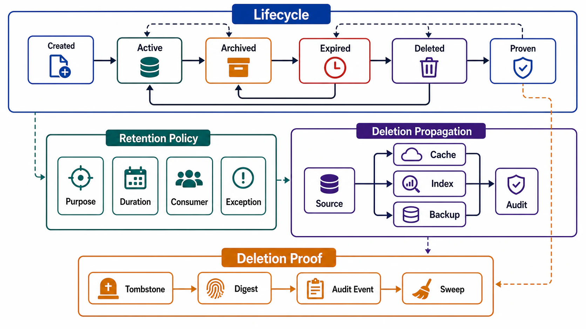

# State Lifecycle, Retention, and Deletion



## Abstract

Every state item moves through a lifecycle — created, active, soft-deleted, retained, erased — and the transitions that destroy information are the only ones you cannot debug afterward, which is why they demand the most design. This file specifies the lifecycle state machine, retention policy as a contract with named consumers (recovery, rebuild, audit, and law all *depend on* retention that deletion wants to end), and deletion as a propagation problem over the file 05 derivation DAG: erasing a source row while its embeddings, caches, backups, and log entries survive is not deletion — it is hiding the original while exhibiting the copies. The regulatory floor is GDPR Article 17's right to erasure ([full text](https://gdpr-info.eu/art-17-gdpr/)); the engineering ceiling is crypto-shredding — per-subject encryption keys whose destruction renders all ciphertext copies, including backups, unrecoverable. The defense-in-depth ordering comes from [Google SRE's data-integrity chapter](https://sre.google/sre-book/data-integrity/): soft deletion exists because *users and operators delete the wrong thing constantly*, and the first defense against data loss is making deletion initially reversible.

The honest tension this file refuses to hide: retention and deletion are opposing obligations pulling on the same bytes, and a policy that names only one of them is half a policy.

## 1. The Lifecycle State Machine

```text
Figure 1. Lifecycle of a state item. The two one-way doors are
marked; everything before them is recoverable by design.

  create
    │
    v
  ┌────────┐   soft_delete    ┌─────────────┐
  │ ACTIVE │ ───────────────► │ SOFT-DELETED│  (recoverable;
  └────────┘ ◄─────────────── │ tombstoned  │   TTL_grace)
    │           restore       └──────┬──────┘
    │ retention                      │ grace expires
    │ class                          v
    v                         ┌─────────────┐
  ┌──────────┐                │ PURGE QUEUE │
  │ ARCHIVED │ ─────────────► │ (propagating│
  │ (cold,   │  legal basis   │  over the   │
  │  cheaper │  ends          │  DAG, §4)   │
  │  claims) │                └──────┬──────┘
  └──────────┘                       │ ══ one-way door ══
    ▲                                v
    │ legal hold                ┌─────────┐
    └── (freezes ALL            │ ERASED  │  provable, audited
        transitions)            └─────────┘
```

State-machine rules:

- **Soft deletion is the first layer, not a luxury.** The SRE data-integrity analysis is blunt about why: the dominant cause of unrecoverable loss is not disk failure but *authorized* deletion of the wrong data — user error, operator error, application bugs ([SRE book](https://sre.google/sre-book/data-integrity/)). GitLab's 2017 outage began as exactly this: an operator removed the wrong directory, and the deletion was instantly real ([postmortem](https://about.gitlab.com/blog/postmortem-of-database-outage-of-january-31/)). A grace window converts a class of catastrophes into a class of tickets.
- **The grace window is a declared number, not a vibe.** It trades recovery insurance against the erasure clock: a 30-day soft-delete window inside a 30-day legal erasure deadline leaves zero days for propagation. The two must be budgeted together (§4).
- **Legal hold is a state, not a memo.** It must mechanically freeze purge transitions for the held scope — a hold implemented as "we told the cron job team" fails the first audit.
- **Archival changes cost claims, not correctness claims.** Archived state keeps its owner, consistency contract, and deletion obligations; only its latency and storage tier change. "It's archived" is never an answer to "who owns this."

## 2. Retention Policy as a Contract With Consumers

Retention is usually written as a compliance chore; it is actually a dependency declaration. Each retention window has consumers who break when it shortens, and a policy is reviewable only when they are named:

| Retention Consumer | What Breaks If Retention Shrinks |
|---|---|
| Recovery (file 08) | RPO claims: PITR reaches back only as far as retained WAL/log |
| Rebuild (file 05 §4) | Derived stores whose replay source ages out become unrebuildable — silently |
| Audit/compliance (Ch01 file 09 §8) | Evidence obligations with statutory minimums |
| Incident forensics | The Ch01 file 10 breach analysis needs history the incident predates |
| Reconciliation | Divergence repair (file 01) needs both sides' history over the divergence window |
| Model/agent replay | Regression evidence for model-assisted decisions (Ch01 file 09) |

```yaml
retention_policy:              # per state item, per data class
  item:
  data_class:                  # Ch01 file 10 §6 classification
  window:                      # duration + trigger (creation | last-use | contract-end)
  legal_basis:                 # why keeping it is lawful (regulated classes)
  consumers:                   # from the table above — named, not implied
  minimum_bound_by:            # the consumer that sets the floor
  maximum_bound_by:            # the obligation that sets the ceiling (erasure, minimization)
  tier_schedule:               # hot → warm → cold transitions
```

The floor/ceiling pair is the policy's whole content: a window with no floor consumer is data hoarding with a schedule; a window with no ceiling is a liability accumulating interest. When floor exceeds ceiling — audit demands 7 years, erasure demands 30 days — the resolution is scope-splitting (retain the audit *event*, erase the personal *payload*) or crypto-shredding (§3), and pretending the conflict away fails review.

## 3. Deletion Mechanisms

Ordered by the strength of what they can prove:

| Mechanism | What It Actually Does | Proof Strength |
|---|---|---|
| Soft delete / tombstone | Marks; hides from default reads; fully recoverable | None — this is a *visibility* change, stage one only |
| Hard delete in the source | Removes from the live store; copies, backups, logs, indexes untouched | Weak — proves one node of the DAG |
| Propagated purge (§4) | Walks the DAG erasing every derived copy; verifies each | Strong for live systems; backups remain |
| Crypto-shredding | Per-subject (or per-scope) key encrypts the data everywhere it lands; erasure = destroy the key | Strongest available: reaches backups, archives, and copies *without touching them* — at the price of key-management becoming the new critical path |
| Physical media destruction | End-of-life hardware | Complements, never substitutes — data outlives media via replication |

Crypto-shredding is the only mechanism whose story survives the backup question ("you erased the row — what about the 90-day-old backup?") without either weakening the erasure claim or rewriting immutable archives. Its honest costs: key granularity must match erasure granularity (per-user keys for per-user erasure — a per-table key shreds everyone); key loss is now total data loss, so the key store inherits file 08's full recovery obligations; and encrypted-at-rest-with-one-master-key provides *none* of this — shredding is a key *architecture*, not a checkbox.

## 4. Deletion as DAG Propagation

Erasure is a traversal of the file 05 derivation DAG, and its completeness is exactly as good as the DAG's:

```text
purge(subject S):
  frontier = sources_of_truth(S)
  for node in topological_order(DAG from frontier):
    erase(node, S)                # delete rows / invalidate keys /
                                  #   remove vectors / rewrite segments
    verify(node, S)               # §5 — absence is checked, not assumed
  handle_special_edges:
    event_log     → tombstone event + compacted-topic key-delete,
                    or crypto-shred the payload (append-only stores
                    cannot un-append)
    backups       → crypto-shred, or documented decay window:
                    "erased from backups by <date>" with restore-time
                    re-purge filter until then
    caches        → invalidate + TTL ceiling as backstop
    ML artifacts  → embeddings/summaries of S go with S (derived-
                    sensitive, Ch01 file 10 §6); models FINE-TUNED on S
                    are a declared risk decision, not an oversight
    third parties → egress inventory (Ch01 file 06) drives outbound
                    deletion requests; their confirmation is audit input
```

Two structural truths. First, **an unmapped DAG makes erasure unprovable** — this is the compliance argument for file 05 that performance arguments understate. The copies you forgot are precisely the ones the auditor, or the attacker, finds. Second, **append-only and immutable stores need deletion designed in at write time**: if erasable data enters an immutable log unencrypted, your erasure options are retention-expiry-as-deletion (honest, slow) or log rewriting (expensive, integrity-breaking). Writing it encrypted under a shreddable key is the design that keeps both properties.

## 5. Proving Deletion

A deletion you cannot prove is a deletion you cannot claim. The proof artifacts:

| Artifact | Content |
|---|---|
| Deletion audit event | Actor, subject scope, legal basis, DAG nodes purged, per-node verification result, completion timestamp (Ch01 file 09 §8's deletion row) |
| Negative verification | Post-purge probes: source query, index search, cache lookup, vector similarity search return nothing for S — sampled, scheduled, and alerting (drill S5, file 10) |
| Backup decay ledger | Which backup generations still contain S, and the date the last one expires or was shredded |
| Third-party confirmations | Deletion request + response per egress destination |

The vector-search probe deserves emphasis because it is the one teams skip: embeddings don't support `WHERE subject = S` — verifying erasure means querying *semantically* for the deleted content and confirming silence. If your vector store can't attribute vectors to subjects, you built it un-erasable (file 09 returns to this).

## 6. Approval Gates

| Gate | Evidence Required | Failure Condition |
|---|---|---|
| Lifecycle gate | Every state item's transitions map onto Figure 1; grace windows and one-way doors declared | Deletion is instantly real (GitLab shape), or "deleted" is undefined |
| Retention gate | Every window has named floor and ceiling consumers; conflicts resolved by scope-split or shredding | Retention exists as a number with no consumers, or floor > ceiling unaddressed |
| Propagation gate | Purge traverses the full DAG including logs, backups, caches, ML artifacts, third parties | Erasure means "deleted the row" |
| Shredding gate | Where backups/immutable stores hold erasable data: crypto-shredding with erasure-granularity keys, or a documented decay window with restore-time re-purge | The backup question has no answer |
| Proof gate | Deletion audit events + scheduled negative verification incl. vector probes | Erasure is claimed on the strength of having run a DELETE statement |
| Hold gate | Legal hold mechanically blocks purge for held scope | Hold depends on humans remembering |

## Output

The output of this file is a lifecycle contract per state item — a state machine with recoverable early stages and provable final ones, retention windows with named floor and ceiling consumers, and erasure defined as verified propagation over the derivation DAG (with crypto-shredding wherever immutability or backups would otherwise make the claim false).

## References

- [Google SRE Book — Data Integrity: What You Read Is What You Wrote (soft deletion, defense in depth)](https://sre.google/sre-book/data-integrity/)
- [GDPR Article 17 — Right to Erasure](https://gdpr-info.eu/art-17-gdpr/)
- [GitLab — Postmortem of database outage of January 31, 2017](https://about.gitlab.com/blog/postmortem-of-database-outage-of-january-31/)
- [Meta Engineering — Privacy-Aware Infrastructure (classification and lineage driving deletion)](https://engineering.fb.com/2026/06/25/security/privacy-aware-infrastructure-in-the-ai-native-era-an-asset-classification-case-study/)
- [OWASP Top 10 for LLM Applications 2025 — LLM08 vector and embedding weaknesses](https://genai.owasp.org/llm-top-10/)
