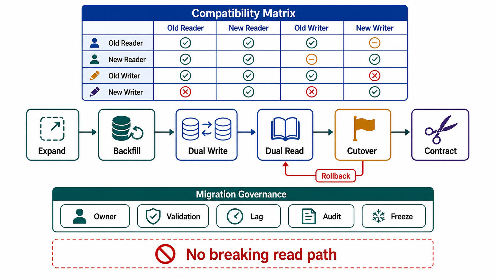

# Schema Evolution and Migration



## Abstract

Schema is the contract between state and every reader and writer of it, and schema change is therefore a distributed coordination problem disguised as a DDL statement: during any real migration, old and new code versions run simultaneously against old and new data shapes, and every combination in that matrix must work. This file specifies the only pattern that survives the matrix — expand/contract (parallel change): add the new shape alongside the old, migrate writers then data then readers in separately deployable steps, and remove the old shape only when telemetry proves it unread ([Fowler, ParallelChange](https://martinfowler.com/bliki/ParallelChange.html); [Prisma's expand-and-contract guide](https://www.prisma.io/dataguide/types/relational/expand-and-contract-pattern)). It also prices the physical layer (online schema-change tooling in the gh-ost/Vitess lineage, which exists because naive `ALTER TABLE` locks production tables for hours) and imports the migration governance Meta documented for moving ingestion systems at scale: shadow execution, correctness comparison, staged rollout, and rollback gates at every phase ([Meta](https://engineering.fb.com/2026/05/12/data-infrastructure/migrating-data-ingestion-systems-at-meta-scale/)).

The brutal framing: there is no such thing as an atomic migration in a system that stays up. Every live migration is a period — hours to months — during which two truths coexist, and the design question is not how to avoid that period but who reconciles the two truths at every moment inside it.

## 1. The Compatibility Matrix

```text
Figure 1. What a live migration actually is: a walk through the
version matrix in which every visited cell must function. Deploys
and data changes move you one cell at a time; there is no diagonal
teleport.

                       data shape
                   old          old+new         new
              ┌───────────┬───────────────┬───────────┐
   code  old  │  start    │ old code must │  ✗ never  │
              │           │ IGNORE new    │  visit    │
              ├───────────┼───────────────┼───────────┤
        old+  │ new code  │  MIGRATION    │ stragglers│
        new   │ must READ │  PLATEAU      │ must not  │
              │ old shape │ (dual write,  │ 500       │
              │           │  backfill)    │           │
              ├───────────┼───────────────┼───────────┤
        new   │  ✗ never  │ cleanup reads │   done    │
              │  visit    │ old-shape     │           │
              │           │ telemetry     │           │
              └───────────┴───────────────┴───────────┘
```

The matrix explains the two rules that void most migration plans:

- **Rollback closes the loop.** Every cell you enter, you may need to exit *backward* — a new-code deploy that wrote new-shape data and then rolls back leaves old code facing new data. Chapter 01 file 04 §6's one-version rollback-safety rule is this matrix's rollback edge, applied to internal schema. Meta's Chapter 02-grade rollout gates apply to every step, not just the first.
- **The forbidden cells are enforced by ordering, not hope.** Old code never meets new-only data because contraction waits for full code rollout *and* read-telemetry silence; new code never meets old-only data because expansion deploys reading code before migrating writers.

## 2. Expand/Contract, With the Steps Nobody Skips Twice

```text
Figure 2. The phases as independently deployable, independently
rollback-able steps. Each gate is evidence, not a calendar date.

 EXPAND        MIGRATE WRITES      BACKFILL        MIGRATE READS      CONTRACT
 add column/   code writes BOTH    copy old→new    reads switch       stop dual
 table/index   old and new         for existing    to new shape,      write; drop
 (additive,    (one transaction    rows (batched,  old path kept      old shape
 no behavior   where possible,     idempotent,     as fallback        after read-
 change)       §3 otherwise)       throttled)      behind a flag      telemetry
    │              │                   │               │              silence
    └──gate────────┴──gate─────────────┴──gate─────────┴──gate────────┘
  schema         dual-write        old≡new on       new-read        zero old-
  applied        divergence        sampled +        error/diff      shape reads
  online,        rate ≈ 0          FULL count       rate ≈ 0        for N days,
  no locks                         comparison                       measured
```

Phase notes with their failure modes attached:

- **Expand** is additive-only and must be online: on large MySQL-family tables, a blocking `ALTER` is an outage, which is why the trigger-less binlog-replay approach (gh-ost) and VReplication-based Online DDL (Vitess) exist — shadow table, batched copy, ongoing-change replay, atomic cutover ([gh-ost design](https://github.com/github/gh-ost/blob/master/doc/cheatsheet.md); [Vitess Online DDL](https://vitess.io/docs/user-guides/schema-changes/)). Postgres has its own traps (rewriting defaults on old versions, index builds without `CONCURRENTLY`); the gate is "applied without a lock the workload can feel," per engine.
- **Migrate writes** is where the file 05 dual-write prohibition needs its careful exception: dual-writing two *shapes inside one store and one transaction* is sound — atomicity holds. Dual-writing across stores remains the bug it always was; cross-store migrations route through CDC/outbox replay instead (§3).
- **Backfill** is a production workload wearing a maintenance costume: it must be batched, throttled against replication lag, resumable from a checkpoint, and *idempotent* — it WILL be re-run. Backfill collides with live writes on the same rows; last-writer-wins against the dual-write is only correct if the backfill copies old→new *only when new is absent* (or versions win deterministically). This is a file 04 OCC problem, and treating it casually re-creates lost updates at table scale.
- **Migrate reads** hides the semantic diff: the new shape is only proven when reads *from it* match reads from the old shape on live traffic — a shadow-read comparison (serve old, compute new, diff, log) is the cheap, honest gate Meta's shadow-execution standard generalizes.
- **Contract** is the step organizations defer forever, and deferral has a real bill: every open migration adds a permanent row to the compatibility matrix that all future changes must test against. Two half-finished migrations on one table give the *next* engineer a 3×3×3 matrix. Contraction telemetry ("zero old-shape reads for N days") turns "probably safe to drop" into a measurement.

## 3. Beyond Columns: The Same Pattern at Every Altitude

| Migration Type | Expand/Contract Instantiation | The Extra Hazard |
|---|---|---|
| Event/message schema | New event version published alongside old; consumers upgraded; old version retired by consumer telemetry | The log's *retention window* keeps old versions readable long after producers stop — readers must handle every version retention can still serve (Ch01 file 04 §6 compatibility, applied to Ch01 file 07 §8 queues) |
| Cross-store migration (engine swap, service split) | New store fed by CDC replay from old (file 05 §3); shadow reads compare; cutover flips reads then writes | The ownership transfer is a file 01 §4 authority transfer — fencing applies to stores, not just replicas; a "brief" dual-authority cutover window is the GitHub-2018 shape scheduled on purpose |
| Derived-state transform change | Build index/embedding set v2 alongside v1 (file 05 §1 identity rule); traffic shifts by comparison gate | Serving mixed v1/v2 results in one response is the unjoinable-output bug; the flag must switch whole read paths, not rows |
| Sharding/partition-key change | New keyspace dual-written; backfill per shard; reads migrate shard-by-shard | Resharding moves *ownership boundaries* — the partition map change is control-plane state with Ch02 file 06 rollout gates |
| API/output contract change | Chapter 01 file 04 §6 versioning | Client rollout is not yours to schedule — contraction may take years; budget for it or version forever |

## 4. Migration Governance

A migration is a project with state, and its state machine belongs in the dossier:

```yaml
migration:
  name:
  matrix_position:            # which Figure 1 cell we are in, TODAY
  phases:
    - phase: expand|write|backfill|read|contract
      gate_evidence:          # the measured condition to advance
      rollback_procedure:     # per phase — backward edges of the matrix
      blast_radius:           # what breaks if this phase is wrong
  comparison:
    method: shadow_read | dual_read_diff | checksum | count + sampled_content
    divergence_budget:        # tolerated diff rate; 0 for correctness paths
  backfill:
    throttle_signal:          # replication lag, p99, queue depth
    checkpoint:               # resumability proof
    idempotence:              # collision rule vs live writes
  abandonment:                # the exit if the migration is cancelled mid-flight
  owner:                      # a person; migrations outlive sprints
  started:                    # date — stale open migrations are findings
```

The `abandonment` field is the one that earns its place in incidents: a migration cancelled at the plateau leaves dual-write code and a half-backfilled shape in production indefinitely unless un-migrating was designed. And `started` plus `matrix_position` makes migration debt visible in review: an expand executed in 2024 with contraction "pending" is not a migration, it is a permanent tax with a polite name.

## 5. Approval Gates

| Gate | Evidence Required | Failure Condition |
|---|---|---|
| Matrix gate | Every code/data version combination the plan visits is enumerated and tested, including rollback edges | The plan assumes atomic cutover, or rollback meets a data shape it cannot read |
| Online gate | Expansion applies without locks the workload feels (engine-appropriate tooling named) | A blocking ALTER/index-build is scheduled against a production table |
| Backfill gate | Batched, throttled, checkpointed, idempotent, with a declared collision rule against live writes | Backfill is a script someone will babysit |
| Comparison gate | Shadow/dual-read diff with a divergence budget gates each read migration | Cutover is scheduled by date rather than by measured equivalence |
| Contraction gate | Old shape dropped only on read-telemetry silence; open migrations carry owner + start date | Migrations accumulate as permanent dual-shape debt |
| Authority gate | Cross-store cutovers follow the file 01 §4 fencing protocol | A migration window deliberately runs two writers without fencing |

## Output

The output of this file is a migration discipline in which every schema change is a walk through an enumerated compatibility matrix — expanded additively, backfilled idempotently, cut over on measured equivalence, contracted on measured silence, rollback-able at every step, and owned by a named person until the old shape is actually gone.

## References

- [Fowler — ParallelChange (expand/contract)](https://martinfowler.com/bliki/ParallelChange.html)
- [Prisma Data Guide — Using the expand and contract pattern](https://www.prisma.io/dataguide/types/relational/expand-and-contract-pattern)
- [gh-ost — GitHub's online schema migration for MySQL](https://github.com/github/gh-ost)
- [Vitess — Online DDL / managed schema changes](https://vitess.io/docs/user-guides/schema-changes/)
- [Meta Engineering — Migrating data ingestion systems at Meta scale](https://engineering.fb.com/2026/05/12/data-infrastructure/migrating-data-ingestion-systems-at-meta-scale/)
