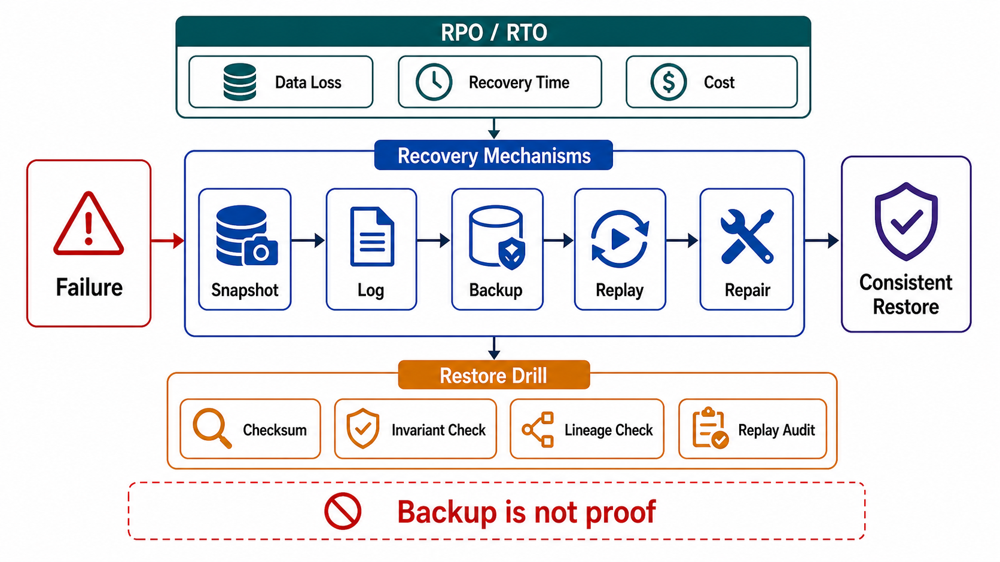

# Recovery, Backup, and Replay



## Abstract

Recovery is the only state contract whose violation is permanent, and it is governed by an uncomfortable epistemological rule: a backup is a hypothesis, and only a restore is evidence. This file specifies recovery as a budgeted, layered, drilled system — RPO/RTO budgets per state item derived from the objective rather than from what the current tooling happens to deliver; the defense-in-depth layering from [Google SRE's data-integrity chapter](https://sre.google/sre-book/data-integrity/) (soft deletion, then backups-plus-restore, then early detection via validation, because the failure modes each layer catches are different); and restore drills as the only admissible evidence class. The founding incident is GitLab's January 2017 outage: an operator deleted the wrong data directory, and *all five* of the team's backup/replication mechanisms turned out to be broken or inapplicable — the eventual source of recovery was a staging snapshot taken by luck six hours earlier, and six hours of customer data were gone permanently ([GitLab postmortem](https://about.gitlab.com/blog/postmortem-of-database-outage-of-january-31/)). Five mechanisms, zero evidence, one coincidence: that is what untested recovery looks like from the inside.

The second lesson, from GitHub's 2018 incident: recovery *time* is a first-class casualty — multi-terabyte restores from remote blob storage took hours, and that duration, not the 43-second fault, defined the outage ([GitHub analysis](https://github.blog/2018-10-30-oct21-post-incident-analysis/)).

## 1. RPO and RTO as Purchased Budgets

```text
Figure 1. The two budgets on one timeline. RPO is bought with
replication/backup frequency (write-path cost, paid always);
RTO is bought with restore bandwidth and warm capacity
(infrastructure cost, paid always, used rarely).

              last durable        fault      service
              recovery point        │        restored
  ────────────────●─────────────────╳───────────●──────────► t
                  │◄──── RPO ──────►│◄── RTO ──►│
                  │  data written   │  restore + replay +
                  │  here is GONE   │  validate + reconnect
```

| Budget | Bought With | The Honest Trade |
|---|---|---|
| RPO (max data loss) | Sync replication (RPO≈0, latency on every write — file 02's ELC cost), async replication lag, WAL/log shipping cadence, backup frequency | RPO≈0 across regions costs cross-region RTT on the write path forever; an RPO of minutes costs only lag monitoring. The objective (Ch01 file 01 failure budget) decides which writes are worth which price — per state item, not per company |
| RTO (max restore time) | Restore bandwidth, snapshot locality, warm standbys, PITR machinery, rehearsed runbooks | RTO is dominated by data volume ÷ restore throughput plus *human orientation time*; GitHub's hours-long blob-storage restore was a bandwidth bill decided years earlier |

Two rules make the budgets real. **They are per state item**: the ledger may buy RPO≈0 while derived indexes buy "rebuild from source" (file 05) and caches buy "cold start" — one blanket number means the cheapest item overpays and the most critical is underinsured. **They compose across the DAG**: restoring a source without its derived stores leaves the system serving contradictions; the recovery plan for an item is the recovery plan for its downstream closure, and total RTO includes derived-state rebuild or re-lag time.

## 2. Defense in Depth

The SRE data-integrity layering, with the reason each layer exists stated plainly ([SRE book](https://sre.google/sre-book/data-integrity/)):

| Layer | Catches | Why the Previous Layer Misses It |
|---|---|---|
| 1. Soft deletion (file 06 §1) | User/operator/application deletion of the wrong data — the *most common* loss cause | It is authorized action; replication faithfully replicates the mistake within seconds |
| 2. Backups + tested restore | Corruption, bad migrations, bugs that soft-delete cannot reverse; infrastructure loss | Soft delete lives inside the store; it dies with the store |
| 3. Early detection (continuous validation) | Slow corruption: bad writes accumulating quietly until every backup generation contains them | Backups are time-bounded; undetected corruption *outlives the retention window* and poisons every restore point |

Layer 3 is the one that separates mature recovery from theater: out-of-band validators (invariant checks, cross-store reconciliation counts, checksum audits) whose job is to shrink *time-to-detection* below *backup retention*. A corruption detected at day 40 with 30-day retention is unrecoverable no matter how good the restore tooling is — detection latency is a recovery parameter, not an observability nicety.

**Replication is not on this list as a backup.** It is an availability mechanism: it propagates deletes and corruption at full speed (GitLab's replicas held the same absence as the primary). Replication protects against machine loss; only versioned history — backups, WAL archives, immutable snapshots — protects against *bad data*. Systems that answer the backup question with "we have three replicas" have confused the two failure classes.

## 3. The Recovery Mechanism Menu

| Mechanism | Restores | Cost Shape | Failure Mode to Design Against |
|---|---|---|---|
| Full snapshot | Whole store at snapshot time | Storage × frequency; restore = full copy time | Staleness = snapshot cadence; GitHub's remote-restore bandwidth bill |
| Snapshot + WAL/PITR | Any instant in the retained window | WAL archive storage + replay time | Replay duration grows with distance from base snapshot; retention floor (file 06 §2) bounds reach |
| Event-log replay (file 05 §4) | Derived state, deterministically | Retention + rebuild compute | Only as good as the log's retention and the transform's determinism |
| Delayed replica | Fast recovery from *recent* mistakes without full restore | One replica's cost, permanently | The delay window is a bet on detection speed |
| Cross-region copies | Region loss, and — if versioned — regional corruption | Egress + storage | Same-credential deletion: backups reachable by the production credentials die *with* production (ransomware's first target); isolation of the backup control plane is a Ch02 file 07 direction rule |
| Reconciliation/repair | Bounded divergence between live stores | Engineering time per incident class | Needs both sides' history over the window (file 06 §2's reconciliation consumer) |

The cross-region row's parenthetical is a real design gate: backups writable or deletable by the credentials that run production are part of production's blast radius. Immutability windows and separated control planes are what make "we have backups" survive an attacker — or a bad automation — that owns the primary environment.

## 4. Restore Is the Product; Backup Is the Byproduct

The GitLab postmortem's enduring content is the enumeration: pg_dump silently producing empty output (version mismatch), Azure disk snapshots not enabled on database servers, LVM snapshots ad hoc, S3 backups empty, and notification email of failures going nowhere ([postmortem](https://about.gitlab.com/blog/postmortem-of-database-outage-of-january-31/)). Every one of those was a *backup* that existed as a line in a config and not as a restore that had ever run. The design consequences:

```yaml
restore_contract:              # per state item
  procedure:                   # executable runbook — commands, not prose
  last_full_exercise:          # date + data generation; stale = assumed, not tested
  measured_rto:                # from drill, at production-representative volume
  measured_rpo:                # actual recovery-point distance achieved in drill
  validation:                  # how restored data is proven correct, not just present
  backup_success_signal:       # ALERT on absence-of-success, never on presence-of-
                               # failure (GitLab's failure emails went to spam)
  scope: item | store | region # drills must cover the largest claimed scope
  first_responder_assumption:  # the drill is run by someone who did NOT write it
```

The alerting inversion matters more than it looks: failure notifications depend on the failing thing successfully reporting its failure. A dead backup job sends nothing. The monitorable event is *the absence of a recent verified success* — a freshness SLI on restore evidence, which slots directly into the Chapter 01 file 09 alerting contract.

## 5. Recovering to Consistency, Not Just to Bytes

Restores land in the past, and the system's other state keeps living in the present. The reconciliation obligations:

- **Cross-item skew**: restoring one store to T while others run at now violates every cross-store invariant (file 03 §5). The plan declares either coordinated restore points (aligned snapshots/log positions across stores) or the reconciliation procedure that repairs the skew — silence here means the first real restore invents it under pressure.
- **The RPO gap is user-visible state loss**: writes between the recovery point and the fault happened — clients got 200s. The output contract's ambiguity machinery (Ch01 file 04) and idempotency records are what let clients detect and re-submit; a system that never planned for "we confirmed it, then unhappened it" will handle it by support ticket.
- **Downstream re-derivation**: after a source restore, every derived store downstream (file 05) is now *ahead* of its source — the DAG must be re-converged (invalidate + rebuild, or rewind consumers to the restore point's log position). Restoring the source and leaving the search index serving deleted-future documents is a correctness and privacy defect, not an inconvenience.
- **Replay side effects**: replaying logs or queues to catch up re-executes effects; without the idempotency discipline of Chapter 01 file 04 §3, recovery *duplicates* what the outage failed to do once — emails, charges, tool calls. Recovery is the load case idempotency was priced for.

## 6. Approval Gates

| Gate | Evidence Required | Failure Condition |
|---|---|---|
| Budget gate | RPO/RTO per state item, derived from the objective, priced against mechanisms; DAG-closure RTO computed | One blanket number, or budgets that current mechanisms cannot mathematically meet |
| Layering gate | All three defense layers present; detection latency < backup retention demonstrated | Replication offered as the backup story, or validation absent so corruption can outlive retention |
| Evidence gate | Every restore contract exercised at representative volume within the current data generation, by a non-author | Backups verified by job exit codes; restore last run on a dataset 100× smaller than production |
| Isolation gate | Backup deletion/overwrite requires credentials and control paths distinct from production's | Production compromise (or automation bug) can destroy the recovery layer with it |
| Signal gate | Absence-of-verified-success alerting on every backup path | Failure-notification emails, going to a folder nobody reads (the literal GitLab mechanism) |
| Consistency gate | Cross-store restore points, RPO-gap client contract, downstream re-derivation, and replay idempotency all declared | The plan restores bytes and calls it done |

## Output

The output of this file is a recovery system rather than a backup habit: per-item RPO/RTO budgets purchased consciously, three defense layers with detection faster than retention, restore contracts proven by drills at production scale, backup infrastructure outside production's blast radius, and a reconciliation story for the fact that every restore lands in the past.

## References

- [GitLab — Postmortem of database outage of January 31, 2017](https://about.gitlab.com/blog/postmortem-of-database-outage-of-january-31/)
- [Google SRE Book — Data Integrity: What You Read Is What You Wrote](https://sre.google/sre-book/data-integrity/)
- [GitHub — October 21, 2018 post-incident analysis (restore duration as the outage)](https://github.blog/2018-10-30-oct21-post-incident-analysis/)
- [AWS Well-Architected Reliability Pillar — failure management and recovery objectives](https://docs.aws.amazon.com/wellarchitected/latest/reliability-pillar/design-interactions-in-a-distributed-system-to-mitigate-or-withstand-failures.html)
