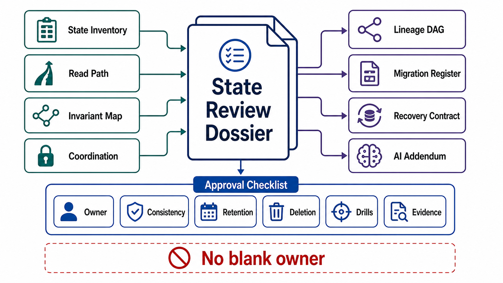

# State Review Templates



## Abstract

This file collects the executable artifacts of Chapter 03: the state inventory with ownership tuples, the per-read-path consistency table, the invariant-to-isolation mapping, the coordination register, the derivation DAG manifest, lifecycle and retention schedules, migration state, recovery contracts, and the drill checklist. Every field is defined and justified in files 01–10; this file adds no new policy. A blank field is a finding, not a formatting choice — and in this chapter more than any other, a blank field is usually a data-loss or data-leak incident with a start date not yet chosen.

## Usage Protocol

1. Complete top-to-bottom; the order matches the file 00 dependency graph, so each section is checkable against those above it.
2. The state inventory must be the Chapter 01 file 07 inventory, extended — same items, now carrying full contracts. Items appearing here but not there (or vice versa) are seam findings.
3. Tag every claim with its file 10 §6 evidence row *and date*. Undated claims are `intended`.
4. Re-run on: new state items, retention changes (audit A4), engine version changes (isolation re-verification), transform/model version changes (identity rule), and drill freshness expiry.

```text
Figure 1. Dossier assembly flow.

  file 01                 files 02–04                files 05–08
  ownership tuple     ──► consistency per path,  ──► DAG manifest,
  per state item          isolation per invariant,   lifecycle/retention,
      │                   coordination register      migration state,
      │                        │                     recovery contracts
      └────────────┬───────────┴──────────┬──────────┘
                   v                      v
        file 09: AI-native instantiation (KV, vectors,
                 memory, sessions, registry)
                   v
        file 10: SLIs + drills S1–S10 + audits A1–A5
                 → evidence class AND DATE per claim
                   v
        approval: state contracts only — no engine,
        store, or vendor selection is approved here
```

## State Inventory (per item — the master table)

```yaml
state_item:
  name:
  class: ephemeral | persistent | shared | derived        # Ch01 f07
  data_class:                                             # Ch01 f10 §6
  ownership:                                              # file 01 §1
    owner_component:
    owner_team:
    source_of_truth:
    write_interface:
    writer_cardinality: single | single_per_partition | multi_arbitrated
    arbitration:            # iff multi_arbitrated: merge fn, invariant pricing
    authority_transfer:     # fencing-first protocol ref, if failover exists
  consistency_read_paths: []            # → read-path table
  invariants_touched: []                # → isolation mapping
  lifecycle:                            # file 06
    soft_delete_grace:
    retention: {window, floor_consumer, ceiling_obligation, legal_basis}
    erasure_mechanism: propagated_purge | crypto_shred | retention_expiry
    legal_hold_mechanism:
  recovery:                             # file 08
    rpo_budget:  {target, mechanism, measured}
    rto_budget:  {target, mechanism, measured, includes_dag_closure: }
    restore_contract_ref:
  derived_from:                         # file 05, iff derived → DAG manifest
  evidence:                             # file 10 §6
    claims: [{claim, class, drill_or_test, date}]
```

## Read-Path Consistency Table

| Read Path | Reader | State Items | Invariant Served | Model Claimed | Mechanism (every intermediary) | PACELC Price | Anomaly Budget + Handling |
|---|---|---|---|---|---|---|---|
|  |  |  |  |  |  |  |  |

## Invariant → Isolation Mapping

| Invariant (Ch01 f01 §5) | Violating Anomalies | Level or Mechanism Chosen | Residual Anomalies Accepted | Verified Against Engine (date) | Abort/Retry Handling |
|---|---|---|---|---|---|
|  |  |  |  |  |  |

## Coordination Register

| Mechanism | Resource Protected | Class: correctness / efficiency | Fencing Enforced By Resource? | CALM Test Applied (monotonic core split?) | Arbiter (single, consensus-backed?) | Drill (S2) Date |
|---|---|---|---|---|---|---|
|  |  |  |  |  |  |  |

## Derivation DAG Manifest (per derived node)

```yaml
derived_node:
  name:
  sources: []                          # ultimately reach a source of truth
  transform: {version, deterministic, nondeterminism_option}   # f05 §5 if false
  propagation: outbox_cdc | log_cdc | batch_rederive           # dual write = finding
  lag_sli: {metric, bound, alert_owner}
  delete_propagation:                  # how erasure reaches this node
  rebuild: {replay_source, retention_guaranteed_until, measured_duration, serving_posture, last_drill}
  diamond_or_join_rules:               # f05 §2 if applicable
```

## Migration Register (per open migration)

| Migration | Matrix Cell Today | Phase | Gate Evidence | Rollback Proc. | Divergence Rate | Owner | Started | Abandonment Plan |
|---|---|---|---|---|---|---|---|---|
|  |  |  |  |  |  |  |  |  |

## Recovery Contracts (per critical store)

| Store | RPO (target/measured) | RTO (target/measured, incl. DAG closure) | Defense Layers (soft-del / backup / validation) | Backup Isolation From Prod Credentials | Absence-of-Success Alert | Last S6 Drill (date, volume, non-author?) |
|---|---|---|---|---|---|---|
|  |  |  |  |  |  |  |

## AI-Native State Addendum

```text
[ ] KV cache: identity = (prefix, model ver, config); tenant scope in key/pool;
    loss = recompute only.
[ ] Vector index: per-vector (doc ver × chunker ver × model ver) + subject
    attribution; model upgrades are dual-index migrations; rebuild measured;
    erasure verified by semantic probe.
[ ] Agent memory: service-mediated writes with trust-class provenance; model
    proposals never auto-committed; erasure walks memory's own DAG (S10).
[ ] Sessions: owner + lifecycle declared before persistence drift;
    read-your-writes mechanized; compaction carries lineage.
[ ] Model registry: identity = weights + tokenizer + template + defaults;
    rollback matrix enumerated across dependent state; registry restorable.
```

## Drill and Audit Checklist

```text
[ ] S1  Failover under write load — fencing before promotion, zero ack'd loss
[ ] S2  Paused lease holder — resource rejected the stale token
[ ] S3  Anomaly suites under partition/pause/failover — within budgets
[ ] S4  Derived store deleted and rebuilt from sources — equal, in time
[ ] S5  Full-DAG erasure of synthetic subject — negative verification passed
[ ] S6  PITR restore at production volume by non-author — RTO/RPO met
[ ] S7  Injected divergence — reconciliation detected and repaired in window
[ ] S8  Mid-migration rollback at the plateau — old code, mixed data, no loss
[ ] S9  CDC consumer kill/replay with duplicates — convergent, no dup effects
[ ] S10 Memory injection + erasure — rejected/quarantined; forgotten provably
Each line: date + data generation + evidence link.

[ ] A1 write legality   [ ] A2 DAG closure    [ ] A3 claim ceiling
[ ] A4 retention floor  [ ] A5 lineage totality      (CI + prod traces)
```

## Approval Checklist

```text
[ ] Every state item carries the full ownership tuple; no blank owner,
    source of truth, or write interface (file 01).
[ ] Writer cardinality declared everywhere; multi-writer items carry merge
    pricing and claim only merge-preserved invariants (files 01 §5, 04 §4).
[ ] Authority transfer is fencing-first with a single consensus-backed
    arbiter (files 01 §4, 04).
[ ] Every read path claims a model with mechanism covering every intermediary,
    a PACELC price, and a handled anomaly budget (file 02).
[ ] Every invariant maps to an isolation level or targeted mechanism verified
    against the engine, with write-skew shapes explicitly covered (file 03).
[ ] Cross-ownership transactions use a named pattern; saga intermediate
    states are output-contract states (file 03 §5).
[ ] Every lock is classified correctness/efficiency; correctness locks are
    fenced at the resource; monotonic paths carry no locks (file 04).
[ ] Every derived store is in the DAG with versions, propagation contract,
    lag SLI, delete propagation, and measured rebuild (file 05).
[ ] No application dual writes anywhere (file 05 §3).
[ ] Every retention window has a named floor consumer and ceiling obligation;
    conflicts resolved by scope-split or crypto-shredding (file 06).
[ ] Erasure is DAG propagation with negative verification, incl. logs,
    backups, caches, vectors, memory, third parties (file 06 §4–5).
[ ] Every migration is expand/contract with enumerated matrix cells, gated
    phases, rollback edges, owner, start date, abandonment plan (file 07).
[ ] RPO/RTO are per-item budgets, measured by drill at production volume;
    three defense layers; detection latency < backup retention;
    backups outside production's credential blast radius (file 08).
[ ] AI-native addendum complete (file 09).
[ ] Every claim carries an evidence class AND date; S1–S6 within freshness
    windows; A1–A5 continuous (file 10).
```

## Final Approval Statement

```text
Chapter 03 approval is granted only for the state contracts: ownership,
consistency, isolation, coordination, lineage, lifecycle, migration,
recovery, and their evidence. It does not approve any database engine,
event log, cache, vector store, or storage service. Chapter 04 selects
engines against these contracts; Chapter 05 distributes them; Chapter 08
engineers the caches and views whose obligations were fixed here.
```
