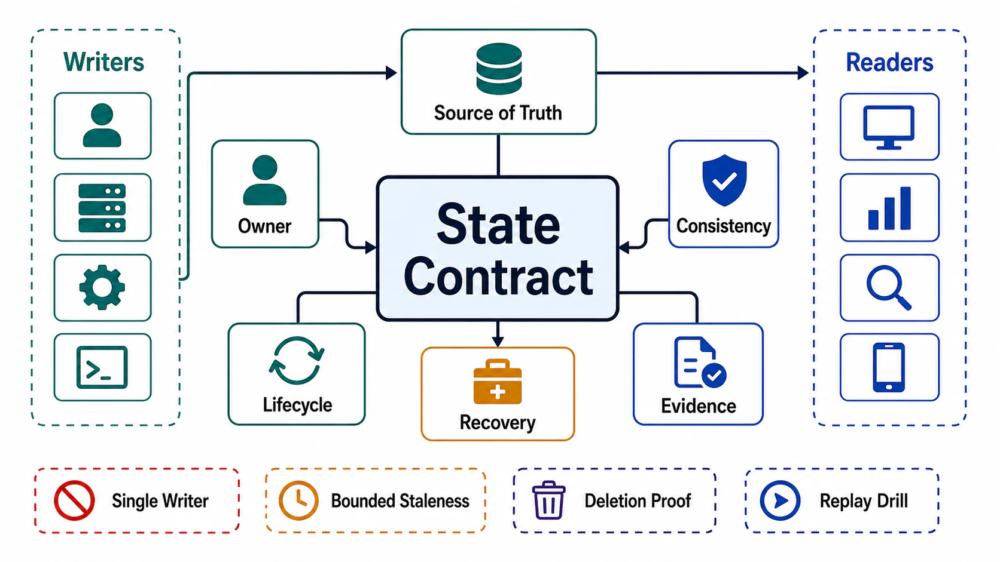

# Chapter 03: State Ownership and Consistency Model

## Abstract

Every state item must have an owner, a lifecycle, a consistency contract, an invalidation path, and a recovery behavior — and ephemeral, persistent, shared, and derived state require different correctness guarantees. This chapter turns that boundary-level declaration (Chapter 01 file 07) into enforceable machinery: ownership as write authority with fencing-first transfer, consistency purchased per read path under PACELC pricing, isolation selected per invariant against the anomalies that can actually violate it, coordination that survives process pauses (and is removed entirely where the CALM theorem proves it unnecessary), derived state as an explicit versioned DAG, deletion as provable propagation over that DAG, schema change as a walk through an enumerated compatibility matrix, recovery as drilled evidence rather than configured hope, and the five AI-native state classes — KV cache, vectors, agent memory, sessions, model artifacts — held to exactly the same rules they currently ship without.

The chapter's evidence is deliberately scar tissue: GitHub's 2018 split-brain, where 43 seconds of dual write authority cost 24 hours of reconciliation ([postmortem](https://github.blog/2018-10-30-oct21-post-incident-analysis/)); GitLab's 2017 outage, where all five backup mechanisms turned out to be untested fiction and six hours of data vanished ([postmortem](https://about.gitlab.com/blog/postmortem-of-database-outage-of-january-31/)); and the standing Jepsen record that documented guarantees and delivered guarantees are different facts until tested ([analyses](https://jepsen.io/analyses)). The chapter's one-sentence version: state contracts fail silently, so every one of them must be wired to something that can fail loudly.

## Chapter Structure

Each file is a self-contained research note: abstract, formal model, ASCII figures, decision tables, approval gates that can fail a design, and primary-source references. The reading order is a dependency graph (see [00-chapter-file-map.md](00-chapter-file-map.md)).

| Order | File | Concept |
|---:|---|---|
| 0 | [00-chapter-file-map.md](00-chapter-file-map.md) | Folder map, dependency graph, seams to Chapters 04/05/08 |
| 1 | [01-state-ownership-model.md](01-state-ownership-model.md) | Ownership tuple, single-writer rule, fencing-first authority transfer, arbitrated multi-writer pricing |
| 2 | [02-consistency-model-selection.md](02-consistency-model-selection.md) | Per-read-path selection, model ladder by admitted anomaly, PACELC, session guarantees, composition rule |
| 3 | [03-transactions-isolation-and-invariants.md](03-transactions-isolation-and-invariants.md) | Anomaly catalog, isolation ladder, write skew, invariant→level method, cross-boundary patterns |
| 4 | [04-coordination-locks-leases-and-convergence.md](04-coordination-locks-leases-and-convergence.md) | Fencing tokens, lease safety under pause, CALM boundary, CRDT pricing, decision procedure |
| 5 | [05-derived-state-and-lineage.md](05-derived-state-and-lineage.md) | Derivation DAG, outbox/CDC contracts, dual-write prohibition, rebuild vs repair, nondeterministic transforms |
| 6 | [06-state-lifecycle-retention-and-deletion.md](06-state-lifecycle-retention-and-deletion.md) | Lifecycle machine, retention floor/ceiling, crypto-shredding, erasure as DAG propagation with proof |
| 7 | [07-schema-evolution-and-migration.md](07-schema-evolution-and-migration.md) | Compatibility matrix, expand/contract phases with gates, online DDL, migration governance |
| 8 | [08-recovery-backup-and-replay.md](08-recovery-backup-and-replay.md) | RPO/RTO budgets, three defense layers, restore-as-evidence, backup isolation, recovering to consistency |
| 9 | [09-ai-native-state.md](09-ai-native-state.md) | KV cache, embeddings/vectors, agent memory, session drift, model registry — contracts instantiated |
| 10 | [10-verification-of-state-contracts.md](10-verification-of-state-contracts.md) | Adversarial consistency/isolation testing, state SLIs, drills S1–S10, audits A1–A5 |
| 11 | [11-state-review-templates.md](11-state-review-templates.md) | Executable dossier and approval checklist |

## Source Corpus

| Source | Official Material | Standard Imported Into This Chapter |
|---|---|---|
| Kleppmann | [Distributed locking and fencing](https://martin.kleppmann.com/2016/02/08/how-to-do-distributed-locking.html), [Hermitage](https://github.com/ept/hermitage), [Database inside-out](https://martin.kleppmann.com/2015/11/05/database-inside-out-at-oredev.html), [*DDIA*](https://dataintensive.net/) | Fencing tokens enforced by the resource as the only pause-safe exclusion; isolation verified per engine, not per keyword; derived state as replayable dataflow from a log of record. |
| Berenson, Gray et al. / Fekete, Cahill | [Critique of ANSI SQL isolation, 1995](https://www.microsoft.com/en-us/research/wp-content/uploads/2016/02/tr-95-51.pdf), [Serializable SI, SIGMOD 2008](https://dl.acm.org/doi/10.1145/1376616.1376690) | Isolation levels as anomaly menus; snapshot isolation's write skew as the signature silent failure; SSI pricing serializability as an abort rate. |
| Abadi / Brewer / Terry | [PACELC, IEEE Computer 2012](https://ieeexplore.ieee.org/document/6127847/), [CAP Twelve Years Later](https://www.infoq.com/articles/cap-twelve-years-later-how-the-rules-have-changed/), [Session guarantees, PDIS 1994](https://dl.acm.org/doi/10.1109/PDIS.1994.331722) | Consistency priced on every request (latency), not only during partitions; session guarantees as the workhorse tier between strong and eventual. |
| Hellerstein & Alvaro / Shapiro et al. | [CALM, CACM 2020](https://cacm.acm.org/research/keeping-calm/), [CRDTs, SSS 2011](https://inria.hal.science/inria-00609399) | Coordination-free consistency iff monotonic; CRDTs as priced products whose merge-preserved invariants are the only claimable ones. |
| Jepsen | [Analyses](https://jepsen.io/analyses), [Consistency map](https://jepsen.io/consistency) | Documented guarantees violate under partition and pause until adversarially tested; the formal model vocabulary. |
| GitHub / GitLab | [Oct 2018 post-incident analysis](https://github.blog/2018-10-30-oct21-post-incident-analysis/), [Jan 2017 postmortem](https://about.gitlab.com/blog/postmortem-of-database-outage-of-january-31/) | Split authority as the founding ownership incident; five untested backup mechanisms as the founding recovery incident; restore duration as the outage. |
| Google SRE | [Data Integrity chapter](https://sre.google/sre-book/data-integrity/) | Defense in depth: soft deletion first (authorized deletion is the top loss cause), tested restores second, continuous validation third — detection latency must beat backup retention. |
| Debezium / Netflix | [Outbox pattern](https://debezium.io/blog/2019/02/19/reliable-microservices-data-exchange-with-the-outbox-pattern/), [DBLog](https://netflixtechblog.com/dblog-a-generic-change-data-capture-framework-69100c47a25f) | Atomic change capture via outbox + log tailing; watermark-based snapshot/stream stitching; application dual writes as a categorical prohibition. |
| GitHub / Vitess / Fowler / Prisma | [gh-ost](https://github.com/github/gh-ost), [Online DDL](https://vitess.io/docs/user-guides/schema-changes/), [ParallelChange](https://martinfowler.com/bliki/ParallelChange.html), [Expand/contract](https://www.prisma.io/dataguide/types/relational/expand-and-contract-pattern) | Lock-free physical schema change; expand/contract as the only pattern that survives the code×data version matrix. |
| Meta | [Privacy-aware infrastructure](https://engineering.fb.com/2026/06/25/security/privacy-aware-infrastructure-in-the-ai-native-era-an-asset-classification-case-study/), [Ingestion migration at scale](https://engineering.fb.com/2026/05/12/data-infrastructure/migrating-data-ingestion-systems-at-meta-scale/) | Lineage-governed classification and deletion; shadow execution and staged gates for state migrations. |
| Standards / AI research | [GDPR Art. 17](https://gdpr-info.eu/art-17-gdpr/), [OWASP LLM Top 10 2025](https://genai.owasp.org/llm-top-10/), [MemGPT](https://arxiv.org/abs/2310.08560), [LLM memory security survey, 2026](https://arxiv.org/html/2604.16548v1) | Erasure as a legal floor; vector/embedding weaknesses as a named risk class; tiered agent memory; provenance and trust-class as the memory failure mode. |

## Chapter Standards

1. Every state item has exactly one writer (or a priced arbitration), one source of truth, and one audited write interface — enforced by the store, not by convention.
2. Authority transfer is fencing-first, decided by a single consensus-backed arbiter; acknowledged-write durability across failover is stated, not assumed.
3. Consistency is claimed per read path, with the delivering mechanism covering every intermediary, a PACELC price, and a handled anomaly budget.
4. Isolation is selected per invariant by the anomaly that can violate it, verified against engine behavior; every cross-object invariant is under serializability or materialized into a single-row constraint.
5. Cross-ownership atomicity uses outbox/CDC, saga, 2PC, or accept-and-reconcile — and saga intermediate states are public contract states.
6. Locks are classified correctness or efficiency; correctness locks carry resource-enforced fencing tokens; monotonic paths (CALM) carry no locks at all.
7. Derived state lives in an explicit DAG with (source × transform) versions, propagation contracts, lag SLIs, and measured rebuild paths; application dual writes are prohibited.
8. Nondeterministic transforms are pinned, or reclassified as generated state with provenance — never passed off as rebuildable.
9. Retention windows carry named floor consumers and ceiling obligations; floor-versus-ceiling conflicts resolve by scope-split or crypto-shredding.
10. Erasure is verified propagation over the DAG — including logs, backups, caches, vectors, memory, and third parties — with negative verification and audit artifacts.
11. Schema change is expand/contract through an enumerated code×data matrix, gated by measured equivalence and contracted on measured silence, rollback-able at every cell.
12. RPO/RTO are per-item purchased budgets; restores are evidence only when drilled at production volume by a non-author; backup destruction requires credentials production does not hold.
13. Detection latency for corruption must be shorter than backup retention, demonstrably.
14. AI-native state (KV, vectors, memory, sessions, registries) satisfies every rule above; the model never writes state unmediated, and injected content is never committed as first-party fact.
15. Every state claim carries an evidence class and a date; drills S1–S10 and audits A1–A5 keep the claims current or downgrade them in writing.

## Chapter Completion Gate

Chapter 03 is complete only when the reviewer can answer these questions without guessing:

- For any state item: who may write it, through which interface, and what fences a stale writer out?
- For any read path: what may it return, delivered by which mechanism, at what latency price, with which anomalies handled?
- For any invariant: which anomaly could violate it, and what excludes that anomaly — verified against the engine on what date?
- For any derived store: from what is it derived, at which versions, how stale is it now, and how long does a measured rebuild take?
- For any person's data: every place it lives, and the evidence it is gone when the law says so?
- For any migration in flight: which matrix cell is it in today, who owns it, and what happens if it is abandoned?
- For any critical store: the measured — not configured — RPO and RTO, and the date someone other than the author last proved them?
- For any agent: what can write to its memory, under whose policy, with what provenance — and can it forget on demand, provably?

## Final Position

State is the part of the system that remembers your mistakes. Compute failures end when the process restarts; state failures compound silently until the day they are discovered, at which point the remediation cost has been accruing interest since the day the contract was skipped. This chapter's machinery — owners, fences, budgets, DAGs, drills — is the price of being able to answer, at any moment, the only question that matters about data: *why do we believe this is correct?* The chapters that follow choose engines, replication schemes, and caches; every one of those choices is checkable only against the contracts fixed here.
