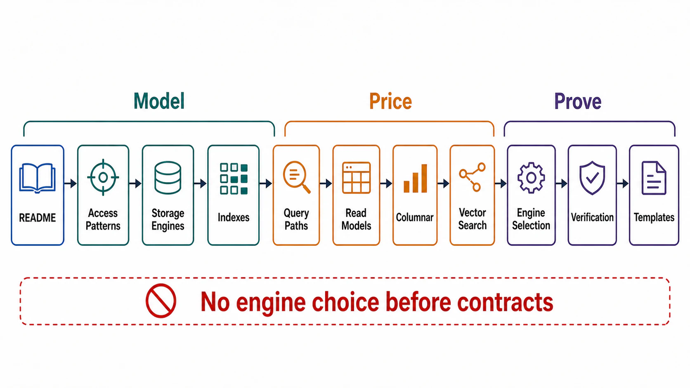

# Chapter 04 File Map



## Purpose

Chapter 03 fixed the state contracts — ownership, consistency, isolation, lineage, lifecycle, recovery. This chapter spends them: data layout, storage engine, index set, and query shape are the decisions that determine whether those contracts are affordable, because every one of them moves cost between the write path, the read path, storage amplification, and recovery complexity. The chapter's law, inherited from the root thesis: data layout must match access patterns — and its corollary, proven at trillion-row scale, is that layout chosen against the access pattern fails not at design review but at the hot partition two years later.

Each file is a self-contained research note: an abstract stating the claim, a formal model, figures, decision tables, approval gates that can fail a design, and primary-source references.

## Reading Order

| Order | File | Architecture Decision Produced |
|---:|---|---|
| 1 | [README.md](README.md) | Chapter thesis, source corpus, and completion gate |
| 2 | [01-access-pattern-driven-data-modeling.md](01-access-pattern-driven-data-modeling.md) | Access-pattern matrix, partition/key design, normalization as a priced trade |
| 3 | [02-storage-engine-mechanics-and-amplification.md](02-storage-engine-mechanics-and-amplification.md) | RUM position per store; B-tree/LSM mechanics; amplification budgets |
| 4 | [03-indexing-and-write-amplification.md](03-indexing-and-write-amplification.md) | Index set as a priced portfolio; covering/partial/composite discipline |
| 5 | [04-query-path-contracts.md](04-query-path-contracts.md) | Bounded-work queries, planner risk management, pagination, N+1 elimination |
| 6 | [05-denormalization-projections-and-read-models.md](05-denormalization-projections-and-read-models.md) | Read models as DAG nodes; when to materialize versus compute |
| 7 | [06-analytical-paths-and-columnar-storage.md](06-analytical-paths-and-columnar-storage.md) | OLTP/OLAP separation, columnar formats, lakehouse table contracts |
| 8 | [07-vector-and-hybrid-search-paths.md](07-vector-and-hybrid-search-paths.md) | ANN index selection (HNSW/IVF/PQ/disk-based), recall as an SLI, filtered and hybrid search |
| 9 | [08-engine-selection-against-contracts.md](08-engine-selection-against-contracts.md) | Selection procedure: Chapter 03 contracts as the rubric; sprawl budget |
| 10 | [09-verification-of-data-paths.md](09-verification-of-data-paths.md) | Plan-regression testing, production-shaped load tests, drills Q1–Q8 |
| 11 | [10-data-path-review-templates.md](10-data-path-review-templates.md) | Executable dossier and approval checklist |

## Approval Dependency Graph

```text
Figure 1. Chapter 04 approval dependency graph.

  [01] Access-pattern matrix (the workload, made concrete)
        │
        ├──────────────────────────────┐
        v                              v
  [02] Storage-engine mechanics   [04] Query-path contracts
       + amplification budgets         (bounded work, pagination)
        │                              ▲
        v                              │
  [03] Index portfolio ────────────────┘
        │
        v
  [05] Read models / projections
        │
        ├──────────────┬────────────────┐
        v              v                │
  [06] Analytical  [07] Vector/hybrid   │
       paths            search paths    │
        │              │                │
        └──────┬───────┴────────────────┘
               v
  [08] Engine selection against Ch03 contracts
               v
  [09] Verification ──► [10] Dossier
```

Concrete dependencies the graph encodes:

- Index decisions ([03]) are unpriceable before the engine's amplification model ([02]) exists — the same index costs differently on a B-tree and an LSM.
- Query contracts ([04]) and the index portfolio ([03]) are one negotiation: every bounded query names the index that bounds it.
- Read models ([05]) instantiate the Chapter 03 derivation DAG; nothing in [05] may contradict a file [01] access pattern it exists to serve.
- Engine selection ([08]) is deliberately *late*: it consumes everything above plus Chapter 03's contracts. Selecting the engine first and discovering the access patterns after is the anti-pattern this ordering exists to kill.

## Prerequisites From Earlier Chapters

| Artifact | Consumed By |
|---|---|
| Workload vector and cost model ([Ch01 file 02](../01-architectural-objective-and-system-boundary/02-workload-and-capacity-envelope.md)) | [01] — the access-pattern matrix is its per-store projection |
| Bounded-query rule ([Ch01 file 02 §5](../01-architectural-objective-and-system-boundary/02-workload-and-capacity-envelope.md)) | [04] |
| State ownership and consistency contracts ([Ch03 files 01–02](../03-state-ownership-and-consistency-model/01-state-ownership-model.md)) | [08] — the selection rubric |
| Derivation DAG ([Ch03 file 05](../03-state-ownership-and-consistency-model/05-derived-state-and-lineage.md)) | [05], [06], [07] — every projection, table snapshot, and vector index is a DAG node |
| Migration discipline ([Ch03 file 07](../03-state-ownership-and-consistency-model/07-schema-evolution-and-migration.md)) | [03], [08] — index changes and engine swaps are migrations |
| Recovery budgets ([Ch03 file 08](../03-state-ownership-and-consistency-model/08-recovery-backup-and-replay.md)) | [02], [08] — engine choice sets restore mechanics |

## Chapter Rule

Chapter 04 approves data layouts, index portfolios, query contracts, and engine selections — each priced in read, write, and space amplification against the declared access patterns, and each shown to satisfy the Chapter 03 contracts. It does not approve replication topology, partition placement, or quorum configuration (Chapter 05), and it does not approve cache or materialized-view engineering beyond the contracts already fixed (Chapter 08).
