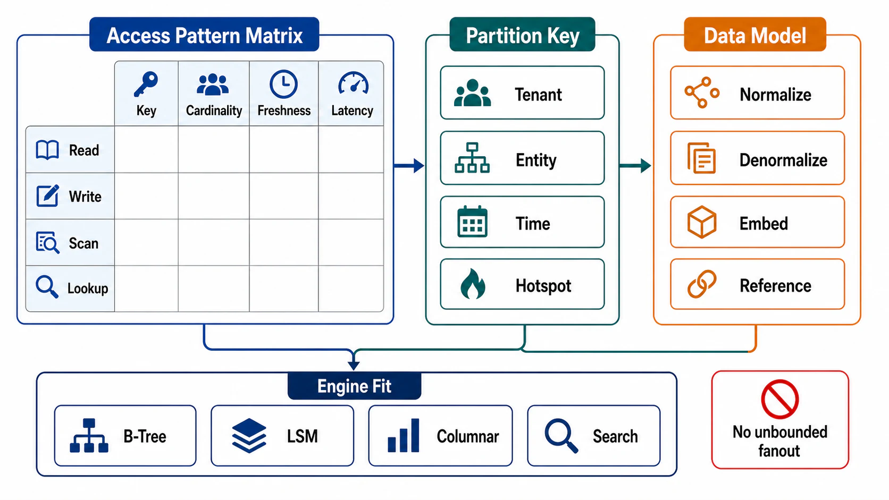

# Access-Pattern-Driven Data Modeling



## Abstract

Data modeling has exactly one sound direction: from access patterns to layout, never from entities to layout with queries discovered later. This file specifies the access-pattern matrix as the modeling artifact that precedes any schema, the partition-key discipline that keeps load distributable, and normalization as a priced trade between write-path simplicity and read-path fanout rather than a virtue. The founding production evidence runs in both directions. Positive: DynamoDB's data-modeling doctrine — enumerate every access pattern first, then design keys and tables to serve each with bounded work — exists because the engine refuses to rescue unplanned queries ([AWS data-modeling best practices](https://docs.aws.amazon.com/amazondynamodb/latest/developerguide/best-practices.html)). Negative: Discord's message store, partitioned by (channel, time bucket), met a workload where one enormous channel turned its partition into a hotspot that degraded whole nodes — the layout was reasonable per entity and wrong per access distribution, and the repair required request coalescing services and ultimately a storage migration ([Discord, trillions of messages](https://discord.com/blog/how-discord-stores-trillions-of-messages)).

The brutal framing: entity-relationship modeling answers "what is true about the domain"; systems fail on "what is asked, how often, by whom, with what skew." A schema is a bet on a query distribution, and bets placed without looking at the distribution lose slowly and then suddenly.

## 1. The Access-Pattern Matrix

The modeling artifact that precedes schema. Each row is one question the system asks of its data — derived from the Chapter 01 file 02 workload vector, made store-concrete:

```yaml
access_pattern:
  name:                        # "fetch last 50 messages in channel"
  caller:                      # client class / service (Ch01 file 03)
  shape: point | range | scan | aggregate | search | similarity
  key_inputs:                  # what the caller HAS when asking
  result_bounds:               # max rows/bytes returned (Ch01 bounded-work rule)
  rate: {sustained, burst}     # per Ch01 file 02
  latency_budget:              # from the request-class decomposition
  consistency:                 # read-path claim (Ch03 file 02) this pattern needs
  skew:                        # hot-key distribution: uniform | zipfian | few-giants
  write_coupling:              # which mutations must this read observe, how fast
```

Two fields carry the incident history. `key_inputs` enforces the navigability rule: a pattern whose key inputs cannot reach the data through a key or index is a scan wearing a query costume — it either gets a layout that serves it or it gets rejected, but it does not get discovered in production. `skew` is the Discord field: "partition by channel" was fine for the median channel and catastrophic for the tail giant, because partition schemes are defeated by their largest key, not their average one.

## 2. Partition-Key Discipline

```text
Figure 1. The three tests every partition key must pass. Failing
any one produces a named production pathology.

  TEST 1: cardinality        keys >> partitions, or growth
          ────────────       concentrates on few partitions
                             ✗ fail → "one giant tenant" hotspot

  TEST 2: load uniformity    p99 key's rate ÷ median key's rate
          ────────────────   within the engine's per-partition
                             headroom
                             ✗ fail → Discord's hot partition:
                             one channel saturates a node while
                             the fleet idles

  TEST 3: pattern locality   every high-rate access pattern
          ────────────────   resolves within one partition (or a
                             bounded, named set)
                             ✗ fail → scatter-gather on the hot
                             path: fanout latency (Ch01 file 02
                             §4.2) bought permanently by layout
```

Design responses when a test fails, in preference order: compound keys that split the giant (channel + time bucket splits history, not concurrent load — Discord's lesson is that bucketing solves *volume* skew but not *rate* skew); key salting/sharding for rate skew (N sub-keys per hot key, fan-in at read — a read-cost purchase, priced in the matrix); request coalescing above the store for read-rate skew (Discord's data-service layer: concurrent identical reads collapse to one — architecture absorbing what layout could not); and isolation of the giants (the largest tenants get their own partitions/tables — the Chapter 01 file 03 blast-radius argument applied to layout).

The honest rule about time: time-leading keys (`2026-07-05#...`) put *all current writes* on one partition forever. Time belongs in the sort key or the bucket suffix, never at the front of the partition key of a write-heavy table.

## 3. Normalization as a Priced Trade

Normalization is not hygiene; it is a position on the write-cost/read-cost axis, and the matrix decides it per relationship:

| Property | Normalized (reference) | Denormalized (copy) |
|---|---|---|
| Write path | One place to update; invariants local (Ch03 file 03) | Every copy is a write obligation — via the Ch03 file 05 DAG, never dual writes |
| Read path | Join/fanout per read — N+1 risk (file 04 §5) | One bounded read; the pattern's latency budget met by layout |
| Consistency | Single-source; trivially coherent | Copies lag; the read path inherits a staleness claim (Ch03 file 02) that must be declared |
| Failure mode | Slow reads under fanout; planner risk on joins | Stale or orphaned copies; the disguised-source pattern if the copy's lineage is lost |
| When it wins | Write-heavy, invariant-dense, read patterns diverse and low-rate | Read-heavy, latency-tight, pattern known and stable |

The decision procedure: for each high-rate access pattern, if serving it normalized requires joins/fanout exceeding its latency budget or violating the bounded-work rule, materialize a denormalized shape *as a derived DAG node* (Ch03 file 05 owns its lineage, lag SLI, and rebuild). The phrase "as a derived DAG node" is the entire safety story — denormalization without lineage is how systems accumulate the unrebuildable copies Chapter 03 spends a file condemning. File 05 develops the machinery.

## 4. Modeling for the Engine You Actually Have

The matrix is engine-neutral; the layout is not. The same patterns land differently:

| Engine Family | Layout Consequence |
|---|---|
| Relational (Postgres/MySQL family) | Model entities normalized by default; buy denormalization per pattern via indexed projections/materialized views; the planner (file 04 §3) is both your flexibility and your operational risk |
| Wide-column / partitioned KV (Dynamo/Cassandra/Scylla family) | The table IS the query: one table (or GSI) per access pattern, single-table design where item collections serve multi-entity fetches; ad-hoc queries do not exist by design ([AWS doctrine](https://docs.aws.amazon.com/amazondynamodb/latest/developerguide/best-practices.html)) |
| Document | Aggregate-per-document matches "fetch the whole aggregate" patterns; cross-document patterns degrade to scans or app-side joins — the aggregate boundary is the modeling decision |
| Log/stream | Layout is (topic, partition key, retention); every consumer's read pattern is a replay from an offset — the matrix's `shape` column is always "range by position" |

The wide-column row states the trade most sharply, which is why this chapter uses it as the discipline benchmark even for teams on relational engines: *flexibility deferred is capacity planning avoided*. Relational engines let you skip the matrix and survive — for a while, at the price of the planner making silent layout decisions for you at runtime (file 04's subject).

## 5. Anti-Patterns

| Anti-Pattern | Failure Mode |
|---|---|
| Entity-first modeling, queries later | The unplanned pattern arrives as a table scan on the hot path; discovered at 100× current volume |
| Partition key = natural entity ID, skew unexamined | The Discord shape: layout correct per entity, wrong per distribution |
| Time-leading partition key on a write path | All current writes on one partition; the fleet scales, the write throughput does not |
| Denormalized copies maintained by application dual writes | Ch03 file 05 §3's categorical prohibition — divergence with no repair path |
| One generic table + JSON blob "for flexibility" | Every pattern is a scan + parse; the matrix was refused, not avoided; indexes cannot reach into the blob's hot fields without being designed anyway |
| Modeling for the demo distribution | Uniform test data hides zipfian production; skew is a *declared* matrix field, estimated from production or stated as an assumption (Ch01 file 11) |
| Unbounded item/row growth per key | The "giant row/partition" — append-to-list layouts that grow monotonically per key eventually exceed engine item limits or turn every read of that key into a megabyte fetch |

## 6. Approval Gates

| Gate | Evidence Required | Failure Condition |
|---|---|---|
| Matrix gate | Every externally reachable read/write path appears as an access-pattern row with bounds, rate, skew, and consistency | A query exists in code that has no row in the matrix |
| Key gate | Every partition/primary key passes the three §2 tests, with skew evidence (production data or a declared assumption) | Key chosen by entity aesthetics; skew unexamined |
| Hot-key gate | The p99-key strategy is named: compound split, salting, coalescing, or isolation — with its read-cost price in the matrix | The plan for the largest key is hope |
| Normalization gate | Every denormalized copy is a Ch03 DAG node with lineage and lag SLI; every high-fanout normalized read fits its latency budget | Copies without lineage, or joins on the hot path exceeding budget |
| Growth gate | Per-key growth is bounded or bucketed; no key accumulates unboundedly | A key's item collection grows monotonically forever |

## Output

The output of this file is an access-pattern matrix and a layout that serves it: every pattern reaching its data through a key or index within declared bounds, every partition key tested against cardinality, uniformity, and locality, every denormalized copy owned by the derivation DAG, and the largest key in the system named along with the plan for it.

## References

- [AWS — DynamoDB data-modeling best practices (access patterns first)](https://docs.aws.amazon.com/amazondynamodb/latest/developerguide/best-practices.html)
- [Discord — How Discord Stores Trillions of Messages](https://discord.com/blog/how-discord-stores-trillions-of-messages)
- [Kleppmann, *Designing Data-Intensive Applications* — data models and query languages](https://dataintensive.net/)
- [Dean & Barroso, "The Tail at Scale" — fanout as the tail amplifier layout can create](https://cacm.acm.org/research/the-tail-at-scale/)
- [Netflix — DBLog / Ch03 file 05 — the propagation machinery denormalization must use](https://netflixtechblog.com/dblog-a-generic-change-data-capture-framework-69100c47a25f)
