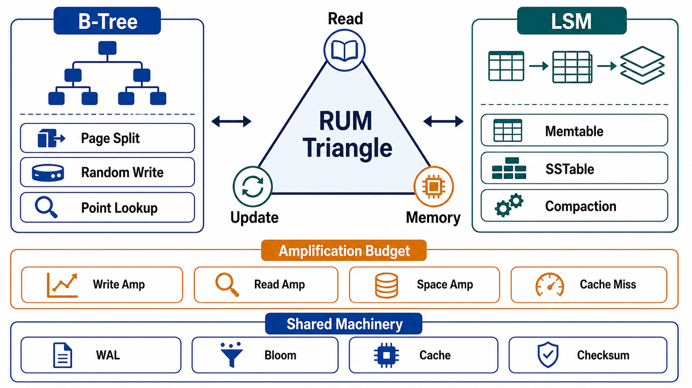

# Storage Engine Mechanics and Amplification



## Abstract

Storage engines differ in one respect that matters architecturally: where they spend amplification. The RUM conjecture formalizes the constraint — an access method that bounds two of read overhead, update overhead, and memory/space overhead sets a lower bound on the third; there is no structure that wins all three ([Athanassoulis et al., EDBT 2016](https://openproceedings.org/2016/conf/edbt/paper-12.pdf)). This file makes that triangle the engine-evaluation instrument: the mechanics of the two dominant families — update-in-place B-trees and log-structured merge trees — expressed as amplification profiles, the write-ahead/MVCC machinery that both families carry, and the compaction economics that make LSM behavior a scheduled background workload rather than a free lunch. The comparative numbers come from the practitioners who run these engines at fleet scale: B-trees pay read efficiency for page-granularity write amplification; LSMs pay sequential-write efficiency for compaction rewrite and multi-level read amplification, with RocksDB's leveled compaction tuned explicitly to trade write amplification against space amplification ([Dong et al., CIDR 2017](https://www.cs.toronto.edu/~stumm/Papers/Dong-CIDR-16.pdf); [Callaghan's amplification analyses](http://smalldatum.blogspot.com/2015/11/read-write-space-amplification-b-tree.html)).

The review posture this file installs: amplification factors are budget lines, not implementation trivia. A write path with 30× write amplification is buying 30× the flash wear and 1/30th of the device's ingest ceiling, and that purchase belongs in the Chapter 01 file 02 resource cost model, visibly.

## 1. The RUM Triangle

```text
Figure 1. The RUM conjecture as an engine map: bounding two
overheads lower-bounds the third. Engines are positions, not
winners.

                       READ-optimal
                       (point/range cost ↓)
                            ▲
                           ╱ ╲
                B-tree ●  ╱   ╲
             (in-place, ╱       ╲
              page R/W)╱          ╲ ● hash index
                      ╱   pick 2,  ╲  (point-only)
                     ╱   pay the    ╲
                    ╱     third      ╲
   UPDATE-optimal ▕─────────────────▏ MEMORY/SPACE-optimal
   (ingest cost ↓)  ● LSM        ● compressed/columnar
                    (sequential,   (scan-friendly, immutable,
                     deferred       expensive point updates —
                     merge)         file 06's territory)
```

Formally, per access method and workload: `RA = bytes read / bytes returned`, `WA = bytes written to device / bytes logically written`, `SA = bytes on device / bytes of live data`. The conjecture's practical force is that every "faster" engine claim is a relocation claim — the cost went to another vertex, and the review's job is to find it and check it against the access-pattern matrix (file 01): read-heavy point/range workloads justify paying WA for RA; ingest-heavy workloads justify the reverse; space-constrained justify paying both.

## 2. B-Tree Mechanics, Priced

Update-in-place over fixed-size pages, balanced for logarithmic point and range access.

| Mechanism | Amplification Consequence |
|---|---|
| Page-granularity writes | WA: a 100-byte update dirties a 8–16 KiB page; worst case WA ≈ page_size/row_size on random updates |
| WAL before page write | +1 sequential write per mutation (the durability purchase; also the CDC tap — Ch03 file 05) |
| In-place structure | RA near-optimal: one root-to-leaf descent, `O(log_B N)` pages, mostly cached; range scans are leaf walks |
| Page splits / fragmentation | SA: half-full pages after splits; long-lived tables drift toward 60–75% fill without maintenance |
| MVCC versions (Postgres-style heap or rollback segments) | SA + background debt: dead versions need vacuum/purge; a vacuum falling behind is a space *and* RA incident |

The B-tree's architectural personality: predictable read latency (the property OLTP serving wants), write costs that scale with *randomness* of the update pattern, and background maintenance (vacuum, defragmentation) that is a real workload deserving Chapter 01 file 02 capacity lines.

## 3. LSM Mechanics, Priced

Writes land in a memtable + WAL; flush produces immutable sorted runs (SSTables); compaction merges runs downward through levels.

| Mechanism | Amplification Consequence |
|---|---|
| Sequential-only device writes | Ingest ceiling near device sequential bandwidth — the LSM's reason to exist |
| Leveled compaction | WA ≈ level_count × size_ratio per byte (commonly 10–30× total): every byte is rewritten once per level it descends |
| Tiered compaction | WA lower, SA higher (overlapping runs retained) — the RocksDB tuning axis: leveled bounds SA ≈ 1.1×, tiered bounds WA ([Dong et al.](https://www.cs.toronto.edu/~stumm/Papers/Dong-CIDR-16.pdf)) |
| Multi-run reads | RA: a point read may touch memtable + a run per level; bloom filters buy most of it back for point lookups — range scans get no bloom rescue |
| Deletes as tombstones | Deletes are *writes* that make reads slower until compacted — a range-delete-heavy workload can build "tombstone walls" that scans must wade through; erasure obligations (Ch03 file 06) physically complete only at compaction |
| Compaction itself | A permanent background workload competing for CPU/IO with serving; compaction debt is the LSM's metastable failure mode — ingest bursts outrun compaction, read amplification climbs, reads slow, retries add load (Ch01 file 08 §1's loop, in an engine) |

The LSM's architectural personality: superb ingest and space economics, read latency that depends on compaction *keeping up*, and a scheduler inside the engine whose backlog is an SLI the operators must watch. Discord's read pathology (Cassandra reads touching memtable plus many SSTables on hot partitions) was this profile meeting rate skew ([Discord](https://discord.com/blog/how-discord-stores-trillions-of-messages)).

Hardware moves the frontier without repealing it: FAST'22 work shows transparent compression and modern storage narrowing the B-tree/LSM WA gap substantially ([Qiao et al.](https://www.usenix.org/system/files/fast22-qiao.pdf)) — the review consequence is that amplification numbers are *measured on the actual stack*, not quoted from folklore.

## 4. The Shared Machinery

Both families carry obligations this book has already contracted:

- **WAL** is the durability point and the replication/CDC tap: "committed" means WAL-durable, and everything Chapter 03 file 05 builds taps this log. WAL fsync policy is the RPO knob (Ch03 file 08) wearing an engine-config name.
- **MVCC** is how engines deliver the snapshot reads Chapter 03 file 03 priced — and its garbage (dead tuples, old versions, uncompacted history) is the SA line item that grows when long-running transactions pin old snapshots. A week-old analytics query holding back vacuum on the OLTP primary is a cross-chapter incident: file 06's separation argument, previewed.
- **Checkpoint/flush cadence** trades recovery time (Ch03 file 08's RTO: WAL replay length) against steady-state write cost — another budgeted dial, not a default.

## 5. Amplification Budget

The file's deliverable, per store:

```yaml
amplification_budget:
  store:
  engine_family: btree | lsm | hash | columnar | other
  measured:                    # on production-shaped data (file 09), not defaults
    write_amp: {value, dominant_cause}
    read_amp:  {point, range, dominant_cause}
    space_amp: {value, dominant_cause}
  background_work:             # vacuum | compaction | merge — as a workload:
    resource_share:            #   CPU/IO reserved
    backlog_sli:               #   compaction debt / vacuum lag → alert owner
    starvation_consequence:    #   what degrades when it falls behind
  rum_position_justified_by:   # the file 01 matrix rows this store serves
  device_consequence:          # ingest ceiling, flash wear, capacity at SA
```

The `background_work` block is the one that prevents the recurring incident class: both families defer work (vacuum, compaction), deferred work is debt, and debt comes due during exactly the traffic that created it. An engine whose background backlog has no SLI is an engine whose read latency has an unmonitored dependency.

## 6. Approval Gates

| Gate | Evidence Required | Failure Condition |
|---|---|---|
| RUM gate | Each store's amplification position is stated and justified by the access-pattern rows it serves | Engine chosen by familiarity; the paid vertex undiscovered |
| Measurement gate | WA/RA/SA measured on production-shaped data and hardware, within the current engine version | Amplification numbers quoted from blog folklore or defaults |
| Background gate | Vacuum/compaction has reserved capacity, a backlog SLI with an owner, and a declared starvation consequence | Background debt discovered as a read-latency incident |
| Durability gate | WAL/fsync policy maps to the declared RPO; checkpoint cadence maps to the declared RTO | Engine defaults silently define the recovery contract |
| Tombstone gate | Delete-heavy patterns are priced (tombstone reads, compaction-completion of erasure) | Deletes assumed free; erasure assumed immediate |

## Output

The output of this file is an amplification budget per store — measured read, write, and space amplification with their dominant causes, background maintenance as a first-class workload with an SLI, and a RUM position justified by the access patterns the store exists to serve.

## References

- [Athanassoulis et al., "Designing Access Methods: The RUM Conjecture," EDBT 2016](https://openproceedings.org/2016/conf/edbt/paper-12.pdf)
- [Dong et al., "Optimizing Space Amplification in RocksDB," CIDR 2017](https://www.cs.toronto.edu/~stumm/Papers/Dong-CIDR-16.pdf)
- [Callaghan — Read, Write & Space Amplification: B-Tree vs LSM](http://smalldatum.blogspot.com/2015/11/read-write-space-amplification-b-tree.html)
- [Qiao et al., "Closing the B+-tree vs. LSM-tree Write Amplification Gap," FAST 2022](https://www.usenix.org/system/files/fast22-qiao.pdf)
- [Discord — How Discord Stores Trillions of Messages (LSM read amplification under skew)](https://discord.com/blog/how-discord-stores-trillions-of-messages)
- [Kleppmann, *DDIA* — storage and retrieval](https://dataintensive.net/)
