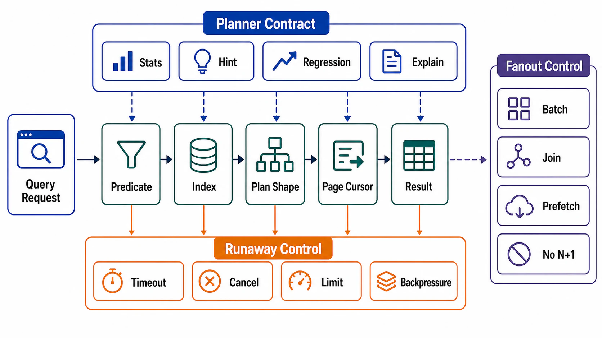

# Query-Path Contracts



## Abstract

A query is a request for bounded work, and a query path is production-grade only when the bound is structural — enforced by keys, indexes, cursors, and timeouts — rather than statistical, enforced by today's data happening to be small. This file specifies the query contract (every query names the index that bounds it, its result ceiling, and its timeout), the pagination discipline (keyset/cursor, because OFFSET re-reads everything it skips and degrades linearly with depth — [Winand's no-offset argument](https://use-the-index-luke.com/no-offset)), the N+1 elimination rule (query count must be independent of result count), and the management of the query planner as what it actually is: a nondeterministic runtime dependency whose "plan flips" — a 3 ms index scan silently becoming a 150 ms hash join after a statistics refresh — are a production incident class with named postmortems, not a theoretical concern.

The chapter-level position: the planner is the one component in the serving stack that can change its behavior *without a deploy*. Treating its decisions as stable because they were stable yesterday is the query-layer version of trusting a dependency's health check.

## 1. The Query Contract

Every query on a serving path carries:

```yaml
query_contract:
  id:                          # stable identifier (also the telemetry join key)
  matrix_row:                  # the file 01 access pattern it implements
  bounding_structure:          # the index/key that makes work O(result), named
  result_bounds: {rows_max, bytes_max}
  timeout:                     # from the request-class budget (Ch01 file 04 §4)
  expected_plan_shape:         # index scan / index-only / bounded nested loop —
                               # the shape file 09's regression tests pin
  isolation_and_consistency:   # Ch03 files 02–03 claims this path relies on
  degradation:                 # what happens at the bound: truncate+disclose |
                               # paginate | reject
```

The `bounding_structure` field enforces the chapter's inheritance from Chapter 01 file 02: *query path must be bounded by indexed predicates or page cursor*. A query that cannot name its bounding structure is a scan with a good lawyer. The `degradation` field enforces honesty at the ceiling: hitting a result bound must produce a contract state (truncated-with-disclosure, next-page cursor), never a silent partial answer.

## 2. Pagination

```text
Figure 1. Offset versus keyset pagination. Offset work grows with
page depth because skipped rows are still read; keyset work is
constant because the index positions directly at the boundary.

  OFFSET 100000 LIMIT 50:
  index/heap ─►[× × × × × × … 100,000 rows read and discarded ×]─►[50 kept]
  cost ∝ offset + limit    → deep pages are slow AND drift under
                             concurrent writes (rows shift across pages)

  WHERE (created, id) < (:last_created, :last_id)
  ORDER BY created DESC, id DESC LIMIT 50:
  index ──seek──►[50 kept]
  cost ∝ limit             → constant at any depth; stable under
                             writes; the cursor IS the position
```

Contract requirements, with their reasons: the sort key must be *deterministic and unique* (append a tiebreaker id — without it, rows with equal keys are skipped or duplicated at page boundaries); the cursor is opaque and signed if it crosses trust boundaries (a client-forgeable cursor is a resource-addressing bypass — Chapter 01 file 04 §8's authorization-before-cursor rule); and cursor semantics under concurrent mutation are declared (moving-window: you may see items shift; snapshot: you need MVCC support and a validity window). Offset survives review only for shallow, bounded, human-facing pages (page ≤ K, K small) — and the ceiling is enforced, because "nobody goes past page 10" is an assumption crawlers exist to falsify.

## 3. The Planner as a Managed Dependency

The planner chooses plans from statistics; statistics come from sampling; sampling drifts. The failure signature is well-documented across engines: a plan flips after an `ANALYZE` on shifted data — the mis-sampled column, the crossed selectivity threshold — and a hot query's latency multiplies by 50 with no deploy, no config change, and no log line saying why ([plan-regression incident analysis](https://medium.com/@philmcc/catching-query-plan-regressions-before-they-become-incidents-5645eb256583)).

Management, not hope:

| Control | Mechanism |
|---|---|
| Plan pinning / baselines | Where the engine supports it (SQL Server plan forcing, Oracle SPM, pg_hint_plan-class tools): pin the hot paths' plans; treat un-pinning as a change with rollout gates |
| Plan-shape regression tests | The `expected_plan_shape` field, asserted in CI against production-scale statistics (file 09) — a plan flip becomes a failed test, not a page at 3 a.m. |
| Statistics as configuration | Analyze cadence, sampling targets, extended statistics for correlated columns (file 03 §4) — owned, monitored, versioned |
| Plan-change telemetry | Log/alert on plan hash changes for contracted queries; the flip is at minimum *observable* the moment it happens |
| Parameter-sensitivity review | Skewed parameters (the giant tenant again) make one plan wrong for the tail: plan-per-parameter-class or forced recompile for known-skewed predicates |

The posture to reject explicitly: "the optimizer is smarter than us." It is — on average, across all queries. The contract exists for the specific twenty queries where average is not the standard, because they sit on the latency budget's critical path.

## 4. Timeouts, Cancellation, and the Runaway Query

Query timeouts implement the Chapter 01 file 04 deadline algebra at the store boundary: statement timeout ≤ remaining request deadline − response budget. Three specifics earn their place here. **Cancellation must reach the engine** — an application timeout that abandons the connection while the query runs on is capacity theft (the query completes for nobody; the Ch01 file 04 §7 abandoned-stream rule, at the database). **Lock waits are budgeted separately** from execution (lock_timeout vs statement_timeout): a query stuck behind a lock should fail fast and distinctly — the retry calculus differs. **The runaway class needs a backstop**: per-role/per-class server-side ceilings, because the one query that escapes the contract system will otherwise demonstrate exactly how much I/O a scan can buy.

## 5. N+1 and Fanout Elimination

The rule: **query count on a serving path is O(1) in result size.** N+1 — one query for the parent list, one more per item — makes latency linear in result count and multiplies per-query overhead by N; at 5 ms per round trip, a 200-item list is a silent second of sequential database time before rendering begins.

| Repair | Trade |
|---|---|
| Join in the store | One round trip; planner risk on the join; the default answer |
| Batch fetch (WHERE id IN (…)) | Two round trips regardless of N; the ORM-friendly answer — batch size itself bounded |
| Denormalize into the parent row/read model | Zero extra trips; a file 05 read-model purchase with DAG obligations |
| Application-level dataloader/coalescing | Collapses duplicate fetches within a request window; Discord's request-coalescing move, in-process |

The structural note: N+1 is usually *invisible in code review* (the loop is in the ORM, the resolver, or the template) and obvious in telemetry — which is why the file 09 audit counts queries per request per endpoint and alerts on growth, treating query cardinality as a regression class equal to latency.

## 6. Anti-Patterns

| Anti-Pattern | Defect |
|---|---|
| SELECT * on contracted paths | Unbounded bytes per row; silently breaks covering indexes; couples the path to every future column |
| OFFSET pagination on deep/mutable sets | Linear cost with depth + page drift under writes (§2) |
| Unindexed predicates "for now" | A scan whose incident date is the data's growth curve |
| Query built by string concatenation of optional filters | Combinatorial plan space; the untested combination ships; also the injection surface |
| Relying on plan stability without pinning or tests | The 3ms→150ms flip, discovered by users |
| Timeout without engine-side cancellation | Abandoned queries consuming the capacity the timeout was protecting |
| Counting for pagination (SELECT COUNT(*) per page) | A full scan per page view to render a number nobody verifies; estimate or drop it |

## 7. Approval Gates

| Gate | Evidence Required | Failure Condition |
|---|---|---|
| Contract gate | Every serving-path query carries the §1 contract with a named bounding structure | A query's work bound is statistical, not structural |
| Pagination gate | Keyset/cursor with unique deterministic sort keys and declared mutation semantics; offset only with enforced shallow ceilings | Deep offset pagination, or cursors without tiebreakers |
| Planner gate | Hot-path plans pinned or shape-tested; plan-change telemetry live; statistics owned as configuration | Plan flips are discovered by latency alerts |
| Deadline gate | Statement and lock timeouts derived from request budgets; cancellation verified to reach the engine | Queries outlive their callers |
| Cardinality gate | Queries-per-request is O(1) in result size, measured per endpoint | N+1 ships invisibly in ORMs and resolvers |

## Output

The output of this file is a query layer under contract: every query bounded by a named structure with a ceiling and a timeout that cancels for real, pagination that costs the same at page 1 and page 10,000, planner behavior pinned or tested rather than trusted, and query cardinality that does not grow with the data it returns.

## References

- [Winand — Use The Index, Luke: "We need tool support for keyset pagination"](https://use-the-index-luke.com/no-offset)
- [Citus/Microsoft — Five ways to paginate in Postgres](https://www.citusdata.com/blog/2016/03/30/five-ways-to-paginate/)
- [McClarence — Catching Query Plan Regressions Before They Become Incidents](https://medium.com/@philmcc/catching-query-plan-regressions-before-they-become-incidents-5645eb256583)
- [PostgreSQL documentation — statement/lock timeouts and planner statistics](https://www.postgresql.org/docs/current/runtime-config-client.html)
- [Discord — request coalescing above the store](https://discord.com/blog/how-discord-stores-trillions-of-messages)
