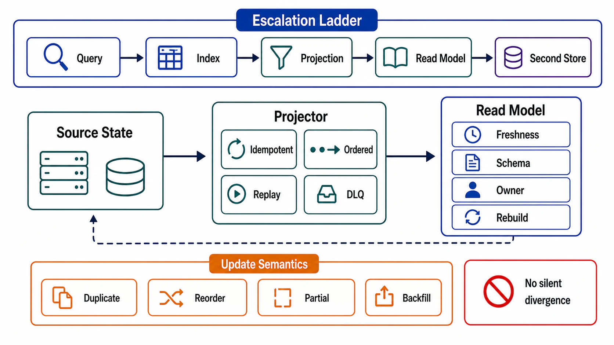

# Denormalization, Projections, and Read Models



## Abstract

A read model is a derived, query-shaped copy of source-of-truth data — a denormalized row, a projection table, a per-pattern materialization — built when no index on the source can serve an access pattern within its budget. This file specifies when that purchase is justified, what it costs, and the two contracts that keep it from rotting: every read model is a Chapter 03 file 05 derivation-DAG node (lineage, propagation mechanism, lag SLI, measured rebuild — no exceptions for "it's just a summary table"), and every read model's consumers inherit a *declared staleness*, because a projection fed by CDC is a bounded-staleness read path (Chapter 03 file 02) whatever the dashboard claims. The file also draws the line this chapter keeps: the *decision* to materialize and its contracts live here; the cache/view *engineering* — stampedes, invalidation mechanics, TTL policy — is Chapter 08's.

The honest sequencing rule that prevents most bad read models: exhaust the cheaper rungs first. A covering index (file 03 §2) or a rewritten query (file 04) delivers most read-model benefits at a fraction of the operational surface; the read model is the *last* rung, not the reflex.

## 1. The Escalation Ladder

```text
Figure 1. Rungs between "slow query" and "new projection." Each
rung up adds operational surface: more state, more lag, more
rebuild obligations. Justification = the rung below measurably
fails the pattern's budget.

  rung 4  separate read model / projection store
          (new DAG node; possibly different engine)     ▲ surface
  rung 3  materialized view / summary table                │
          in the same store (DAG node, same engine)        │
  rung 2  covering / partial index (file 03)               │
  rung 1  query rewrite + plan pin (file 04)               │
  rung 0  the pattern as written                           │ cost of
                                                           ▼ being wrong
```

The review question at each rung is quantitative: which line of the pattern's budget (latency, result bound, planner risk, cross-store join) does the current rung fail, measured on production-shaped data? "The join is ugly" is not a budget line. Conversely, the ladder is not a prohibition — patterns that join across ownership boundaries (two services' data on one screen) have no rung 1–3 available, and jump to rung 4 legitimately: cross-service read models are the standard repair for the Chapter 03 file 02 §6 cross-service-composition anomaly.

## 2. The Read-Model Contract

Rung 3–4 artifacts carry the full derived-node contract, instantiated:

```yaml
read_model:
  name:
  serves_patterns: []          # file 01 matrix rows — its entire justification
  shape:                       # the query-shaped layout, keyed by the pattern's inputs
  dag_node:                    # Ch03 file 05 contract: sources, transform version,
                               #   propagation (outbox/CDC — never dual write),
                               #   lag SLI, delete propagation, measured rebuild
  staleness_claim:             # the Ch03 file 02 model its readers actually get,
                               #   stated where its READERS can see it
  write_amplification:         # each source mutation → how many model updates
                               #   (a fanout-heavy model can out-cost the query it replaced)
  ownership:                   # one writer: the projector. Nothing else writes it.
  serving_engine:              # same store | different store (justify per §4)
```

Two lines carry the recurring failures. `write_amplification`: a model that fans one source write into hundreds of projected updates (per-follower timelines are the canonical case) has *moved* the cost from read-time fanout to write-time fanout — sometimes correct (reads dominate), but it is a purchase with a number on it, and hot-key writes multiply it. `ownership`: the projector is the model's single writer (Chapter 03 file 01); the moment application code "fixes" a projected row by hand, the model has two writers and its rebuild becomes a lie.

## 3. Update Semantics: What the Projector Must Survive

The projector consumes an at-least-once, per-key-ordered change stream (Ch03 file 05 §3) and must deliver a model that converges anyway:

| Obligation | Mechanism |
|---|---|
| Duplicate deliveries | Idempotent apply: version/LSN high-water mark per key — apply only if newer (drill S9 already tests this) |
| Cross-key reordering | Model rows must not encode cross-key invariants the stream doesn't order; if the pattern needs them, the projector needs a join buffer or the model needs redesign |
| Source deletes | Tombstone handling + delete propagation (Ch03 file 06's DAG walk includes every read model) |
| Transform deploys | New projector version = new transform version: dual-materialize and cut over (Ch03 file 07 §3), or measured rebuild — never in-place semantic drift |
| Lag under burst | The projector is a consumer with a backlog SLI and a drain story (Ch01 file 06 backpressure); its lag is its readers' staleness, alarmed as such |

The eventing subtlety worth stating plainly: projecting from *domain events* (OrderPlaced) versus *row changes* (CDC) is a semantic choice, not plumbing. Row CDC is complete but leaks schema and intent; domain events carry intent but only capture what someone remembered to emit. A projection needing data no event carries has found an event-design gap — the repair is at the source, not a side-channel query from inside the projector (which reintroduces the undeclared-join defect of Ch03 file 05 §2).

## 4. Same Store or Second Store?

Rung 4 splits on whether the model lives in the source engine or a different one:

| Choice | Wins | Pays |
|---|---|---|
| Same store (summary tables, native materialized views) | Transactional adjacency (sometimes even synchronous maintenance), one operational surface, one backup/recovery story | Competes for the source's resources; inherits its RUM position (file 02) even when the pattern wants the opposite vertex |
| Second store (search index, wide-column read table, analytical replica) | The pattern gets the engine its shape deserves (the file 08 selection logic, applied to one pattern) | A full new Chapter 03 surface: recovery, retention, deletion, drills — plus the file 08 sprawl budget line |

The forcing question is RUM mismatch: a full-text pattern on an OLTP B-tree, an aggregate-scan pattern on a row store (file 06's subject) — when the source engine's amplification profile fights the pattern, a second store is honest. When the pattern merely wants a different *sort order* of the same rows, it wants an index, and rung 4 was vanity.

## 5. Anti-Patterns

| Anti-Pattern | Defect |
|---|---|
| Read model without a DAG node | The unrebuildable copy — Chapter 03's disguised source of truth, bred in captivity |
| Projection maintained by dual writes from the app | Ch03 file 05 §3's categorical prohibition; divergence with no repair |
| Hand-edited projected rows ("just fix the number") | Second writer; the next rebuild erases the fix and nobody knows why |
| Fresh-labeled stale reads | Model lag exists; hiding it from readers converts bounded staleness into user-visible lying (Ch01 file 04's output-contract rule) |
| Projector querying live sources mid-apply | Nondeterministic rebuild (Ch03 file 05 §2's undeclared join) |
| One mega-model serving every pattern | Recreates the generic table the matrix was supposed to kill; models are per-pattern-family, small, and disposable |
| Read model as the write path's validator | Reads-own-writes inverted: the model lags, validation flaps; invariants live at the source (Ch03 file 03) |

## 6. Approval Gates

| Gate | Evidence Required | Failure Condition |
|---|---|---|
| Ladder gate | Each read model shows the measured budget failure of the rung below | Projections built by reflex where an index would do |
| Contract gate | Full §2 contract; DAG node with lag SLI and measured rebuild; single-writer projector | Any read model outside the DAG, or writable by anything but its projector |
| Convergence gate | Idempotent apply with per-key high-water marks; duplicate/reorder behavior tested (S9) | Projector correctness depends on exactly-once delivery nobody sells |
| Staleness gate | Readers see the model's declared staleness claim; lag alarms as reader-facing staleness | "Real-time" dashboards on minutes-old projections |
| Amplification gate | Write fanout per model measured and ceilinged; hot-key fanout named | A projection that multiplies the write path's cost invisibly |

## Output

The output of this file is a read-model portfolio where every projection is justified by a measured budget failure, owned by exactly one projector, wired into the derivation DAG with lag and rebuild evidence, and honest with its readers about how old its answers are. The cache/view engineering this file defers — invalidation mechanics, TTL derivation, stampede control, and the maintenance ladder up to automatic IVM — is [Chapter 08](../08-caching-materialization-and-invalidation/README.md).

## References

- [Kleppmann — Turning the database inside-out (read models as materialized dataflow)](https://martin.kleppmann.com/2015/11/05/database-inside-out-at-oredev.html)
- [Debezium — the outbox pattern feeding projections](https://debezium.io/blog/2019/02/19/reliable-microservices-data-exchange-with-the-outbox-pattern/)
- [Fowler — CQRS (the pattern's scope and its warning label)](https://martinfowler.com/bliki/CQRS.html)
- [Discord — data services and request coalescing (architecture above the model)](https://discord.com/blog/how-discord-stores-trillions-of-messages)
- [Kleppmann, *DDIA* — derived data](https://dataintensive.net/)
