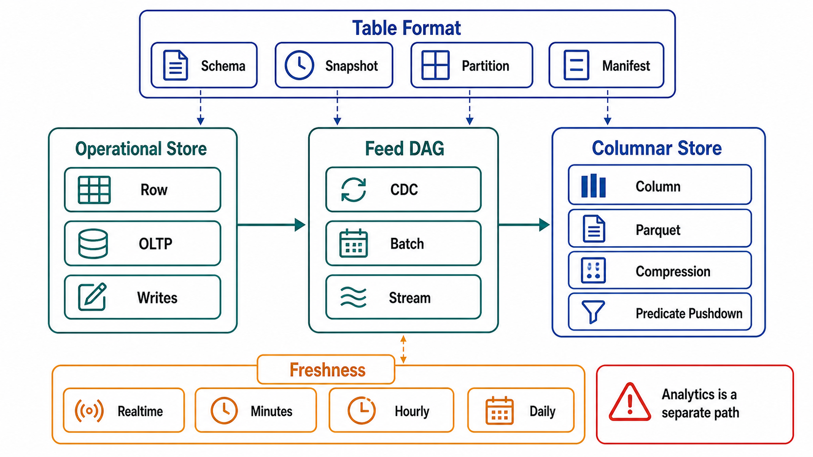

# Analytical Paths and Columnar Storage



## Abstract

Analytical access patterns — scan millions of rows, touch few columns, aggregate — sit at the opposite RUM vertex from OLTP point access, and serving both from one layout means serving one of them badly. This file specifies the separation: columnar storage as the layout that matches scan-shaped patterns (read only the projected columns, compress runs of like values, vectorize execution), the OLTP→analytical feed as one more derivation-DAG edge with lag and lineage, and the open-table-format contract — Iceberg-class metadata over Parquet-class files — that has become the SOTA answer to "analytical storage with ACID commits, schema evolution, and time travel on object storage," readable and writable by many engines against one table ([Iceberg ecosystem state, 2025–26](https://datalakehousehub.com/blog/2026-02-state-of-the-apache-iceberg-ecosystem/)). The file's discipline is the same as the chapter's: the lakehouse is not an exemption zone — a table format's snapshots, manifests, and compaction are engine mechanics with amplification budgets (file 02), and an analytical table fed from OLTP is a read model whose staleness its dashboards must wear honestly (file 05).

The blunt version of the separation argument: the analytics query that scans a year of orders is, on the OLTP primary, indistinguishable from an attack — it evicts the hot working set, pins MVCC snapshots that stall vacuum (file 02 §4), and holds locks the serving path queues behind. Separation is not an org-chart preference; it is workload isolation (Chapter 01 file 03) applied to query shapes.

## 1. Row Versus Column, Priced

```text
Figure 1. Why layout follows query shape. The same 100M-row,
40-column table, asked "SUM(amount) WHERE day ∈ Q2, GROUP BY
region" (3 columns touched):

  ROW STORE (OLTP layout)          COLUMNAR (analytical layout)
  ┌──────────────────────┐        ┌────┐┌────┐┌────┐   ┌────┐
  │ r1: c1 c2 c3 … c40   │        │ c1 ││ c2 ││ c3 │ … │c40 │
  │ r2: c1 c2 c3 … c40   │        │    ││    ││    │   │    │
  │ …                    │        └────┘└────┘└────┘   └────┘
  └──────────────────────┘        read 3 columns of 40 (~7.5%)
  read all 40 columns per row     + run-length/dictionary
  to use 3 → I/O ≈ 13× the        compression on sorted runs
  useful bytes                    + min/max zone maps skip files
                                  + vectorized (SIMD) execution
  great at: fetch row by key      great at: scan/aggregate
  (one seek, one page)            terrible at: point update
                                  (rewrite file/segment)
```

Columnar's costs are the mirror image and must be said out loud: point lookups and single-row updates are pathological (a row is scattered across N column chunks; updates mean rewriting immutable files or maintaining delete/position vectors), small writes fragment into many small files whose *file count* becomes the read-amplification problem, and freshness is granular to the commit/compaction cadence. Columnar is not "better storage"; it is the other end of the RUM triangle, chosen per pattern family like everything else in this chapter.

## 2. The Feed Is a DAG Edge

The OLTP→analytical pipeline is a Chapter 03 file 05 edge, and every contract applies verbatim: propagation by CDC/outbox (never dual-writing the warehouse from the app); lag as a declared SLI that dashboards inherit as a staleness claim; delete propagation (erasure reaches the lake — a data lake full of "deleted" users is Chapter 03 file 06's incident, at petabyte scale); and schema evolution coordinated with source migrations (a Ch03 file 07 expand at the source is a schema evolution event downstream — the formats support it; the *coordination* is the work).

The design choice inside the edge is *when shape changes*: ELT (land raw row-shaped changes, transform into columnar marts inside the platform) keeps lineage replayable and moves transform compute off the source; streaming transforms buy freshness at the price of operating the stream processor. Either way the landed tables are DAG nodes with transform versions — "the warehouse" is not one node but a DAG of them, and the rebuild question ("can we regenerate this mart from raw?") gets the same measured answer file 05 demands.

## 3. The Open Table Format Contract

Parquet files on object storage plus a metadata layer (Iceberg-class) is the current settlement of a decade of lakehouse churn. What the metadata layer actually contracts — and what the review checks:

| Capability | Mechanism | The Review Question |
|---|---|---|
| Atomic commits (ACID on object storage) | Snapshot metadata swapped by atomic catalog pointer update | Which catalog, and is *it* backed up? The catalog is the table's source-of-truth pointer — losing it orphans the data files (Ch03 file 08 applies to metadata) |
| Schema evolution | Column IDs, not names/positions — add/rename/drop without rewrite | Are readers pinned to engine versions that honor the format version's features? |
| Time travel / snapshots | Every commit is a retained snapshot | Snapshot retention is a *retention policy* (Ch03 file 06): it bounds rollback and reproducibility AND it retains "deleted" data until expiry — erasure must expire snapshots too |
| Partition/file pruning | Manifest-level min/max stats; hidden partitioning | Does the dominant query predicate align with partition/sort layout? Pruning that doesn't engage is a full-lake scan with good marketing |
| Row-level change (deletes/updates) | Delete files / deletion vectors merged at read; compaction folds them in | Merge-on-read debt is compaction debt (file 02 §3's LSM economics, re-materialized): delete-vector accumulation degrades scans until maintenance runs |
| Multi-engine access | One table, many engines (Spark/Trino/Flink/DuckDB/warehouses) | Multi-engine *write* concurrency: whose conflict resolution, tested how? Interoperability at v3 (deletion vectors, row lineage, variant types) is real but version-gated ([Iceberg v3](https://www.databricks.com/blog/next-era-open-lakehouse-apache-icebergtm-v3-public-preview-databricks)) |

The through-line: the table format re-creates engine internals (WAL→snapshot log, compaction, statistics) out of files and a catalog. That is its virtue — inspectable, engine-neutral — and its obligation: small-file compaction, snapshot expiry, and manifest maintenance are the lakehouse's vacuum, with the same budgeted-background-work standing (file 02 §5) and the same failure mode when deferred.

## 4. HTAP and the Freshness Ladder

"One system for both workloads" (HTAP) recurs every few years; the honest evaluation is by mechanism, not slogan. In-engine columnar replicas of row tables, warehouse-native streaming ingest, and CDC-fed lakehouses are all points on one ladder — freshness bought with coupling:

| Rung | Freshness | Coupling Cost |
|---|---|---|
| Analytics on the OLTP primary | Zero lag | The §0 pathology: working-set eviction, vacuum stalls — acceptable only for small, indexed, bounded lookups that merely *look* analytical |
| Read replica for analytics | Replication lag | Cheap; long queries can still conflict with replay (replica lag vs query cancellation — a real dial, not a footnote); the replica's plan/statistics diverge from the primary's |
| In-engine columnar copy (HTAP proper) | Seconds | One engine's blast radius for both workloads; the column store competes for the same buffer/IO unless resource-governed — the Ch02 coupled-domain register wants this row |
| CDC → warehouse/lakehouse | Minutes | Full isolation; full DAG surface; the default answer at scale |

The rule the ladder enforces: pick the rung per *pattern family*, declare its staleness to consumers, and register any shared-blast-radius rung as a coupled failure domain. What fails review is the unexamined default — either "everything queries the primary" (rung 0 by inertia) or "everything waits for the nightly load" (rung 3 with 1990s cadence) — both of which are freshness decisions nobody made.

## 5. Approval Gates

| Gate | Evidence Required | Failure Condition |
|---|---|---|
| Separation gate | Scan-shaped patterns identified in the matrix and routed off the OLTP serving path (or rung-0 exceptions bounded and indexed) | Analytics queries share the primary's buffer pool and MVCC horizon unexamined |
| Edge gate | The analytical feed is a DAG edge: CDC/outbox propagation, lag SLI on dashboards, delete propagation to the lake, schema-evolution coordination | Warehouse loaded by app dual-writes, or erasure stops at the OLTP boundary |
| Format gate | Catalog backed up; snapshot retention set as policy (incl. erasure expiry); compaction and manifest maintenance budgeted with backlog SLIs | The lakehouse's vacuum is nobody's job; snapshots retain deleted data indefinitely |
| Pruning gate | Dominant predicates align with partition/sort layout; pruning engagement measured, not assumed | Full-table scans wearing partition costumes |
| Rung gate | Each analytical pattern family sits on a declared freshness rung; shared-blast-radius rungs are in the coupled-domain register | Freshness decided by inertia; HTAP coupling unregistered |

## Output

The output of this file is an analytical path that is a designed system rather than a side effect: scan-shaped patterns on columnar layout they match, fed by a lineage-bearing DAG edge whose lag its dashboards wear, governed by a table format whose catalog, snapshots, and compaction carry the same budgets as any engine — and a freshness rung chosen per pattern family, on purpose.

## References

- [Apache Iceberg — table format specification and evolution](https://iceberg.apache.org/spec/)
- [State of the Apache Iceberg ecosystem, 2025–26 survey](https://datalakehousehub.com/blog/2026-02-state-of-the-apache-iceberg-ecosystem/)
- [Databricks — Apache Iceberg v3 (deletion vectors, row lineage, variant)](https://www.databricks.com/blog/next-era-open-lakehouse-apache-icebergtm-v3-public-preview-databricks)
- [Apache Parquet — columnar file format](https://parquet.apache.org/docs/)
- [Athanassoulis et al., RUM conjecture — the triangle this file's separation instantiates](https://openproceedings.org/2016/conf/edbt/paper-12.pdf)
