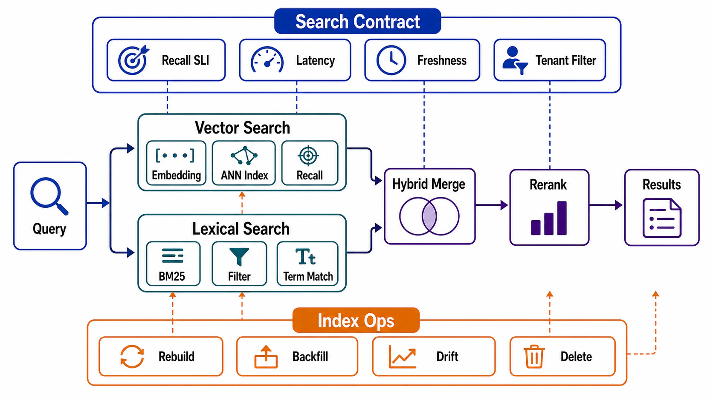

# Vector and Hybrid Search Paths



## Abstract

Approximate nearest-neighbor search is the one query path in this chapter whose *correctness is a tunable* — every ANN index trades recall against latency against memory, which means "the retrieval works" is a measured number with a target, not a property. This file specifies ANN index selection as a RUM-style position among three proven families — graph-based HNSW ([Malkov & Yashunin](https://arxiv.org/abs/1603.09320)): high recall at low latency, paid in memory and build cost; partition-based IVF with product quantization ([FAISS](https://arxiv.org/abs/2401.08281)): memory economy paid in recall/latency; disk-resident graphs (DiskANN/Vamana lineage): billion-scale on NVMe paid in I/O-bound tail latency — plus the two production problems that dominate real deployments more than index choice does: filtered search (predicate + similarity, where naive pre- or post-filtering silently destroys either performance or recall) and hybrid retrieval (lexical + vector fusion, because embeddings miss exact identifiers and lexical misses paraphrase). The state contracts arrive from Chapter 03 file 09 and are not renegotiated here: per-vector lineage, subject attribution for erasure, dual-index model migrations.

The chapter-level claim, stated at full bluntness: a vector index whose recall is not on a dashboard is a retrieval system whose quality is unknown *by construction* — approximate indexes fail by returning plausible-but-worse neighbors, which no error rate, no latency percentile, and no user report will ever surface.

## 1. Recall Is an SLI

```text
Figure 1. The ANN trade surface. Every index family is a region;
every parameter change moves you along it. The only way to know
where you are is to measure recall@k against exact ground truth
on YOUR vectors — recall is corpus- and model-dependent.

  recall@k
  1.0 ┤        ● HNSW (high ef_search)
      │      ●───● HNSW (tuned)
      │    ╱   ● IVF (high nprobe)
  0.9 ┤  ●───●  DiskANN (NVMe-bound)
      │ ╱  ● IVF+PQ (compressed)
      │●
  0.8 ┤ ← every point here looks IDENTICAL to users per query;
      │   the difference is which relevant items silently vanish
      └──────────────────────────────────────► latency / memory
        the knobs: ef_search / nprobe / beam width — runtime-
        tunable, which makes recall an OPERABLE dial, and
        therefore an SLI with an owner
```

The measurement contract: a held-out query set with exact (brute-force) neighbors recomputed per (embedding model version × corpus generation), recall@k tracked continuously — because recall degrades *silently* as the corpus grows, drifts, or accumulates deletions, while the index keeps answering fast. This is the file 09 drill Q6, and it is the one evaluation teams skip because nothing visibly breaks without it.

## 2. Index Family Selection

| Family | Mechanics | Wins | Pays | Choose When |
|---|---|---|---|---|
| HNSW (graph) | Multi-layer navigable small-world graph; greedy descent then local search | Recall ≥0.95 at single-digit-ms, runtime-tunable via ef_search | RAM-resident graph (~1.1–1.5× raw vectors + links); slow builds; deletes degrade the graph (tombstone + periodic rebuild) | Corpus fits memory budget; latency-critical serving; the default for < ~100M vectors |
| IVF(+PQ) (partition + compression) | k-means cells; probe nprobe nearest cells; PQ compresses vectors 10–50× | Memory economy; fast builds; scales past RAM | Recall ceiling from cell-boundary misses; PQ distance distortion (re-rank with full vectors to buy it back); needs (re)training — cluster drift as corpus shifts | Memory-constrained; huge corpora; batch/offline tolerance for retraining |
| DiskANN/Vamana (disk graph) | Graph on NVMe, compressed vectors in RAM for navigation | Billion-scale on one node's economics | I/O-bound tails (p99 is an NVMe queue, not a CPU number); build cost; operational novelty | Corpus ≫ RAM and latency budget tolerates a few ms of SSD reads |

Composite reality: production stores increasingly run composites (HNSW over PQ codes, IVF with re-ranking), and managed engines hide the family behind a parameter surface — the review question is unchanged: *what is the measured recall@k at the deployed parameters on our vectors*, and which family's failure mode (memory ceiling, retraining drift, I/O tail) is on the operational hook.

## 3. Filtered Search: The Real Production Problem

Most real retrieval is `similar AND tenant = X AND date > Y AND acl_allows(user)` — and filters break ANN structurally, because the index was built over the whole corpus's geometry:

| Strategy | Mechanism | Failure Mode |
|---|---|---|
| Post-filter | ANN top-k, then apply predicate | Selective filters annihilate results: top-100 with a 1%-selective filter leaves ~1 expected hit — recall collapses exactly on the queries the filter matters for |
| Pre-filter | Predicate first, then exact search in survivors | Correct, but abandons the index; cost linear in filter cardinality — fine for tiny survivor sets, an outage for large ones |
| In-traversal filtering | Predicate evaluated during graph/cell traversal (filtered-HNSW variants) | The right answer when supported — but traversal through sparse-qualifying regions degrades; measured recall-under-filter is its own SLI, per filter class ([filtered-ANN analysis](https://arxiv.org/html/2602.11443)) |
| Partitioned indexes | One index per tenant/segment (the file 01 isolation move) | Perfect isolation and the Ch03 tenant answer; pays index-count operations and cold small-tenant indexes |

The tenant rule is not a strategy choice: Chapter 01 file 03 and Chapter 03 file 09 already decided that authorization scoping happens *before or during* candidate selection, never after ranking. Within that constraint, the strategy table is a per-filter-class engineering decision — and "recall@k under our three dominant filter classes" belongs on the same dashboard as unfiltered recall, because in-traversal filtering degrades exactly where post-filtering collapses.

## 4. Hybrid Retrieval

Embeddings and lexical search fail on disjoint query classes: vectors miss exact identifiers, part numbers, names, and negations; BM25-class lexical misses paraphrase and cross-lingual similarity. Production retrieval is therefore a *fusion* path:

```text
query ──┬─► lexical (BM25/inverted index) ──► top-k_l ─┐
        │                                              ├─► fusion ─► re-rank ─► top-n
        └─► vector (ANN)              ────► top-k_v ───┘   (RRF or
                                                            learned)
```

Contract points: fusion by reciprocal rank fusion (RRF) is the robust default — score normalization across BM25 and cosine spaces is a calibration swamp RRF sidesteps by using ranks; the re-ranker (cross-encoder class) is a *second retrieval stage with its own latency budget line* — typically the most expensive per-item step in the path, bounded by re-ranking only the fused top-k; and the two retrievers are two DAG nodes over one source — their indexes can lag *differently*, so a document may exist lexically and not vectorially for the propagation-lag window: the fusion path's freshness claim is the max of the two lags (the file 05 diamond, instantiated).

## 5. Operations: The Index as a Living Derived Store

Everything Chapter 03 file 09 contracted, plus the vector-specific operational facts: **deletes degrade quality, not just space** — tombstoned nodes leave HNSW's graph connectivity scarred; delete-heavy corpora need scheduled rebuilds (the vacuum of vector stores, budgeted per file 02 §5). **Re-embedding is a migration, always** — model version change = new index built alongside, traffic cut over by recall comparison, old index retired (Ch03 file 07 §3's dual-index rule; the "just upsert the new vectors" shortcut produces the unjoinable mixed-space index). **Build cost is capacity planning** — HNSW builds are CPU-days at 100M+ scale; the rebuild path's *measured duration* (Ch03 file 05 §4) decides whether "rebuild on corruption" is a plan or a prayer. **Snapshot + WAL semantics vary wildly across vector engines** — the Ch03 file 08 recovery contract must be verified per engine, not assumed from the word "database" in the vendor's name.

## 6. Approval Gates

| Gate | Evidence Required | Failure Condition |
|---|---|---|
| Recall gate | recall@k measured against exact ground truth on production vectors, per (model × corpus generation), tracked continuously with an owner | Retrieval quality inferred from latency dashboards and vibes |
| Family gate | Index family/parameters justified by memory budget, latency budget, and measured recall — the §2 table filled in, not quoted | Index chosen because the vector DB's default was HNSW |
| Filter gate | Dominant filter classes enumerated; strategy per class; recall-under-filter measured; tenant scoping before/during traversal | Post-filtering on selective predicates; ACLs applied after ranking |
| Hybrid gate | Fusion method declared; re-ranker budgeted as its own stage; dual-index lag reconciled in the freshness claim | Vector-only retrieval assumed sufficient; re-ranker latency discovered in p99 |
| Lifecycle gate | Delete-degradation rebuild schedule; model migrations as dual-index cutovers; recovery verified per engine | In-place re-embedding; graph decay unmonitored; "the vendor handles backups" |

## Output

The output of this file is a similarity path whose quality is operable: an index family chosen by measured position on the recall/latency/memory surface, filters and hybrid fusion engineered per query class with their own recall SLIs, and the index run as what it is — a derived store that decays under deletes, migrates by dual-version cutover, and answers confidently whether or not it is still correct, which is why the dashboard has to.

## References

- [Malkov & Yashunin, "Efficient and robust approximate nearest neighbor search using HNSW," 2016](https://arxiv.org/abs/1603.09320)
- [Douze et al., "The FAISS Library," 2024 (IVF, PQ, and composite index design)](https://arxiv.org/abs/2401.08281)
- [Subramanya et al., "DiskANN: Fast Accurate Billion-point Nearest Neighbor Search on a Single Node," NeurIPS 2019](https://proceedings.neurips.cc/paper/2019/hash/09853c7fb1d3f8ee67a61b6bf4a7f8e6-Abstract.html)
- [Filtered ANN search in vector databases — system design and performance analysis](https://arxiv.org/html/2602.11443)
- [Pinecone — HNSW mechanics and parameter behavior](https://www.pinecone.io/learn/series/faiss/hnsw/)
- [OWASP LLM08 / Ch03 file 09 — the state contracts this path inherits](https://genai.owasp.org/llm-top-10/)
