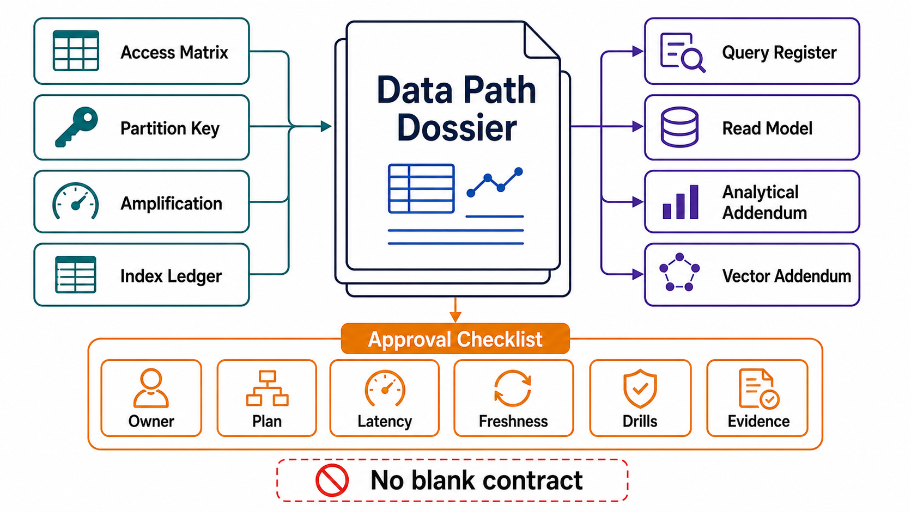

# Data-Path Review Templates



## Abstract

This file collects the executable artifacts of Chapter 04: the access-pattern matrix, the amplification budgets, the index portfolio ledger, the query contracts, the read-model register, the analytical-path and vector-path addenda, the engine rubric, and the drill checklist. Every field is defined and justified in files 01–09; this file adds no new policy. A blank field is a finding — and in this chapter, a blank field is usually a scan, a flip, or a hot partition whose date of arrival is set by the data's growth curve rather than by anyone's decision.

## Usage Protocol

1. Complete top-to-bottom; the order matches the file 00 dependency graph — the matrix first, the engine last, always.
2. The state items referenced throughout must be the Chapter 03 inventory; every read model and index here is a DAG node there. Divergence between the two chapters' registers is a seam finding.
3. Tag every claim with its file 09 §5 evidence row, its date, *and the data generation/volume it was proven at* — this chapter's evidence expires by growth, not just by time.
4. Re-run on: new access patterns, data-volume doublings, engine version upgrades, statistics regime changes, embedding-model changes, and any Q-drill freshness expiry.

```text
Figure 1. Dossier assembly flow.

  file 01                 files 02–04                files 05–07
  access-pattern      ──► amplification budgets, ──► read-model register,
  matrix (the workload,   index portfolio,           analytical + vector
  made concrete)          query contracts            addenda
      │                        │                          │
      └────────────┬───────────┴──────────────────────────┘
                   v
        file 08: engine rubric + portfolio ledger + exit stories
                   v
        file 09: plan tests, SLIs, drills Q1–Q8
                 → evidence class + DATE + DATA GENERATION per claim
                   v
        approval: layouts, indexes, query contracts, engine
        selections — replication/quorum (Ch05) and cache/view
        engineering (Ch08) are NOT approved here
```

## Access-Pattern Matrix (per pattern — the master table)

| Pattern | Caller | Shape | Key Inputs | Result Bounds | Rate (sust/burst) | Latency Budget | Consistency Claim | Skew | Served By (key/index/model) |
|---|---|---|---|---|---|---|---|---|---|
|  |  | point/range/scan/aggregate/search/similarity |  |  |  |  |  | uniform/zipfian/few-giants |  |

## Partition-Key Register (per table/keyspace)

| Table | Partition Key | Cardinality Test | Uniformity Test (p99 key ÷ median) | Locality Test | Hot-Key Strategy | Growth Bound |
|---|---|---|---|---|---|---|
|  |  | pass/fail+evidence |  |  | split/salt/coalesce/isolate/none+why |  |

## Amplification Budget (per store)

```yaml
store:
  engine_family: btree | lsm | hash | columnar | vector | other
  measured_at: {date, data_volume, engine_version}
  write_amp: {value, dominant_cause}
  read_amp: {point, range, dominant_cause}
  space_amp: {value, dominant_cause}
  background_work:
    kind: vacuum | compaction | merge | rebuild | snapshot_expiry
    resource_share:
    backlog_sli: {metric, alert_owner}
    starvation_consequence:
  rum_position_justified_by: []        # matrix rows
  durability_mapping: {fsync_policy_to_rpo, checkpoint_to_rto}
```

## Index Portfolio Ledger (per table)

| Index | Form | Claimed By (matrix rows) | Est. Selectivity | Write-Amp Contribution | Usage Counter (last audit) | Lifecycle State |
|---|---|---|---|---|---|---|
|  | composite/covering/partial/unique/inverted |  |  |  |  | active/candidate-removal/building |

Table write-amplification ceiling: ______ · Current sum: ______ · Audit A (unclaimed) and Audit B (unserved patterns) run: date ______

## Query Contract Register (per contracted query)

| Query ID | Matrix Row | Bounding Structure | Result Bounds | Timeout / Lock Timeout | Expected Plan Shape | Pinned? | Plan-Hash Telemetry | Degradation at Bound |
|---|---|---|---|---|---|---|---|---|
|  |  |  |  |  |  |  | live/absent | truncate+disclose / paginate / reject |

Pagination: all cursor paths keyset with unique tiebreakers [ ] · offset ceilings enforced where retained [ ] · queries-per-request O(1) verified per endpoint [ ]

## Read-Model Register (per projection)

| Model | Serves Patterns | DAG Node Ref (Ch03) | Propagation | Lag SLI → Reader Staleness Claim | Write Fanout (per source mutation) | Projector (single writer) | Rebuild (measured, date) |
|---|---|---|---|---|---|---|---|
|  |  |  | outbox/CDC/batch |  |  |  |  |

## Analytical-Path Addendum

```text
[ ] Scan-shaped patterns routed off the OLTP serving path; rung-0 exceptions
    bounded and indexed (file 06 §4 ladder, rung declared per family).
[ ] Feed is a DAG edge: CDC propagation, lag on dashboards, delete
    propagation into the lake, schema-evolution coordination.
[ ] Catalog backed up; snapshot retention = policy incl. erasure expiry.
[ ] Compaction / small-file / manifest maintenance budgeted with backlog SLIs.
[ ] Pruning engagement measured for dominant predicates.
[ ] Shared-blast-radius rungs (replica, HTAP) in the Ch02 coupled-domain register.
```

## Vector-Path Addendum

```text
[ ] Index family + parameters justified by measured recall/latency/memory
    on production vectors (file 07 §2 table filled, not quoted).
[ ] recall@k tracked continuously per (model × corpus generation), owner named.
[ ] Dominant filter classes enumerated; strategy per class;
    recall-under-filter measured; tenant scope before/during traversal.
[ ] Hybrid path: fusion method declared; re-ranker has its own budget line;
    dual-index lag reconciled in the freshness claim.
[ ] Delete-degradation rebuild schedule; model changes = dual-index cutover;
    per-vector lineage + subject attribution (Ch03 f09) verified.
[ ] Recovery semantics verified per engine (not assumed).
```

## Engine Rubric (per store × selected engine)

| Contract Row | Evidence (class + date + volume) |
|---|---|
| Ownership/fencing enforcement (S1/S2 on candidate) |  |
| Consistency under partition+pause (Jepsen-class) |  |
| Isolation behavior (Hermitage-class + own write-skew cases) |  |
| Recovery (S6 at production volume, non-author) |  |
| Deletion/erasure provability |  |
| Online migration + CDC-out at rate |  |
| Amplification budget met (measured) |  |
| Query contracts supported (plan controls, cancellation) |  |
| Operations: named humans, incident experience |  |

Portfolio ledger: pattern families → required engines vs engines run; divergences + migration/retirement plans: ______
Exit story per engine: CDC tap verified [ ] · idiom seams named [ ] · re-evaluation trigger declared [ ]

## Drill and SLI Checklist

```text
[ ] Q1 top-N replay at forecast volume — bounds hold, no flips
[ ] Q2 statistics degradation — pins/baselines held the hot paths
[ ] Q3 ingest saturation — backlog alerted before read p99; self-recovered
[ ] Q4 index loss — scan-to-seek fired; contracts self-identified
[ ] Q5 hottest key at forecast p99 rate — named strategy held
[ ] Q6 recall@k vs exact ground truth incl. filters — within target
[ ] Q7 timed rebuild of read model / vector index — within declaration
[ ] Q8 erasure walk through the analytical path incl. snapshots
Each line: date + data generation + evidence link.

SLIs live with owners: queries/request [ ] plan-hash [ ] scan-to-seek [ ]
slowest-key p99 [ ] background backlogs [ ] index usage [ ] recall@k [ ]
projection lag [ ] growth-vs-bound forecasts [ ]
```

## Approval Checklist

```text
[ ] Every reachable query path has a matrix row; every matrix row is served,
    re-bounded, or accepted-with-owner (files 01, 03).
[ ] Every partition key passes cardinality, uniformity, locality; the largest
    key has a named strategy with its read-cost price (file 01).
[ ] Every store carries a measured amplification budget with background work
    as an SLI-bearing workload (file 02).
[ ] Index portfolio: every index claimed, ceiling respected, statistics
    managed, changes gated as migrations (file 03).
[ ] Every contracted query names its bounding structure, timeout with real
    cancellation, plan shape (pinned or tested), and degradation (file 04).
[ ] Pagination keyset with tiebreakers; queries-per-request O(1) (file 04).
[ ] Every read model: ladder-justified, DAG-wired, single-projector,
    idempotent-applying, honest about staleness (file 05).
[ ] Analytical addendum complete (file 06). Vector addendum complete (file 07).
[ ] Engine rubric answered with dated evidence; portfolio ledger balanced;
    exits verified (file 08).
[ ] Q1–Q8 within freshness; SLIs owned; every claim carries class + date +
    data generation (file 09).
```

## Final Approval Statement

```text
Chapter 04 approval is granted for data layouts, partition keys, index
portfolios, query contracts, read models, analytical and vector paths, and
engine selections — each priced in amplification and proven against the
Chapter 03 state contracts at a stated data generation. It does not approve
replication topology, partitioning placement, or quorum configuration
(Chapter 05), nor cache and materialized-view engineering (Chapter 08).
```
