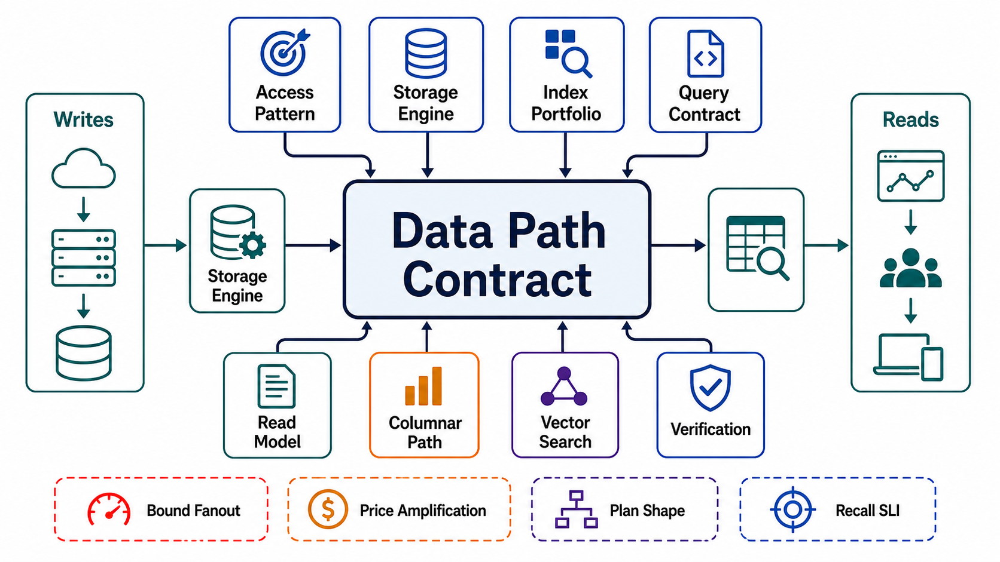

# Chapter 04: Data Modeling, Storage Engines, and Query Paths

## Abstract

Data layout must match access patterns — indexes, materialized views, logs, and denormalized projections are architecture decisions because they move cost between the write path, the read path, storage amplification, and recovery complexity. This chapter builds the machinery behind that thesis: the access-pattern matrix as the modeling artifact that precedes any schema, the RUM conjecture as the law that every engine and index is a position on a triangle rather than a winner ([Athanassoulis et al., EDBT 2016](https://openproceedings.org/2016/conf/edbt/paper-12.pdf)), query paths as contracts whose work bounds are structural rather than statistical, read models as derivation-DAG purchases justified by measured budget failures, analytical and vector paths as pattern families deserving the layouts their shapes demand, and engine selection — deliberately last — as evidence against the Chapter 03 contracts rather than familiarity or fashion.

The chapter's scar tissue is chosen for range: Discord's hot partition, where a layout correct per entity met a workload skewed per key and degraded whole nodes before a coalescing layer and a storage migration repaired it ([trillions of messages](https://discord.com/blog/how-discord-stores-trillions-of-messages)); the plan-flip incident class, where a statistics refresh turns a 3 ms index scan into a 150 ms join with no deploy and no warning; and the standing Jepsen record that engine documentation and engine behavior are different facts ([analyses](https://jepsen.io/analyses)). One sentence for the whole chapter: a schema is a bet on a query distribution, and this chapter exists to make sure somebody actually looked at the distribution before placing it.

## Chapter Structure

Each file is a self-contained research note: abstract, formal model, ASCII figures, decision tables, approval gates that can fail a design, and primary-source references. The reading order is a dependency graph (see [00-chapter-file-map.md](00-chapter-file-map.md)).

| Order | File | Concept |
|---:|---|---|
| 0 | [00-chapter-file-map.md](00-chapter-file-map.md) | Folder map, dependency graph, seams to Chapters 03/05/08 |
| 1 | [01-access-pattern-driven-data-modeling.md](01-access-pattern-driven-data-modeling.md) | Access-pattern matrix, partition-key tests, hot-key strategies, normalization as a priced trade |
| 2 | [02-storage-engine-mechanics-and-amplification.md](02-storage-engine-mechanics-and-amplification.md) | RUM triangle, B-tree/LSM mechanics, compaction economics, amplification budgets |
| 3 | [03-indexing-and-write-amplification.md](03-indexing-and-write-amplification.md) | Index cost model, form selection, portfolio audits, statistics as configuration |
| 4 | [04-query-path-contracts.md](04-query-path-contracts.md) | Bounded work, keyset pagination, the planner as a managed dependency, N+1 elimination |
| 5 | [05-denormalization-projections-and-read-models.md](05-denormalization-projections-and-read-models.md) | Escalation ladder, read-model contracts, projector convergence, same-store vs second-store |
| 6 | [06-analytical-paths-and-columnar-storage.md](06-analytical-paths-and-columnar-storage.md) | Row vs column pricing, the feed as DAG edge, open table formats, the HTAP freshness ladder |
| 7 | [07-vector-and-hybrid-search-paths.md](07-vector-and-hybrid-search-paths.md) | Recall as an SLI, HNSW/IVF/DiskANN selection, filtered search, hybrid fusion, index lifecycle |
| 8 | [08-engine-selection-against-contracts.md](08-engine-selection-against-contracts.md) | The contract rubric, sprawl vs hammer, exit stories, the evaluation protocol |
| 9 | [09-verification-of-data-paths.md](09-verification-of-data-paths.md) | Plan-shape regression, statistics twins, data-path SLIs, drills Q1–Q8 |
| 10 | [10-data-path-review-templates.md](10-data-path-review-templates.md) | Executable dossier and approval checklist |

## Source Corpus

| Source | Official Material | Standard Imported Into This Chapter |
|---|---|---|
| Athanassoulis, Idreos et al. | [The RUM Conjecture, EDBT 2016](https://openproceedings.org/2016/conf/edbt/paper-12.pdf) | Bounding two of read/update/memory overhead lower-bounds the third; every engine, index, and layout claim is a relocation of cost, and the review's job is to find where it went. |
| RocksDB / Callaghan / FAST | [Space amplification in RocksDB, CIDR 2017](https://www.cs.toronto.edu/~stumm/Papers/Dong-CIDR-16.pdf), [amplification analyses](http://smalldatum.blogspot.com/2015/11/read-write-space-amplification-b-tree.html), [B-tree/LSM gap on modern hardware, FAST 2022](https://www.usenix.org/system/files/fast22-qiao.pdf) | Leveled-vs-tiered as the WA/SA dial; compaction as a permanent budgeted workload; amplification measured on the actual stack, never quoted from folklore. |
| Discord | [How Discord Stores Trillions of Messages](https://discord.com/blog/how-discord-stores-trillions-of-messages) | The hot-partition incident shape: layout correct per entity, wrong per distribution; request coalescing above the store; an engine exit executed against contracts at trillion-row scale. |
| AWS | [DynamoDB data-modeling best practices](https://docs.aws.amazon.com/amazondynamodb/latest/developerguide/best-practices.html) | Access patterns enumerated before keys; the table is the query; flexibility deferred is capacity planning avoided. |
| Winand / Citus | [Use The Index, Luke — no-offset](https://use-the-index-luke.com/no-offset), [Five ways to paginate](https://www.citusdata.com/blog/2016/03/30/five-ways-to-paginate/) | Keyset pagination as the constant-cost cursor; offset as linear re-reading that drifts under writes; index design against real planner behavior. |
| Plan-regression practice | [Catching query plan regressions](https://medium.com/@philmcc/catching-query-plan-regressions-before-they-become-incidents-5645eb256583), [PostgreSQL planner docs](https://www.postgresql.org/docs/current/planner-stats.html) | The planner as a nondeterministic runtime dependency: plan flips as an incident class; statistics twins, plan pinning, and plan-hash telemetry as the management regime. |
| Vector search research | [HNSW, Malkov & Yashunin 2016](https://arxiv.org/abs/1603.09320), [The FAISS Library, 2024](https://arxiv.org/abs/2401.08281), [DiskANN, NeurIPS 2019](https://proceedings.neurips.cc/paper/2019/hash/09853c7fb1d3f8ee67a61b6bf4a7f8e6-Abstract.html), [filtered-ANN analysis](https://arxiv.org/html/2602.11443) | Recall/latency/memory as the ANN trade surface; recall as a continuously measured SLI; filtered and hybrid search as the production problems that dominate index choice. |
| Lakehouse ecosystem | [Iceberg specification](https://iceberg.apache.org/spec/), [Iceberg v3](https://www.databricks.com/blog/next-era-open-lakehouse-apache-icebergtm-v3-public-preview-databricks), [ecosystem survey 2025–26](https://datalakehousehub.com/blog/2026-02-state-of-the-apache-iceberg-ecosystem/) | Open table formats as engine internals rebuilt from files and a catalog: atomic commits, schema evolution by column ID, snapshots as retention policy, compaction as the lakehouse's vacuum. |
| Jepsen / Hermitage | [Analyses](https://jepsen.io/analyses), [Hermitage](https://github.com/ept/hermitage) | The documented-versus-delivered gap as the default assumption; engine admission by adversarial evidence. |
| McKinley | [Choose Boring Technology](https://mcfunley.com/choose-boring-technology) | The sprawl budget: every engine is a permanent tax; novelty spends innovation tokens the org must actually have. |

## Chapter Standards

1. Modeling runs from access patterns to layout; a query with no matrix row is a scan with a scheduled incident date.
2. Every partition key passes cardinality, uniformity, and locality tests; the largest key in the system is named, along with the plan for it.
3. Normalization is a priced position, not a virtue; every denormalized copy is a derivation-DAG node or it is a defect.
4. Every store carries a measured amplification budget; background work (compaction, vacuum, snapshot expiry, graph rebuild) is a first-class workload with a backlog SLI.
5. Every index is claimed by named patterns; every pattern is served or consciously accepted; the portfolio has a write-amplification ceiling.
6. Every contracted query names its bounding structure, carries a timeout that cancels at the engine, and has a pinned or shape-tested plan.
7. Pagination is keyset with unique tiebreakers; query count per request is O(1) in result size.
8. The planner is a managed dependency: statistics are configuration, flips are telemetry, hot paths are pinned.
9. Scan-shaped patterns run on columnar layout off the serving path; the analytical feed is a DAG edge whose lag its dashboards wear.
10. Vector retrieval quality is an SLI: recall@k measured against exact ground truth, per model and corpus generation, including under dominant filters.
11. Embedding-model changes are dual-index migrations; vector indexes carry lineage and subject attribution or they were built un-erasable.
12. Engines are selected last, admitted by evidence against the Chapter 03 contracts, justified against the sprawl/hammer ledger, and held on priced leases with verified exits.
13. Evaluation is production-shaped, steady-state, open-loop, and includes watching the candidate fail.
14. Data-path evidence expires with growth: every claim carries its class, its date, and the data generation it was proven at.
15. Drills Q1–Q8 and the data-path SLIs keep every claim current or downgrade it in writing.

## Chapter Completion Gate

Chapter 04 is complete only when the reviewer can answer these questions without guessing:

- For any query in production: which matrix row is it, what structure bounds it, and what happens at the bound?
- For any table: what is the partition key's p99-to-median load ratio, and what absorbs the largest key's traffic?
- For any store: where does its amplification go, what background work does it owe, and what happens when that work falls behind?
- For any index: which patterns claim it, and what does it cost every write?
- For any hot path: what pins its plan, and who is alerted when the plan hash changes?
- For any read model: what measured budget failure justified it, and how stale is it right now?
- For any dashboard: which freshness rung feeds it, and does it say so?
- For the vector path: what is recall@k today, on which corpus generation, under which filters?
- For any engine: which contract rows admitted it, on what dated evidence, and how would we leave?

## Final Position

Storage is where architecture's abstractions meet physics: bytes must be read, written, and kept, and every layout decision is a standing order about which of those three costs the system pays forever. The access-pattern matrix is this chapter's whole method — everything else is the disciplined spending of what it reveals. Chapter 05 distributes what this chapter laid out; Chapter 08 engineers the caches and views whose contracts are now fixed. Neither can rescue a layout that bet against its own workload — that bet is settled here or it is settled in production.
