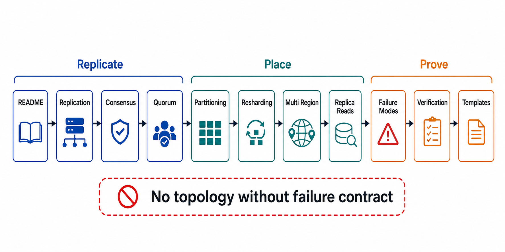

# Chapter 05 File Map



## Purpose

Chapters 03 and 04 fixed what must be true of state — ownership, consistency claims, isolation, recovery budgets — and how it is laid out per store. This chapter distributes it, and inherits the root thesis with no discount: distribution improves capacity only when partition ownership, replication lag, quorum reads/writes, rebalancing, and conflict handling are explicit; undocumented consistency behavior becomes a latent correctness defect. Every mechanism in this chapter is the delivery vehicle for a contract signed earlier — replication delivers Chapter 03's consistency claims across copies, partitioning delivers Chapter 04's layout across machines, and consensus delivers Chapter 03's single arbiter — which is why every file here cites the contract it implements rather than inventing a new one.

Each file is a self-contained research note: an abstract stating the claim, a formal model, figures, decision tables, approval gates that can fail a design, and primary-source references.

## Reading Order

| Order | File | Architecture Decision Produced |
|---:|---|---|
| 1 | [README.md](README.md) | Chapter thesis, source corpus, and completion gate |
| 2 | [01-replication-topologies-and-lag.md](01-replication-topologies-and-lag.md) | Topology per store (single-leader / multi-leader / leaderless), ack ladder, lag as a distribution |
| 3 | [02-consensus-and-coordination-services.md](02-consensus-and-coordination-services.md) | Where consensus is required, Raft mechanics, coordination-service blast radius |
| 4 | [03-quorum-semantics.md](03-quorum-semantics.md) | Quorum arithmetic and its honest limits; strict vs sloppy; asymmetric quorum design |
| 5 | [04-partitioning-and-placement.md](04-partitioning-and-placement.md) | Partition scheme, partition map ownership, secondary indexes across shards |
| 6 | [05-rebalancing-and-resharding.md](05-rebalancing-and-resharding.md) | Shard counts, movement budgets, live resharding as a migration |
| 7 | [06-multi-region-and-conflict-handling.md](06-multi-region-and-conflict-handling.md) | Region topology, conflict-resolution semantics, evacuation contracts |
| 8 | [07-replica-reads-and-consistency-delivery.md](07-replica-reads-and-consistency-delivery.md) | How each Chapter 03 read-path claim is delivered over replicas |
| 9 | [08-failure-modes-and-degradation.md](08-failure-modes-and-degradation.md) | Quorum loss, lag runaway, correlated failure, consensus overload |
| 10 | [09-verification-of-distribution.md](09-verification-of-distribution.md) | Partition/zone/region drills R1–R10, lag SLIs, Jepsen-class harnesses |
| 11 | [10-distribution-review-templates.md](10-distribution-review-templates.md) | Executable dossier and approval checklist |

## Approval Dependency Graph

```text
Figure 1. Chapter 05 approval dependency graph.

  [01] Replication topology + ack ladder (per store)
        │
        ├──────────────────────────────┐
        v                              v
  [02] Consensus + coordination   [03] Quorum semantics
       services                        │
        │                              │
        └──────────┬───────────────────┘
                   v
  [04] Partitioning + placement (the map is control-plane state)
                   │
                   v
  [05] Rebalancing + resharding (changing the map, live)
                   │
                   v
  [06] Multi-region + conflict handling
                   │
                   v
  [07] Replica reads: delivering the Ch03 claims
                   │
                   v
  [08] Failure modes + degradation
                   │
                   v
  [09] Verification ──► [10] Dossier
```

Concrete dependencies the graph encodes:

- Quorum arithmetic ([03]) is meaningless before the topology ([01]) fixes what an acknowledgment means.
- The partition map ([04]) is a control-plane state item whose single writer is a consensus group ([02]) — Chapter 02's plane rules and Chapter 03's ownership rules, converging.
- Resharding ([05]) is Chapter 03 file 07's migration discipline applied to partition boundaries; it cannot be reviewed before the map ([04]) exists.
- Replica-read delivery ([07]) consumes everything above it: topology lag, quorum choices, and region placement jointly determine which Chapter 03 claims are even deliverable.

## Prerequisites From Earlier Chapters

| Artifact | Consumed By |
|---|---|
| Consistency models per read path ([Ch03 file 02](../03-state-ownership-and-consistency-model/02-consistency-model-selection.md)) | [01], [03], [06], [07] — this chapter is their delivery mechanism |
| Single-writer + fencing-first transfer ([Ch03 file 01 §4](../03-state-ownership-and-consistency-model/01-state-ownership-model.md)) | [02], [08] — consensus is the arbiter that rule demanded |
| Coordination menu, CALM boundary ([Ch03 file 04](../03-state-ownership-and-consistency-model/04-coordination-locks-leases-and-convergence.md)) | [02], [06] |
| RPO/RTO budgets ([Ch03 file 08](../03-state-ownership-and-consistency-model/08-recovery-backup-and-replay.md)) | [01] ack ladder, [06] region RPO |
| Partition-key tests, hot-key strategies ([Ch04 file 01](../04-data-modeling-storage-engines-and-query-paths/01-access-pattern-driven-data-modeling.md)) | [04], [05] |
| Migration matrix ([Ch03 file 07](../03-state-ownership-and-consistency-model/07-schema-evolution-and-migration.md)) | [05] — resharding is a migration |
| Control-plane rules: static stability, blast radius ([Ch02](../02-control-plane-and-data-plane-separation/README.md)) | [02], [04] — the partition map and the coordination service are control-plane objects |

## Chapter Rule

Chapter 05 approves replication topologies, quorum configurations, partition schemes, rebalancing procedures, and multi-region designs — each shown to deliver a named Chapter 03 claim at a computed availability and lag budget. It does not approve event-log/stream architecture (Chapter 06), and it does not revisit engine selection (Chapter 04) — a distribution design that requires a different engine has found a Chapter 04 finding, not a Chapter 05 workaround.
