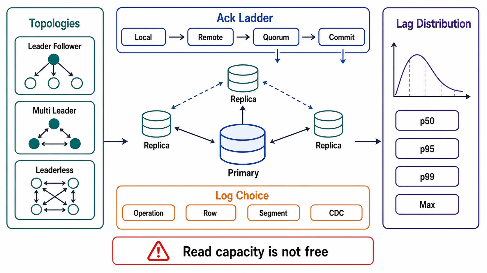

# Replication Topologies and Lag



## Abstract

Replication is the purchase of availability and read capacity with copies, and every topology is defined by two decisions it cannot dodge: who may accept writes (one leader, several leaders, or any replica), and what an acknowledgment means (which copies must be durable before the client hears "committed"). This file specifies the three topology families with the failure mode each one signs up for, the acknowledgment ladder as the mechanism that converts replication configuration into RPO fact (Chapter 03 file 08's budget, delivered or not delivered right here), and lag as what it actually is — a per-replica distribution with a tail, not a scalar on a dashboard. The framing debt is to [Kleppmann's *DDIA* replication treatment](https://dataintensive.net/): the problems of replication are not exotic — they are exactly three (leader failure, replication lag, and concurrent writes), and every topology is a different distribution of those three problems among clients, operators, and reconciliation jobs.

The blunt inheritance from Chapter 03: an asynchronous replica is not a backup (it replicates deletes at full speed — file 08 §2), and a failover onto a lagging replica is a silent violation of every acknowledged-durability promise the primary made. Topology is where those sentences either become configuration or remain slogans.

## 1. The Three Topologies

| Topology | Who Writes | The Problem It Buys | Canonical Habitat |
|---|---|---|---|
| Single-leader | One leader per partition; followers replay its log | Leader failure → the authority-transfer problem (Ch03 file 01 §4: fencing first); write throughput ceilinged by one node per partition | Relational primaries, Kafka partitions, Raft groups — the default |
| Multi-leader | A leader per site/region, replicating to peers | Concurrent writes → permanent conflict-handling obligation (file 06); no global write order exists | Cross-region active-active, offline-capable clients |
| Leaderless | Any replica accepts writes; quorums + repair reconcile | No authority at all → versioning, read repair, and anti-entropy are load-bearing, not optional (file 03) | Dynamo-lineage stores ([SOSP 2007](https://www.allthingsdistributed.com/2007/10/amazons_dynamo.html)) |

The selection rule is Chapter 03's ownership rule wearing topology clothes: `single-writer` state items (file 01 §2) map to single-leader; `multi_arbitrated` items — and only those, with their merge pricing already paid — may map to multi-leader or leaderless. A team choosing leaderless "for availability" on state whose invariants demand a single writer has not chosen a topology; it has scheduled the GitHub-2018 reconciliation, permanently.

## 2. The Acknowledgment Ladder

```text
Figure 1. What "committed" means, rung by rung. Each rung down
adds latency to every write and subtracts data loss from every
failover. The rung IS the RPO — everything else is commentary.

  ack rung                     write latency        RPO on leader loss
  ────────────────────────     ─────────────        ──────────────────
  leader memory only           fastest              everything since
                                                    last flush
  leader fsync                 +fsync               everything not yet
                                                    replicated  ◄─ most
                                                    "durable" configs
                                                    actually sit here
  + 1 follower (semi-sync)     +1 RTT (intra-AZ)    ≈ 0 if failover
                                                    targets THAT follower
  + quorum of followers        +1 RTT (majority)    0 within the quorum's
  (consensus-grade)                                 failure model
  + remote region              +cross-region RTT    0 across region loss
                               (tens of ms)         (Ch03 f08's priciest
                                                    RPO purchase)
```

Three review obligations fall out. **The rung is declared per state item, not per cluster** — the ledger and the clickstream do not deserve the same rung, and paying cross-region RTT on telemetry writes is the Chapter 03 file 08 budget error in reverse. **Semi-sync's fine print is read aloud**: most semi-synchronous implementations degrade to async when the follower stalls (the timeout is the escape hatch) — meaning the RPO guarantee silently evaporates exactly during the incident that will test it; whether that degradation alarm exists is a gate, not a preference. **Failover targeting must honor the rung**: an RPO-zero rung is only RPO-zero if promotion is constrained to replicas that hold every acknowledged write — which is the consensus property (file 02), obtained there or not obtained at all.

## 3. What Replicates: Log Choice

| Stream | Content | Consequence |
|---|---|---|
| Physical (WAL/block) | Byte-level page/redo records | Exact replica, version-locked to the engine; the Ch04 file 02 WAL doing double duty |
| Logical (row-change) | Decoded row mutations | Cross-version and selective replication; the CDC tap (Ch03 file 05) — but schema changes need coordination (Ch03 file 07) |
| Statement | The SQL itself | Nondeterminism hazard (NOW(), sequences, triggers) — effectively deprecated for correctness-bearing replication; listed to be rejected |

The architectural note: physical for the engine's own replicas, logical for everything leaving the engine (projections, warehouses, other stores). Aurora's design pushes this to its limit — replicating *only* the redo log to a purpose-built storage tier, making "the log is the database" a physical architecture rather than a metaphor ([Aurora, SIGMOD 2017](https://dl.acm.org/doi/10.1145/3035918.3056101)).

## 4. Lag Is a Distribution

Replication lag is per-replica, per-time, heavy-tailed — and every consumer of "the replica" experiences a *sample* of it, not the average. The operational model:

```yaml
lag_contract:                  # per replica set
  metric: bytes AND time behind leader (both — bytes for throughput
          diagnosis, time for staleness claims)
  slo:                         # the bound Ch03 file 02's bounded-staleness
                               #   claims cite; alarmed at margin
  tail_behavior:               # what drives p99 lag: checkpoints, vacuum,
                               #   long transactions, batch jobs, network
  reader_policy_on_breach:     # reject | redirect-to-leader | serve-with-
                               #   disclosure (the Ch03 f02 §5 anomaly budget)
  failover_eligibility:        # max lag at which this replica may be promoted
                               #   (the §2 rung enforcement)
```

The two lag pathologies that own most incidents: **lag runaway** — a burst outruns replay, staleness claims breach, readers fail over to the leader, the leader's load rises, lag worsens (a Chapter 01 file 08 metastable loop with replicas as the fuel; file 08 details the break); and **the invisible long-transaction stall** — replay on a replica blocked behind conflicting reads or a leader's long transaction, where lag climbs while every throughput metric looks healthy. Both are why the SLO carries a *cause taxonomy*, not just a threshold: un-diagnosable lag alerts train operators to ignore lag alerts.

## 5. Read Capacity Is Not Free Capacity

The standard justification for replicas — "scale the reads" — carries three taxes the justification usually omits: every replica read is a *consistency decision* (which Chapter 03 file 02 claim does this path hold when served stale? — file 07's whole subject); every replica added multiplies the leader's fan-out and the failure surface (more replicas = more lag distributions to manage, not just more capacity); and replicas run the same background debt (Ch04 file 02 §5) on their own schedules — a replica vacuuming during peak serves its samples of lag to everyone. Replicas scale reads the way indexes scale queries: genuinely, and with a bill.

## 6. Approval Gates

| Gate | Evidence Required | Failure Condition |
|---|---|---|
| Topology gate | Each state item's topology matches its Ch03 writer-cardinality declaration | Leaderless/multi-leader serving single-writer invariants |
| Rung gate | Ack rung declared per state item; write-latency price in the Ch01 budget; RPO arithmetic shown | One cluster-wide rung; or "durable" meaning leader-fsync while the dossier claims RPO 0 |
| Degradation gate | Semi-sync fallback-to-async alarms; failover eligibility enforces max-lag | The RPO guarantee can evaporate silently under follower stall |
| Log gate | Physical/logical split declared; statement replication absent from correctness paths | Logical consumers version-coupled to engine internals, or nondeterministic replay |
| Lag gate | Per-replica lag SLO with cause taxonomy, reader breach policy, and failover eligibility | Lag is one averaged dashboard number consumed by nobody |

## Output

The output of this file is a replication design per state item: a topology matching its ownership contract, an acknowledgment rung matching its RPO budget with the degradation paths alarmed, a log choice separating engine replicas from external consumers, and lag managed as the per-replica distribution it is — with a named policy for every reader the tail will eventually reach.

## References

- [Kleppmann, *Designing Data-Intensive Applications* — Replication](https://dataintensive.net/)
- [DeCandia et al., "Dynamo: Amazon's Highly Available Key-value Store," SOSP 2007](https://www.allthingsdistributed.com/2007/10/amazons_dynamo.html)
- [Verbitski et al., "Amazon Aurora: Design Considerations for High Throughput Cloud-Native Relational Databases," SIGMOD 2017](https://dl.acm.org/doi/10.1145/3035918.3056101)
- [GitHub — October 21, 2018 post-incident analysis (failover onto lag, at production scale)](https://github.blog/2018-10-30-oct21-post-incident-analysis/)
- [Jepsen — analyses of replication-boundary guarantee violations](https://jepsen.io/analyses)
