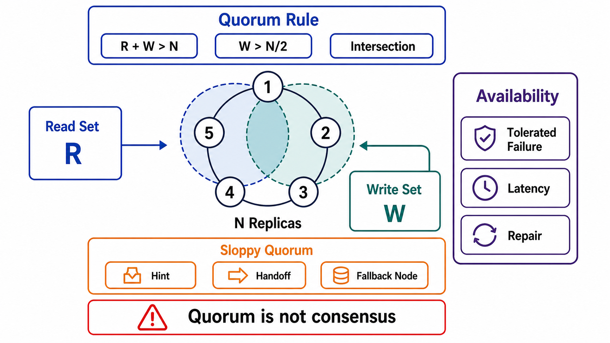

# Quorum Semantics



## Abstract

Quorum arithmetic — write to W of N, read from R of N, overlap when R+W>N — is the most misquoted formula in distributed systems, and this file's first job is the honest accounting: overlap guarantees that a read *contacts* a node holding the latest acknowledged write, which is necessary but not sufficient for linearizability (concurrent read-write races and partially failed writes both produce anomalies inside R+W>N unless reads repair synchronously and writes round versions correctly — a gap [Jepsen analyses](https://jepsen.io/analyses) have demonstrated against production stores repeatedly). The second job is the design space beyond the formula: Dynamo's deliberate weakening (sloppy quorums and hinted handoff trade the overlap guarantee itself for write availability during failures — [SOSP 2007](https://www.allthingsdistributed.com/2007/10/amazons_dynamo.html)) and Aurora's deliberate strengthening (an asymmetric 6-copy/3-AZ design with W=4, R=3, sized not for node failure but for *correlated* AZ failure plus an independent node — ["quorums and correlated failure"](https://aws.amazon.com/blogs/database/amazon-aurora-under-the-hood-quorum-and-correlated-failure/)), which together bracket what quorum design actually is: choosing a failure model first and deriving the arithmetic from it.

The chapter-level warning this file exists to install: R+W>N is a *mechanism inventory*, not a consistency claim. The claim (Chapter 03 file 02) is made per read path and proven by adversarial test (file 09) — never by arithmetic alone.

## 1. The Honest Arithmetic

```text
Figure 1. What quorum overlap does and does not give you.
N=3, W=2, R=2: every read set intersects every write set —
and anomalies still fit in the gaps.

  write x=1 ────► [A✓] [B✓] [C ] ack'd (W=2)
  read  ────────► [B✓] [C✓]      sees {x=1 @B, x=0 @C}
                  overlap ✓ — reader CONTACTED the truth.
                  Now the gaps:

  gap 1  concurrent read during the write's flight:
         two readers can see x=1 then x=0 (no linearization
         point) unless the reader WRITES BACK the newest value
         (sync read repair) before returning
  gap 2  failed write (ack'd on A only, W not met, client told
         "error"): a later read {A,B} returns x=1 — a value the
         client was told FAILED. write-abort is not write-undo
  gap 3  clock-skewed LWW versioning: "newest" decided by wall
         clock silently discards concurrent acknowledged writes
```

The consequences, stated as rules: strict-quorum reads deliver linearizability only with synchronous read repair on the read path (and monotonic version arbitration — vector or consensus-assigned, not wall-clock); "failed" writes must be modeled as *ambiguous* (Chapter 01 file 04's status machine — the value may surface later); and compare-and-set/conditional operations over quorum stores require a consensus round (the LWT/Paxos path in Dynamo-lineage engines), at consensus prices — the quorum fast path cannot do read-modify-write safely.

## 2. Availability Arithmetic

What the numbers buy, before correlation ruins it:

| Config | Tolerates (reads / writes) | Notes |
|---|---|---|
| N=3, W=2, R=2 | 1 node / 1 node | The default; loses write availability at 2 failures |
| N=3, W=3, R=1 | 2 / 0 | Fast reads, fragile writes — every node is write-critical |
| N=3, W=1, R=1 | 2 / 2 — and no overlap | Pure availability; eventual only; the config that must be *declared*, not drifted into |
| N=5, W=3, R=3 | 2 / 2 | The consensus-shaped middle |
| Aurora: N=6 (2/AZ×3), W=4, R=3 | AZ+1 for writes; AZ+1 for reads | Sized for the *correlated* case: lose an AZ (2 copies) plus one more node and still read (3 remain) and repair |

Aurora's design carries the two lessons that generalize. First, **the failure model precedes the arithmetic**: node-independent failure math says N=3 suffices; AZ-correlated failure math — the failures that actually co-occur — demands the 6/4/3 shape. Placement (copies spread across failure domains) is half of quorum design, and it is the half the formula hides. Second, **asymmetry is legitimate**: Aurora avoids quorum reads entirely in steady state (the writer tracks which segments are complete and reads one directly), paying R=3 only during recovery — quorum cost paid where the failure model needs it, not uniformly ([Aurora, SIGMOD 2017](https://dl.acm.org/doi/10.1145/3035918.3056101)).

## 3. Sloppy Quorums and Hinted Handoff

Dynamo's move, named honestly: under failure, writes go to the first N *reachable* nodes — including nodes outside the key's home set — with a hint recording the intended owner; hinted writes replay home when it recovers. This preserves write availability through failures and *abandons the overlap guarantee while doing so*: a strict-looking R+W>N over a sloppy membership can miss the latest write entirely, because the write is sitting on a substitute node the read set never contacts.

The review treatment is classification, not prohibition: sloppy mode is an *availability feature with an eventual-consistency price* — legitimate exactly where the Chapter 03 file 02 claim for the path is already eventual-with-divergence-metric, and a silent correctness defect anywhere a stronger claim is advertised. The dossier field is binary and mandatory: does this store's quorum go sloppy under failure, and does every read path over it know?

Anti-entropy closes the loop sloppy quorums open: hinted handoff handles the transient case; background repair (Merkle-tree comparison and reconciliation) handles the durable divergence — and *read repair alone is not a repair strategy* for cold keys, which are precisely the keys nobody reads. Repair cadence is a divergence-window SLI (Chapter 03 file 10 §3's table, extended to replicas).

## 4. Quorums Are Not Consensus

The confusion this section exists to end: quorum replication (Dynamo-style R/W sets) and consensus (Raft/Paxos majorities) both say "majority," and they are different machines. Quorum replication has no leader, no log, no single order — concurrent writes to different coordinators both succeed and *coexist as siblings* until something arbitrates. Consensus buys the total order at the price of leader-serialized writes and unavailability below majority. The practical composition, visible in every mature Dynamo-lineage engine: the quorum fast path for raw reads/writes, a consensus path (LWT-class) for the operations that need read-modify-write atomicity — two prices on one menu, and the menu must say which operations pay which.

## 5. Approval Gates

| Gate | Evidence Required | Failure Condition |
|---|---|---|
| Claim gate | Per read path: the R/W/N config, the repair mode (sync read repair? version arbitration?), and the Ch03 claim it delivers — tested adversarially, not derived from arithmetic | "R+W>N therefore strongly consistent" appears anywhere |
| Ambiguity gate | Failed/timed-out writes modeled as ambiguous in the output contract; resurfacing values expected | Write-error treated as write-undone |
| Placement gate | N copies placed across declared failure domains; the arithmetic re-run against *correlated* failure (the Aurora AZ+1 exercise) | Quorum math assumes independent node failures in a world of AZs |
| Sloppiness gate | Sloppy/strict behavior under failure declared per store; sloppy only under eventual-claim paths; hint replay and anti-entropy cadence monitored | Sloppy quorums hiding under strict-sounding configs |
| Arbitration gate | Version ordering is monotonic (vector/consensus-assigned); wall-clock LWW only with the Ch03 f01 §5 data-loss acknowledgment; CAS routed through the consensus path | Concurrent acknowledged writes silently discarded by clock luck |

## Output

The output of this file is a quorum design derived from a declared failure model: R/W/N and placement sized against correlated failure, repair modes that make the claimed consistency real rather than arithmetic, sloppy behavior confined to paths whose contracts already forgave it, and a menu that says plainly which operations ride the fast path and which pay for consensus.

## References

- [DeCandia et al., "Dynamo," SOSP 2007 — sloppy quorums, hinted handoff, anti-entropy](https://www.allthingsdistributed.com/2007/10/amazons_dynamo.html)
- [AWS — Amazon Aurora Under the Hood: Quorums and Correlated Failure](https://aws.amazon.com/blogs/database/amazon-aurora-under-the-hood-quorum-and-correlated-failure/)
- [Verbitski et al., "Amazon Aurora," SIGMOD 2017](https://dl.acm.org/doi/10.1145/3035918.3056101)
- [Jepsen — analyses demonstrating anomalies inside R+W>N configurations](https://jepsen.io/analyses)
- [Kleppmann, *DDIA* — leaderless replication and quorum limitations](https://dataintensive.net/)
