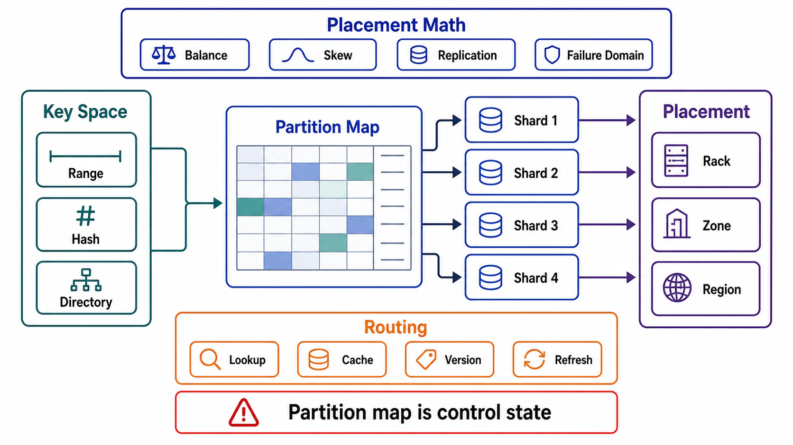

# Partitioning and Placement



## Abstract

Partitioning divides a keyspace into ownership units; placement assigns those units to machines; and the artifact that records both — the partition map — is a control-plane state item with a single consensus-backed writer, distributed to the data plane as a versioned snapshot, exactly per the Chapter 02 machinery. This file specifies the three partitioning schemes with their query-shape consequences (hash for uniform point access, range for ordered scans at the price of hotspot risk, directory for the flexibility that pays in map complexity), consistent hashing and virtual nodes as the placement mathematics that bound movement under membership change ([Karger et al., 1997](https://dl.acm.org/doi/10.1145/258533.258660)), and the two problems that dominate partitioned systems in practice long after the scheme is chosen: secondary indexes that must be either local (scatter-gather reads) or global (distributed-write costs), and request routing that must never let a stale map produce a silent wrong answer.

The inheritance is strict: partition *keys* were chosen in Chapter 04 file 01 against skew tests; per-partition write authority is Chapter 03 file 01's single-writer rule instantiated (`single_per_partition`); cross-partition atomicity is Chapter 03 file 03 §5's menu, unchanged. This file adds the map, the math, and the routing — not new semantics.

## 1. The Three Schemes

| Scheme | Mechanism | Wins | Pays |
|---|---|---|---|
| Hash | key → hash → partition | Uniform distribution by construction; hot-key resistance (within Ch04 f01's skew limits) | Range queries shatter: adjacent keys land on arbitrary partitions — scans become scatter-gather |
| Range | ordered key intervals | Range scans stay local; time-series and prefix patterns served naturally | Hotspot magnet: monotonic keys (time, sequence) concentrate all writes on the last range — Ch04 f01 §2's time-leading-key rule, now with a mechanism |
| Directory | explicit key→partition lookup table | Arbitrary assignment: tenant isolation, giant-tenant extraction (Ch04 f01's isolation strategy), incremental migration | The directory is itself a lookup on every request — cached, versioned, and owned like the map it generalizes |

Composite reality: production systems layer them — hash-by-tenant then range-by-time within tenant (the Discord/Cassandra shape), or hash with a directory override for extracted giants. The review question is per dominant access pattern (Ch04 file 01's matrix): does the pattern resolve within one partition, a bounded named set, or a scatter — and is the scatter priced in its latency budget (Ch01 file 02 §4.2's fanout tail math applies in full)?

## 2. Placement Mathematics

```text
Figure 1. Consistent hashing with virtual nodes. Keys and nodes
hash onto one ring; each key belongs to the next node clockwise.
Adding a node moves only ~K/N keys — the property that makes
elastic membership affordable (Karger 1997).

                    node A (vnodes a1,a2,a3)
                 a1 ●─────● b1
               ╱               ╲        key k hashes here ─┐
             c2 ●               ● a2                       v
             │      the ring     │      owner = next vnode
             b3 ●               ● c1    clockwise (c1)
               ╲               ╱
                 a3 ●─────● b2
                    node C        node B

  without vnodes: N points → uneven arcs, and a node's failure
  dumps its ENTIRE arc on one successor.
  with V vnodes/node: N×V points → arcs average out (variance
  ~1/√V), failure load spreads across MANY successors, and
  heterogeneous hardware gets proportional vnode counts.
```

Two placement rules complete the math. **Replica placement respects failure domains**: the R replicas of a partition go to the next R nodes clockwise *in distinct racks/AZs* — the file 03 correlated-failure lesson enforced structurally, not by luck of the ring. **Fixed-partition-count is the pragmatic alternative**: many systems (and Notion's 480-logical-shards-on-32-hosts design — [sharding Postgres at Notion](https://www.notion.com/blog/sharding-postgres-at-notion)) skip the ring entirely: create many more partitions than hosts up front, assign partitions→hosts via the map, and rebalance by *moving whole partitions* — divisibility (480 = 2^5×3×5) becomes the elasticity mechanism. The ring optimizes for continuous membership churn; fixed-count optimizes for operational legibility. Both are admissible; drifting between them is not.

## 3. The Partition Map Is Control-Plane State

The map (key-range/hash-slot → owner → replica set, versioned) gets the full Chapter 02 treatment, itemized because every row has a named incident behind it somewhere:

| Obligation | Mechanism |
|---|---|
| Single writer | One consensus-backed authority mutates the map (Ch02 f05 §3; Ch03 f01) — never two rebalancers, never operator-edits-plus-automation |
| Versioned distribution | Data-plane routers hold snapshot vN with LKG semantics (Ch02 f04); map fetch is never per-request |
| Epoch-fenced ownership | A partition's owner rejects writes carrying a stale map epoch — the Ch03 f04 fencing token, applied to shard ownership; without it, a router with an old map writes to the old owner *after* the shard moved |
| Stale-map failure mode declared | Wrong-owner requests get an explicit redirect-with-new-map response (the "moved" protocol), never silent service from stale data |
| Router divergence SLI | Fraction of requests hitting wrong owners = map propagation health (Ch02 f09 §4's applied-version signal, instantiated) |

## 4. Secondary Indexes Across Partitions

The problem Chapter 04 file 03 deferred: an index on a non-partition-key attribute cannot live in one place. Two shapes, both honest about their cost:

| Shape | Write Path | Read Path | Choose When |
|---|---|---|---|
| Local (per-partition) index | Index update is local to the row's partition — cheap, atomic with the row | Query by indexed attribute must scatter to ALL partitions and gather | Writes dominate; indexed queries are rare, batch, or already scoped by partition key |
| Global (partitioned-by-indexed-term) index | Index update crosses partitions — asynchronous in practice, making the index a *bounded-staleness derived node* (Ch03 f05; DynamoDB GSIs are exactly this) | Query by indexed attribute hits one index partition — seek, not scatter | Indexed reads dominate and tolerate the declared lag; write amplification priced per Ch04 f03 |
| The third option | Don't: re-model so the pattern carries the partition key (Ch04 f01's key_inputs rule) | — | More often available than admitted |

The global-index row's fine print is the one that bites: an asynchronously maintained global index can *miss or double-serve* rows near the lag window — it is a projection with everything Chapter 03 file 05 implies (lag SLI, rebuild path, read-path staleness claim), and vendors' marketing ("just add a GSI") does not exempt it.

## 5. Routing

Where the map meets the request: routing tiers (smart client with cached map / proxy tier / coordinator-any-node) differ in hop count and upgrade coupling, but all three obey the same contract — route from a *local versioned snapshot*, follow redirects on staleness, refresh asynchronously, and surface routing-error rates as the map-health SLI. The one absolute: a router must never fall back to "broadcast and merge" when its map is stale — scatter-as-fallback converts a control-plane propagation delay into a data-plane load multiplication, which is the Chapter 02 file 07 feedback-loop table acquiring a new row.

## 6. Approval Gates

| Gate | Evidence Required | Failure Condition |
|---|---|---|
| Scheme gate | Scheme per keyspace justified by the dominant patterns' locality; scatter patterns priced by fanout math | Range scheme under monotonic write keys; hash scheme under range-scan-dominant patterns |
| Placement gate | Replicas of each partition span declared failure domains; vnode counts or partition counts justified (variance / divisibility) | Ring or map placement that can put a quorum in one rack |
| Map gate | The partition map has one consensus-backed writer, versioned distribution with LKG, and epoch-fenced ownership | Two map-mutating authorities, per-request map lookups, or unfenced shard ownership |
| Index gate | Every cross-partition secondary index declared local (scatter priced) or global (lag SLI, rebuild, staleness claim) | A "global index" treated as synchronous and consistent because the vendor's diagram was pretty |
| Routing gate | Stale-map behavior is redirect-with-refresh; wrong-owner rate is an SLI; no scatter-on-stale fallback | Silent stale service, or broadcast fallbacks that melt the fleet during map changes |

## Output

The output of this file is a partitioned keyspace whose every unit has one owner, whose map has one writer and versioned distribution with fenced epochs, whose placement arithmetic respects correlated failure, whose secondary indexes state their scatter-or-lag price, and whose routers can be wrong about the map without ever being silently wrong about the data.

## References

- [Karger et al., "Consistent Hashing and Random Trees," STOC 1997](https://dl.acm.org/doi/10.1145/258533.258660)
- [Notion — Herding Elephants: Sharding Postgres at Notion (480 logical shards)](https://www.notion.com/blog/sharding-postgres-at-notion)
- [DeCandia et al., "Dynamo," SOSP 2007 — the ring and preference lists in production](https://www.allthingsdistributed.com/2007/10/amazons_dynamo.html)
- [Vitess — sharding and topology service documentation](https://vitess.io/docs/reference/features/sharding/)
- [Kleppmann, *DDIA* — partitioning](https://dataintensive.net/)
